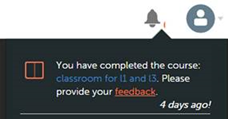

# Notificaciones de usuarios

<!--User notifications for Learners in Learning Manager.-->

La función de notificaciones se aplica a todos los usuarios de Adobe Learning Manager. Sin embargo, cada usuario, según su función, recibe distintos tipos de notificaciones en distintos escenarios. Todas las alertas y notificaciones a los usuarios se muestran en el cuadro de diálogo emergente de notificaciones.

## Notificaciones de acceso {#accessnotifications}

Los usuarios pueden ver las notificaciones haciendo clic en el icono de notificaciones en la esquina superior derecha de la ventana.

En la siguiente captura de pantalla se muestra una ventana de notificación de ejemplo para la función de alumno:

*Ver todas las notificaciones*

Esta ventana emergente muestra resaltadas todas las notificaciones junto con la hora de aparición y una barra de desplazamiento.

Puede saber el número de notificaciones más recientes en función del número resaltado en la parte superior del icono de notificaciones. Por ejemplo, si hay cinco notificaciones más recientes después de su inicio de sesión anterior, puede ver el número 5 que se muestra en la parte superior del icono de notificaciones. Estos números desaparecen una vez que se leen todas las notificaciones más recientes.

Los alumnos pueden rechazar un curso asignado por responsables haciendo clic en Rechazar en la ventana emergente de notificaciones.

## Mostrar todas las notificaciones {#showallnotifications}

Haga clic en **[!UICONTROL Mostrar todas las notificaciones]** situado en la parte inferior de la ventana emergente de notificaciones para ver todas las notificaciones en una página independiente.

*Ver todas las notificaciones en una página independiente*

**Tipos de notificaciones para alumnos**

Los alumnos reciben notificaciones cada vez que se activan los siguientes eventos:

1. El alumno ha completado un curso
1. El alumno ha completado un curso y aún no ha proporcionado los comentarios de L1
1. El alumno ha obtenido una insignia
1. El administrador ha inscrito a un alumno en un curso, un programa de aprendizaje o una certificación
1. El responsable ha designado al alumno para un curso, que debe aceptar o rechazar
1. Se ha asignado una nueva competencia al alumno
1. El alumno adquirió una competencia
1. El alumno finaliza un programa de aprendizaje
1. Nominación aceptada por el alumno
1. Nominación rechazada del alumno
1. En el caso de los cursos aprobados por el responsable, el responsable aprueba o rechaza una solicitud de inscripción en el curso
1. Se borra la lista de espera del alumno.
1. El alumno se ha inscrito automáticamente en un curso, programa de aprendizaje o certificación
1. El alumno finaliza una certificación
1. El responsable aprueba/rechaza el documento de prueba de finalización de la certificación cargado por el alumno
1. Cuando se acerca la fecha límite para una instancia de curso concreta. (El administrador puede definir la fecha a partir de la cual pueden aparecer notificaciones de recordatorio para el alumno).

## Proporcionar comentarios {#providefeedback}

Los alumnos pueden proporcionar comentarios de L1 después de completar un curso que tiene una opción de comentarios. Para proporcionar comentarios, haga clic en el vínculo de comentarios como se muestra a continuación, después de completar el curso.

*Proporcionar comentarios del curso*

>[!NOTE]
>
>Los alumnos obtienen la opción de comentarios para los cursos solo cuando un administrador la activa para un curso concreto.
