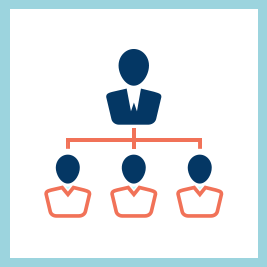

# Responsables

<table> 
 <tbody>
  <tr> 
   <td></td> 
   <td>
Continúe leyendo para conocer las funciones y las preguntas más frecuentes de Learning Manager asociadas con la función de responsable. 
</td> 
  </tr> 
 </tbody>
</table>

## Preguntas más frecuentes {#frequentlyaskedquestionsfaq}

[Preguntas más frecuentes sobre la función de responsable](managers/frequently-asked-questions-for-managers.md)

## Funciones {#features}

* [Introducción](managers/feature-summary/learning-objects.md#main-pars_header)
* [Usuarios de tabletas iPad y Android](managers/feature-summary/ipad-android-tablet-users.md)
* [Informes](managers/feature-summary/reports.md)
* [Configuración](managers/feature-summary/settings.md)
* [Inicio de sesión de usuario](managers/feature-summary/user-login.md)
* [Notificaciones de usuarios](managers/feature-summary/user-notifications.md) [&#128279;](managers/feature-summary/settings.md)
* [Objetos de aprendizaje](managers/feature-summary/learning-objects.md)
