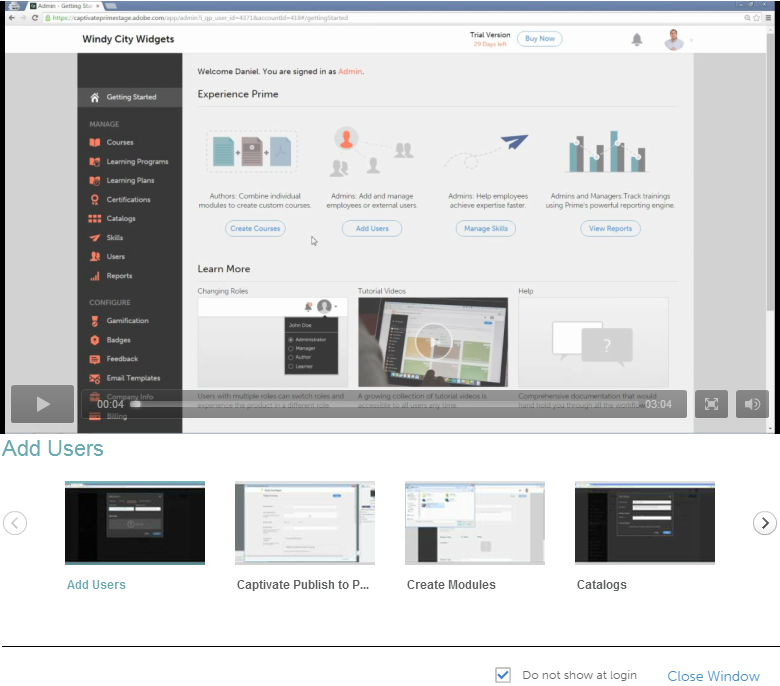
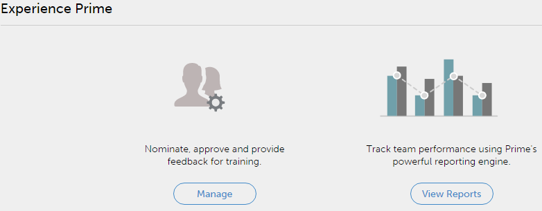

# Primeros pasos para responsables

Primeros pasos como responsable en Learning Manager.

La página Introducción le permite desplazarse por las funciones principales de la aplicación.

Tan pronto como inicia sesión como responsable, puede ver una ventana emergente con una lista de vídeos.

## Ver vídeos de muestra {#viewsamplevideos}

Examine los tutoriales de vídeo de muestra para comprender las funciones principales de los responsables. Si no quiere que esta ventana emergente aparezca durante el inicio de sesión, desactívela haciendo clic en No mostrar en la opción de inicio de sesión, en la esquina superior derecha de la ventana emergente.

Haga clic en **[!UICONTROL Cerrar ventana]** para cerrar la ventana emergente.

## Página Introducción {#gettingstartedpage}

En la página Introducción, puede realizar las siguientes actividades:

* Ver informes: realizar un seguimiento del rendimiento del equipo mediante informes.
* Gestionar equipo: nominar, aprobar y proporcionar comentarios sobre cursos.

También puede obtener más información sobre la aplicación Learning Manager al ver los tutoriales de vídeo y el contenido de ayuda y aprender sobre diferentes funciones.

