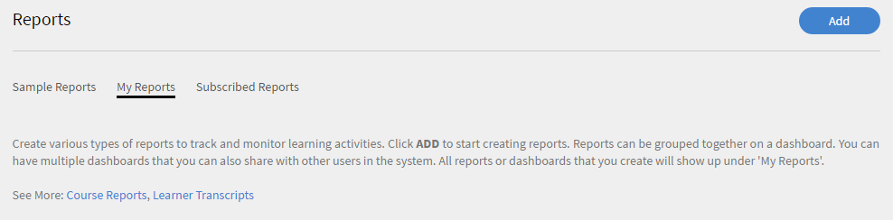
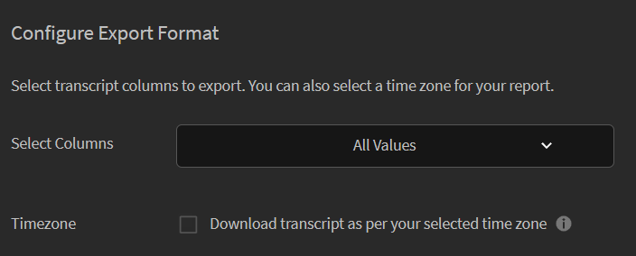

# Transcripciones de alumnos

Aprenda a descargar transcripciones de alumnos basadas en usuarios, objetos de aprendizaje o aptitudes en Learning Manager.

Adobe Learning Manager permite a los responsables de una organización generar las transcripciones asociadas a los alumnos.

## Generar transcripciones de alumnos {#generatelearnertranscripts}

1. Para generar transcripciones de alumnos, haga clic en **[!UICONTROL Informes]** en el panel izquierdo del inicio de sesión del responsable.
1. Haga clic en **[!UICONTROL Mis informes]** de la página.
1. Haga clic en **[!UICONTROL Transcripciones de alumnos]** vínculo.

   

   *Crear informes para transcripciones de alumnos*

1. Aparece el cuadro de diálogo Transcripciones de alumnos. Elija el intervalo de fechas para el que necesita generar la transcripción.

   >[!NOTE]
   >
   >De forma predeterminada, la fecha de inicio es la fecha de registro del alumno y la fecha de finalización es siempre la fecha actual. Sólo se puede modificar la fecha de inicio desde el momento en que se necesitan los datos.

1. Elija los nombres de los alumnos en el campo Seleccionar alumnos y haga clic en **[!UICONTROL Generar]**.

Puede elegir un solo alumno o grupos de alumnos. Para añadir a más de un alumno, haga clic en Añadir más alumnos.

Las transcripciones se generan y se descargan en su equipo como archivos .xls. Cada archivo .xls de Excel tiene siete hojas, cuyos detalles se mencionan a continuación:

## Descargar transcripciones de alumnos según la zona horaria {#lt-timezone}

Como un administrador, un responsable también puede elegir las columnas que se van a exportar. Además, un responsable puede descargar la transcripción del alumno en función de la zona horaria que haya seleccionado en la configuración del perfil.

Si el responsable activa esta opción, la zona horaria se selecciona de la que se ha definido en la página de configuración del perfil, como se muestra a continuación.

>[!NOTE]
>
>Para un nuevo responsable, la casilla de verificación Zona horaria está desactivada.

*Descargar transcripciones de alumnos de una zona horaria*

## Contenido del archivo de transcripciones de alumnos {#learnertranscriptfilecontent}

Un archivo de transcripciones de alumnos típico consta de seis hojas de Excel en un único archivo. Las hojas de transcripciones de alumnos proporcionan una visión general de los datos, incluido el número de alumnos que participan en cada curso, sus aptitudes, el porcentaje de finalización en función del curso o alumno y un tablero de cumplimiento. A continuación, se indican los paneles disponibles en las transcripciones de alumnos:

**Transcripciones de alumnos**

En la hoja de Excel de la transcripción del alumno, junto con los detalles del perfil del alumno, se proporcionan detalles de consumo del objeto de aprendizaje, como la fecha de inscripción, la fecha de inicio, la nota obtenida, la puntuación de prueba obtenida, etc. Si los cursos forman parte de un programa de aprendizaje, se enumeran por separado de los detalles de consumo de cada curso.

**1 - Tablero de actividades de aprendizaje**

En este tablero específico de objetos de aprendizaje, puede ver el número de alumnos de cada curso, programa de aprendizaje o certificación. Puede ver la hoja de progreso de los alumnos para un objeto de aprendizaje concreto. Esta hoja muestra datos como el número de alumnos que han completado el curso o programa de aprendizaje, los alumnos en curso y las fechas de vencimiento de los alumnos.

El progreso de los usuarios para el curso específico se calcula en función de los campos de entrada en los que se especifican los umbrales de porcentaje de progreso y la fecha de vencimiento. Por ejemplo, si especifica 7 días y 70 % como valores en el campo Entrada, se muestra el progreso del curso para los cursos que vencen en 7 días y para los cursos que tienen un progreso superior al 70 %. También puede cambiar el período de tiempo en esta hoja, donde los datos modificados se muestran automáticamente en este panel.

**2 - Tablero de actividades de aprendizaje**

Este tablero de aprendizaje mostrará los datos de un usuario específico. Desde este panel, puede ver los cursos, los programas de aprendizaje o las certificaciones en los que se ha inscrito un usuario determinado. La tabla también muestra los datos sobre los objetos de aprendizaje que el usuario ha completado, los objetos de aprendizaje en curso y las fechas de vencimiento próximas para el usuario.

El progreso de los usuarios para cada curso se calcula en función de las entradas que especifique. Es decir, la fecha de vencimiento y los valores de porcentaje de progreso. Por ejemplo, si especifica 7 días y 70 % como valores en el campo Entrada, se muestra el progreso del usuario para los diferentes cursos que vencen en 7 días y para los cursos que tienen un progreso superior al 70 %.

**Aptitud**

En la hoja de aptitudes, se proporciona el nombre de la aptitud, el nivel de aptitud, los créditos necesarios, los créditos ganados, el porcentaje de finalización y otros detalles del perfil. A continuación se proporciona una captura de pantalla de ejemplo de la hoja de cálculo de aptitudes como referencia.

**Tablero de aptitudes**

En este tablero, puede ver si su organización está equipada con varias aptitudes. Para una aptitud específica, puede comprobar el número de usuarios de una organización que se supone que tienen esta aptitud frente al número de usuarios que realmente la tienen. Este panel también especifica los usuarios que podrían necesitar actualizar sus aptitudes. Este valor se calcula en función de la entrada que introduzca en el campo Entrada. Por ejemplo, si especifica 50 días como entrada, el panel proporciona datos sobre los usuarios que pueden necesitar actualizar sus aptitudes pasados 50 días.

Este tablero de aptitudes es más específico del usuario. Puede filtrar uno o varios usuarios específicos y ver su nivel de aptitud como un tablero. Esta hoja puede ayudar a los gestores y administradores a realizar un seguimiento de la cualificación de cada alumno en comparación con la cualificación que se espera que tengan. El tablero de aptitudes también ilumina a los alumnos que necesitan actualizar sus aptitudes. La lista de actualización de alumnos se calcula en función del número de días que se especifican en el campo Entrada.

**Panel de cumplimiento**

El tablero de cumplimiento consta de dos partes: informe de cumplimiento por usuario e informe de cumplimiento por formación. En el caso del informe basado en usuario, puede utilizar el Panel de cumplimiento para realizar un seguimiento de los usuarios que tienen fechas de vencimiento próximas para iniciativas de cumplimiento importantes. En el informe basado en formación, puede filtrar por programa de aprendizaje o certificación.

Para ambos informes de conformidad, filtre por la fecha de vencimiento para ver los datos adecuados.
