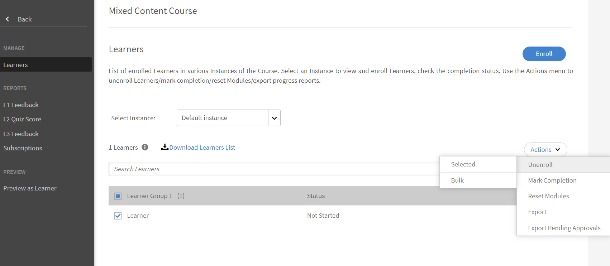

# Objetos de aprendizaje

Este documento contiene información sobre objetos de aprendizaje para responsables.

Un responsable puede inscribir a los alumnos que están bajo su mando en cursos, programas de aprendizaje y certificaciones. Para obtener más información y los pasos a seguir para inscribirse, consulte [Inscribir alumnos.](../../administrators/feature-summary/courses.md#main-pars_header_1058138132)

## Cursos {#courses}

## Ver cursos {#viewingcourses}

Como responsable, puede ver una lista de todos los cursos disponibles. Haga clic en **[!UICONTROL Cursos]** en el panel izquierdo para ver la lista de cursos con las opciones de búsqueda y filtro. También puede ver el porcentaje de eficacia de cada curso en las miniaturas de los cursos. Tenga en cuenta que solo puede inscribir miembros del equipo en cursos que sean visibles para usted en la aplicación del alumno.

>[!NOTE]
>
>Para ver la lista de todos los cursos retirados, haga clic en **Retirado** .

## Ver puntuaciones de pruebas {#viewquizscores}

1. Haga clic en el nombre del curso en la miniatura del curso.
1. Haga clic en Puntuación de prueba en el panel izquierdo.

Puede ver las puntuaciones de las pruebas de cualquier curso en particular en función del nombre de usuario o de cada pregunta. Elija las pestañas Por usuario o Por pregunta en consecuencia. Solo puede ver la puntuación de prueba de los integrantes del equipo.

Elija el tipo de instancia en la lista desplegable para ver las puntuaciones según cada instancia del curso.

## Administrar la lista de alumnos de un curso {#managelearnerslistforacourse}

Como responsable, puede gestionar la lista de alumnos de los miembros de su equipo.

1. Haga clic en el nombre del curso en la miniatura del curso.
1. En el panel izquierdo, haga clic en **[!UICONTROL Alumnos]**.

*Seleccionar una acción del alumno*

Puede realizar las siguientes acciones desde la página Alumnos:

* Seleccione el alumno que desea eliminar y haga clic en Acciones > Eliminar.
* Seleccione el alumno cuya asistencia desea marcar y haga clic en Acciones > Marcar como completada.

Para permitir que los alumnos restablezcan un módulo y vuelvan a consumirlo, haga clic en Restablecer. En el cuadro de diálogo emergente, haga clic en Sí para confirmar el restablecimiento. Los módulos que se han completado no se pueden restablecer. Solo se pueden restablecer los módulos fallidos o incompletos.

También puede exportar la lista de alumnos en una hoja de Excel. Para exportar la lista de alumnos, haga clic en Acciones > Exportar.

>[!NOTE]
>
>Si hay varias instancias de un curso, la lista de alumnos en Excel se proporciona en cada ficha por separado. La lista de alumnos consta del nombre del alumno, su estado y los criterios de selección. El estado de los alumnos puede ser **No iniciado**, o **En curso**, o **Completado**.

## Ver comentarios de L1 y L3 {#viewl1andl3feedback}

Puede ver los comentarios de L1 proporcionados por los alumnos de un curso y los comentarios de L3 proporcionados por los miembros de su equipo.

1. Haga clic en cualquier mosaico de curso de la lista Cursos.
1. Haga clic en Comentarios de L1 o Comentarios de L3 en el panel izquierdo para ver los comentarios recibidos.
1. Seleccione la instancia en la lista desplegable para ver los comentarios de esa instancia en particular.

## Previsualización de cursos {#previewcourses}

El responsable puede obtener una vista previa de los cursos haciendo clic en **Vista previa como alumno** al visualizar los módulos del curso.

1. Haga clic en **[!UICONTROL Cursos]** en el panel izquierdo después de iniciar sesión.
1. Haga clic en cualquier icono de curso de la lista de cursos de la página.
1. Haga clic en Vista previa como alumno en el panel izquierdo y haga clic en el nombre del módulo en la página para obtener una vista previa del módulo del curso en el reproductor.

## Eficacia del curso {#courseeffectiveness}

La eficacia del curso se evalúa para comprender la utilidad de un curso para el alumno. Se trata de una combinación de los resultados de los comentarios de los alumnos sobre el contenido del curso, los resultados de las pruebas del curso de un alumno y los comentarios del responsable que evalúa a un alumno en función de lo aprendido en el curso.

Puede ver la clasificación de la eficacia del curso en las miniaturas de los cursos, como se muestra en la captura de pantalla siguiente. Puede ver la clasificación de este curso como 100.

<!---->

El valor de valoración de la eficacia del curso se obtiene considerando los valores de comentarios de L1, L2 y L3. Para ver el desglose de cada comentario, haga clic en el valor de eficacia del curso. Aparece una ventana emergente como se muestra a continuación.

*Ver la eficacia del curso para los comentarios*

En esta captura de pantalla de ejemplo, 1 de 1 usuarios recibió los tres comentarios, de ahí que la puntuación sea 100/100. En esta tabla, puede comprender que si alguno de los tres comentarios (L1, L2 y L3) no se proporciona para un curso, se produce un impacto negativo en la eficacia general. Haga clic en la flecha hacia abajo en la esquina inferior derecha de la ventana emergente para ver cómo se realizan los cálculos de eficacia del curso.

*Cálculo de la eficacia del curso*

Según el gráfico circular mostrado anteriormente, se da más peso a los comentarios de L3 del gerente.

## Buscar cursos, programas de aprendizaje y certificaciones {#searchingcourseslearningprogramsandcertifications}

Adobe Learning Manager le facilita la búsqueda rápida de los cursos y programas de aprendizaje que desee. Puede buscar los cursos de dos formas:

1. Mediante el campo Buscar. Haga clic en el icono de búsqueda que se muestra en la esquina superior derecha. Aparece un campo de búsqueda. Escriba el nombre del curso o cualquier palabra clave asociada a los cursos para localizar los cursos o programas de aprendizaje. También puede realizar búsquedas con etiquetas predefinidas, como Captivate, C, Java y HTML. Las etiquetas se pueden buscar dentro del campo Buscar, lo que significa que las etiquetas se muestran en el campo de búsqueda mientras escribe. La búsqueda también se puede ejecutar mediante un ID exclusivo.
1. Filtrando la lista de cursos/programas de aprendizaje/certificaciones mediante los filtros. Puede filtrar los cursos por estado, como Todos, Publicados y Retirados.

Puede buscar por competencias haciendo clic en Competencias y eligiéndolas. Como responsable, puede ordenar los cursos de cuatro maneras para encontrar mejor el curso requerido. Haga clic en Ordenar por y elija orden alfabético ascendente, orden alfabético descendente, fecha de actualización del curso o eficacia de los cursos:

*Búsqueda basada en competencias*

Puede ordenar los programas de aprendizaje de tres maneras: orden alfabético ascendente, orden alfabético descendente y según la fecha de actualización.

## Inscribir alumnos en cursos {#enrollinglearnersintocourses}

Los responsables inscriben a algunos alumnos en cursos obligatorios según los requisitos de la organización:

1. Coloque el ratón sobre cualquier mosaico de curso publicado y haga clic en Inscribir alumnos.

   Como alternativa, haga clic en cualquier mosaico de curso publicado y haga clic en Alumnos en el panel izquierdo. Aparece una página con una lista de alumnos. Haga clic en Inscribir.\
   Aparece el cuadro de diálogo Inscribir alumnos.

1. Introduzca el nombre o el perfil de los alumnos para elegir a los alumnos y haga clic en Guardar.

>[!NOTE]
>
>Solo puede inscribir alumnos que pertenezcan a su equipo.

## Programas de aprendizaje {#learningprograms}

El responsable puede inscribirse, ver las puntuaciones de las pruebas, los comentarios de L1 y L3, y dar de baja solo a sus informadores.

## Añadir alumnos a un programa de aprendizaje {#addlearnerstoalearningprogram}

1. En el modo de responsable, haga clic en Programas de aprendizaje en el panel izquierdo.
1. Seleccione el programa de aprendizaje publicado en la lista de mosaicos al que desea añadir alumnos.
1. Haga clic en Alumnos en el panel izquierdo, en la categoría Informes de programas. Nota: El programa de aprendizaje se debe publicar antes de añadir alumnos.
1. Haga clic en el vínculo Inscribir de la página.
1. Empiece a escribir el nombre o el perfil de los alumnos y elija los alumnos en la lista desplegable de alumnos. Haga clic en Guardar.

## Ver puntuaciones de pruebas {#Viewquizscores-1}

1. Haga clic en cualquier mosaico de programa de aprendizaje.
1. Haga clic en Puntuación de prueba en el panel izquierdo.

Puede ver las puntuaciones de las pruebas de cualquier programa de aprendizaje concreto en función del nombre de usuario o de cada pregunta. Elija las pestañas Por usuario o Por pregunta en consecuencia. Las puntuaciones de las pruebas aparecen de curso en curso. Cambie el nombre del curso en el menú desplegable para ver las puntuaciones de las pruebas de otros cursos. También puede exportar puntuaciones de pruebas de cada curso. Elija el tipo de instancia en la lista desplegable para ver las puntuaciones según cada instancia del programa de aprendizaje.

## Dar de baja para alumnos {#unenrollmentforlearners}

El responsable puede dar de baja a un alumno si este aún no ha iniciado el programa de aprendizaje.

## Marcar finalización {#markcompletion}

Un responsable puede marcar un programa de aprendizaje completado para los alumnos. Para obtener más información, consulte [Marcar finalización](../../administrators/feature-summary/learning-paths.md).

## Certificaciones {#certifications}

## Inscribir alumnos en la certificación {#enrolllearnerstothecertification}

Puede inscribir a los alumnos en la certificación de dos formas. Siga los pasos que se indican a continuación para inscribir alumnos.

1. Haga clic en Certificaciones en el panel izquierdo después de iniciar sesión como responsable. En la lista Publicados de la ficha, desplace el ratón sobre cada certificación y haga clic en Inscribir alumnos. También puede hacer clic en cualquier mosaico de certificación publicado y, a continuación, hacer clic en Alumnos en el panel izquierdo. Haga clic en + Inscribir en el lado derecho de la página de alumnos para empezar a añadir alumnos.
1. Puede ver el cuadro de diálogo Inscribir alumnos tras hacer clic en la opción Inscribir alumnos en cada uno de los dos pasos anteriores. Empiece a escribir el nombre y el perfil del alumno, elija el nombre del alumno en la lista desplegable y haga clic en Guardar.

## Dar de baja para alumnos {#Unenrollmentforlearners-1}

El responsable puede dar de baja a un alumno si este aún no ha iniciado la certificación.

## Marcar finalización {#Markcompletion-1}

Un responsable puede marcar la finalización de la certificación. Para obtener más información, consulte [Marcar finalización](../../administrators/feature-summary/certifications.md#main-pars_header_303097138).

## Notificaciones de responsables para la aprobación de cursos de alumnos {#manager-notifications-course-approval}

Al intentar aceptar o rechazar la inscripción de un alumno, un responsable ahora puede ver los detalles de la sesión (**Videoconferencia** o **Classroom**) en la ventana emergente.

*Aprobar o rechazar la solicitud de inscripción de un alumno*

Se muestran los siguientes detalles de la sesión:

* Nombre de sesión
* Nombre del instructor
* Ubicación
* Fecha y hora

Este es el flujo de trabajo:

1. El responsable ve una notificación después de que un alumno solicite la aprobación de un curso.

1. El responsable hace clic **Detalles de sesión**.

   

   *Ver tareas pendientes*

1. A continuación, el responsable aprueba o rechaza la solicitud.
1. El responsable recibe un mensaje de confirmación o error si la aprobación o el rechazo no se han producido del modo esperado.
1. El alumno recibe una notificación de aprobación o rechazo de la inscripción en el curso.

## Envío opcional de certificaciones externas {#optional}

En versiones anteriores de Learning Manager, para que se completara una certificación externa, un responsable aceptaba el archivo que había enviado un alumno. El responsable obtiene una notificación solo después de que el alumno envíe el archivo.

Un responsable ahora puede ver una lista de alumnos que se han inscrito en la certificación externa en una página de envío dentro de la certificación externa y puede aceptar o rechazar desde la propia página sin esperar una notificación.

Cuando el responsable acepta sin esperar al envío del archivo, se muestra al alumno un nuevo mensaje que el responsable ha aceptado y el alumno no necesita enviar el archivo. En caso de que el responsable rechace sin enviar el archivo, el responsable tiene la opción de volver a aceptarlo sin esperar al archivo.

Si el alumno envía el archivo, el responsable puede ver el archivo desde la página de envío y puede aceptar o rechazar en función del archivo enviado.

*Aceptar o rechazar según el envío de archivos*

Cuando los cursos se establecen como obligatorios:

* En la página de envíos, los alumnos solo se enumeran una vez que los alumnos han completado los cursos.
* El alumno solo puede cargar un archivo después de completar el curso.

## Ayudas de trabajo {#jobaids}

El responsable puede administrar la asignación de ayudas de trabajo para sus informadores. Sin embargo, como responsable, solo puede ver las ayudas de trabajo publicadas, mientras que un administrador también puede ver las ayudas de trabajo retiradas.
