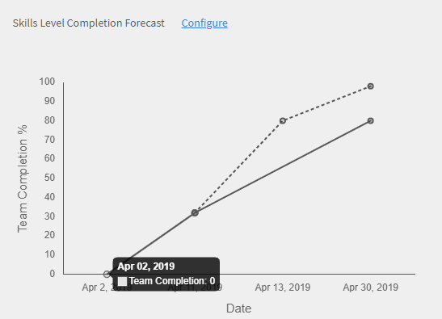

# Tablero de responsable

Obtenga información sobre cómo ver y realizar el seguimiento de aprendizajes desde el tablero de responsable.

Los gestores desempeñan un papel importante en las iniciativas de aprendizaje de un equipo. Para que los responsables trabajen en mejores condiciones, la plataforma de aprendizaje proporciona una vista de tablero en la que se puede realizar el seguimiento de los aprendizajes de su equipo.

*Informe de tablero de un responsable*

Para ver los detalles de un gráfico, haga clic en el gráfico o en el vínculo **[!UICONTROL Detalles]**.

## Resumen del aprendizaje {#learningsummary}

Un responsable puede examinar el resumen de las actividades de aprendizaje de su equipo efectuadas durante un determinado período. En el menú desplegable, seleccione el mes, el trimestre o el año.

Las opciones Mes y Año se basan en el año natural. Por su parte, Trimestre se basa en el año fiscal que el administrador ha definido en la configuración de la cuenta.

*Ver las actividades de aprendizaje durante períodos de tiempo*

## Vista de equipo {#teamview}

En la vista de equipo, se muestran los equipos, los integrantes y sus inscripciones, progresos y finalizaciones de objetos de aprendizaje.

*La vista de equipo muestra los equipos, sus miembros y sus inscripciones respectivas*

Al hacer clic en los nombres de los equipos, por ejemplo, el equipo de Venkatesh, puede ver los miembros del equipo de Venkatesh junto con el número total de inscripciones, progresos y finalizaciones de un objeto de aprendizaje.

*Seleccionar un miembro del equipo*

Para ver el resumen del aprendizaje de cada integrante del equipo, haga clic en el número de la columna que corresponda al responsable del equipo. Se muestra una tabla con la lista de objetos de aprendizaje con los valores de Fecha de inscripción, Fecha de vencimiento y Progreso.

*Seleccionar un jefe de equipo*

También es posible ver objetos de aprendizaje y la cantidad de inscripciones, progresos o finalizaciones haciendo clic en los valores de las columnas correspondientes.

*Ver cursos y resumen de aprendizaje*

Al hacer clic en el número de inscripciones, progresos o finalizaciones de cada aprendizaje, puede ver los siguientes detalles: personas, fecha de inscripción/finalización, fecha de vencimiento y progreso realizado.

*Ver la fecha de inscripción/finalización, la fecha de vencimiento y el progreso realizado*

## Vista de aprendizajes {#learningsview}

En la vista de equipo, se muestran la cantidad de inscripciones, progresos y finalizaciones de un objeto de aprendizaje.

Para ver información sobre personas, fechas de inscripción, de vencimiento y el progreso de los respectivos objetos de aprendizaje, haga clic en los valores pertinentes de las columnas Inscripciones, Progresos y Finalizaciones.

*Vista de aprendizaje*

## Exportar informe {#exportreport}

Para generar un informe de Excel, haga clic en **[!UICONTROL Acciones] > [!UICONTROL Informe]**

## Estado de cumplimiento {#compliancestatus}

Los responsables pueden ver el estado de cumplimiento general del equipo para los aprendizajes configurados en el tablero de cumplimiento. La lista de aprendizajes se puede configurar. Por su parte, el responsable puede seleccionar los aprendizajes para efectuar el seguimiento del estado del cumplimiento.

En este tablero, los responsables también pueden ver los alumnos que cumplen, si aún les queda plazo, si el plazo se aproxima y si no cumplen respecto a un objeto de aprendizaje.

En el tablero de cumplimiento, se pueden configurar objetos de aprendizaje con límites de finalización para realizar el seguimiento.

**Compatibles**: muestra la cantidad de alumnos que han finalizado el objeto de aprendizaje dentro del límite de finalización.

**Plazo prudente**: muestra la cantidad de alumnos que tienen menos de 30 días para finalizar un objeto de aprendizaje.

**Próximo plazo**: muestra la cantidad de alumnos que disponen de más de 30 días para completar un objeto de aprendizaje.

**No cumplen**: muestra la cantidad de alumnos que no han finalizado el objeto de aprendizaje dentro del límite de finalización.

*Ver panel de cumplimiento*

## Vista de equipo {#TeamView-1}

Muestra el estado del cumplimiento de un curso de los equipos respectivos. En la tabla Vista de equipo, se muestran las columnas Compatibles, Plazo prudente, Próximo plazo y No cumplen.

*estado de cumplimiento de un curso para los equipos respectivos*

Para mostrar los nombres de los miembros de un equipo y el número individual de cursos para los que su estado es Compatible, en Fecha límite segura, Fecha límite próxima y No compatible, haga clic en los valores correspondientes de la tabla.

*Seleccionar equipos individuales*

Al hacer clic en los valores de las columnas Compatibles, Plazo prudente, Próximo plazo y No cumplen, se muestran los detalles de curso correspondientes: nombre de objeto de aprendizaje, fecha de inscripción o de finalización, fecha de vencimiento y progreso en porcentaje.

 

*Ver progreso de cursos*

## Vista de aprendizajes {#LearningsView-1}

En Vista de aprendizajes de Estado de cumplimiento, se muestra la lista de objetos de aprendizaje y el número correspondiente de miembros del equipo que hay en cada columna de Compatibles, Plazo prudente, Próximo plazo o No cumplen.

*Ver fecha límite y estado de cumplimiento*

Al hacer clic en los valores de las columnas Compatibles, Plazo prudente, Próximo plazo y No cumplen, se muestran los datos siguientes: Personas, Fecha de inscripción, Fecha de finalización y Progreso.

*Ver detalles del cumplimiento*

## Exportar datos y enviar correos electrónicos {#exportdataampsendemails}

* Para exportar el estado de cumplimiento para la vista de equipo y de aprendizaje, haga clic en **[!UICONTROL Acciones]** > **[!UICONTROL Exportar]**.

* Para enviar un correo electrónico a los miembros del equipo, haga clic en **[!UICONTROL Acciones]** > **[!UICONTROL Enviar correo electrónico]**.

*Exportar y enviar datos por correo electrónico*

## Aptitudes de equipo {#teamskills}

Los responsables pueden ver el gráfico de finalización de aptitudes y configurar un pronóstico de finalización de aptitudes en diferentes niveles. En la lista desplegable de aptitudes, se enumeran cinco aptitudes. El responsable conoce la experiencia obtenida por los miembros del equipo e identifica dónde está el talento en determinadas aptitudes.

Asimismo, puede impulsar aptitudes concretas en un equipo definiendo un objetivo y una previsión del tiempo que se necesitará para adquirir un determinado porcentaje de aptitudes de un equipo en un plazo de tiempo.

Esta previsión se basa en cálculos de sistema que ofrecen una perspectiva futura sobre el progreso de esa aptitud.

*Ver previsión de aptitud*

Para ver el estado de aptitudes de un equipo, siga los pasos que se indican a continuación:

1. Haga clic en **[!UICONTROL Habilidades de equipo]** en el panel izquierdo, bajo la sección Vista de mi equipo.
1. Para ver las aptitudes que se muestran, haga clic en el filtro de aptitudes y seleccione una de la lista desplegable.
1. Para seleccionar un nivel (1, 2 o 3), haga clic en el menú desplegable de niveles.
1. En función de la aptitud y el nivel seleccionados, se muestra un gráfico con su estado de aptitud. Al pasar el cursor sobre el gráfico, se pueden ver los porcentajes siguientes relativos al estado de la aptitud: **En curso** y **Conseguido**.

   

   *Ver porcentaje del estado de la aptitud*

## Cómo prever el porcentaje de finalización del equipo respecto a una aptitud {#howtoforecasttheteamcompletionforaskill}

Para prever el porcentaje de finalización del equipo respecto a una aptitud, siga estos pasos:

1. Para ver en pantalla el rastreador de configuración, haga clic en el hipervínculo Configurar.

   

   *Seleccione el hipervínculo Configurar*

1. En el cuadro de diálogo emergente configurar, introduzca un valor de porcentaje en la aptitud que desee configurar **% de finalización de objetivo** y la fecha en la que desea alcanzar el porcentaje de finalización objetivo en el campo **Fecha objetivo** campo.****

   

   *Introducir porcentaje de finalización de destino*

1. Para ver el resultado de la previsión, haga clic en el botón **Estimación**. El resultado se parece a la captura de pantalla siguiente.

   

   *Ver salida del rastreador de aptitudes*

## Previsión de finalización del nivel de aptitud {#skilllevelcompletionforecast}

El responsable de un equipo puede ver y configurar el porcentaje de finalización del equipo relativo a una aptitud durante un determinado período de tiempo según el porcentaje de finalización objetivo y la fecha y hora indicadas en el rastreador de aptitudes.

En el gráfico de previsión, hay dos tipos de líneas (continua y discontinua) con tres vértices cada una.

En la línea continua, el primer punto muestra la fecha de la primera inscripción de un nivel de aptitud.

*Ver la primera inscripción de un nivel de aptitud*

El segundo punto muestra la fecha actual y el porcentaje de finalización del equipo respecto a la aptitud.

*Ver la fecha actual y el nivel % de finalización del equipo de la aptitud*

El tercer punto de la línea muestra el porcentaje de finalización objetivo previsto y la fecha de finalización objetivo.

*Ver el porcentaje de finalización de destino esperado y la fecha de finalización de destino*

## Línea de previsión {#forecastline}

La línea discontinua muestra la previsión según el porcentaje de finalización del equipo respecto a una aptitud en un determinado período de tiempo.

El primer punto de la línea discontinua muestra el porcentaje de finalización del equipo, así como el porcentaje de finalización previsto respecto a una aptitud en esa fecha.

*Ver el porcentaje de finalización del equipo y el porcentaje de finalización del equipo previsto para una aptitud*

El segundo punto muestra la fecha en la cual se consiguió el porcentaje de finalización previsto del equipo respecto a una aptitud.

*Ver la fecha en la que se alcanzó el porcentaje de finalización de equipo previsto para una aptitud*

El tercer punto de la línea de previsión muestra el porcentaje de finalización del equipo conseguido en la fecha objetivo que se proporciona en el rastreador de aptitudes.

*Ver el porcentaje de finalización del equipo alcanzado en la fecha objetivo proporcionada en el rastreador de habilidades*

Debajo del gráfico, se muestra una tabla con la vista del equipo y la cantidad de aptitudes en las que se ha inscrito, las que se han conseguido y las que están en curso. Si un aprendizaje tiene una fecha de finalización, también se muestra la fecha de finalización prevista.

*Tabla con la vista del equipo y el número de aptitudes que se han inscrito, alcanzado y en curso*

Al hacer clic en el nombre del equipo, se muestra la lista de miembros que se inscribieron en la aptitud, el estado de la aptitud y la fecha de finalización.

*Ver lista de miembros*

Al hacer clic en el equipo, puede ver sus miembros y los detalles correspondientes a la aptitud seleccionada, por ejemplo, si está inscrito, el estado (en curso o conseguido) y la fecha de finalización si se ha definido.

*Ver aptitudes de miembros*

Al seleccionar los valores de un equipo en la columna de inscritos, conseguidos o en curso, se puede ver la cantidad de usuarios que se han inscrito en la aptitud. También se puede ver la fecha en que el usuario se había inscrito en la aptitud, el estado y la fecha de finalización de la aptitud si el usuario la ha completado.

<!-- -->

## Exportar informe {#Exportreport-1}

* Haga clic en **[!UICONTROL Acciones]** > **[!UICONTROL Exportar]** para exportar los datos como un archivo de excel.

*Exportar los datos*
