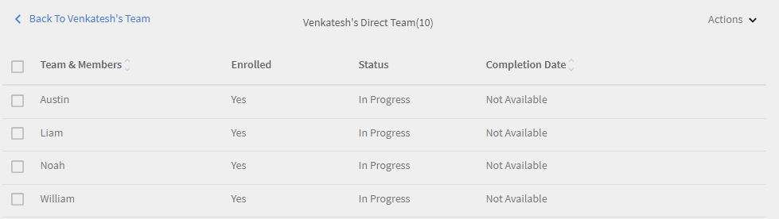

# Tablero de responsable

Obtenga información sobre cómo ver y realizar el seguimiento de aprendizajes desde el tablero de responsable.

Los gerentes juegan un papel importante en las iniciativas de aprendizaje de un equipo. Para que los responsables trabajen en mejores condiciones, la plataforma de aprendizaje proporciona una vista de tablero en la que se puede realizar el seguimiento de los aprendizajes de su equipo.

*Informe de tablero para un responsable*

Para ver los detalles de un gráfico, haga clic en el gráfico o en el vínculo **[!UICONTROL Detalles]**.

## Resumen del aprendizaje {#learningsummary}

Un responsable puede examinar el resumen de las actividades de aprendizaje de su equipo efectuadas durante un determinado período. En el menú desplegable, seleccione el mes, el trimestre o el año.

Las opciones Mes y Año se basan en el año natural. Por su parte, Trimestre se basa en el año fiscal que el administrador ha definido en la configuración de la cuenta.

*Ver las actividades de aprendizaje durante un período de tiempo*

## Vista de equipo {#teamview}

En la vista de equipo, se muestran los equipos, los integrantes y sus inscripciones, progresos y finalizaciones de objetos de aprendizaje.

*La vista de equipo muestra los equipos, sus miembros y sus respectivas inscripciones*

Al hacer clic en los nombres de los equipos, por ejemplo, Equipo de Venkatesh, puede ver los miembros del equipo de Venkatesh junto con el número total de inscripciones, progresiones y finalizaciones de un objeto de aprendizaje.

*Seleccionar un miembro del equipo*

Para ver el resumen del aprendizaje de cada integrante del equipo, haga clic en el número de la columna que corresponda al responsable del equipo. Se muestra una tabla con la lista de objetos de aprendizaje con los valores de Fecha de inscripción, Fecha de vencimiento y Progreso.

*Seleccione un administrador de equipo*

También es posible ver objetos de aprendizaje y la cantidad de inscripciones, progresos o finalizaciones haciendo clic en los valores de las columnas correspondientes.

*Ver cursos y resumen de aprendizaje*

Al hacer clic en la cantidad de inscripciones, progresiones o finalizaciones de cada aprendizaje, puede ver los siguientes detalles: personas, fecha de inscripción/finalización, fecha de vencimiento y progreso realizado.

*Ver la fecha de inscripción/finalización, la fecha de vencimiento y el progreso realizado*

## Vista de aprendizajes {#learningsview}

En la vista de equipo, se muestran la cantidad de inscripciones, progresos y finalizaciones de un objeto de aprendizaje.

Para ver información sobre personas, fechas de inscripción, de vencimiento y el progreso de los respectivos objetos de aprendizaje, haga clic en los valores pertinentes de las columnas Inscripciones, Progresos y Finalizaciones.

*Vista de aprendizajes*

## Exportar informe {#exportreport}

Para generar un informe de Excel, seleccione **[!UICONTROL Acciones] > [!UICONTROL informe]**

## Estado de cumplimiento {#compliancestatus}

En el tablero de cumplimiento, los responsables pueden ver el estado general de cumplimiento del equipo para los aprendizajes configurados en categorías específicas (por ejemplo, ventas, marketing y legal). Los administradores pueden crear un tablero con cursos de conformidad, rutas de aprendizaje o certificaciones, y compartirlo con los responsables. Los responsables pueden ver el tablero compartido por el administrador en sus instancias.

### Ver el tablero

Para ver el tablero, seleccione **[!UICONTROL el tablero]** de cumplimiento desde la aplicación del administrador.

_Aplicación Compliance dashboard-Manager_

El tablero de cumplimiento incluye los siguientes estados de cumplimiento:

* **[!UICONTROL Alumnos]** que no cumplen las normas: muestra la cantidad de alumnos que incumplieron los plazos.
* **[!UICONTROL Alumnos que se acercan a la fecha límite]**: muestra el número de alumnos con plazos en menos de 30 días.
* **[!UICONTROL Alumnos con plazos]** seguros: muestra el recuento de alumnos con plazos más lejanos (más de 30 días).
* **[!UICONTROL Alumnos]** totalmente conformes: muestra el número de alumnos que cumplen todos los requisitos.
* **[!UICONTROL Alumnos no inscritos en ninguna parte]**: muestra el recuento de alumnos que no se han inscrito en ningún curso, rutas de aprendizaje ni certificaciones.

### Gestores de correo electrónico y alumnos

**Gestión de varios equipos**

Si gestiona varios equipos, puede notificar a los responsables sobre el estado de aprendizaje de los miembros de su equipo mediante la selección de la opción Responsables ]**de**[!UICONTROL  correo electrónico disponible en la sección Vista ]**de**[!UICONTROL  equipo.

_Gestores de correo electrónico_

Email **[!UICONTROL Managers]** le ofrece las siguientes opciones:

* **[!UICONTROL Responsables de correo electrónico de alumnos que no cumplen las]** normas: notifique a los responsables cuyos miembros del equipo incumplieron los plazos.
* **[!UICONTROL Los responsables de correo electrónico de los alumnos se acercan a las fechas límite]**: notifique a los responsables cuyos miembros del equipo tienen fechas límite próximas.

**Gestión de un solo equipo**

Si gestiona un único equipo, puede notificar a sus alumnos sobre su estado de aprendizaje seleccionando la **[!UICONTROL opción Enviar correo electrónico a los]** alumnos disponible en la sección Vista ]**de**[!UICONTROL  equipo.

_Alumnos con correo electrónico_

La **[!UICONTROL opción Alumnos]** por correo electrónico le ofrece las siguientes opciones:

* **[!UICONTROL Enviar por correo electrónico a alumnos]** que no cumplen las normas: notifique a los alumnos que no cumplieron los plazos.
* **[!UICONTROL Enviar un correo electrónico a los alumnos que se acercan a las fechas límite]**: notifique a los alumnos que tienen fechas límite próximas.

### Descargar informe

Para descargar el informe, siga estos pasos:

1. En la aplicación del responsable, vaya al **[!UICONTROL Tablero]** de cumplimiento > **[!UICONTROL a la vista]** Equipo.
1. Seleccione **[!UICONTROL Descargar informe]** para guardar el tablero como un informe.
Esto le permite realizar un seguimiento del progreso general del aprendizaje de su equipo.

_Descargar informes_

<!--On this dashboard, managers can also view the learners who are compliant, in a safe deadline, approaching deadline, and non-compliant for a selected learning object. 

Learning Objects with completion deadlines can be configured in compliance dashboard for tracking. 

**Compliant**: Displays the number of learners who have completed the learning object within completion deadline.

**Safe deadline**: Displays the number of learners who have less than 30 days available to complete a learning object.

**Upcoming Deadline**: Displays the number of learners with more than 30 days available to complete a learning object.

**Non-compliant**: Displays the number of learners who did not complete the learning object within the completion deadline.

*View compliance dashboard*

## Team View {#TeamView-1}

Displays the compliance status of a course for respective teams. Compliant, Safe Deadline, Upcoming Deadline, and Non-Compliant are columns in the Team View table.

*compliance status of a course for respective teams*

To display names of the members in a team and the individual number of courses for which their status is Compliant, in Safe Deadline, reaching Upcoming Deadline, and Non Compliant, click the corresponding values in the table.

*Select individual teams*

On further clicking the values in the compliant, safe deadline, upcoming deadline, and non-compliant column, the corresponding course details are displayed: Learning object name, enrollment/ completion date, due date, and progress in percentage.

 

*View progress of courses*

## Learnings View {#LearningsView-1}

In the Compliance Status Learnings View, the list of Learning Objects and the corresponding number of team members that are Compliant, within a Safe Deadline, have an Upcoming Deadline, or are Non Compliant is displayed.

*View deadline and compliance status*

On further clicking the values in the compliant, safe deadline, upcoming deadline, and non compliant columns, the following data is displayed: People, Enrollment Date, Completion date, and Progress.

*View details of compliance*

## Export data & send emails {#exportdataampsendemails}

* To export the compliance status for team and learnings view, click **[!UICONTROL Actions]** > **[!UICONTROL Export]**.

* To send an email to team members, click **[!UICONTROL Actions]** > **[!UICONTROL Send Email]**.

*Export and email data*-->

## Aptitudes de equipo {#teamskills}

Los responsables pueden ver el gráfico de finalización de aptitudes y configurar un pronóstico de finalización de aptitudes en diferentes niveles. La lista desplegable de aptitudes incluye cinco aptitudes. El gerente llega a conocer la experiencia adquirida por los miembros del equipo e identifica un fuerte talento en ciertas habilidades.

Los gerentes también pueden impulsar ciertas habilidades en un equipo al establecer una meta y pronosticar cuánto tiempo tomaría lograr una habilidad para un porcentaje específico de un equipo dentro de una línea de tiempo.

Esta previsión se basa en cálculos de sistema que ofrecen una perspectiva futura sobre el progreso de esa aptitud.

*Ver pronóstico de habilidades*

Para ver el estado de las aptitudes de un equipo, siga los pasos que se indican a continuación:

1. Haga clic **[!UICONTROL en Aptitudes]** de equipo en el panel izquierdo en la sección Mi vista de equipo.
1. Para ver las aptitudes que se muestran, haga clic en el filtro de aptitudes y seleccione una de la lista desplegable.
1. Para seleccionar un nivel (1, 2 o 3), haga clic en el menú desplegable de niveles.
1. En función de la aptitud y el nivel seleccionados, se muestra un gráfico con su estado de aptitud. Al pasar el cursor sobre el gráfico, se pueden ver los porcentajes siguientes relativos al estado de la aptitud: **En curso** y **Conseguido**.

   

   *Ver porcentaje de estado de aptitud*

## Cómo prever el porcentaje de finalización del equipo respecto a una aptitud {#howtoforecasttheteamcompletionforaskill}

Para prever el porcentaje de finalización del equipo respecto a una aptitud, siga estos pasos:

1. Para ver en pantalla el rastreador de configuración, haga clic en el hipervínculo Configurar.

   

   *Seleccione el hipervínculo Configurar*

1. En el cuadro de diálogo emergente de configuración, para la aptitud que desee configurar, introduzca un valor porcentual en el campo % de **finalización** de destino y la fecha en la que desea alcanzar el porcentaje de finalización previsto en el **campo Fecha** objetivo.****

   

   *Introduzca el porcentaje de finalización del objetivo*

1. Para ver el resultado de la previsión, haga clic en el botón **Estimación**. El resultado es similar a la captura de pantalla siguiente.

   

   *Ver salida de tracxker de aptitudes*

## Previsión de finalización del nivel de aptitud {#skilllevelcompletionforecast}

El responsable de un equipo puede ver y configurar el porcentaje de finalización del equipo relativo a una aptitud durante un determinado período de tiempo según el porcentaje de finalización objetivo y la fecha y hora indicadas en el rastreador de aptitudes.

En el gráfico de previsión, hay dos tipos de líneas (continua y discontinua) con tres vértices cada una.

En la línea continua, el primer punto muestra la fecha de la primera inscripción de un nivel de aptitud.

*Ver la primera inscripción para un nivel de aptitud*

El segundo punto muestra la fecha actual y el porcentaje de finalización del equipo respecto a la aptitud.

*Ver la fecha actual y el nivel de porcentaje de finalización del equipo de la habilidad*

El tercer punto de la línea muestra el porcentaje de finalización objetivo previsto y la fecha de finalización objetivo.

*Ver el porcentaje previsto de finalización y la fecha de finalización del objetivo*

## Línea de previsión {#forecastline}

La línea discontinua muestra la previsión según el porcentaje de finalización del equipo respecto a una aptitud en un determinado período de tiempo.

El primer punto de la línea discontinua muestra el porcentaje de finalización del equipo, así como el porcentaje de finalización previsto respecto a una aptitud en esa fecha.

*Ver el porcentaje de finalización del equipo y el porcentaje de finalización proyectado del equipo para una aptitud*

El segundo punto muestra la fecha en la cual se consiguió el porcentaje de finalización previsto del equipo respecto a una aptitud.

*Ver la fecha en la que se alcanzó el porcentaje de finalización del equipo proyectado para una aptitud*

El tercer punto de la línea de previsión muestra el porcentaje de finalización del equipo conseguido en la fecha objetivo que se proporciona en el rastreador de aptitudes.

*Ver el porcentaje de finalización del equipo que se logra en la fecha objetivo proporcionada en el rastreador de habilidades*

Debajo del gráfico, se muestra una tabla con la vista del equipo y la cantidad de aptitudes en las que se ha inscrito, las que se han conseguido y las que están en curso. Si un aprendizaje tiene una fecha de finalización, también se muestra la fecha de finalización prevista.

*Tabla con la vista del equipo y el número de habilidades que se han inscrito, obtenido y en progreso*

Al hacer clic en el nombre del equipo, se muestra la lista de miembros que se inscribieron en la aptitud, el estado de la aptitud y la fecha de finalización.

*Ver lista de miembros*

Al hacer clic en el equipo, puede ver los miembros que contiene y los detalles correspondientes de la aptitud seleccionada, como si están inscritos, el estado (en curso o logrado) y la fecha de finalización, si se ha establecido.

*Ver las aptitudes de los miembros*

Al seleccionar los valores de un equipo en la columna de inscritos, conseguidos o en curso, se puede ver la cantidad de usuarios que se han inscrito en la aptitud. También se puede ver la fecha en que el usuario se había inscrito en la aptitud, el estado y la fecha de finalización de la aptitud si el usuario la ha completado.

<!-- -->

## Exportar informe {#Exportreport-1}

* Haga clic en **[!UICONTROL Acciones]** > **[!UICONTROL Exportar]** para exportar los datos como un archivo de Excel.

*Exportar los datos*
