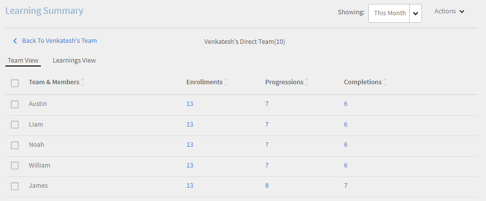
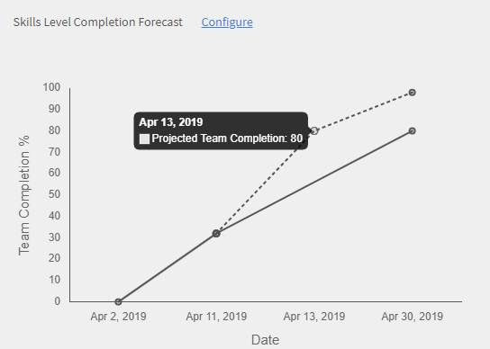

# Tablero de responsable

Aprenda a ver y hacer un seguimiento de los aprendizajes desde el tablero del responsable.

Los gestores desempeñan un papel importante en las iniciativas de aprendizaje de un equipo. Para orientarlos mejor, la plataforma de aprendizaje proporciona al responsable una vista de panel para realizar un seguimiento de los aprendizajes en su equipo.

*Informe de tablero de un responsable*

Para ver los detalles de un gráfico, haga clic en el gráfico o haga clic en **[!UICONTROL Detalles]** hipervínculo.

## Resumen del aprendizaje {#learningsummary}

Un responsable puede ver el resumen de las actividades de aprendizaje de su equipo durante un período de tiempo seleccionado. Seleccione mes, trimestre o año en el menú desplegable.

&#39;Mes&#39; y &#39;Año&#39; se basan en el año natural, mientras que &#39;Trimestre&#39; se basa en el año financiero, tal y como lo haya configurado el administrador en la configuración de la cuenta.

*Ver las actividades de aprendizaje durante períodos de tiempo*

## Vista de equipo {#teamview}

La vista de equipo muestra los equipos, sus miembros y sus respectivas inscripciones, progresiones y finalizaciones de objetos de aprendizaje.

*La vista de equipo muestra los equipos, sus miembros y sus inscripciones respectivas*

Al hacer clic en los nombres de los equipos, por ejemplo, el equipo de Venkatesh, puede ver los miembros del equipo de Venkatesh junto con el número total de inscripciones, progresos y finalizaciones de un objeto de aprendizaje.

*Seleccionar un miembro del equipo*

Para ver el resumen de aprendizaje de cada miembro del equipo, haga clic en el número de la columna correspondiente al jefe del equipo. Se abre una tabla que muestra la lista de objetos de aprendizaje con información de Fecha de inscripción, Fecha de vencimiento y Progreso.

*Seleccionar un jefe de equipo*

Del mismo modo, puede ver los objetos de aprendizaje junto con el número de inscripciones, progresiones o finalizaciones haciendo clic en los valores de las columnas correspondientes.

*Ver cursos y resumen de aprendizaje*

Al hacer clic en el número de inscripciones, progresos o finalizaciones de cada aprendizaje, puede ver los siguientes detalles: personas, fecha de inscripción/finalización, fecha de vencimiento y progreso realizado.

*Ver la fecha de inscripción/finalización, la fecha de vencimiento y el progreso realizado*

## Vista de aprendizaje {#learningsview}

La vista de aprendizaje muestra el número de inscripciones, progresiones y finalizaciones de un objeto de aprendizaje.

Para ver detalles, incluidas las personas, las fechas de inscripción, las fechas de vencimiento y el progreso de los respectivos objetos de aprendizaje, haga clic en los valores correspondientes en las columnas Inscripciones, Progresiones y Finalizaciones.

*Vista de aprendizaje*

## Exportar informe {#exportreport}

Para generar un informe de Excel, haga clic en **[!UICONTROL Acciones] > [!UICONTROL Informe]**

## Estado de cumplimiento {#compliancestatus}

Los responsables pueden ver el estado de cumplimiento general del equipo para los aprendizajes configurados en el tablero de cumplimiento. La lista de aprendizajes se puede configurar y el responsable puede seleccionar los aprendizajes para realizar un seguimiento del estado de cumplimiento.

En este tablero, los responsables también pueden ver a los alumnos que cumplen los requisitos, en una fecha límite segura, acercándose a la fecha límite y que no cumplen los requisitos para un objeto de aprendizaje seleccionado.

Los objetos de aprendizaje con plazos de finalización se pueden configurar en el tablero de cumplimiento para el seguimiento.

**Conforme**: muestra el número de alumnos que han completado el objeto de aprendizaje dentro de la fecha límite de finalización.

**Plazo de seguridad**: muestra el número de alumnos que tienen menos de 30 días disponibles para completar un objeto de aprendizaje.

**Próximo Plazo**: muestra el número de alumnos con más de 30 días disponibles para completar un objeto de aprendizaje.

**No conforme**: muestra el número de alumnos que no han completado el objeto de aprendizaje dentro de la fecha límite de finalización.

*Ver panel de cumplimiento*

## Vista de equipo {#TeamView-1}

Muestra el estado de cumplimiento de un curso para los respectivos equipos. Las columnas Cumplimiento, Fecha límite segura, Próxima fecha límite y No cumplimiento se encuentran en la tabla Vista de equipo.

*estado de cumplimiento de un curso para los equipos respectivos*

Para mostrar los nombres de los miembros de un equipo y el número individual de cursos para los que su estado es Compatible, en Fecha límite segura, Fecha límite próxima y No compatible, haga clic en los valores correspondientes de la tabla.

*Seleccionar equipos individuales*

Al hacer clic en los valores de la columna que cumple, fecha límite segura, fecha límite próxima y no cumple, se muestran los detalles del curso correspondiente: nombre del objeto de aprendizaje, fecha de inscripción/finalización, fecha de vencimiento y progreso en porcentaje.

 

*Ver progreso de cursos*

## Vista de aprendizaje {#LearningsView-1}

En la vista de aprendizaje del estado de cumplimiento, se muestra la lista de objetos de aprendizaje y el número correspondiente de integrantes del equipo que cumplen los requisitos, dentro de una fecha límite segura, tienen una fecha límite próxima o no cumplen los requisitos.

*Ver fecha límite y estado de cumplimiento*

Al hacer clic en los valores de las columnas Cumplimiento, Fecha límite segura, Fecha límite próxima y No compatible, se muestran los siguientes datos: Personas, Fecha de inscripción, Fecha de finalización y Progreso.

*Ver detalles del cumplimiento*

## Exportar datos y enviar correos electrónicos {#exportdataampsendemails}

* Para exportar el estado de cumplimiento para la vista de equipo y de aprendizaje, haga clic en **[!UICONTROL Acciones]** > **[!UICONTROL Exportar]**.

* Para enviar un correo electrónico a los miembros del equipo, haga clic en **[!UICONTROL Acciones]** > **[!UICONTROL Enviar correo electrónico]**.

*Exportar y enviar datos por correo electrónico*

## Habilidades de equipo {#teamskills}

Los responsables pueden ver el gráfico de finalización de aptitudes y configurar una previsión de finalización de aptitudes en diferentes niveles. En la lista desplegable de aptitudes se muestran cinco aptitudes. El gerente conoce la experiencia adquirida por los miembros del equipo e identifica el talento fuerte en ciertas habilidades.

Los gestores también pueden impulsar determinadas habilidades en un equipo estableciendo un objetivo y pronosticando el tiempo que se tardaría en conseguir una habilidad para un porcentaje específico de un equipo en un plazo de tiempo.

Este pronóstico se basa en cálculos del sistema que ofrece una visión en el futuro para un progreso de esa habilidad específica.

*Ver previsión de aptitud*

Para ver el estado de aptitudes de un equipo, siga los pasos que se indican a continuación:

1. Haga clic en **[!UICONTROL Habilidades de equipo]** en el panel izquierdo, bajo la sección Vista de mi equipo.
1. Para ver las aptitudes mostradas, haga clic en el filtro de aptitud y seleccione una de la lista desplegable.
1. Para seleccionar un nivel (Nivel 1, Nivel 2 o Nivel 3), haga clic en el menú desplegable de nivel.
1. En función de la aptitud y el nivel seleccionado, se muestra un gráfico con su estado de aptitud. Al pasar el cursor sobre el gráfico, puede ver los siguientes porcentajes del estado de la aptitud: **En curso** y **Conseguido**.

   

   *Ver porcentaje del estado de la aptitud*

## Cómo prever el porcentaje de finalización del equipo para una aptitud {#howtoforecasttheteamcompletionforaskill}

Para prever el porcentaje de finalización del equipo para una aptitud, siga los pasos que se indican a continuación:

1. Para mostrar el rastreador de configuración, haga clic en el hipervínculo de configuración.

   

   *Seleccione el hipervínculo Configurar*

1. En el cuadro de diálogo emergente configurar, introduzca un valor de porcentaje en la aptitud que desee configurar **% de finalización de objetivo** y la fecha en la que desea alcanzar el porcentaje de finalización objetivo en el campo **Fecha objetivo** campo.****

   

   *Introducir porcentaje de finalización de destino*

1. Para ver el resultado de la previsión, haga clic en **Estimación** botón. El resultado se parece a la captura de pantalla siguiente.

   

   *Ver salida del rastreador de aptitudes*

## Previsión de finalización de nivel de aptitud {#skilllevelcompletionforecast}

El responsable de un equipo puede ver y configurar el porcentaje de finalización de equipo de una aptitud para un período de tiempo determinado en función del porcentaje de finalización de destino y la fecha y hora proporcionadas en el rastreador de aptitudes.

En el gráfico de previsión, hay dos tipos de líneas (línea sólida y línea de puntos) con tres vértices cada una.

En la línea sólida, el primer punto muestra la fecha de la primera inscripción para un nivel de aptitud.

*Ver la primera inscripción de un nivel de aptitud*

El segundo punto muestra la fecha actual y el nivel de porcentaje de finalización del equipo de la aptitud.

*Ver la fecha actual y el nivel % de finalización del equipo de la aptitud*

El tercer punto de la línea muestra el porcentaje de finalización de destino esperado y la fecha de finalización de destino.

*Ver el porcentaje de finalización de destino esperado y la fecha de finalización de destino*

## Línea de previsión {#forecastline}

La línea de puntos es la línea de previsión que muestra la previsión en función del porcentaje de finalización del equipo actual para una aptitud en un período de tiempo determinado.

El primer punto de la línea de puntos representa el porcentaje de finalización del equipo y el porcentaje de finalización del equipo previsto para una aptitud en esa fecha.

*Ver el porcentaje de finalización del equipo y el porcentaje de finalización del equipo previsto para una aptitud*

El segundo punto muestra la fecha en la que se alcanzó el porcentaje de finalización de equipo previsto para una aptitud.

*Ver la fecha en la que se alcanzó el porcentaje de finalización de equipo previsto para una aptitud*

El tercer punto de la línea de previsión muestra el porcentaje de finalización del equipo alcanzado en la fecha objetivo proporcionada en el rastreador de aptitudes.

*Ver el porcentaje de finalización del equipo alcanzado en la fecha objetivo proporcionada en el rastreador de habilidades*

En el gráfico, se muestra una tabla con la vista del equipo y el número de aptitudes que se han inscrito, alcanzado y en curso. Si un aprendizaje tiene una fecha de finalización, también se muestra la fecha de finalización esperada.

*Tabla con la vista del equipo y el número de aptitudes que se han inscrito, alcanzado y en curso*

Al hacer clic en el nombre del equipo, se muestra la lista de miembros que se han inscrito en la aptitud, el estado de la aptitud y la fecha de finalización.

*Ver lista de miembros*

Al hacer clic en el equipo, puede ver sus miembros y los detalles correspondientes a la aptitud seleccionada, por ejemplo, si está inscrito, el estado (en curso o conseguido) y la fecha de finalización si se ha definido.

*Ver aptitudes de miembros*

Al seleccionar los valores de un equipo en la columna Inscripción, conseguido y en curso , puede ver el número de usuarios que se han inscrito en la aptitud. También puede ver la fecha en la que el usuario se ha inscrito en la aptitud, el estado y la fecha de finalización si el usuario ha completado la aptitud.

<!-- -->

## Exportar informe {#Exportreport-1}

* Haga clic en **[!UICONTROL Acciones]** > **[!UICONTROL Exportar]** para exportar los datos como un archivo de excel.

*Exportar los datos*
