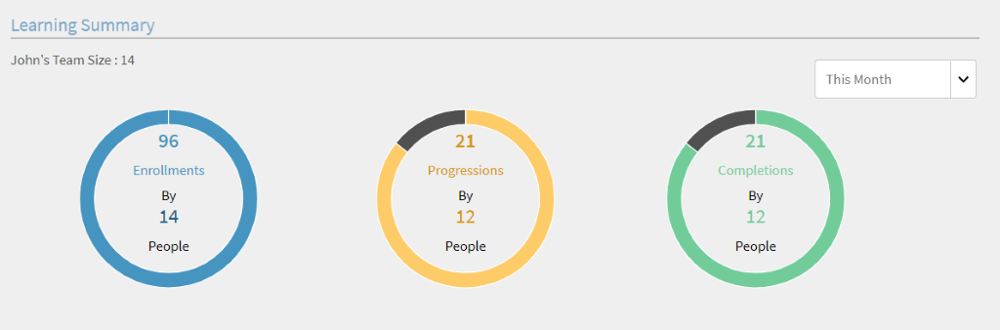
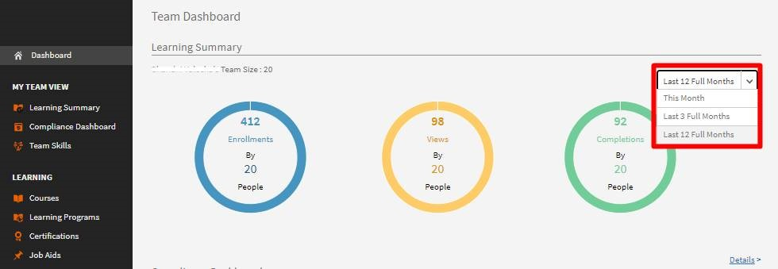
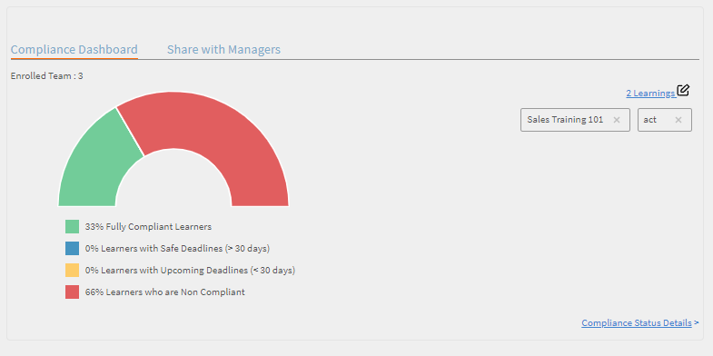
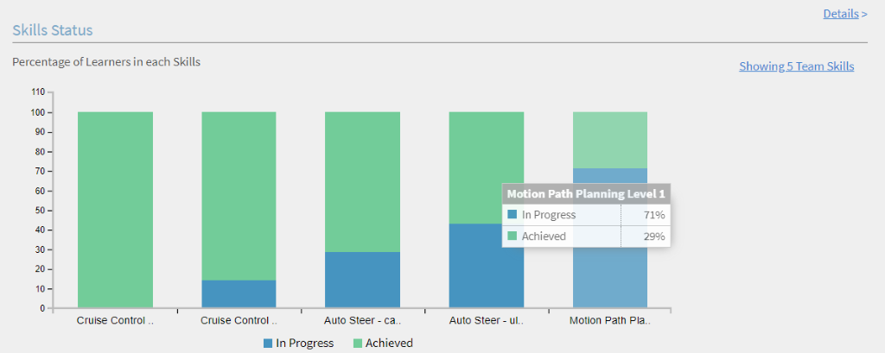
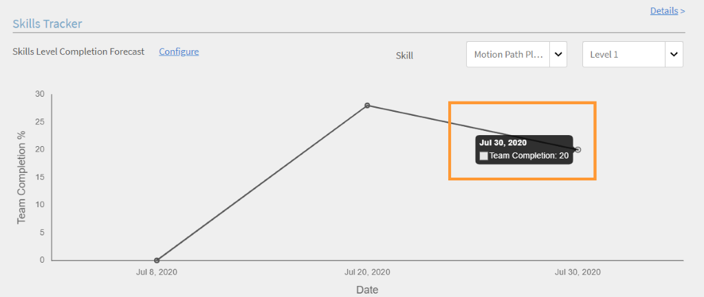
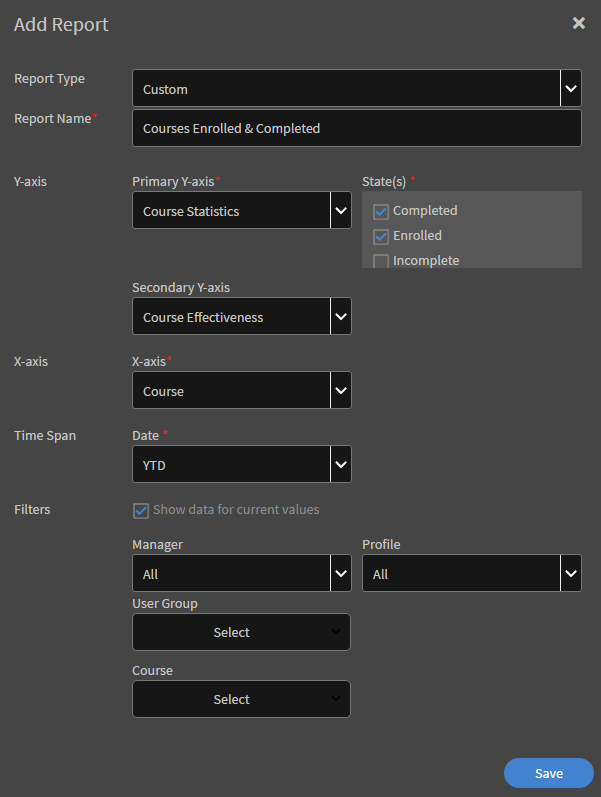
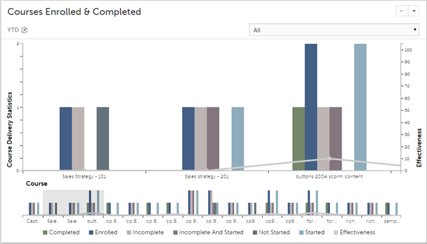
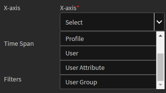
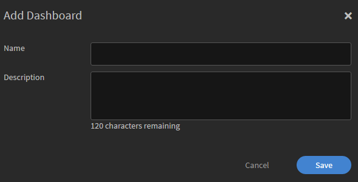
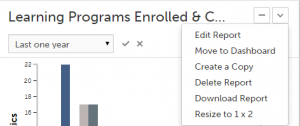

# Informes

Creación y administración de informes para responsables.

Adobe Learning Manager le permite crear diversos informes para supervisar y controlar las actividades de los alumnos. Las actividades de los alumnos se supervisan y se capturan automáticamente en la base de datos. Los informes del responsable y el administrador se generan a partir de la base de datos.

## Información general {#overview}

El proceso de generación de informes es el mismo para el administrador y para el responsable. Los responsables pueden ver los informes correspondientes a sus subordinados, mientras que el administrador puede ver todos los informes en toda la empresa.

Los informes se añaden en un tablero. Un informe debe estar dentro de un tablero. De manera predeterminada, verá un **Tablero predeterminado** en la página Informes. Cualquier informe añadido por usted se añade a este tablero predeterminado. Para añadir informes a tableros individuales, utilice la tecla de flecha desplegable y escoja Añadir informe. Para obtener más información sobre cómo crear tableros, consulte la sección Tableros en esta página.

## Tableros de responsables {#manager-dashboards}

Un responsable puede ver información sobre su equipo directo o indirecto en forma de resumen.

A continuación, el responsable puede filtrar el informe por intervalos como trimestre, este mes, últimos tres meses completos y últimos 12 meses completos.

## Resumen del aprendizaje {#learningsummary}

*Ver resumen de aprendizaje*

*Filtrar resumen de aprendizaje por fecha*

## Tablero de cumplimiento {#compliancedashboard}

Consulte el cumplimiento del equipo y el miembro del equipo que roza el incumplimiento. Elija los objetos de aprendizaje y vea el estado de cada uno.

*Ver panel de cumplimiento*

## Estado de aptitudes {#skillsstatus}

Consulte el porcentaje de alumnos para cada aptitud. Elija un máximo de cinco aptitudes de los alumnos que desee consultar. La visualización se realiza en forma de gráfico de barras apiladas. Al pasar el cursor sobre cada barra, puede ver el desglose del estado de esa aptitud.

*Ver el estado de las aptitudes de un alumno*

## Rastreador de aptitudes {#skilstracker}

Vea una proyección de finalización de aptitudes de un equipo. Elija el porcentaje de finalización de destino y la fecha de una aptitud.

En función de los datos históricos, puede ver una representación gráfica de la proyección de finalización de aptitudes en la fecha seleccionada.

*Ver proyección de finalización de aptitudes*

## Cómo crear informes {#creatingreports}

1. Haga clic en Informes en el panel de la izquierda. Aparece la página Resumen de informes.\
   **Nota**
De forma predeterminada, aparecen al menos tres informes de muestra en la página Resumen de informes. Solo puede ver estos informes de muestra para hacerse una idea de cómo los crearía y los personalizaría.

1. En la página Resumen de informes, haga clic en Añadir. Aparece el cuadro de diálogo de creación de informes.
1. Haga clic en Guardar para terminar de crear un informe. A continuación, se proporciona un informe de muestra como referencia.

*Cuadro de diálogo Agregar informe*

En Tipo de informe, puede seleccionar un conjunto de informes predefinidos o un tipo personalizado. Puede ver los siguientes informes como parte del conjunto de informes predefinidos:

* Aptitudes asignadas y obtenidas
* Cursos en los que me inscribí y que finalicé
* Eficacia de los cursos
* Programas de aprendizaje en los que me inscribí y que finalicé
* Tiempo de aprendizaje dedicado a cada curso
* Tiempo de aprendizaje dedicado por trimestre

Puede utilizar los tipos de informes especificados anteriormente para generar más de 300 variaciones de informes.

Nombre del informe Escriba un título para su informe.

**Eje Y principal** Seleccione el criterio primario/principal para su informe entre las opciones desplegables. Para algunos de los criterios seleccionados, tiene la opción de escoger uno o varios estados del cuadro desplegable junto a los estados. Por ejemplo, para el criterio principal Estadísticas de inscripción en el curso, los estados pueden ser finalizado, incompleto, inscritos, etc. Los datos del intervalo principal se representan en forma de gráfico de barras en el informe.

**Eje Y secundario** Seleccione el criterio/intervalo secundario del eje Y para su informe entre las opciones desplegables. Por ejemplo, en la opción de inscripción en programas de aprendizaje, escoja uno o varios estados entre la lista de estados. Los datos del intervalo secundario se representan en forma de gráfico de líneas.

**Eje X** Seleccione los criterios apropiados del eje X para su informe entre las opciones desplegables. Si se selecciona la fecha como el eje X, está disponible la opción de agrupar los criterios del eje X por día, mes, trimestre y año.

**Fecha** Seleccione la opción apropiada de la lista desplegable. Opciones: último mes, trimestre, año, trimestre hasta la fecha (últimos 90 días), año hasta la fecha (últimos 365 días) e intervalo de fecha. Si selecciona el intervalo de fechas, proporcione las fechas &quot;desde&quot; y &quot;hasta&quot; como se indica a continuación:

**Desde** Seleccione la fecha de inicio desde la cual desea ver el informe.

**Hasta** Seleccione la fecha de finalización para su informe.

## Filtros {#filters}

Los filtros aparecen en el cuadro de diálogo Añadir informe en la parte inferior en función de los tipos de informes que ha seleccionado. Algunos de los filtros prominentes se mencionan a continuación.

**Responsable** Puede elegir cualquiera de los responsables según la jerarquía. Algunos responsables pueden tener responsables subordinados y varios empleados que informen a cada responsable subordinado.

**Perfil** Seleccione la designación de su empleado. Ayudaría en la visualización de informes de empleados según su perfil/designación. Por ejemplo, técnico informático, ingeniero, etc.

**Grupo de usuarios** Seleccione el grupo de usuarios teniendo en cuenta para cuál desea filtrar informes. Learning Manager busca los grupos de usuarios definidos para su cuenta según la función Usuarios.

**Curso** Puede filtrar su informe según cualquier curso si lo selecciona de la lista desplegable.

*Ver gráfico de cursos inscritos y completados*

>[!NOTE]
>
>Sobre la leyenda del gráfico, puede ver un cuadro para aumentar el tamaño. Puede mover el cursor sobre él, hacer clic y arrastrar el cursor sobre cualquier parte del área del cuadro que desee aumentar.

Puede ver los valores secundarios del eje Y en forma de línea a través de las barras del gráfico. Por ejemplo, en la muestra especificada anteriormente, puede ver los valores de Eficacia en una línea gris a través del gráfico.

## Informes de grupos de usuarios {#user-group-reporting}

Controle la manera en que los grupos de usuarios, como los departamentos, los socios externos y las funciones, se desempeñan en comparación con otros grupos de usuarios u otros objetivos del aprendizaje.

### Grupos de usuarios {#usergroups}

Para generar informes basados en grupos de usuarios, elija **Grupo de usuarios** en el eje X entre las opciones de la lista desplegable, como se muestra en la captura de pantalla a continuación.

*Generar informes de grupos de usuarios*

Aparece otra lista de **selección** desplegable junto al eje X con una lista de los grupos de usuarios disponibles para su cuenta. En esta lista desplegable, puede seleccionar uno o varios grupos de usuarios.

Una vez que guarda y genera este informe, si ha seleccionado varios grupos de usuarios, el informe se genera con todos los grupos de usuarios representados en el gráfico de barras uno al lado del otro en el eje X.

Este informe del grupo de usuarios le permite comparar el rendimiento de un departamento/división/función con otro para evaluar sus logros de aprendizaje.

### Atributos personalizados de los usuarios/grupos de usuarios {#customusergroupsuserattributes}

También puede crear grupos de usuarios personalizados con la función Añadir usuarios/grupos de usuarios en Learning Manager. Después de crear los grupos de usuarios, puede generar informes para los grupos de usuarios personalizados con la ayuda de una lista de atributos, como, por ejemplo, ubicación, sucursal, etc.

En el eje X, elija la opción Atributos de usuario y seleccione el atributo en el menú desplegable **seleccionar** situado junto a él. Para crear un informe personalizado del grupo de usuarios basado en estos atributos, también deberá seleccionar el grupo de usuarios correspondiente en el filtro.

Los responsables pueden crear informes de grupos de usuarios solo para sus propios miembros del equipo como alumnos.

## Tipos de informes {#typesofreports}

* Estadísticas de entrega del curso para alumnos
* Informe sobre la eficacia de los cursos
* Informe basado en las aptitudes del alumno
* Estadísticas de inscripción en el programa de aprendizaje para alumnos
* Tiempo de aprendizaje dedicado por los alumnos
* Finalización de la certificación

## Mis informes {#myreports}

Un tablero es una colección de informes. Los informes pueden agruparse en un tablero según su elección.

**Informes de muestra**

Haga clic en esta ficha para ver algunos informes indicativos que se basan en puntos de datos de muestra. Explore estos informes para tener una idea de los distintos tipos de informes repletos de funciones que puede generar con los datos de su cuenta.

**Mis informes**

Haga clic en la ficha de este tablero para ver todos los tableros creados por usted. En la vista de la lista desplegable del tablero, puede seleccionar el tablero predeterminado o cualquiera de los tableros creados por usted.

**Añadir tablero**

1. Haga clic en Añadir tablero en la parte derecha de la página para comenzar a crear sus propios tableros.

   

   *Crea tu propio tablero*

1. Proporcione un nombre y una descripción para el tablero y haga clic en **[!UICONTROL Guardar]**.

Puede ver el tablero creado recientemente en la lista Mis tableros.

Para añadir informes a su tablero, haga clic en la lista desplegable en la esquina superior derecha de la ventana de su tablero y luego haga clic en Añadir informe. El informe que crea de este modo se asocia con su tablero.

>[!NOTE]
>
>Los informes que cree haciendo clic en Agregar en la esquina superior derecha de la página Informes se agregan al panel predeterminado.

**Informes compartidos**

Los informes compartidos son una colección de informes que otros usuarios dentro de la empresa han compartido con usted. Si tiene los permisos, puede descargar o duplicar los informes compartidos. Póngase en contacto con el administrador de su empresa con el fin de obtener privilegios de acceso para descargar/duplicar los informes compartidos.

**Informes de suscripción**

Para suscribirse a sus informes favoritos, proporcione su Id. de correo electrónico aquí. Los informes a los que se suscribe se le envían por correo electrónico.

Haga clic en el icono **Editar**, en la parte superior derecha del nombre del informe en la lista de informes, para modificar su suscripción en cualquier momento.

## Visualización de informes {#viewingreports}

En la página Resumen de informes, puede ver todos los informes. Puede minimizar cada informe si hace clic en el icono menos (-) situado en la esquina superior derecha de cada informe. Haga clic en el icono + para ver su informe nuevamente.

**Vista rápida con fechas diferentes**

Los valores de fecha que utiliza para ver el informe son temporales. Esta vista del informe no se descarga cuando selecciona la opción Descargar. Esta vista solo es temporal.

Puede cambiar el intervalo/valor de fecha para cualquier informe y obtener una vista rápida de una fecha diferente sin tener que modificar y guardar el informe. Haga clic en el icono Editar (como se muestra con una flecha en la captura de pantalla a continuación) junto al intervalo de fecha, por ejemplo, trimestre hasta la fecha, último año, etc. Seleccione el nuevo valor en el menú desplegable y haga clic en la marca de verificación para confirmar el cambio. Para cancelar el cambio, haga clic en la marca X.

**Vista rápida con responsables diferentes**

Si varios responsables le informan a usted, podrá ver los informes rápidamente para cada responsable. Seleccione el nombre del responsable en la lista desplegable para ver un informe único para cada responsable.**Editar/Mover al tablero/Crear una copia/Eliminar/Cambiar el tamaño de informes** Haga clic en la flecha desplegable en la esquina superior derecha de cada informe para ver opciones desplegables como Editar/Mover al tablero/Crear una copia/Eliminar/Cambiar el tamaño.

<!---->

**Editar** Mientras modifica datos, regrese a los valores iniciales y haga clic en Restablecer. Haga clic en Guardar después de modificar los valores.

**Mover al tablero** Puede mover el informe actual a otro tablero, que se elige entre la lista de tableros.

**Crear una copia** Puede copiar el informe al mismo tablero o a otro, que se selecciona de la lista de tableros.

**Eliminar** Haga clic en Eliminar para eliminar el informe. Aparece un mensaje de advertencia/confirmación antes de que se elimine el informe.

**Cambiar el tamaño** Puede cambiar el tamaño de sus informes a los tamaños 1×1 (grande) y 2×2 (medio).

## Suscripciones por correo electrónico {#emailsubscriptions}

Puede recibir sus informes favoritos por correo electrónico mediante una suscripción.

En la página Informes, haga clic en Suscripción por correo electrónico junto al botón Añadir que se ve en la esquina superior derecha de la página. Aparece la página de suscripción a informes.

Comience a escribir el nombre del informe en el campo Informes para seleccionar el nombre del informe de la lista desplegable. Seleccione la frecuencia del correo electrónico como diaria, semanal o mensual, según prefiera; añada el asunto del correo electrónico; y haga clic en Añadir para suscribirse.

Haga clic en Editar para modificar la suscripción. Haga clic en Eliminar para eliminar la suscripción.
