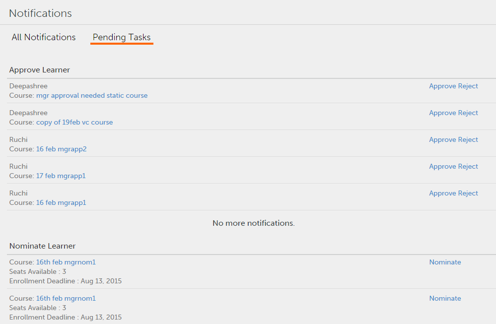

# Notificaciones de usuarios

Configuración de notificaciones de usuario para responsables.

La función Notificaciones es aplicable a todos los usuarios de Adobe Learning Manager 1.0. Sin embargo, según la función de cada usuario, se obtienen distintos tipos de notificaciones en diferentes situaciones. Todas las alertas y notificaciones a los usuarios se muestran en cuadros de diálogo emergentes de notificaciones.

## Notificaciones de acceso {#accessnotifications}

Los usuarios pueden ver las notificaciones si hacen clic en el icono de notificaciones en la esquina superior derecha de la ventana. En el modo de inicio de sesión Responsable, también puede hacer clic en Notificaciones en el panel izquierdo para acceder a estas notificaciones.

Captura de pantalla de muestra de notificaciones del responsable:

*Ver todas las notificaciones*

Esta ventana emergente muestra resaltadas todas las notificaciones junto con la hora de envío y una barra de desplazamiento. Para ver más información sobre todas las notificaciones, haga clic en Mostrar todas las notificaciones en la parte inferior de la ventana emergente. Aparece la página de notificaciones.

Un responsable puede ver las tareas pendientes y todas las notificaciones en formato de fichas en la página de notificaciones. Las notificaciones de las tareas pendientes se clasifican según las aprobaciones, las nominaciones, etc. Para ver todas las notificaciones, haga clic en la ficha **[!UICONTROL Todas las notificaciones]**. En la ficha Todas las notificaciones, las notificaciones se ordenan por fecha y hora, y se enumeran.

*Ver todas las tareas pendientes*

Puede saber la cantidad de notificaciones más recientes según el número resaltado en el icono de notificaciones. Por ejemplo, si tiene cinco notificaciones recientes después del inicio de sesión anterior, puede ver que el número cinco aparece en el icono de notificaciones. Estos números desaparecen cuando lee todas las notificaciones recientes.

## Nominar alumnos para cursos {#nominatelearnersforcourses}

En la ventana Notificaciones, tal y como se muestra en la captura de pantalla anterior, haga clic en el vínculo Nominar. Aparecerá un cuadro de diálogo emergente. Haga clic en Nominar.

*Nominar alumnos a cursos*

**Tipos de notificaciones para responsables** 

Los responsables pueden obtener notificaciones cuando se activan los siguientes eventos:

1. Un alumno se inscribe en un curso o programa de aprendizaje
1. Un alumno finaliza un curso o programa de aprendizaje
1. Un administrador inscribe a un alumno en un curso o programa de aprendizaje
1. Un responsable debe proporcionar comentarios sobre el N3 al alumno
1. Un responsable debe nominar a alumnos para un curso
1. Un responsable debe aprobar a un alumno para un curso.
1. Un responsable debe aprobar el documento de prueba de la certificación cargado por el alumno
1. Un alumno no termina el curso, ni siquiera después de la fecha límite. (este evento se activa solo cuando el recordatorio de notificación de la instancia del curso se establece con nivel de escalación al responsable del alumno).

>[!NOTE]
>
>Los responsables también pueden recibir notificaciones cuando desempeñan la función de alumno. Consulte las notificaciones de alumnos para obtener más información.

## Proporcionar comentarios {#providefeedback}

Tal como se muestra en la captura de pantalla anterior, los responsables pueden hacer clic en Proporcionar comentarios para proporcionar comentarios sobre el N3 para los alumnos de cada curso o programa de aprendizaje.

>[!NOTE]
>
>Los alumnos y responsables pueden obtener la opción de comentarios para los cursos solo cuando un administrador la activa para un curso concreto.
