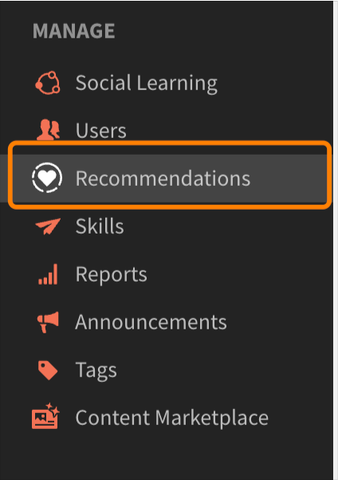
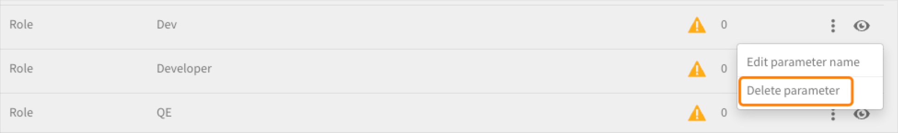

# Recomendaciones en Adobe Learning Manager

Adobe Learning Manager ha introducido un sistema de recomendaciones para los cursos nuevo y mejorado. Esta función de recomendaciones utiliza algoritmos de IA y los intereses de los usuarios, como productos, funciones y niveles, para ofrecer recomendaciones de contenido personalizadas.

El nuevo sistema de recomendaciones le permite crear parámetros personalizados que los alumnos pueden seleccionar para recibir recomendaciones personalizadas. Estas recomendaciones se mostrarán como cursos, rutas de aprendizaje y certificaciones a los alumnos en su fuente de la página de inicio.

Para empezar a utilizar esta función, debe activarla en la aplicación de administración.

## Habilitar y configurar las recomendaciones

1. Cargue el curso y los datos de usuario (opcional).
1. Lleve a cabo los cambios en tiempo real.
1. Después de activar y configurar las recomendaciones, cargue los datos en Adobe Learning Manager para que las recomendaciones empiecen a funcionar. Estos datos se componen de:

   * Datos del curso
   * Datos de usuario (opcional)

## Algoritmo de clasificación del curso

El núcleo del motor de recomendaciones se basa en el nuevo **[!UICONTROL algoritmo de clasificación de cursos]** de Learning Manager. El algoritmo utiliza 50 millones de puntos de datos y cinco años de datos de aprendizaje agregados de millones de usuarios para clasificar los cursos en función de su probabilidad de inscripción. Esta clasificación garantiza que la mayoría de los cursos en los que se puede inscribir se muestren por adelantado a los alumnos.

## Términos clave

El nuevo motor de recomendaciones basado en IA de Learning Manager ofrece a los líderes de aprendizaje un sistema de recomendaciones configurable basado en parámetros para crear una experiencia personalizada para los alumnos.

Los parámetros son: **Productos/temas**, **Funciones** y **Niveles**. Además, se puede cambiar el nombre de estos parámetros para adaptarlos a sus necesidades. Así, los &#39;productos&#39; pueden convertirse en &#39;temas&#39; o los &#39;roles&#39; pueden convertirse en &#39;región&#39;.

## Configurar el sistema de recomendaciones

El nuevo motor de recomendaciones de Adobe Learning Manager simplifica el flujo de trabajo de administración que conlleva la configuración de recomendaciones personalizadas, ya que los datos sobre los productos y las funciones asociadas a un cliente o socio están disponibles generalmente para los administradores (por ejemplo, de los registros de compra).

La configuración del nuevo motor de recomendaciones implica principalmente tres flujos de trabajo:

* Administrador
* Autor
* Alumno

Los administradores configuran los valores de los parámetros Productos, Roles y Niveles de la cuenta. Por ejemplo, un proveedor de soluciones de TI con bancos como su principal base de clientes puede configurar el parámetro &quot;Producto&quot; para que tenga valores como Payment Gateway, Secure Cloud Storage, Fraud Detection System, Trading Platform, etc., y el parámetro &quot;Rol&quot; para que tenga valores como Especialista en Integración, Administrador de Red, Analista de Riesgos, Responsable de Cumplimiento, etc.

Los administradores disponen de un flujo de trabajo guiado en Learning Manager para configurar de forma óptima el motor de recomendaciones y personalizarlo según el caso de uso de la cuenta. Además, los administradores también tienen la opción de configurar recomendaciones de PRL mediante una carga de CSV de un solo uso.

1. Seleccione **[!UICONTROL Recommendations]** en la aplicación de administración.

   

   *Seleccione la opción Recommendations*

1. Haga clic en **[!UICONTROL Actualizar]**.

   

   *Seleccionar la opción de actualización*

1. Haga clic en **[!UICONTROL Continuar]** para actualizar al nuevo sistema de recomendaciones.

   <!--
   *Select the Proceed button*-->

1. Cree los parámetros de recomendación de productos y funciones.

   
   *Crear parámetros para recomendación*

1. Haga clic en **[!UICONTROL Añadir más valores]**.
1. Añada los productos. Escriba el nombre de un producto y pulse Intro.

   Debe añadir al menos dos productos para poder empezar.

   
   *Agregar productos*

1. Añada las funciones. Escriba los nombres de las funciones y pulse Intro.

   
   *Agregar las funciones*

1. Haga clic en **[!UICONTROL Continuar]**.

   Los productos y las funciones ahora aparecen en la lista de parámetros.

   
   *Lista de productos y funciones*

## Preparación de datos

Para que las recomendaciones funcionen correctamente, se deben cargar los datos de interés del usuario, el producto, las funciones y los niveles.

**Cargar opciones de datos**

La función de recomendaciones se puede configurar. Así que en lugar de productos/roles/niveles, puede utilizar temas/roles/nivel o elegir cualquiera de estas opciones: producto/temas solamente, roles solamente, producto/temas y roles solamente, roles-niveles solamente o productos-niveles solamente.

Según la configuración de recomendación que elija, modifique las hojas de datos en consecuencia.

En la siguiente sección se explica la opción más amplia para utilizar productos, funciones y niveles.

El administrador debe cargar los datos del usuario en un formato predeterminado. Los datos cargados se insertarán en el algoritmo de recomendación para que un alumno reciba recomendaciones de los cursos adecuados en función de sus funciones y niveles.

**Requisitos previos**

Para cargar los datos de forma que funcionen las recomendaciones, rellene los Productos, Funciones y Niveles en los archivos CSV User y RecommendationsLO.

Como parte del ejercicio de preparación de datos, proporcionamos dos plantillas CSV:

**RecUser.csv**

* ID de usuario
* Productos
* Funciones
* Niveles (principiante, intermedio o avanzado)

El siguiente es un ejemplo de registros en el archivo .csv:

| ID de usuario | Productos | Funciones | Niveles |
|--- |--- |--- |--- |
| 123 | Ciencia de datos | Analista | Analista: intermedio |
| 456 | Ingeniero aeroespacial | Técnico | Técnico: avanzado |

**RecLO.csv**

* Curso/ruta de aprendizaje
* Tipo de formación
* Nombre de la formación
* Productos
* Funciones
* Niveles
* Etiquetas
* Aptitudes

El siguiente es un ejemplo de registros en el archivo .csv:

| ID del curso de formación | Tipo de formación | Nombre de la formación | Productos | Funciones | Niveles | Etiquetas | Aptitudes |
|---|---|---|---|---|---|---|---|
| 111 | CURSO | Python 101 | Ciencia de datos | Analista | Analista: intermedio | datos | General |
| 222 | CURSO | Julia 101 | Ciencia de datos | Analista | Analista: avanzado | datos | General |

Rellena estos CSV y ponte en contacto con tu equipo de éxito de clientes para descargar los formatos y cargar estos CSV.

## Haz las recomendaciones en directo

Una vez cargados ambos archivos CSV, haga clic en Activar. De este modo, los alumnos podrán ver el nuevo sistema de recomendaciones.

*Hacer recomendaciones en vivo*

El sistema de recomendaciones ya está disponible para los alumnos.

## Editar un parámetro

1. En la lista de parámetros, seleccione el icono de tres puntos y, a continuación, la opción **[!UICONTROL Editar nombre de parámetro]**.

   

1. Cambie el nombre del parámetro y haga clic en **[!UICONTROL Guardar]**.

   
   *Editar el parámetro*

## Eliminar un parámetro

Los administradores pueden eliminar un parámetro haciendo clic en el icono de tres puntos y seleccionando **[!UICONTROL Eliminar parámetro]**. Los administradores pueden eliminar un parámetro si no está vinculado a objetos de aprendizaje. Si está vinculado, solo pueden ocultar el parámetro. Sin embargo, no pueden ocultar los dos últimos parámetros porque se necesitan al menos dos parámetros para que funcionen las recomendaciones.

*Eliminar el parámetro*

## Página Configuración del curso

En la página de configuración de un curso, se muestran las recomendaciones de productos y funciones. Se recomendará a los alumnos de este curso si han expresado interés en estos productos y funciones.

*Página de configuración del curso*

## Vista de alumno

En el caso de una cuenta con la configuración de recomendaciones basadas en PRL, cuando un alumno inicia sesión en la plataforma de aprendizaje, un flujo de trabajo guiado ayuda al alumno a configurar recomendaciones en función de sus preferencias de producto, función y nivel. De este modo, se crea el perfil de alumno que el motor de recomendaciones debe analizar.

Los alumnos de cuentas que han cambiado al nuevo sistema de recomendaciones pueden ver los cursos y la formación recomendados.

Los alumnos pueden ver lo siguiente:

* Productos, funciones-niveles: se solicita a los alumnos que seleccionen primero productos, funciones y, a continuación, niveles en cada uno de los roles seleccionados
* Producto-niveles: se solicita a los alumnos que seleccionen primero productos y, a continuación, niveles en cada uno de los productos seleccionados
* Roles - Niveles: se pide a los alumnos que elijan primero los Roles y después los Niveles para cada rol seleccionado.
* Productos y funciones: se solicita a los alumnos que seleccionen primero los productos y, a continuación, las funciones.
* Productos: se solicita a los alumnos que seleccionen solo productos.
* Funciones: se solicita a los alumnos que seleccionen solo funciones.

Después de seleccionar Recommendations en el panel izquierdo, el alumno ve un mensaje emergente para configurar las recomendaciones.

*El alumno configura la recomendación*

Al hacer clic en Configurar Recomendaciones, el alumno accede a la ventana emergente de selección de productos.

*Seleccionar productos*

A continuación, en la siguiente ventana emergente, el alumno puede seleccionar la función.

*Seleccionar roles*

Después, el alumno puede añadir los niveles.

*Seleccionar niveles*

## Tiras de aprendizaje de la aplicación del alumno

Un alumno puede ver las siguientes tiras en la aplicación:

* Mi tira de aprendizaje
* Tira con calendario, social y widget de ludificación
* Tira guardado por mí
* Tira superimportante
* Tira de productos: 1
* Tira de productos: 2
* Tira de descubrimiento
* Tira recomendado por el administrador
* Tira Examinar por catálogo

### Tarjetas en mi tira de aprendizaje

*Tarjetas en la tira de aprendizaje*

Cada tarjeta tiene los botones Valoración, Imagen de la tarjeta, Título, Aptitud, fecha de publicación, Autor, Duración, barra de progreso y Continuar o Explorar.

### Tarjetas guardadas por mí tira

*Tarjetas guardadas*

Cada tarjeta tiene los botones Valoración, Imagen de la tarjeta, Título, Aptitud, fecha de publicación, Autor, Duración, barra de progreso y los botones Iniciar, Explorar, Continuar o Volver.

No aparecerá ninguna barra de progreso en la tarjeta una vez que el alumno haya iniciado el curso. El alumno también puede dejar de guardar un curso.

### Tarjetas en tiras súper relevantes

*Tarjetas relevantes*

Cada tarjeta tiene los botones Valoración, Imagen de la tarjeta, Título, Aptitud, fecha de publicación, Autor, Duración, barra de progreso y los botones Iniciar, Explorar, Continuar o Volver.

No aparecerá ninguna barra de progreso en la tarjeta una vez que el alumno haya iniciado el curso.

En el menú, hay dos opciones: **[!UICONTROL Guardar]** y **[!UICONTROL No recomendar esto]**. Si el alumno hace clic en **[!UICONTROL Guardar]**, el curso se guarda en la tira &quot;Guardados por mí&quot;. Si el alumno hace clic en **[!UICONTROL No recomendar este]**, el curso de formación recomendado se elimina de la lista.
