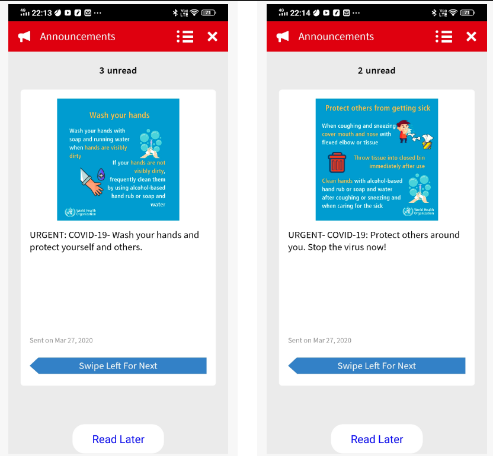
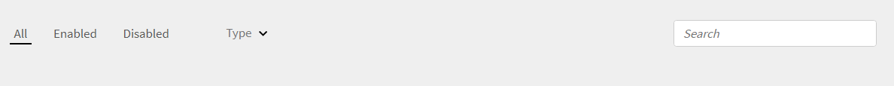

# Notas de la versión de Adobe Learning Manager

<!--<table>
 <tbody>
  <tr>
   <td></td>
   <td>
    
<a href="https://business.adobe.com/products/learning-manager/adobe-learning-manager.html">Adobe Learning Manager</a> was launched in August 2015. As part of our continuous improvement efforts to enhance the product, we have been rolling out regular updates. Read on to know the features enhanced/issues fixed in update releases. 
</td>
  </tr>
 </tbody>
</table>-->

+++Actualización 99: versión de febrero de 2025 de Adobe Learning Manager

## Configurar el idioma de la interfaz mediante SAML

Adobe Learning Manager (ALM) ahora acepta un atributo SAML para el idioma. A continuación, este atributo se asigna a la interfaz del usuario y a la configuración de idioma de contenido, lo que garantiza una interacción fluida con el LMS en el idioma que prefiera. La configuración de estas opciones de idioma se administra a través de la plataforma de administración de identidades y accesos (IAM), utilizando SAML para inicio de sesión único (SSO). Esto admite inicios de sesión iniciados por el proveedor de servicios (SP) e iniciados por el proveedor de identidades (IdP), lo que permite a los usuarios ver la interfaz y el contenido en el idioma elegido.

Consulte este [artículo](/help/migrated/administrators/feature-summary/set-up-interface-language-through-saml.md) para obtener más información.

## Mejora en las API de migración

Anteriormente, los módulos de actividad con vínculos externos migrados mediante API (`GET /bulkimport/cansync` y `POST /bulkimport/startrun`) no mostraban la opción **[!UICONTROL Marcar como completado]** para los alumnos después de acceder al vínculo. Este problema se ha solucionado. Ahora, los módulos de actividad con vínculos externos migrados a través de API mostrarán correctamente la opción **[!UICONTROL Marcar como completado]** para los alumnos.

## Funcionalidad de ordenación en la aplicación del alumno

La función de ordenación de la aplicación del alumno proporciona recomendaciones de cursos personalizadas basadas en el contenido y el idioma de la interfaz. palpador Esta mejora simplifica el proceso para que los alumnos encuentren los cursos en su idioma preferido y utilicen opciones de ordenación más inteligentes.

Consulte este [artículo](/help/migrated/learners/feature-summary/catalogs.md#sorting-functionality-in-the-learner-app) para obtener más información.

+++

+++Actualización 98: versión de noviembre de 2024 de Adobe Learning Manager

**Fecha de publicación**: 16 de noviembre de 2024

## Novedades de esta versión

Para obtener más información, consulte [Novedades de Adobe Learning Manager](/help/migrated/whats-new.md).
+++

+++Actualización 97: versión de julio de 2024 de Adobe Learning Manager

**Fecha de publicación:** 13 de julio de 2024

## Novedades de esta versión

Para obtener más información, consulte [Novedades de Adobe Learning Manager](/help/migrated/whats-new-july-2024.md).
+++

+++Actualización 96: versión de marzo de 2024 de Adobe Learning Manager

**Fecha de publicación:** 1 de marzo de 2023

## Novedades de esta versión

Para obtener más información, consulte [Novedades de Adobe Learning Manager](/help/migrated/whats-new-march-2024.md).
+++

+++Actualización 95: versión de noviembre de 2023 de Adobe Learning Manager

**Fecha de publicación:** 18 de noviembre de 2023

## Novedades de esta versión

Para obtener más información, consulte [Novedades de Adobe Learning Manager](/help/migrated/whats-new-november-2023.md).
+++

+++Actualización 94

**Fecha de publicación:** jueves, 23 de agosto de 2023

## Novedades de esta actualización

* Seleccione el icono de engranaje del reproductor para cambiar la calidad del vídeo.
* Cambie la calidad y velocidad de un vídeo en las redes sociales.
+++

+++Actualización 93: versión de julio de 2023 de Adobe Learning Manager

**Fecha de publicación:** 10 de julio de 2023

Novedades de esta versión

### Opción Recomendaciones mejorada

Adobe Learning Manager ha introducido un sistema de recomendaciones para los cursos nuevo y mejorado. Esta función de recomendaciones utiliza algoritmos de IA y los intereses de los usuarios, como productos, funciones y niveles, para ofrecer recomendaciones de contenido personalizadas.

### Inscripción múltiple

En esta versión de Adobe Learning Manager se presenta la opción Varias inscripciones, que permite a los alumnos inscribirse en más de una instancia de un curso en uno o varios periodos de tiempo.

### Rechazo Del Conector De Exavault

Esta versión de Adobe Learning Manager incluirá un nuevo conector que empleará el protocolo SFTP de la familia AWS Transfer.

Para obtener más información, consulte [Novedades de la versión de julio de 2023 de Adobe Learning Manager](/help/migrated/whats-new-2023-july.md).
+++

+++Actualización: 92

**Fecha de publicación:** 23 de junio de 2023

**Errores corregidos en esta actualización**

* Después de completar un módulo, la API de grados no se activa automáticamente, lo que hace que la marca de verificación verde no se muestre como se esperaba en la interfaz de usuario.
* Después de completar algunos módulos de una ruta de aprendizaje o una certificación, la marca de verificación verde, que indica que la finalización se ha realizado correctamente, no se muestra del modo esperado.
* Adobe Learning Manager no se inicia del modo esperado después de cargar un archivo CSV de usuarios con campos incorrectos.
* La ventana emergente de advertencia sobre cómo contactar con el administrador también muestra otras direcciones de correo electrónico.
* Todas las insignias obtenidas por un alumno no se muestran en la respuesta.
* Durante el registro del usuario, debe aceptarse un nombre de usuario con &quot; &quot;.

#### Reproductor

* Añada un menú para seleccionar la resolución de pantalla al reproducir un vídeo.
+++

+++Actualización 91

**Fecha de publicación:** viernes, 01 de junio de 2023

### Conectores

* El conector de Adobe Connect requiere API para enviar tokens de CSRF. Para obtener más información, consulte Mejorar la seguridad de las cuentas de Adobe Connect.

### Cambio de cadena

* Hemos cambiado el nombre de la cadena Clasificar este curso de formación a Clasificar este curso, Clasificar esta ruta de aprendizaje o Clasificar esta certificación en función de la formación que realice un alumno. En función del tipo de formación, el alumno verá la cadena en consecuencia.

### Errores solucionados en esta actualización

* La descripción de la aplicación móvil de Adobe Learning Manager de Play Store indica incorrectamente que un alumno puede realizar un curso sin conexión.
* Se han producido problemas al migrar contenido (module_version.csv y course_module.csv) de LinkedIn a Adobe Learning Manager.
* Si una cuenta está en estado inactivo y se creó hace más de tres años, todos los usuarios de la cuenta se eliminan según el RGPD, independientemente del estado de los usuarios.
* En la aplicación del instructor, cuando establece el límite de la lista de espera en cero en una sesión y guarda la sesión, la interfaz de usuario muestra incorrectamente &quot;No aplicable&quot; en lugar de cero.
* Al generar transcripciones de alumnos para el conector de Power BI, la columna Duración del módulo o formación (minutos) muestra valores nulos para determinados módulos de clase o clase virtual.
* Después de marcar un curso como completado para los alumnos de una instancia o varias instancias, todos los alumnos del curso se marcan como completados, no solo los alumnos de la instancia o instancias actuales.
+++

+++Actualización 90

**Fecha de publicación:** 4 de abril de 2023

### Errores Corregidos En Esta Actualización

El inicio de sesión de SAML falla si la dirección URL de inicio de sesión de SSO contiene entity_id.
+++

+++Actualización 89: versión de marzo de 2023 de Adobe Learning Manager

**Fecha de publicación:** 4 de abril de 2023

### Novedades de esta actualización

**Mejoras en la experiencia de formación para instructores (ILT)**

Se han realizado varias mejoras en la experiencia de formación dirigida por instructor (ILT). Entre las mejoras clave se incluyen: la capacidad de filtrar las sesiones de clase según la ubicación, la capacidad de cambiar instancias (VILT) sin perder el progreso, un nuevo &quot;Asistente de programación&quot; para gestionar conflictos en los instructores de reserva y las clases, la capacidad de adjuntar &quot;Aptitudes&quot; a los instructores y elegir instructores en función de las aptitudes.

**Mejoras en la lista de comprobación de observaciones**:

Los autores ahora pueden seleccionar &quot;Responsable&quot; y &quot;Gerente de tienda&quot; como Observador de las listas de comprobación. Los responsables pueden ver y completar las listas de verificación en la interfaz Responsable sin tener que cambiar de función a un instructor. Se envía una notificación al responsable cuando se le asigna una lista de verificación.

**Usar cualquier aplicación o cámara de smartphone para escanear códigos QR de Learning Manager**

Los alumnos ahora podrán utilizar cualquier aplicación de escaneado de código QR o la cámara de su smartphone para escanear los códigos QR generados por Learning Manager para la inscripción de cursos, la finalización y mucho más.

**Mejoras en los informes**

Un nuevo informe de utilización del instructor, un informe de revisión de cursos de formación, un informe de ayudas de trabajo y otras mejoras en los informes.

**Compatibilidad con sesiones &#39;híbridas&#39;**

Adobe Learning Manager ahora admite la posibilidad de crear sesiones &quot;híbridas&quot; de formación impartida por instructores (ILT). Las sesiones de ILT virtuales se pueden crear con información de ubicación opcional para que los alumnos puedan asistir a la sesión en persona, así como en la ubicación si están disponibles.

**Mejor seguimiento del progreso para ILT virtual y de clase**

Los módulos ILT de clase y virtuales ahora ofrecen la capacidad de informar del estado de la prueba de un alumno (aprobado o suspenso) junto con el estado de asistencia. Por lo tanto, se pueden tener en cuenta tanto la asistencia como el éxito de las pruebas para decidir el progreso del alumno.

**Aplicación Adobe Learning Manager para Microsofts Teams**

La nueva aplicación Adobe Learning Manager en Microsofts Teams está diseñada para fomentar el aprendizaje en el flujo de trabajo y favorecer el aprendizaje social. Los estudiantes podrán acceder al contenido de aprendizaje en la plataforma Microsofts Teams sin necesidad de cambiar a un navegador. Póngase en contacto con su CSAM para obtener la versión beta de la aplicación Adobe Learning Manager en MS Teams.

### Errores solucionados en esta actualización

**Curso**

* Un autor personalizado no puede obtener una vista previa de un módulo cuando el curso está en estado «UNDER_CONSTRUCTION». La respuesta muestra el error 404.
* El título del curso en la página del curso o la adición de una aplicación de autor se desborda cuando el título del curso supera un determinado límite de caracteres.

**Autor**

* En la aplicación de autor, el título del curso (si es largo) excede los límites de la página al crear un curso.
* En ocasiones, se añade un curso, aunque no se haya seleccionado ningún autor.

**Informes de tableros**

* La información sobre herramientas se muestra correctamente cuando el idioma de la interfaz es el inglés, pero genera un error de consola cuando el idioma de la interfaz es diferente.
* Cambie el nombre &quot;Obligatorio&quot; a &quot;Obligatorio&quot; en el tablero del alumno.

**Aplicación del instructor**

* El formato de hora en la aplicación del instructor no es coherente con el resto de aplicaciones.

**Social**

* En ciertos tipos de publicaciones, después de la publicación, el tablero social no se abre como estaba previsto.

**Administrador**

* Un usuario con una función personalizada no puede descargar recursos al obtener una vista previa de un curso.

**Plantillas de correo electrónico**

* Cuando un alumno se da de baja de un programa de aprendizaje que contiene un curso de clase o clase virtual, no recibe ningún correo electrónico de cancelación.

**Ayudas de trabajo**

* No se puede ver el nombre del curso en el widget Ayuda de trabajo.

**Publicación**

* La descripción del módulo añadida en Adobe Captivate no está visible en Learning Manager cuando el módulo se publica en ALM.

**Campos activos**

* Cuando se está procesando un archivo CSV con un gran número de registros, tarda un tiempo considerable, durante el cual, si un usuario inicia sesión e introduce un valor para uno de los atributos, podría crear un nuevo grupo de usuarios que podría generar errores de CSV. Para solucionarlo, cuando la importación de CSV está en curso, el mensaje emergente del atributo Campos activos se deshabilita y se vuelve a habilitar una vez completada la carga del CSV.
* Si la columna del archivo CSV de usuarios tiene el mismo nombre que el campo activo de usuarios externos, la carga del archivo CSV falla.

**Correcciones relacionadas con API**

* En la respuesta learningObjects, falta el atributo bookmark.
* Se crea una entrada de acceso al generar tokens de actualización de oauth para usuarios eliminados.
* La API de objeto de aprendizaje devuelve un valor loFormat incorrecto, ya que los módulos previos al trabajo se tenían en cuenta para calcular el tipo de curso junto con el contenido principal.

**Problemas conocidos en esta actualización**

* El botón Compartir del catálogo de alumnos no funciona del modo esperado en el navegador Safari ni en la aplicación para dispositivos móviles y iPad MS Teams.
* Las notificaciones no aparecen en la pestaña Actividad una vez que la aplicación se elimina en otros equipos.
No ocurre nada al hacer clic en las notificaciones de la pestaña Actividad de la aplicación en iPhone 14.
* En la aplicación de MS Teams, las notificaciones de Learning Manager (completado, inscrito, fecha límite y vencido) no muestran el estado ni el nombre del curso en la ficha Actividad.
* Aparece una ventana emergente con contenido XML cuando el administrador de integración no aprueba la aplicación MS Teams.
* El idioma de la interfaz de usuario en la aplicación Adobe Learning Manager en MS Teams no cambia a veces del modo previsto cuando se cambia el idioma.
* No es posible interactuar con la primera notificación cuando el foco está dentro de Iframe (fichas Inicio y Catálogo).

**Limitaciones de la aplicación móvil de Adobe Learning Manager**

* Visualización de contenido sin conexión.
* Vista de cuadrícula o lista en la página Catálogo/Mi aprendizaje.
* Varios intentos de realizar un curso.
* Plazo de inscripción en una tarjeta de curso.
* En dispositivos iOS, las notificaciones push no aparecen cuando la aplicación está en primer plano.
* Los vínculos profundos en las notificaciones push no se redirigen a la página de destino prevista.
* Al hacer clic en el botón Registrar interés se redirigirá a la web.
* Al responder o comentar en Aprendizaje social, no podrá adjuntar un archivo.
* No podrá iniciar sesión en LinkedIn Learning.
+++

+++Actualización 8

**Fecha de publicación:** 7 de marzo de 2023

### Mejoras De Rendimiento En Esta Versión

Cuando se realiza una inscripción masiva de alumnos, no se genera ningún archivo de registro para cada alumno.
Hemos optimizado el procesamiento de planes de aprendizaje para cuentas grandes. De este modo, se evitan problemas de búsqueda o retrasos.
+++

+++Actualización 87

**Fecha de publicación:** 1 de marzo de 2023

## Errores Corregidos En Esta Actualización

* Un alumno no recibe el correo electrónico de cancelación de la sesión si se elimina el módulo CR/VC del curso en el que se ha inscrito.
* Cambiar GetNotificationData de GET a POST. La implementación original produjo el error **IllegalArgumentException: El encabezado de la solicitud es demasiado grande**, lo que produjo notificaciones erróneas.
+++

+++Actualización: 86

**Fecha de publicación:** 17 de febrero de 2023

### Error Corregido En Esta Versión

En la aplicación del alumno, la búsqueda de usuarios y grupos de usuarios falla debido a algunos problemas con la configuración regional.
+++

+++Actualización 85

**Fecha de publicación:** martes, 13 de febrero de 2023

### Qué ha cambiado en esta actualización

Se ha agregado la compatibilidad con el código de idioma de cuatro letras al filtrar los idiomas en GET learningmanagerapi/v2/learningObjects.

### Errores Corregidos En Esta Actualización

Para algunas configuraciones regionales, la búsqueda devuelve resultados incorrectos.
Los metadatos del curso se sobrescriben cuando el curso tiene más de una variante de la misma configuración regional.
+++

+++Actualización 84

**Fecha de publicación:** viernes, 02 de febrero de 2023

### Qué ha cambiado en esta actualización

**Informe de ayuda de trabajo**

Esta actualización incluye un nuevo informe de ayudas de trabajo que enumera todas las ayudas de trabajo de la cuenta.

**Control de versiones**

Hemos añadido control de versiones para los recursos al añadir los recursos al crear un curso.

**Informe de intentos**

Puede ver un informe de todos los reintentos y visitas de un alumno a cada curso de formación.

**API de restablecimiento de módulo**

Un administrador ahora puede restablecer un módulo mediante la API de restablecimiento de módulos. Para obtener más información, consulte la [referencia de API de Learning Manager](https://captivateprime.adobe.com/docs/primeapi/v2/).

**Plantilla de correo electrónico**

Para algunas plantillas de correo electrónico, ahora puede agregar un requisito previo a la plantilla.

**Otros cambios**

* Puede añadir un curso aprobado por el responsable como requisito previo.
* Mejora del rendimiento al actualizar el tablero de resumen de aprendizaje.
* Los ID de correo electrónico y los ID de cuenta se verifican antes de enviar un informe de rebote.

### ERRORES CORREGIDOS EN ESTA ACTUALIZACIÓN

* Los nombres de los autores duplicados aparecen en la página Resumen del curso.
* Un hipervínculo en la página de creación de la cuenta generó el error 404.
* La configuración regional checa no se reflejaba del modo esperado en la configuración del reproductor.
* En algunos casos, las aptitudes se muestran como no definidas para los alumnos en curso y no iniciados.
* El tiempo empleado en varios días muestra el tiempo empleado en los informes de transcripciones e inscripciones de alumnos.
* El botón Atrás no responde a los perfiles Administrador y Responsable de la ficha Curso > Puntuación de prueba L2 > Por pregunta y Asistencia y Puntuación respectivamente.
* Para algunas configuraciones regionales, en una plantilla de correo electrónico, falta contenido en el cuerpo del correo electrónico y la traducción de idioma en la plantilla no es coherente.
+++

+++Actualización 83

**Fecha de publicación:** 18 de enero de 2023

### Qué ha cambiado en esta actualización

**Nueva columna**

Se agrega una nueva columna, **unenrollmentAllowed**, a course.xlsx. Descargue el archivo de este manual.

**Conector de Linkedin Learning**

Para el conector de LinkedIn Learning, hay una nueva casilla de verificación que permite al alumno darse de baja en la página Filtros. Para obtener más información, consulte [Conector de LinkedIn Learning](/help/migrated/integration-admin/feature-summary/connectors.md).

### Errores Corregidos En Esta Actualización

* Al pasar el cursor sobre los gráficos de barras, la información sobre herramientas del informe del tablero aparece como se esperaba.
* En los informes de Actividad del usuario, el informe Tiempo de aprendizaje empleado muestra datos incorrectos para los datos diarios/mensuales.
* En algunos casos, el gráfico de puntuación de la prueba muestra valores incorrectos.
* En un curso con contenido SCORM con varios intentos configurados, cuando un alumno intenta acceder al curso, el botón Volver a visitar está desactivado.
* En algunos casos, después de inscribir a un alumno en un curso y descargar un registro de auditoría de correo electrónico, se envía el mensaje de correo electrónico, pero este no aparece en el registro.
* La invitación de calendario de un instructor debe incluir el instructor de texto en la asignatura.
* El icono de la tarjeta de aprendizaje no se muestra en las tarjetas de la ruta de aprendizaje y las recomendaciones de cursos relacionados que se incluyen en la página de resumen del curso.
* En la configuración de la página de inicio del alumno, agregue una sección Guardados por mí .
* En el caso de determinadas cuentas, se solicita al usuario que utilice el inicio de sesión único para acceder a una cuenta en la que se requiere el ID de Adobe.
* En las zonas horarias con horario de verano, el campo &quot;start_time&quot; se calcula en función de la diferencia horaria actual, no en función de la diferencia horaria con la fecha y hora de inicio reales. Esto provoca que haya invitaciones con horas incorrectas.
* Siempre que se repite una certificación, se crea internamente una copia de los cursos subyacentes en la base de datos. Estos cursos aparecen después en la búsqueda, en contra del comportamiento esperado.
* Cuando falla la carga de un archivo CSV, no se recibe ninguna notificación por correo electrónico.
* Si los nombres de los campos activos son largos, desaparecen al arrastrarlos y soltarlos. A continuación, el botón Guardar tampoco funciona del modo esperado.
* Un informe de sesión no se exporta a través de la página de asistencia y puntuación de un curso si el primer usuario del informe tiene un registro en la tabla de notas de actividad con el comentario como nulo.
* Al utilizar la cuenta de administrador para recuperar las insignias, puede ordenar la lista como se esperaba. Sin embargo, cuando se realiza la misma acción para un alumno, los resultados no se ordenan.
* Si elige un curso de los resultados de búsqueda y luego intenta volver a los resultados de búsqueda con el botón Atrás , los resultados de la búsqueda desaparecen.
* No todos los usuarios se añaden a un grupo de usuarios como instructores en una sesión.
* Las plantillas que tienen varias plantillas de usuario en su interior, su asunto se sobrescribe con algunos valores.
+++

+++Actualización 82

**Fecha de publicación:** 15 de diciembre de 2022

* La API de objetos de aprendizaje GET ahora incluye información de precios, si está disponible.
* Se agrega una nueva columna Completado por a los informes LT. Esto ayuda al administrador a identificar el origen de finalización de un objeto de aprendizaje.
* Hemos añadido un nuevo módulo ILT que puede registrar el estado de aprobado/suspenso del alumno junto con la asistencia. Los instructores ahora pueden marcar a un alumno como Completado y aprobado o Completado y suspenso.
* Un administrador ahora puede solicitar a los alumnos que completen y aprueben el objeto de aprendizaje antes de consumir el siguiente módulo/curso. Esto es aplicable a los requisitos previos, los cursos solicitados y los programas de aprendizaje.

**Correcciones de errores**

* Problemas de la barra lateral y el pie de página en el idioma indonesio con la experiencia móvil envolvente.
* Correcciones de la vista envolvente relacionadas con la previsualización de módulos.
* Una búsqueda de cursos como administrador y autor devuelve resultados en una configuración regional diferente a la escrita.
* Los cambios en las plantillas de correo electrónico de bienvenida no se guardaban después de la edición.
* Los usuarios con diferentes ID de correo electrónico y Adobe ID no podían iniciar sesión en la aplicación para dispositivos móviles.
* Los usuarios se identificaban incorrectamente al unirse a sesiones de clase virtual de Zoom/BJ.
+++

+++Actualización 81: versión de noviembre de 2022 de Adobe Learning Manager

**Fecha de publicación:** 5 de noviembre de 2022

**Nota:** Con esta versión de Adobe Learning Manager, los usuarios con cuentas inactivas ya no pueden acceder a sus cuentas mediante subdominios. Se puede acceder a las cuentas mediante el ID de cuenta o mediante la página acapindex.html e introduciendo el ID de correo electrónico.

### Novedades de esta versión

La versión de noviembre de 2022 de Adobe Learning Manager consta de lo siguiente:

* Configuración de varios inicios de sesión únicos (SSO)
* Compatibilidad con la función de sesión no iniciada
* Mejoras de la página de información general de formación
* Personalización del reproductor
* Suplantación del alumno y el responsable

**Nota:** Con la versión de noviembre de 2022 de Adobe Learning Manager, Zoom dejará de usar la [autenticación JWT en junio de 2023](https://marketplace.zoom.us/docs/guides/auth/jwt/). Por lo tanto, el conector de Zoom con JWT seguirá funcionando hasta la fecha indicada, pero recomendamos a los usuarios que creen una aplicación OAuth de servidor a servidor para reemplazar esta función en la cuenta. Todas las conexiones nuevas tendrán la autenticación de OAuth de Zoom de forma predeterminada.

### Errores solucionados en esta actualización

* Como alumno, al intentar acceder a un programa de aprendizaje con más de 10 cursos en dispositivos móviles, aparece un mensaje de error.
* Si un curso ha establecido un recordatorio para enviarlo n días después de no cumplir la fecha límite, el mensaje de correo electrónico se envía n días después de la fecha prevista, pero el número de días que no se ha cumplido la fecha límite es n-1 en lugar de n.
* Un vídeo no se carga en el reproductor si los comentarios de L1 están activados para el curso en la aplicación del alumno y el usuario solo tiene una función de alumno.
* Un correo electrónico de recordatorio de finalización no muestra la hora en la zona horaria del usuario como se esperaba.
* Las transcripciones de alumnos que se generan mediante informes del tablero no respetan los filtros y muestran más información de la necesaria.
* No se puede seleccionar contenido en el que el idioma de la interfaz no se agregue como idioma del contenido.
* Al registrarse automáticamente en un curso por segunda vez, la dirección URL que aparecía era incorrecta.
* Cuando se elimina a un instructor de una sesión de clase virtual, no se recibe ningún mensaje en el que se le notifique la cancelación de la sesión.
* El texto &quot;minuto&quot; en un mosaico de la página de formación del alumno no se traduce al indonesio como se esperaba.
* El tablero de cumplimiento muestra datos incorrectos para los alumnos que no cumplen la normativa.
* Al añadir un informe, no se pueden seleccionar cursos o catálogos en los que el idioma de la interfaz no se haya añadido al idioma del contenido.
* Hemos añadido los siguientes idiomas de contenido en esta versión:
   * Búlgaro
   * Flamenco
   * Portugués (Brasil)

### Problemas conocidos de esta actualización

* En algunos casos, el gráfico de puntuación de la prueba no se muestra del modo esperado. Cuando se cambia el tamaño del gráfico, aparece un espacio en blanco al principio. Además, no aparecen todas las preguntas y los datos incorrectos se muestran de forma intermitente.
+++

+++Actualización 80

**Fecha de publicación:** 20 de septiembre de 2022

* Se han solucionado los problemas de inicio de sesión en la aplicación móvil de iOS.
* Se ha corregido un problema con los mensajes de correo electrónico devueltos.
* Los instructores recibían una notificación incorrecta incluso antes de que los alumnos realizaran los envíos.
* El instructor recibe una notificación por correo electrónico, aunque el alumno no haya enviado una actividad.
* Después de crear una sesión de clase virtual en MS Teams o Adobe Connect, los instructores no reciben las invitaciones para la sesión.
* Estado incorrecto en una ruta de aprendizaje.
* Se ha mejorado el rendimiento de la aplicación.
+++

+++Actualización 79

**Fecha de publicación:** viernes, 18 de agosto de 2022

* La confirmación de invitación de calendario para las sesiones ILT/VILT ahora funciona con Google Calendar.
* Un administrador de la tienda ahora puede ver notificaciones para los usuarios debajo de ellos, incluso si se les elimina como administrador de personas.
* En algunos casos, la inscripción de cursos falla y se muestra el error 500.
* En algunos casos, no se puede modificar una instancia de curso virtual para Teams.
* Los administradores y los instructores pueden añadir comentarios para los usuarios que no hayan asistido a las sesiones ILT/VILT.
* Mejoras en el rendimiento al descargar informes de gran tamaño.
* Cuando se devuelve el correo electrónico de un usuario, el administrador recibe una notificación por correo electrónico. El mensaje de correo electrónico contiene un vínculo que, al hacer clic en él, descarga un archivo CSV con la lista de usuarios cuyo correo electrónico se ha devuelto. A continuación, el administrador puede realizar las acciones necesarias.
   * El correo electrónico se activa cuando se devuelve o se anula un mensaje de correo electrónico.
   * El correo electrónico se activa una vez al día para todos los administradores añadidos a la lista.
   * El vínculo caduca en siete días.
* Aparece un mensaje de error al intentar incorporar una cuenta de Adobe Connect ya integrada a otra cuenta de Learning Manager.
+++

+++Actualización 78

**Fecha de publicación:** 4 de agosto de 2022

### Errores solucionados en esta actualización

* Si tiene un curso que contiene un módulo con una vista previa y, a continuación, utiliza una API para recuperar los recursos del curso, la respuesta no contendrá ningún dato de location, contentZipUrl ni contentStructureInfoUrl.
* Respuesta incorrecta después de enviar una solicitud XAPI desde el documento de Swagger, donde el nombre de dominio es learningmanager.
* En la respuesta de la API /boards/{id}/posts, la propiedad &quot;post.attributes.myPoll&quot; aparece como un objeto vacío.
* En algunos casos, para un usuario que no haya iniciado sesión, el botón Añadir al carro está desactivado para algunos cursos o rutas de aprendizaje.
* URL de subdominio incorrecta en la página de construcción de marca.
+++

+++Actualización 7

**Fecha de publicación: 24 de mayo de 2022**

**Problemas solucionados en esta actualización:**

* Los nuevos cursos no respetan la secuencia en la aplicación de Salesforce. Si modifica la secuencia, el curso no se muestra en la secuencia deseada.
* Después de modificar la configuración en la página principal de Classic y guardarla, los cambios no se guardan del modo esperado. Esto sucede intermitentemente.
* El código de HTML aparece cuando los alumnos comprueban sus notificaciones, lo que afecta negativamente a la experiencia.
* En el tablero, el tiempo dedicado al aprendizaje se muestra incorrectamente como cero horas.

## ACTUALIZACIÓN: Adobe Learning Manager pasará a denominarse Adobe Learning Manager

Esta es una actualización sobre un cambio inminente y le ayuda a prepararse para él.

**Adobe Learning Manager como producto se cambiará de marca a Adobe Learning Manager en julio de 2022**. Se trata de un esfuerzo estratégico que se está realizando para reflejar con mayor precisión la alineación del producto con determinadas prioridades empresariales.

El equipo del producto está tomando todas las medidas necesarias para garantizar que su uso de la plataforma no se vea afectado. Puede seguir utilizando el producto como de costumbre. Los administradores de la plataforma pueden observar el nuevo nombre de la marca en determinadas pantallas en julio.

Como parte de este cambio, se ven afectadas las direcciones URL de acceso de Learning Manager.

Por ejemplo, si la dirección URL de acceso de su cuenta es `https://learningmanager.adobe.com/XYZ`, la nueva dirección URL será `https://learningmanager.adobe.com/XYZ`.

Todas las URL existentes seguirán funcionando.

Para completar esta acción, póngase en contacto con el departamento de TI de su organización. Para obtener más información, póngase en contacto con nosotros en `learningmanagersupport@adobe.com`.
+++

+++Actualización 76

**Fecha de publicación:** jueves, 20 de abril de 2022

* Correcciones en terminologías de productos en algunos informes de tableros.
* Una barra doble (&quot;//&quot;) en la dirección URL de un extremo produjo errores de validación.
* Después de actualizar una página, el porcentaje completado y los últimos campos visitados mostraban información incorrecta.
* Hemos realizado algunos cambios en la forma de calcular el valor Certificado o Plan de aprendizaje.
* Un administrador personalizado podía añadir a todos los usuarios como instructores aunque solo se le permitiera añadir un usuario.
* En un PDF de insignia, se mostraba una fecha de finalización incorrecta.
+++

+++Actualización 75

**Fecha de publicación:** miércoles, 29 de marzo de 2022

* En algunas cuentas, después de copiar el archivo .csv sin procesar en la ubicación de FTP, la importación de usuarios no se realiza del modo esperado y hay varias notificaciones de errores.
* En versiones anteriores de Learning Manager, para configurar un conector de Zoom, era necesario configurar primero Exavault FTP para copiar el archivo csv. En esta versión, el conector de FTP ya no se utilizará para el archivo csv y, por lo tanto, no es necesario configurar el FTP primero.
+++

+++Actualización 74: instancia de Learning Manager AWS India

**Fecha de publicación:** miércoles, 15 de febrero de 2022

### Información general

Una [instancia](https://learningmanagerapac.adobe.com/acapindex.html) de Learning Manager se alojará ahora en AWS en Mumbai (ap-south-1). Para los clientes que utilicen esta instancia de India, solo se almacenará la información de identificación personal (PII) y los registros de aprendizaje del usuario en la región de India.

### Qué admite

La instancia de Adobe Learning Manager India está a la par de otras instancias como las regiones de la UE y EE. UU. en términos de capacidades de funciones. Hay algunas características que no se admiten en la instancia de India. Estos son:

* Pago con tarjeta de crédito para la compra de asientos
* Catálogo de contenido de Creative Cloud
* Aplicación de Slack
* **&#42;** Esperando certificación para el cumplimiento de SOC2

### Preguntas más frecuentes

**¿En qué se diferencia esta instancia en Mumbai de otros entornos de solo AWS?**

No hay ninguna diferencia. La instancia en Mumbai es la misma que [AWS US](http://learningmanager.adobe.com/) o [AWS EU](http://learningmanagereu.adobe.com/) instancias. Esta instancia se aloja en India, y todos los registros de aprendizaje y datos de usuarios permanecen en India. Las siguientes funciones no son compatibles en la instancia de India:

* Pago con tarjeta de crédito para la compra de asientos
* Catálogo de contenido de Creative Cloud
* Aplicación de Slack
* **&#42;** Esperando certificación para el cumplimiento de SOC2

**¿Este entorno será compatible con Common Controls Framework (CCF)?**

Sí. La nueva instancia es compatible con Common Control Framework (CCF).
+++

+++Actualización 73

Fecha de publicación: 05 de febrero de 2022

* La compatibilidad con plantillas de correo electrónico ahora está disponible para los idiomas de contenido, incluidos el húngaro y el finlandés.
+++

+++Actualización 72: versión de enero de 2022 de Learning Manager

Fecha de publicación: 28 de enero de 2019

### Novedades y cambios

* Añadir ubicaciones de clases
* Cambios en la interacción
* Conector de Microsoft Teams
* Cambios en la API
* Cambios web envolventes en dispositivos móviles

<!--
For more information, see What's new in the [**January 2022 release of Adobe Learning Manager**](../whats-new.md).
-->

### Errores solucionados en esta versión

**Biblioteca de contenido**

* La búsqueda de archivos de contenido en carpetas de contenido privadas no funcionaba para usuarios con privilegios de función personalizados. Esto ya se ha solucionado.

**Cursos**

* La eliminación de un curso o una ruta de aprendizaje no era posible si tenían una asociación histórica con un plan de aprendizaje. Esto ya se ha solucionado. Los usuarios ahora pueden eliminar un curso o una ruta de aprendizaje si no están asociados actualmente a un plan de aprendizaje.
* Al previsualizar un curso o una ruta de aprendizaje, si el archivo de recursos tiene un nombre largo sin espacios, el nombre de archivo no se ajusta como se esperaba y se desborda en la siguiente línea. Este problema se ha solucionado.
* En el caso de la clase virtual, anteriormente podía crear un módulo sin seleccionar ningún sistema de conferencia de clase virtual en ese momento, ya que en una nueva instancia la dirección URL de clase virtual no tenía la información necesaria. Esto se evita ahora con un mensaje de error en la fase de creación del módulo en el que se le solicita que especifique el sistema de conferencia de clase virtual antes de guardar el módulo.
* La página de la lista de espera mostraba un mensaje de banner engañoso en los usuarios registrados, que se ha eliminado ahora.
* En el caso de la desinscripción masiva de cursos, la ventana emergente para introducir los ID de correo electrónico no aparecía, lo que se ha solucionado.
* La opción de enviar correo electrónico a los alumnos desde la ficha Asistencia y puntuación en la aplicación del administrador y el instructor no excluía a los alumnos desmarcados después de realizar la operación Seleccionar todo. Por lo tanto, Learning Manager enviaba correo electrónico a todos los alumnos. Este problema ya se ha solucionado.
* El informe de inscripción aparece como No iniciado, aunque un alumno ya haya completado el curso.

**SSO**

* En la configuración de SSO, si el ID de entidad tenía espacios iniciales o de formación, la configuración de inicio de sesión no funcionaba, ahora se gestiona como parte de la corrección.

**Anuncios**

* Como administrador, las fechas de inicio y finalización de un anuncio no se guardaban si el idioma de la interfaz y el contenido se establecía en alemán/español. Este problema ya se ha solucionado.

**Plantilla de correo electrónico**

* Las invitaciones de sesión se extienden a lo largo de varios días en los que las invitaciones no reflejan la información correcta sobre los días que están bloqueados en algunos clientes de correo electrónico. Esto ya se ha solucionado.
* Falta la variable &quot;Nombre del lugar&quot; en la plantilla de correo electrónico &quot;Recordatorio de la próxima sesión&quot; para los alumnos de la configuración regional alemana. Esto se ha añadido.
* El vínculo para crear una cuenta como parte del correo electrónico de bienvenida al usuario no tenía en cuenta la configuración regional del usuario, lo cual ya se ha solucionado.

**Recordatorios por correo electrónico**

* Si los alumnos se inscribían en un curso de formación a través de un plan de aprendizaje, se enviaban recordatorios de finalización por correo electrónico varias veces en función del número de modificaciones realizadas en las fechas de finalización del mismo plan de aprendizaje. Este problema ya se ha solucionado.

**Usuario**

* El mensaje que se muestra al usuario cuando su cuenta está inactiva/suspendida se ha mejorado, lo que indica que debe ponerse en contacto con el administrador para que habilite sus cuentas de nuevo.

**Actividad**

* Un instructor no podía ver los envíos de alumnos si el nombre del archivo de envío tenía un carácter especial. Esto ya se ha solucionado.

**Informe**

* Un administrador no ha podido descargar el informe de inscripción en el curso si contiene un alumno que se ha inscrito indirectamente en él a través de una ruta de aprendizaje flexible, pero que aún no ha elegido una instancia para el curso en la ruta de aprendizaje. Este problema ya se ha solucionado.
* La reorganización de informes en el tablero de informes para las funciones de administrador y responsable no conservaba el estado del orden de los informes. Este problema ya se ha solucionado.

**Contenido**

* El audio en el contenido de formación no se reproducía automáticamente en el modo de vista previa como alumno debido a las políticas de reproducción automática del navegador. Esto se ha solucionado ahora para los navegadores compatibles, excepto Safari.

**Interacción**

* Si un alumno externo se convertía como alumno interno en la misma cuenta, no podía acceder a la tabla de posiciones de interacción en la aplicación del alumno. Este problema ya se ha solucionado.

**Reproductor**

* El reproductor no mostraba el mensaje de advertencia cuando el usuario intentaba saltar módulos en el curso ordenado que tenía el tipo de módulos AICC. Esto ya se ha solucionado.
* En algunos cursos adquiridos que tenían módulos de vídeo en el sistema de gestión de aprendizaje (LMS) descentralizado, la reproducción de casos no funcionaba para determinados usuarios. Este problema ya se ha solucionado.

**Tablero de responsable**

* Un responsable no pudo exportar el informe para su equipo directo desde la página de habilidades de equipo de Manager Dashboard. Este problema ya se ha solucionado.

**Publish**

* En el caso europeo, el contenido de Learning Manager que se publicaba directamente en Adobe Learning Manager desde Adobe Captivate se publicaba en la configuración regional de Deutsch de forma predeterminada. Esto ya se ha solucionado.

**API**

* El campo de duración se añade ahora al modelo de ayuda de trabajo.
* Para las API de recomendación, a veces una solicitud de GET devuelve el error 500.
* Al migrar cursos de formación mediante Exavault, y si el texto contiene caracteres no ingleses, solía actualizarse con caracteres no utilizables en el texto. Este problema se ha solucionado.

**Localización**

* Aplicaciones de administrador, autor y alumno de `NormalTextRun  BCX0 SCXW38820519 For the`Adobe, parte del contenido en alemán no se muestra del modo esperado.

## Problemas conocidos de esta versión

* En la página Aprendizaje social, al crear una publicación no es posible grabar un audio ni cargarlo después de pulsar el botón del micrófono. Se trata de una limitación del navegador.
* En iOS, los archivos de audio H264 y WMA no son compatibles con el navegador para dispositivos móviles.
* Los alumnos con un signo + en su dirección de correo electrónico no tienen marcado el progreso. Esto se produce después de realizar un curso de clase virtual en Microsoft Teams.
* En el navegador Safari Mobile, los alumnos no podrán cargar archivos de más de 200 MB en Aprendizaje social. Se trata de una limitación del navegador.
+++

+++Actualización 71

Fecha de publicación: 17 de noviembre de 2021

### Compartir formación con responsables

Learning Manager ofrece un panel de cumplimiento a todos los administradores y responsables. A los gestores les resulta muy útil realizar un seguimiento del cumplimiento de los miembros de su equipo para una formación concreta. Al mismo tiempo, los administradores desean que todos los responsables añadan cursos de formación sobre cumplimiento a su panel y realicen un seguimiento.

En Learning Manager, el flujo de trabajo **Compartir con responsables** permite a los administradores compartir la formación con los responsables para que puedan ser añadidos al tablero de cumplimiento de un responsable. Por lo tanto, los responsables no necesitan realizar ninguna acción y pueden empezar a realizar un seguimiento del cumplimiento de forma inmediata.

Para obtener más información, consulte [**Compartir formación con responsables**](../administrators/feature-summary/reports.md#share_training_managers).

### Errores solucionados en esta actualización

* Si hay dos cuentas, la función Ruta de aprendizaje mejorada está desactivada y hay un catálogo compartido entre la primera cuenta y la otra, la ruta de aprendizaje de la segunda cuenta presentará secciones duplicadas en la página del curso.
* Un FTP personalizado ahora es compatible con sftp://, además de http:// y https://.
* El conector de Exavault ahora utiliza API V2.
* En algunos casos, la calidad de los vídeos no era óptima. Este problema se ha solucionado.
* Incluso después de que un alumno haya completado un curso obligatorio y el responsable lo haya aprobado, la certificación permanece con el estado Pendiente de aprobación.
* Si los nombres de los autores contienen caracteres acentuados, no se completa correctamente la migración del curso.
* Si el campo activo tiene valores en mayúsculas, este no se guarda de la forma esperada.
* No se pueden filtrar las rutas de aprendizaje basadas en aptitudes.
* Cuando un administrador crea una instancia y añade una nueva sesión, un instructor no recibe el mensaje de correo electrónico de invitación a la sesión. Este problema se produce en los cursos de clase virtual de Zoom.
+++

+++Actualización 70

Fecha de publicación: 28 de octubre de 2021

### Errores solucionados en esta actualización

* En algunos casos, la información sobre una ruta de aprendizaje no se refleja en una transcripción del alumno.
* El texto del cuadro de diálogo **Marcar finalización** se ha actualizado para indicar que la operación es irreversible.
* En algunos casos, la API de objetos de aprendizaje devolvía un error de metadatos.
+++

+++Actualización 69: versión de octubre de 2021 de Learning Manager

**Fecha de publicación:** 9 de octubre de 2021

### Ruta de aprendizaje

La **versión de octubre de 2021 de Adobe Learning Manager** presenta el concepto de rutas de aprendizaje.

>[!NOTE]
>
>La página **Configuración > General** tiene una nueva opción para habilitar las capacidades ampliadas de las rutas de aprendizaje. Si esta opción está activada, puede añadir rutas de aprendizaje en otra ruta de aprendizaje. Una vez activada, no se puede cambiar la opción.

Las rutas de aprendizaje sustituyen a la función existente de los programas de aprendizaje. Imagine que los programas de aprendizaje obtienen mejoras eficaces sin eliminar las capacidades existentes. Además, la función se marca como una ruta de aprendizaje.

Para obtener más información, consulte [***Rutas de aprendizaje***](../administrators/feature-summary/learning-paths.md).

### Otros cambios

* Nueva aplicación de Salesforce
* Centro de contenido
* Cambios en los informes
* Informe de resumen de sesión
* Cambios en el índice del reproductor
* Cambios en la API
* Cambios relacionados con el conector

Para obtener más información, consulte [***Novedades de la versión de octubre de 2021 de Learning Manager***](../whats-new.md).

### Errores solucionados en esta actualización

* Las plantillas de correo electrónico como, por ejemplo, Darse de baja del curso, Darse de baja del programa de aprendizaje o Darse de baja de la certificación, no reflejan las últimas terminologías de productos definidas en el archivo .csv. Ahora, el texto predeterminado de las plantillas de correo electrónico admite terminologías personalizadas.
* El idioma del usuario en Learning Manager no se admite en el flujo de trabajo Publicar en Learning Manager. Si el idioma del usuario es diferente, de Publish a Learning Manager se produce en inglés.
* Si añade muchos catálogos a una función personalizada, se produce un error al actualizar la función. Ahora el límite de número de catálogos se ha aumentado a 50 catálogos.
* En algunos casos, las formaciones que se eliminan siguen visibles en un catálogo. Este problema se produjo solo en la aplicación de administración y se ha solucionado ahora.
* Cuando se cambiaba la función de responsable de un usuario a otro, la función de responsable del usuario anterior se reflejaba en la interfaz de usuario. Esto ya se ha solucionado. Este problema solo se producía para usuarios externos, no internos.
* En algunos casos específicos para un gran conjunto de usuarios que se importaban mediante csv de usuario, la importación fallaba. Este problema ya se ha solucionado.
* Una transcripción de aprendizaje no muestra la fecha de finalización de un certificado externo si se agrega un curso obligatorio después de crear un certificado externo y se inscribe en él un usuario. Esto ya se ha solucionado.
* Un certificado no muestra el nombre localizado del alumno como se esperaba. Esto ya se ha solucionado.
* En el caso de sesiones de clase virtual de Zoom, un instructor no siempre recibe la invitación para la sesión. Esto ya se ha solucionado. El instructor recibe ahora la comunicación necesaria.
* Un alumno no recibe invitaciones para una sesión si las plantillas de nivel de curso están habilitadas pero las plantillas de nivel de cuenta están desactivadas. Esto ya se ha solucionado.
* Para zonas horarias específicas, los recordatorios por correo electrónico se enviaban un día después de lo esperado. Esto ya se ha solucionado.
* Los alumnos no reciben mensajes de notificación de sesión si determinadas plantillas de correo electrónico están desactivadas.
* En caso de que una reunión de BlueJeans se actualizara por parte de los autores, administradores, la URL de la reunión de BJ se estaba volviendo inutilizable. Esto ya se ha solucionado.
* En algunos casos, al ejecutar la API GET/LO, no se devuelven los cursos que forman parte de un programa de aprendizaje.
* Si el alumno intenta cargar contenido cuyo nombre tiene espacio en blanco, el alumno encuentra un error interno en el servidor.
* Los PDF de insignias generados para los alumnos tenían problemas de formato cuando se generaban en idiomas distintos al inglés. Estos problemas ya se han solucionado.
+++

+++Actualización 68

Fecha de publicación: 28 de septiembre de 2021

### Errores solucionados en esta actualización

* En el navegador para dispositivos móviles, se han activado los vínculos profundos para los siguientes elementos:

   * Todos los tableros
   * Tablero público y publicación
   * Tablero privado y publicación con acceso
   * Tablero privado y publicación sin acceso
   * Tablero restringido y publicación
   * Comentar en publicación
   * Responder al comentario
   * Perfil de usuario de aprendizaje social

* Para las cuentas que utilizan un dominio personalizado, la aplicación del alumno no muestra el icono de favoritos.
* En AEM, el componente Learning Manager elimina la configuración de otros componentes.
* La página de ayuda para el componente AEM redirige a una ubicación incorrecta.
* Externalización de la obtención y el almacenamiento de mensajes de correo electrónico y tokens de usuario para que los usuarios puedan implementar su propio back-end de almacenamiento en lugar de utilizar AEM nodos de usuario.
* Al editar la descripción de texto sin formato en Cursos, Programas de aprendizaje, Certificados y Ayudas de trabajo, aparece un mensaje de advertencia.
* Los informes del tablero de responsable no se descargan cuando un usuario tiene funciones personalizadas y de responsable.
* Un mensaje de correo electrónico de resumen muestra un valor incorrecto de actividad de formación.
* En algunos casos, Learning Manager se comporta de forma inesperada al pasar de la Tienda de contenido a la página del alumno.
* En la aplicación de aprendizaje social, los filtros no funcionan del modo esperado en la vista de lista.
* El mensaje de correo electrónico de bienvenida que reciben los usuarios internos también lo reciben usuarios externos.
* Añada el widget de Learning Manager en la plantilla de página en AEM.
* Si desea volver a publicar un certificado después de eliminar un curso, no podrá hacerlo.
* Los alumnos no reciben mensajes de correo electrónico con detalles de una sesión.
+++

+++Actualización 67: actualizaciones de Azure

Esta actualización introduce una nueva instancia de Azure.

>[!NOTE]
>
>En la instancia, no se admiten los elementos siguientes:
>
>* [Dominio personalizado](../custom-domain.md)
>* [Compra con tarjeta de crédito](../administrators/feature-summary/billing-management.md)
>* [Catálogo de contenido](../administrators/feature-summary/content-catalogs.md)

+++

+++Actualización 66: versión de agosto de 2021 de Learning Manager

La **versión de agosto de 2021** de Adobe Learning Manager **se centra en mejorar la experiencia del alumno, los informes y los flujos de trabajo administrativos.** Entre sus aspectos destacados, se incluyen los siguientes:

* **Tienda de contenido:** Learning Manager ofrece ahora más de 70 000 cursos de diferentes campos, como, por ejemplo, tecnología, administración, liderazgo, etc.
* **Compatibilidad con accesibilidad mejorada:** La compatibilidad con la accesibilidad para la función de alumno se refuerza mediante la navegación por teclado mejorada, la capacidad del lector de pantalla y el cumplimiento de la relación de contraste.
* **Formato de texto enriquecido:** Learning Manager ahora ofrece edición de texto enriquecido para descripciones de cursos, programas, certificados y ayudas de trabajo. Esto permite a los autores especificar descripciones en texto enriquecido, incluidos hipervínculos, imágenes y otras opciones de formato de texto, en lugar de texto sin formato.
* **Valoración basada en estrellas:** Un alumno puede ahora valorar un curso con una escala de 5 puntos. Un administrador puede seleccionar entre la clasificación de eficacia existente o la clasificación de 5 estrellas.
* **Integración en Badgr:** los alumnos ahora pueden autorizar a Learning Manager para que envíe automáticamente las insignias que se han obtenido en Learning Manager a la cuenta de Badgr, desde la que se pueden compartir las insignias en redes sociales.
* **Exportar eventos de aprendizaje a Salesforce:** Learning Manager ahora ofrece la posibilidad de exportar algunos eventos específicos de Learning Manager, como la adición y la inscripción de nuevos usuarios y la finalización de cursos a un inquilino de Salesforce, y proporciona la posibilidad de vincularlos al objeto Usuario o Contacto adecuado en Salesforce.

Para obtener más información, consulte [***Novedades y cambios en la versión de agosto de 2021 de Learning Manager***](../whats-new.md).

**Fecha de publicación:** 7 de agosto de 2021

### Errores solucionados en esta actualización

**Experiencia del alumno**

* Después de añadir un alumno a dos grupos de usuarios y un plan de aprendizaje, este se inscribe en una instancia diferente del mismo curso.
* En algunos casos, después de la inscripción e iniciar el curso, el curso no se reproduce como se esperaba.
* En la descripción del curso, se muestran etiquetas HTML, lo que se ha solucionado.
* Si incluye un comentario en una publicación de un tablero de aprendizaje social que abarca varias líneas, el comentario aparece en una sola línea. Esto ya se ha solucionado.

**Creación**

* En algunos casos con inscripciones automáticas, los alumnos reciben varios mensajes de correo electrónico de inscripción.

**Informes**

* Cuando la interfaz se establece en algunas configuraciones regionales distintas a la inglesa, las transcripciones de alumnos no se generan del modo esperado.
* Posibilidad de restablecer el progreso de un curso dentro de un programa de aprendizaje y certificación.
* Si un archivo CSV contiene campos activos con el mismo nombre, pero con una distinción entre mayúsculas y minúsculas diferente, el archivo CSV genera una excepción.

**Otros**

* La opción de editar las puntuaciones y los comentarios debe estar desactivada cuando no se ha seleccionado ningún alumno o si la asistencia del alumno seleccionado no está marcada.
* Los valores de los campos activos se muestran en minúsculas en el cuadro de diálogo Editar usuario, aunque un usuario haya añadido anteriormente los valores en mayúsculas.
* Capacidad de los administradores y los responsables de ver las aprobaciones pendientes de los cursos. Esto permite a la administración garantizar que los responsables realicen un seguimiento del aprendizaje y la formación de los empleados, así como permitir que los administradores de Learning Manager aprueben la inscripción en cursos según sea necesario.
* Un usuario que tenga un permiso de autor o de administrador/autor personalizado no podrá editar una ayuda de trabajo creada por otro usuario.
* En la función de administrador, cuando el usuario se desplaza a Curso > Instancia y selecciona la opción &quot;Alumnos inscritos&quot; de cualquier instancia, anteriormente se solían mostrar los alumnos de &quot;Instancia predeterminada&quot;. El administrador debe cambiar la instancia manualmente desde el menú desplegable. Ahora, Learning Manager desplaza correctamente al usuario a la página de alumnos con la instancia correcta seleccionada.

**Aplicación de dispositivo**

* En dispositivos Android y iPhone, un alumno no puede iniciar módulos de cursos al azar. Al hacerlo, se produce el error 401 no autorizado.
* Un alumno puede escanear dos códigos QR, pero, al leer el tercer código QR, aparece un mensaje de error.
* En algunos dispositivos Android y iOS, un archivo no se abre del modo esperado para algunos cursos descargados.
* Al intentar abrir una ayuda de trabajo, aparece un mensaje de error.
* La aplicación del dispositivo se comporta de forma inesperada cuando se consume un programa de aprendizaje sin conexión.
* Cuando un alumno vuelve a estar en línea y abre la aplicación, esta se bloquea en la pantalla de bienvenida.
* A veces, cuando un usuario vuelve a estar en línea, la aplicación cambia a la vista clásica.
* A veces, cuando un curso se consume sin conexión, el progreso no se guarda.
* A veces, el nombre de un curso no se muestra como se espera desde el principio cuando es largo.
* En la página del catálogo, los cursos no se ordenan de la forma esperada.
+++

+++Actualización 65

Fecha de publicación: julio de 2021

### Errores solucionados en esta actualización

* Problemas de inicio de sesión de los usuarios.
* La plantilla de correo electrónico de inscripción en los cursos del responsable no muestra el plazo de finalización del curso se ha añadido la variable a la plantilla.
* TLS 1.0 y TLS 1.1 ya no se utilizan
* Problemas con la eliminación de datos de RGPD para un usuario.
+++

+++Actualización 64

Fecha de publicación: julio de 2021

### Errores solucionados en esta actualización

* La notificación de inscripción se envía a los alumnos que ya se han inscrito en un curso.
* Cuando se genera un certificado personalizado como insignia, no se admite el formato de fecha en alemán.
+++

+++Actualización 63

Fecha de publicación: junio de 2021

### Errores solucionados en esta actualización

* Puede crear un usuario con un nombre en blanco en un archivo csv.
* Si hay un carácter &#39;/&#39; en el campo activo, después de crear un trabajo para descargar user.csv, el estado del trabajo no cambia de &quot;Enviado&quot; a &quot;Completado&quot;.
* Los módulos ordenados no respetan la secuencia.
* Cuando se elimina un autor externo, el curso que ha creado el autor ya no está disponible.
* La búsqueda en un objeto de aprendizaje con más de una aptitud produce resultados inesperados.
+++

+++Actualización 62

Fecha de publicación: junio de 2021

### Errores solucionados en esta actualización

* No se puede iniciar sesión en la aplicación cuando se inicia sesión en la cuenta mediante SP-login.
* Los vídeos no se procesan desde Brightcove como se esperaba.
* La API userGroupInfo no está visible al visitar el programa de aprendizaje en cualquiera de las aplicaciones.
* No se puede buscar un programa de aprendizaje y una certificación retirados al crear un informe del tablero.
* Un autor no puede editar ni actualizar una ayuda de trabajo creada por otro autor.
* La API para el envío de archivos no funciona correctamente en el clúster de la UE.
+++

+++Actualización 61

Fecha de publicación: mayo de 2021

### Errores solucionados en esta actualización

* Mejora del rendimiento en llamadas de userGroupInfo.
* Después de activar los nuevos perfiles de Brightcove, Learning Manager admite contenido con módulos de vídeo y audio.
* Las transcripciones de aprendizaje no capturan los datos si se selecciona un intervalo de fechas limitado.
* Se envía una invitación de sesión a los alumnos inscritos para todas las sesiones, incluso aunque solo se haya añadido una nueva sesión.
* Los módulos de audio no se cargan del modo esperado.
+++

+++Actualización 60

Fecha de publicación: abril de 2021

### Errores solucionados en esta actualización

**Informe**

* Después de crear un informe, no podrá buscar un curso retirado.
* Los errores de un informe se propagan a otros. Como resultado, esos informes provocaron errores.

**Ayudas de trabajo**

* Después de descargar una ayuda de trabajo, no puede eliminarla.

**Reproductor**

* Los subtítulos de WebVTT no aparecen como se esperaba.

**Aplicación de alumno**

* En la página Resumen de certificación, en la certificación externa, no se muestra la duración añadida por un autor.
* Agregue la opción **All** en el filtro Aptitud.
* Los alumnos recibían varios mensajes de correo electrónico de resumen.
* El número de filas seleccionadas no se refleja como se espera en una página.

**Componente AEM**

* Los widgets no se actualizan como se esperaba después de actualizar la página.

**Localización**

* Algunas cadenas alemanas no se localizan como se esperaba.
* La traducción de cadenas se establece de forma predeterminada en inglés si un alumno no ha seleccionado la interfaz y el idioma del contenido.

**Certificación**

* El orden del módulo se puede omitir si no se cumplen los requisitos previos.

**Explorador**

* Las aplicaciones de autor, responsable o alumno no se muestran de la forma esperada en IE 11.

**Interacción**

* Los puntos de interacción no se canjean del modo esperado.

**Biblioteca de contenido**

* Los cursos de la aplicación de prueba de contenido no funcionan del modo esperado.

**Reproductor**

* El reproductor solo se carga en el espacio en el que está presente el widget.
* Los vídeos de un módulo de Captivate no se reproducen del modo esperado.

**Conector**

* En algunos casos, los archivos se eliminan de un conector de FTP/Box.
* Los archivos se eliminan de FTP si los archivos se actualizan con los mismos nombres.
* Un evento de BlueJeans admite la paginación si el número de eventos es superior a 100.

**Actualización 3.3 de la aplicación para dispositivos móviles: marzo de 2021**

Fecha de publicación: 26 de marzo de 2021

### Novedades y cambios {#whatsnewandchanged}

La actualización 3.3 de la aplicación móvil de Captivate Learning Manager presenta una nueva página de inicio que admite encabezados y recomendaciones de formación basadas en Inteligencia artificial. Esta página principal está disponible para todas las cuentas configuradas para la nueva opción Diseño envolvente. Las cuentas configuradas con el diseño clásico seguirán viendo la página principal clásica o heredada. No se debería observar ningún cambio en la página de inicio.

Además, esta actualización también permite a los alumnos descargar su insignia como PDF y una imagen. La actualización también introduce una ventana emergente de comentarios, que permite a los alumnos proporcionar comentarios sobre la aplicación de forma anónima.

Para obtener más información, consulte [Aplicación de dispositivo de Learning Manager](../learners/feature-summary/ipad-android-tablet-users.md).

Siga leyendo para obtener más información.

#### Nueva página de inicio

Para todas las cuentas que tienen activada la opción Diseño envolvente, hay una nueva página de inicio que admite la configuración de Diseño envolvente.

#### Comentarios de valoración

En esta versión, Learning Manager solicita al usuario que proporcione comentarios sobre su experiencia con la aplicación móvil.

#### Descargar insignia

Esta actualización permite a los alumnos descargar sus insignias en formato PDF y de imagen.

<!--## Previous update releases {#previousupdatereleases}-->
+++

+++Actualización 60: versión de febrero de 2021 de Learning Manager

Fecha de publicación: 20 de febrero de 2021

### Novedades y cambios {#Whatsnewandchanged-1}

* Vista de tablero en Aprendizaje social.
* Personalización del banner social.
* Filtros de catálogos en la aplicación del alumno.
* Dar de baja de formación.
* Importar usuarios desde contactos de Salesforce.
* Y mucho más.

Para obtener más información, consulte [Novedades de la actualización de Learning Manager de febrero de 2021](../whats-new.md).

### Errores solucionados en esta actualización {#bug-fixes}

**Certificación**

* En algunos casos, un alumno no podía intentar realizar de nuevo un curso que formase parte de una certificación, incluso aunque el número máximo de intentos del curso se hubiese establecido en infinito. Este problema se ha solucionado.
* En algunos casos, un alumno no puede inscribirse en una certificación debido a que el botón **Inscribir** no está visible como se esperaba.

**Biblioteca de contenido**

* URL de ayuda incorrecta en la página **Añadir contenido nuevo**. Se ha actualizado la dirección URL correcta.

**Curso**

* Un informe de puntuación de prueba L2 descargado para un módulo de contenido AICC muestra una puntuación incorrecta en la columna Puntuación total del usuario / Puntuación de prueba. Este problema se ha solucionado.
* La descarga de recursos de un curso no funcionaba si era un duplicado de otro curso y si el alumno no tenía acceso al curso original que se utilizó para crear un curso duplicado.
* Las imágenes del banner no se eliminaban cuando el autor las eliminaba cuando el curso estaba en estado Borrador. Este problema se ha solucionado.

**AEM**

* Después de insertar el componente Learning Manager en AEM, la página tardaba mucho tiempo en cargarse, lo que impedía el acceso a los demás componentes. Este problema se ha solucionado.

**Administrador**

* Los cursos que se han retirado no aparecen en los resultados de búsqueda del modo esperado. Este problema se ha solucionado.
* El administrador no pudo buscar cursos retirados en **Aplicación de administración** -> **Informes personalizados** -> **Informes de Excel** -> **Informes de cursos**, lo que se ha solucionado.

* No se podía descargar un informe de prueba como Excel si el archivo contenía alumnos que habían consumido los cursos de formación antes y después de la actualización de contenido. Este problema se ha solucionado.
* La carga de CSV falla si los campos activos contienen caracteres especiales. Esto se ha solucionado.
* En algunos casos, cuando un alumno realiza una prueba creada en Captivate Prime, las respuestas no se capturan del modo previsto.
* Después de crear una suscripción e intentar editarla, los botones **Guardar** y **Cancelar** no aparecen del modo esperado. Esto se ha solucionado.

**Reproductor**

* Para un tipo específico de contenido del escenario de reanudación de SCORM-2004 no funcionaba. Por lo tanto, los alumnos tenían que desplazarse hasta el punto en el que se quedaron. Esto ya se ha solucionado. El contenido ahora debe reanudarse desde el punto en el que lo dejó el usuario.
* Después de inscribirse en un curso, en algunos casos, el contenido no se reproduce del modo esperado. Este problema se ha solucionado.

**Darse de baja**

* Un informe de inscripción solo muestra 20 alumnos que se han dado de baja, incluso aunque haya más alumnos que se han dado de baja del curso/certificación. Este problema se ha solucionado.
* Se producía un problema al exportar la lista de alumnos dados de baja en el informe de inscripción en algunos casos. Esto se ha solucionado.

**Programa de aprendizaje**

* En un plan de aprendizaje flexible, si un alumno se inscribe solo en una instancia del curso, al hacer clic en el vínculo de los otros cursos cuyas instancias no se han seleccionado, se abre una página en blanco.

**Alumno**

* Algunos alumnos, cuyos nombres de usuario tienen caracteres especiales, no reciben notificaciones por correo electrónico de la forma esperada.
* En la vista envolvente, en algunos casos, el widget de calendario no muestra las próximas sesiones de clase virtual del modo esperado.
* En la aplicación del alumno, el filtro **Aptitud** no funcionaba del modo esperado. Este problema se ha solucionado.

**Buscar**

* En un escenario específico, el responsable no podía buscar anteriormente un grupo de usuarios del responsable. Este problema ya se ha solucionado para la función de responsable.

**Grupo de usuarios**

* Al exportar un informe de grupo de usuarios con más de 500 usuarios, los valores de datos y los encabezados de columna del informe no coincidían; este problema se ha solucionado.
* Si el administrador editaba la firma de correo electrónico en las plantillas de correo electrónico y añadía varias líneas, solo aparecían etiquetas html en la interfaz de admin. Este problema ya se ha solucionado.
* En **Aplicación de administración > Catálogo > Buscar catálogo**, no se puede buscar.

**Usuarios**

* Se eliminaban algunos usuarios externos activos. Hemos realizado algunos cambios y el problema se ha solucionado ahora.

**Importar**

* La importación de un archivo csv presenta errores si el encabezado de csv contiene espacios en blanco finales o si la dirección de correo electrónico de un usuario contiene acentos o caracteres diacríticos.

**Envío de actividad**

* En la página de envíos de actividad de la aplicación del instructor, el valor de fecha enviado se solapaba con el nombre del archivo si era largo; se ha solucionado este problema de la interfaz de usuario.

**Instructor**

* Un instructor recibe invitaciones de sesión para todas sus sesiones, aunque solo se haya añadido una nueva sesión. Este problema se ha solucionado.

**SCORM**

* Para determinado contenido SCORM, hay algunos problemas relacionados con el navegador y la navegación por el reproductor, además de incoherencias en el registro de la puntuación de la prueba. Estos problemas se han solucionado.

**SAML y SSO**

* Hemos actualizado el mensaje de error que aparece cuando caducan las credenciales de SSO.

**API de Learning Manager**

* La API getlearningObject devolvía datos de inscripción incorrectos debido a problemas en el almacenamiento en caché. Este problema se ha solucionado.
* Ahora, una sesión de clase virtual muestra la dirección URL de la reunión en el campo Ubicación de una invitación a la reunión.
* Si ha configurado varias integraciones de proveedores de clases virtuales y alguna de ellas no funciona correctamente, en el menú desplegable de selección de clase virtual, se mostraba una lista vacía. Esto ya se ha solucionado. Las integraciones de clases virtuales restantes se enumeran ahora correctamente.
* Las plantillas de clase virtual de Connect no se cargan del modo esperado cuando un instructor se une a la sesión.
* Se muestra una duración incorrecta en la interfaz de usuario después de migrar módulos con duración en el archivo csv module_version.
* En algunas cuentas, la actualización de un usuario no funciona del modo esperado. Esto se ha solucionado.

### Problemas conocidos de esta actualización {#known-issues}

* Al utilizar el filtro **Duración** en la aplicación del alumno, es posible que el contenido y el filtro no estén sincronizados si el alumno utiliza otra configuración regional de contenido y no forma parte de la instancia predeterminada en términos de inscripción.

>[!NOTE]
>
>Los filtros de formación &#39;**Duración**&#39; y &#39;**Formato**&#39; se identifican en función del contenido de formación disponible para la instancia predeterminada y la configuración regional preferida de la cuenta.

+++

+++Actualización 59

## Actualización 59

Fecha de publicación: 18 de diciembre de 2020

### Conector de eventos de BlueJeans {#bluejeanseventconnector}

El conector de eventos de BlueJeans conecta los sistemas de Learning Manager y BlueJeans para automatizar la sincronización de datos. Con este conector, puede:

* **Configurar sesiones virtuales mediante eventos de BlueJeans:** Configure un nuevo evento en BlueJeans y configure una sesión de clase virtual en Learning Manager seleccionando el evento de BlueJeans adecuado. La información de fecha y hora se selecciona automáticamente en los eventos de BlueJeans.
* **Sincronización automatizada de finalización de usuarios:** Un proceso automatizado de sincronización de finalización de usuarios permite al administrador de Learning Manager obtener automáticamente los registros de finalización de los eventos de BlueJeans.

Para configurar este nuevo conector, se necesita un conjunto independiente de credenciales.

Para obtener más información, consulte [***Conector de eventos de BlueJeans***](../integration-admin/feature-summary/connectors.md#bj-events).

+++

+++Actualización 58: versión de diciembre de 2020 de Learning Manager

## Actualización 58: versión de diciembre de 2020 de Learning Manager

Fecha de publicación: 05 de diciembre de 2020

### Novedades y cambios {#Whatsnewandchanged-2}

Esta versión se centra en lo siguiente:

* Nueva experiencia de página de inicio del alumno
* Diseño interactivo para una experiencia web móvil para la función de alumno
* Recomendación basada en Inteligencia artificial para alumnos
* Mensajes de correo electrónico de resumen semanales
* Lista de comprobación
* Integración de Marketo Engage
* Dominio personalizado
* Importar puntuaciones de pruebas de Adobe Connect
* Vínculo profundo al catálogo para alumnos
* Mejoras de LinkedIn Learning
* Y mucho más...

Para obtener más información, consulte [***Novedades de la versión de diciembre de 2020 de Adobe Learning Manager***](../whats-new.md).

### Funciones no admitidas en la experiencia móvil envolvente {#unsupportedfeaturesinmobileimmersiveexperience}

No se admiten las siguientes funciones:

* Aplicación social: se redirigirá a un alumno a la experiencia clásica si este hace clic en el widget Social de la página de inicio.
* Configuración de perfil/editar perfil.
* Ver insignia/aptitudes.
* Tabla de posiciones: se redirigirá a un alumno a la experiencia clásica si este hace clic en el widget Tabla de posiciones de la página de inicio.
* Descargar ayudas de trabajo.
* Opciones de filtro en Buscar.

### Errores solucionados en esta actualización {#bug-fixes-1}

* No se puede eliminar una carpeta de contenido si esta incluye contenido eliminado.
* El plan de aprendizaje permite a los administradores configurar un curso con instancias automáticas. En un curso con el módulo de envío de actividades, la información del instructor no se configuraba antes correctamente. Ahora Learning Manager asigna automáticamente al instructor desde la instancia predeterminada a esta instancia automática.
* Una insignia personalizada con una etiqueta de catálogo con un espacio no permite que el PDF se descargue del modo esperado.
* Un informe descargado desde el tablero es diferente al mensaje de correo electrónico recibido para el informe del tablero.
* Una transcripción del alumno no incluye datos actualizados para una certificación recurrente.
* Después de iniciar un curso, si deja que se agote el tiempo de espera del curso, el número de intentos no se muestra del modo esperado. También aparece a veces una pantalla en blanco al intentar realizar un curso varias veces.
* Se produce un error 5xx después de cargar un módulo.
* Un tablero social privado no está visible para todos los alumnos.

### Problemas conocidos de esta actualización {#known-issues-1}

Después de completar un curso o una certificación, no aparecerá al instante la ventana emergente de comentarios. Este problema solo se produce cuando se realiza el curso en la interfaz de usuario envolvente. Si se realiza en la interfaz de usuario clásica, la ventana emergente de comentarios se muestra del modo esperado.

+++

+++Actualización 57

## Actualización 57

Fecha de publicación: 23 de septiembre de 2020

**Biblioteca de contenido**

* En la biblioteca de contenido, al retirar un contenido, no se quita el contenido de la pestaña **Publicado**. Al actualizar la página, el contenido retirado ya no se muestra.
* Al crear una carpeta de contenido, el campo **Nombre** no se marca como obligatorio, que de hecho es un campo obligatorio.

**Solicitud del cliente**

* Para identificar todos los cursos en los que está inscrito cada alumno y si los ha completado, incluya los siguientes campos en el tablero, Informe de suscripción:

   * UUID
   * Dirección de correo electrónico

**Transcripciones de alumnos**

* La creación de una transcripción del alumno en la configuración regional indonesia generaba errores.

**Buscar**

* No se puede buscar un curso específico. Esto se ha solucionado.

+++

+++Actualización 56: aplicación móvil

Fecha de publicación: 25 de agosto de 2020

### Realizar cursos desde LinkedIn Learning {#takecoursesfromlinkedinlearning}

Learning Manager ya admite cursos de LinkedIn Learning en la plataforma de aprendizaje. Ahora los alumnos pueden realizar estos cursos de LinkedIn Learning en la aplicación Learning Manager para dispositivos móviles. En la aplicación del dispositivo, busque un curso e inícielo.

Para obtener más información, consulte Realizar cursos desde [***LinkedIn Learning***](../learners/feature-summary/ipad-android-tablet-users.md#linkedin).

### Notificación de inserción para inscripciones del administrador {#pushnotificationforadminenrollments}

Cuando el administrador inscribe alumnos en cursos de formación, los alumnos reciben notificaciones sobre las inscripciones.

Las notificaciones de inserción ahora también son compatibles con los anuncios.

### Comentarios de L1 obligatorios {#mandatoryl1feedback}

En su última versión de agosto de 2020, Learning Manager permite a los administradores configurar los comentarios de L1 para que todas las preguntas sean obligatorias. Ahora se admite lo mismo desde la perspectiva del alumno en la aplicación móvil.

### Mejoras en la interfaz de usuario {#userinterfaceenhancements}

**Vínculos de pie de página**

El administrador puede configurar varios vínculos de pie de página en la vista del administrador en la Web. Los alumnos pueden acceder ahora a estos vínculos. Para ello, deben pulsar los iconos de hamburguesa y de Ayuda.

De forma predeterminada, habrá dos vínculos y el administrador podrá añadir otros tres (a través de la vista del administrador en la Web) que aparecerán en la aplicación.

**Vista de tarjetas para objetos de aprendizaje**

De forma predeterminada, en las secciones Mi aprendizaje y Catálogo de la aplicación, los cursos de formación aparecen como tarjetas en lugar de como listas. Este es un cambio para los alumnos, ya que anteriormente la vista predeterminada era &quot;Vista de lista&quot;.

Sin embargo, los alumnos pueden alternar entre las vistas de lista y tarjetas.

+++

+++Actualización 55: versión de agosto de 2020 de Learning Manager

Fecha de publicación: 23 de agosto de 2020

### Novedades y cambios {#Whatsnewandchanged-3}

Esta versión se centra en lo siguiente:

* Mejoras en la elaboración de informes
* Carpetas de contenido privado
* FTP personalizado
* Compatibilidad de subtítulos en vídeos
* Mejoras de Power BI
* Mejoras en los comentarios
* API nuevas y modificadas
* Cambios en la política de conservación de datos
* Y mucho más...

Para obtener más información, consulte [***Novedades de la versión de agosto de 2020 de Adobe Learning Manager***](../whats-new.md).

### Notas sobre esta versión {#notes}

* La generación de una transcripción de alumno (~1 GB) tarda menos de 15 minutos en completarse.
* En versiones anteriores de Learning Manager, las columnas de transcripciones de alumnos Puntuación de prueba y Puntuación de más alta de prueba se utilizaban para proporcionar la puntuación y la puntuación máxima con el formato 25/100. Para mejorar la legibilidad y el análisis, la puntuación de prueba también se exporta como columnas independientes: **Puntuación_de_prueba, Puntuación_máx._de_prueba, Puntuación_más_alta_de_prueba y Puntuación_más_alta_de_prueba_máx.** Estas permiten a los administradores realizar cálculos y análisis rápidos.

### Errores solucionados en esta actualización {#bug-fixes-2}

**Conector**

* Un alumno no puede participar al mismo tiempo en dos reuniones diferentes creadas por dos autores distintos.
* Al hacer clic en la opción Gestionar conexiones desde la tarjeta de Adobe Connect, se accede a la página de conexión FTP.
* Una sincronización de FTP programada se cierra con una excepción.
* Existen problemas relacionados con la contraseña al conectarse a Exavault.

**Curso**

* Puede crear un módulo de clase virtual sin seleccionar ningún sistema de conferencia. Como efecto secundario, el proceso de creación de un curso genera el error 500.
* Un alumno no puede descargar recursos de un curso duplicado, aunque esté inscrito en él.
* Al previsualizar un curso como alumno, un administrador o un autor no pueden descargar recursos a menos que estén inscritos en el curso.

**Aplicación de dispositivo**

* En casos de inscripción específicos, el gráfico de rosquilla en Mi aprendizaje pendiente presenta distintos valores de la aplicación del alumno en el navegador y la aplicación para dispositivos móviles.

**Certificación**

* El filtro de informe Estado no funciona correctamente al intentar descargar un informe del tablero para la certificación.

**Buscar**

* En la página Catálogo de alumnos, al intentar buscar un curso por su nota, no aparecen resultados de búsqueda.

**SCORM**

* Para algunos contenidos, el reproductor SCORM muestra una pantalla en blanco.
* El contenido de Storyline se identifica como contenido de Captivate si el proyecto de Storyline publicado contiene un objeto web que señala a la salida de Captivate publicada.
* El contenido de SCORM no se puede iniciar debido a una dirección URL incorrecta.

**Función personalizada**

* En determinados casos, un administrador personalizado no puede ver la lista completa de objetos de aprendizaje.
* Un administrador personalizado no puede buscar un programa de aprendizaje o una certificación en los informes del tablero.
* Un administrador personalizado no puede buscar un responsable en un tablero.
* Las transcripciones de alumnos generadas por un administrador personalizado no contienen los datos de usuarios eliminados.
* Un autor o un administrador personalizados no pueden duplicar un programa de aprendizaje, un curso o una certificación.

**Informes**

* La columna Tipo de una transcripción de alumno presenta el valor como curso para los cursos que forman parte de una certificación, si el alumno ha anulado su inscripción a la certificación.

**Aptitudes**

* Durante la adición de una aptitud para un curso, se producen algunos problemas al buscar una aptitud.

**Interacción**

* Si se establecen muchos usuarios como confidenciales, al hacer clic en la ficha del alumno confidencial en Internet Explorer y Edge, el navegador se comporta de forma inesperada.
* Cuando se cambia la frecuencia de un criterio, los puntos calculados con una frecuencia más antigua se añaden al cálculo actual.

**Administrador**

* No se puede marcar la asistencia de los alumnos si se cambia la instancia del curso asignada a un programa de aprendizaje.

**Plantillas de correo electrónico**

* En los programas de aprendizaje y las certificaciones, falta el botón de conmutación en la plantilla de correo electrónico.

**Biblioteca de contenido**

* El contenido de SCORM no se inicia como se esperaba debido a una dirección URL incorrecta.

**Transcripciones de alumnos**

* Al generar transcripciones de alumnos, si añade un alumno eliminado en el cuadro de entrada Seleccionar alumnos y, a continuación, activa la opción &quot;Incluir datos de alumnos eliminados&quot; en Avanzado, la página se comporta de forma inesperada.

**Buscar**

* No se puede buscar un curso mediante sus notas.

**Informes de Excel**

* Si el informe de seguimiento de auditoría de un usuario tarda más de una hora en descargarse debido a una gran cantidad de datos o a un procesamiento lento, se agota el tiempo de espera de la conexión y el informe nunca se descarga.
* En una transcripción de alumno, la columna Tipo se muestra como &quot;Curso&quot; en lugar de &quot;Certificación&quot; para los cursos que forman parte de la certificación, si el alumno ha anulado su inscripción a la certificación.

**Aplicación de alumno**

* Un alumno puede realizar un curso solicitado de forma desordenada accediendo a los cursos mediante un mensaje de correo electrónico o una notificación de anulación de la inscripción.
* Un alumno no recibe mensajes de correo electrónico de recordatorio de sesión como se esperaba.
* Un curso no se inicia del modo esperado si falta un determinado módulo.

**Anuncios**

* Si un anuncio contiene la etiqueta `<a>`, el anuncio no se crea del modo esperado.

**La cuenta**

* En algunos casos, las cuentas se desactivan, incluso aunque una cuenta tenga una orden de compra válida.

**API**

* Si hace clic en Administrar conexiones desde la tarjeta Adobe Connect, se le redirigirá a la página de conexión FTP.
* En algunos casos, el administrador de Connect recibe alertas incorrectas.
* La migración a LinkedIn Learning genera algunos errores.

### Problemas conocidos de esta actualización {#known-issues-2}

**Informes de tableros**

* Cuando se elimina un programa de aprendizaje de certificación, en el informe de cursos de formación activos, se muestran los cursos presentes en el programa de aprendizaje o la certificación, aunque estos no tengan ninguna inscripción.

+++

+++Actualización 54: aplicación móvil

## Actualización 54: aplicación móvil

Fecha de publicación: 16 de abril de 2020

Para obtener las últimas funciones, actualizaciones y una mejor experiencia, le recomendamos que actualice la aplicación del dispositivo a la última versión. La actualización es **obligatoria**.

### Funciones nuevas y mejoradas {#newandenhancedfeatures}

Un administrador puede comunicar información importante a todos los usuarios de la aplicación. Los anuncios pueden ser por vídeo, imagen o un simple mensaje de texto. En esta versión de la aplicación del dispositivo, ahora se admiten anuncios. Aparecerá un nuevo anuncio en cuanto se inicie la aplicación, para que los alumnos no se pierdan ninguna comunicación importante enviada por los administradores. Los alumnos pueden leerla al instante o más tarde desde la pestaña **Anuncios**.

Cuando hay uno o varios anuncios, pueden verse en la sección **Anuncios**.

Para ver un anuncio, toque **Anuncios**. El anuncio más reciente aparece en la pantalla.

Para ver el anuncio siguiente, **deslice hacia la izquierda hasta el siguiente**.

### Anuncios {#announcements}

Si no desea leer el anuncio en ese momento, siempre puede leerlo más tarde. Toque **Leer más tarde** en el anuncio, que pasará a mostrarse como no leído.

### Errores solucionados en esta actualización {#bugsfixedinthisupdate}

* En iOS, un podcast deja de reproducirse cuando la pantalla está bloqueada. El problema se ha solucionado, y el audio se reproducirá aunque la pantalla esté bloqueada.
* Al realizar un curso en la aplicación del dispositivo, la diapositiva de resultados a veces podía aparecer en blanco. Este problema se ha solucionado en esta actualización.

+++

+++Actualización 53: versión de abril de 2020 de Learning Manager

Fecha de publicación: 4 de abril de 2020

La versión de abril de 2020 de Learning Manager se centró en lo siguiente:

* [Mejoras de rendimiento](../whats-new.md#performance)
* [Aprendizaje en clase](../whats-new.md#classroom)
* [Flujos de trabajo del responsable](../whats-new.md#manager)
* [Aprendizaje social](../whats-new.md#social)
* [Informes](../whats-new.md#reporting)
* [Experiencia del alumno](../whats-new.md#learner)
* [Cambios en el nivel de API](../whats-new.md#api)

Para obtener más información, consulte [***Novedades de la versión de abril de 2020 de Learning Manager***](../whats-new.md).

+++

+++Actualización 52: aplicación móvil

## Actualización 52: aplicación móvil

Fecha de publicación: 20 de diciembre de 2019

### Funciones nuevas y mejoradas {#Newandenhancedfeatures-1}

#### Logotipo de promoción de la marca de la empresa {#companybrandinglogo}

La aplicación ahora tiene la capacidad de mostrar el nombre de la marca, el logotipo de la marca o ambos dentro de la aplicación del dispositivo, según la configuración que establezca el administrador.

#### Vínculos profundos {#deeplinks}

Learning Manager ahora inicia la aplicación del dispositivo en cuanto hace clic en un vínculo o una URL compatible con Learning Manager. En caso de que la aplicación no esté instalada en el dispositivo, la URL se abre en el explorador.

A continuación, se incluyen algunos casos de uso que se admitirán en esta actualización.

* Haga clic en una URL de aprendizaje recibida por correo electrónico.
* URL de aprendizaje predeterminadas que aparecen en las plantillas de correo electrónico.
* URL de cuenta que aparece en las plantillas de correo electrónico.
* go-URL de Mi aprendizaje y Catálogo.

Además, cualquier URL con el dominio *learningmanager.adobe.com* se abre en la aplicación del dispositivo.

#### Cargar activos en un certificado externo como prueba de finalización {#uploadassetsinexternalcertificateasproofofcompletion}

En esta actualización, un alumno puede cargar activos como prueba de finalización de un certificado externo.

Un alumno puede abrir un certificado externo y cargar activos, como archivos PDF, de texto o de imagen.

Para obtener más información, consulte [***Cargar activos en un certificado externo***](../learners/feature-summary/ipad-android-tablet-users.md#externalcert).**&#x200B;**

### Problemas solucionados en esta versión {#issuesfixedinthisrelease}

* Un usuario no puede iniciar sesión en la aplicación del dispositivo si el correo electrónico contiene caracteres especiales.
* Mientras se desplaza, el icono del objeto de aprendizaje parpadea cuando está en una vista de lista.
* Ahora puede ver todas las notificaciones de inserción sin tocar el botón de flecha hacia abajo y ver los mensajes de uno en uno.
* Al hacer clic en una notificación para una publicación que se ha aceptado o rechazado en la revisión, se abre una página en blanco en la aplicación. En esta actualización, se abre la página del tablero.

+++

+++Actualización 51

En esta actualización, también puede cambiar la imagen del banner de un objeto de aprendizaje.

Además, puede personalizar el titular en una página de Aprendizaje social.

## Actualización 51

Fecha de publicación: 17 de diciembre de 2019

### Funciones nuevas y mejoradas {#Newandenhancedfeatures-2}

### Planes de aprendizaje definidos por funciones configurables {#learningplansscopedbyconfigurableroles}

Puede crear funciones personalizadas para planes de aprendizaje que permitan el ámbito de usuarios y objetos de aprendizaje. En otras palabras, los Planes de aprendizaje se pueden crear con un ámbito limitado que se deriva del ámbito de la función de un administrador personalizado.

Un administrador ahora puede definir o restringir el ámbito mientras otorga acceso a la administración del plan de aprendizaje.

Para obtener más información, consulte [***Planes de aprendizaje definidos por funciones configurables***](../administrators/feature-summary/custom-role.md#scopeconfigure).

### Restringir campos activos en informes {#restrictactivefieldsinreports}

En Campos activos, hemos agregado dos opciones nuevas: **Reportable** y **Exportable**.

Para los campos CSV y los campos añadidos manualmente, si un campo activo se marca como **Reportable**, se puede buscar en un filtro dentro de un informe del tablero.

Para obtener más información, consulte [***Restringir campos activos en informes***](../administrators/feature-summary/add-users-user-groups.md#restrictactivefields)***.***

### Ver la descripción del módulo de contenido {#viewdescriptionofcontentmodule}

Como autor, puede ver la descripción de los módulos mientras añade el módulo a un curso.

Cuando cree un módulo, añada su descripción. Para obtener más información sobre cómo crear un curso, consulte [***Crear un curso***](../authors/feature-summary/courses.md).

### Mostrar los nombres de cursos y sesiones {#displaycourseandsessionnames}

Como instructor, puede ver los nombres de los cursos y las sesiones en la vista Asistencia. Puede realizar un seguimiento de las sesiones que se modifican.

### Anuncio para alumnos {#announcementforlearners}

Los alumnos ahora pueden ver un anuncio en vista completa en lugar de verlos en una lista. Esto sucede cuando los alumnos tienen un anuncio sin leer. De esta forma, se mejora la experiencia de visualización de anuncios de los alumnos.

Adobe Learning Manager ahora permite personalizar su cuenta para proporcionar una experiencia mejorada a sus usuarios. A continuación se muestra una lista de elementos que se pueden personalizar. Póngase en contacto con el [soporte técnico de Learning Manager](mailto:learningmanagersupport@adobe.com) para realizar estos cambios.

* Colores de la tarjeta de aprendizaje
* Icono de progreso
* Imagen del puntero del ratón
* Fuente

Para obtener más información, consulte [***Personalizar la cuenta***](../administrators/feature-summary/themes.md#customize).

### Cargar imágenes de titular {#uploadbannerimages}

En esta actualización, también puede cambiar la imagen del banner de un objeto de aprendizaje.

Además, puede personalizar el titular en una página de Aprendizaje social.

### Compatibilidad con API {#apisupport}

Esta actualización de Learning Manager incluye API para las operaciones siguientes:

**Descargar insignia como PDF**

Esta actualización incluye API de alumno para permitir la descarga de PDF de una insignia.

**Descargar transcripciones de alumnos**

Esta actualización incluye API de aprendizaje para permitir la descarga de transcripciones de alumnos.

**Descargar informe de prueba**

Esta actualización incluye API de administración para permitir la descarga de informes de prueba.

**Interacción paginada**

La API de alumno ahora permite obtener todos los alumnos y los puntos de interacción en el ámbito del alumno. Facilita la elaboración de una tabla de posiciones de interacción.

**API:** `GET /users`

**Solicitud:** `GET\\ users?page[offset]=0&page[limit]=10&sort=id&filter=gamification`

**Respuesta:** *La respuesta contendrá los usuarios ordenados por puntos de interacción.*

**No molestar**

Actualmente, solo los administradores pueden añadir usuarios a una lista de No molestar a través de la interfaz de usuario. A partir de esta versión, un alumno podrá establecer estos permisos para sí mismo a través de la API, siempre que el administrador haya activado dicha API. Para activar la API de una cuenta, se requiere una configuración de back-end. Esta API permite que el alumno edite los permisos siguientes relacionados con el correo electrónico.

* Dirigir correos electrónicos a alumno
* Correos electrónicos de escalación a responsables de alumnos
* Sobre subordinados directos
* Sobre subordinados de omisión de nivel

Para obtener más información sobre las API de Learning Manager, consulte lo siguiente:

* [***Referencia de API***] (<https://learningmanager.adobe.com/docs/Learning> Managerapi/v2/)
* [***Guía del desarrollador de API***] (<https://helpx.adobe.com/captivate-Learning> Manager/integration-admin/feature-summary/developer-manual.html)

### Problemas solucionados en esta versión {#Issuesfixedinthisrelease-1}

* Solo los usuarios que pertenecen a un determinado grupo de usuarios deben recibir anuncios destinados a ellos. Otros usuarios no deben recibir los anuncios.
* El reproductor muestra una rueda de carga antes de que se muestre el contenido.
* Los metadatos del usuario en los informes provocan una excepción de puntero nulo.
* Al añadir a un instructor para una instancia predeterminada de un curso de Connect VC, aparece el mensaje: *“No hay ninguna sesión para este módulo”* en la página Instancia del curso de la aplicación de administración.

* Al exportar una transcripción de alumno, se produce un comportamiento inesperado durante una transferencia por FTP.
* El nombre de un autor se muestra incorrectamente en los cursos de un programa de aprendizaje.
* Los cambios en la terminología del producto de las ayudas de trabajo no se reflejan del modo esperado.
* El nombre de un módulo se trunca si es largo y se ve en modo vertical en un móvil.
* No se puede crear una instancia para un curso de Connect anterior después de haber actualizado la instancia predeterminada con la implementación de Connect anterior.
* Un instructor recibe una invitación de calendario incluso antes de que se publique el curso.

+++

+++Actualización 50

## Actualización 50

Fecha de publicación: 24 de octubre de 2019

### Funciones nuevas y mejoradas {#Newandenhancedfeatures-3}

#### Crear funciones personalizadas con varios ámbitos del catálogo {#createcustomrolewithmultiplecatalogscopes}

Como administrador, puede restringir una función personalizada conforme a catálogos y grupos de usuarios. Todos los usuarios con dichas funciones solo pueden ver objetos de aprendizaje del catálogo que pertenezcan a su ámbito. Estos usuarios solo pueden efectuar las acciones que se hayan definido en el ámbito de sus grupos de usuarios.

Hasta ahora, en Learning Manager, el ámbito de una función personalizada podía abarcar varios catálogos para un único grupo de usuarios con permisos completos.

A partir de esta actualización de Learning Manager, es posible crear una función personalizada con un ámbito que abarque varios catálogos, y que cada catálogo tenga asignado su propio conjunto de permisos. Para obtener más información, consulte [***Ámbito de las funciones personalizadas en varios catálogos***](../administrators/feature-summary/custom-role.md#multi-scope).

### Mejoras en la función de búsqueda {#enhancementstosearch}

**Plan de aprendizaje**

En la página Planes de aprendizaje de administradores y autores, se ha incorporado una barra de búsqueda que permite buscar cualquier plan de aprendizaje.

**Aplicaciones de administrador y autor**

En esta actualización de Learning Manager, además de ejecutar una búsqueda de escritura anticipada, los administradores y los autores pueden ejecutar búsquedas libres en cualquier objeto de aprendizaje.

### Se mantiene el filtro de búsqueda {#searchfilterispreserved}

Solo se aplica a un perfil de alumno.

En las páginas **Catálogo** y **Mi aprendizaje**, un alumno puede aplicar un filtro en el panel izquierdo, por ejemplo, **Cursos** o **Programas de aprendizaje**, y después hacer clic en un elemento de curso o de catálogo.

Cuando el alumno regresa a las páginas **Catálogo** o **Mi aprendizaje** con el botón Atrás del navegador, se mantiene el filtro. El filtro que había aplicado un alumno con anterioridad ya no se restablece.

### Controlar la visibilidad de los filtros de búsqueda {#controlvisibilityofsearchfilters}

En versiones anteriores de Learning Manager, los administradores no tenían el control de las opciones de visibilidad de un filtro de catálogo para que los alumnos no vieran las aptitudes ni las etiquetas. En esta versión de Learning Manager, un administrador puede filtrar los tipos, las aptitudes y las etiquetas de un catálogo.

En la página **Configuración**, en la opción Mostrar paneles de filtro de la categoría, al hacer clic en **[!UICONTROL Editar]**, se muestran una serie de opciones. Las opciones determinan los paneles de filtro que están visibles para los alumnos, de modo que los alumnos puedan ajustar los resultados de búsqueda.

Para obtener más información, consulte [***Mostrar paneles de filtro***](../administrators/feature-summary/settings.md#filter-panels).

### Descargar código QR de la aplicación de administrador {#downloadqrcodefromadministratorapp}

En actualizaciones anteriores de Learning Manager, un administrador personalizado tenía problemas al descargar un código QR. En esta actualización, un administrador personalizado con acceso a **Todos los alumnos** y con permiso para **Inscripción del curso** puede descargar el código QR.

El código QR sigue sin estar disponible para los usuarios con funciones personalizadas si tienen permiso para un ámbito limitado de usuarios.

### Añadir comentarios al inscribir alumnos {#addcommentswhileenrollinglearners}

Los administradores o los responsables pueden añadir comentarios al inscribir alumnos en un curso. Se puede mencionar información adicional sobre la serie de usuarios que se inscriben. Esta información se exporta en los informes del curso.

Para obtener más información, consulte [***Añadir comentarios al inscribir alumnos***](../administrators/feature-summary/courses.md#enroll-comments).

### Compatibilidad con las salas de reuniones permanentes de Adobe Connect {#supportforadobeconnectpersistentmeetingroom}

En Adobe Connect, los clientes utilizan salas de reuniones que ya se han creado en dicho programa. Todas las salas de reuniones son permanentes en Adobe Connect y las plantillas de sala de reuniones se configuran cuidadosamente a fin de ofrecer una experiencia unificada para cada sala de reuniones permanente.

En esta versión de Learning Manager, la integración con Adobe Connect se ha mejorado para que admita también salas de reuniones permanentes. Por lo tanto, ahora es posible crear una sala de reuniones virtual a partir de una sala de reuniones que ya se haya creado en Adobe Connect.

Ahora Learning Manager también permite que los alumnos tengan acceso a la sala de reuniones de Connect para participar en una sesión virtual mediante autenticación de inicio de sesión único (SSO).

Para obtener más información, consulte [***Compatibilidad con las salas de reuniones permanentes de Adobe Connect***](../integration-admin/feature-summary/connectors.md#persistent).

### Advertencia antes de marcar la asistencia si la duración de la sesión es cero {#warningbeforemarkingattendanceifthesessiondurationiszero}

Un autor o un administrador pueden crear una sesión con una duración de 0. Esta acción es posible si:

* La fecha de inicio y/o la fecha de finalización están vacías.
* La hora de inicio y/o la hora de finalización están vacías.

En esta actualización, el administrador, el responsable o el instructor reciben un **mensaje de advertencia que indica que la duración de la sesión es cero**.

### Advertencia si se crea un módulo de clase sin añadir datos de sesión {#warningifaclassroommoduleiscreatedwithoutaddingsessiondata}

Si un autor crea un curso añadiendo una clase o un módulo de clase virtual, el autor tiene las opciones siguientes:

* No añadir una fecha de inicio/finalización ni una hora de inicio/finalización.
* Añadir una fecha, pero no una hora de inicio/finalización.
* Añadir una fecha y una hora de inicio.

En todos los casos anteriores, cuando un administrador, un instructor o un responsable marcan la asistencia o la finalización, los valores de la fecha de inicio y de finalización de la sesión son iguales, lo que significa que, en una transcripción de un alumno, el valor de Tiempo de aprendizaje empleado es cero.

En esta actualización, el autor recibe un **mensaje de advertencia que indica que los datos de la sesión están incompletos**.

### Problemas solucionados en esta versión {#Issuesfixedinthisrelease-2}

**Aplicación de alumno**

* Un alumno no puede ver un curso de un programa de aprendizaje si el curso lo ha creado un autor externo.
* Si un administrador añade una publicación en un tablero externo, la solicitud de revisión se dirige a un experto en la materia interno al que se ha asignado esa aptitud.
* Un alumno no puede ver el botón Iniciar o Continuar tras inscribirse en cursos de LinkedIn.

**Correo electrónico**

* Cuando hay una gran cantidad de usuarios en una lista No molestar con el correo electrónico, la página **Configuración** se carga muy despacio. En esta actualización, se ha incorporado la paginación a una lista de No molestar con el correo electrónico.
* Un instructor recibe actualizaciones/correos relativos a sesiones de las que no forma parte. El problema se ha solucionado en esta actualización.

**Aptitudes**

* En una transcripción de un alumno, el tipo de valor de una aptitud se muestra incorrectamente como texto.

**Aplicación móvil**

* En la aplicación móvil, un alumno podía ver e inscribirse en una instancia de plan de aprendizaje, lo cual no era el comportamiento previsto. El problema se ha solucionado en esta actualización.

**Funciones personalizadas**

* Como administrador personalizado, no puede buscar a un responsable en un informe de tablero.

**Varios intentos**

* En algunos casos, varios módulos de curso no se muestran a los alumnos.

**Inscripción externa**

* No se puede cambiar el perfil externo de un usuario si las licencias se han rellenado para perfiles principales.

### Problemas conocidos de esta versión {#knownissuesinthisrelease}

* En los navegadores que se enumeran a continuación, al pasar el ratón por el panel izquierdo, el texto aparece tras una breve demora.

   * Edge 42.17134.1.0
   * Edge 44.17763.1.0
   * Internet Explorer 11.1006
   * Internet Explorer 11.615

* Se permite que un alumno tenga acceso a una sala de reuniones de Adobe Connect antes y después de la sesión.

+++

+++Actualización 49

## Actualización 49

Fecha de publicación: 26 de agosto de 2019

### Funciones nuevas y mejoradas {#Newandenhancedfeatures-4}

**Mejoras de rendimiento**

* Comparada con versiones anteriores, la importación de usuarios en el sistema es más rápida. Se produce una mejora considerable en la importación de grandes cantidades de datos de usuario.
* Para responsables y administradores, las opciones de la lista desplegable Configuración de informe se han modificado para cargar los datos a petición.
* Se ha mejorado el rendimiento de la API. Muchas API ahora deberían tener un tiempo de respuesta mejorado.
* El tiempo necesario para generar transcripciones de alumnos se ha mejorado.
* No hay retrasos en las páginas que contienen alumnos internos y externos, sobre todo cuando el número de alumnos es elevado.

**Privilegios de usuarios especiales**

Un administrador puede otorgar privilegios especiales a un grupo de usuarios y determinar los miembros del grupo que pueden participar en todos los tableros. El grupo de usuarios especiales pasa por alto cualquier restricción que se hubiera definido en la configuración del ámbito. Para obtener más información, consulte [***Privilegios de usuarios especiales***](../administrators/feature-summary/social-learning-configurations-as-an-admin.md#privilege).

**Cambios en la interfaz de usuario**

* En el cuadro de diálogo **Agregar informe**, los selectores **Intervalo de tiempo** y **Filtros** aparecen como secciones independientes, que están en estado contraído de forma predeterminada. Para obtener más información, consulte [***Crear informes***](../administrators/feature-summary/reports.md#report).

* En el cuadro de diálogo **Añadir informe**, en el caso de un grupo de usuarios, puede utilizar la búsqueda de escritura anticipada para seleccionar uno o más grupos de usuarios. Para obtener más información, consulte [***Informes de grupos de usuarios***](../administrators/feature-summary/reports.md#user-group-reporting).

**Cambios en los valores de las columnas de tiempo**

En las columnas de tiempo de las transcripciones de alumnos, los minutos se redondean al minuto más próximo y el valor de los segundos es 00. Para obtener más información, consulte [***Columnas de tiempo***](../administrators/feature-summary/learner-transcripts.md#datetime).

### Problemas solucionados en esta versión {#Issuesfixedinthisrelease-3}

**Tablero del alumno**

* Un calendario de aprendizaje mostraba el estado **Sesión inscrita** incluso cuando un responsable aún no había aprobado la inscripción. Ahora el estado correcto **Pendiente** se muestra al alumno hasta que el responsable apruebe la inscripción.

* En un caso concreto, para una sesión, el calendario de aprendizaje mostraba el estado **Inscrito** aunque el alumno haya completado un curso.

**Tablero de responsable**

* Los responsables no podían controlar el cumplimiento de las materias de formación de su equipo si los integrantes del mismo se inscribían mediante planes de aprendizaje.

**Buscar**

* En la vista de instructor no era posible buscar un alumno.

**Interfaz de usuario**

* En una cuenta en la que se han aplicado cambios de taxonomía, los cambios no se reflejaban en las notificaciones del modo previsto.

### Problemas conocidos de esta versión {#Knownissuesinthisrelease-1}

* Mediante la barra de búsqueda no es posible buscar usuarios eliminados de la lista de alumnos externos. Como solución alternativa, desplácese hacia abajo para ver la lista de todos los usuarios y localice manualmente al usuario requerido.
* Si un usuario especial publica en un tablero externo, los expertos en la materia reciben la solicitud de revisión de su ámbito.

+++

+++Actualización 48

## Actualización 48

Fecha de publicación: 2 de agosto de 2019

### Funciones nuevas y mejoradas {#Newandenhancedfeatures-5}

**Separación del ámbito en Aprendizaje social para usuarios internos y externos** Un administrador puede definir ámbitos independientes para alumnos internos y externos. Hay dos nuevas secciones para usuarios internos y externos. En ambas secciones, puede definir los ámbitos de los grupos de alumnos. Para usuarios internos, puede definir los valores de Característica de usuario. Para usuarios externos, puede definir el perfil externo, dentro del cual los alumnos pueden compartir el mismo espacio social. Para obtener más información, vea [***Configuración del ámbito***](../administrators/feature-summary/social-learning-configurations-as-an-admin.md#scopesettings).  **Creación con restricción social de tableros sociales** Para restringir la creación de tableros de todos los alumnos y moderarlos con eficacia, un administrador puede conceder permisos para crear tableros a un grupo seleccionado de usuarios. El administrador puede restringir la creación de un tablero solo a un determinado grupo y no a todos los alumnos que participan en el aprendizaje social. Para obtener más información, vea [***Permisos de creación de tableros***](../administrators/feature-summary/social-learning-configurations-as-an-admin.md#permission).  **Mostrar solo los campos activos vacíos a los alumnos** Un administrador puede optar por mostrar los campos activos u ocultar los campos después de que se hayan rellenado los valores. Para obtener más información, vea [***Visualización de usuario***](../administrators/feature-summary/add-users-user-groups.md#activefields).  **Los usuarios internos se eliminan cuando transcurre un tiempo de inactividad especificado** Un administrador puede establecer la duración (en días) dentro de la cual se elimina un alumno interno si este permanece inactivo durante el tiempo especificado. Para obtener más información, consulte ***[Eliminar usuarios automáticamente](../administrators/feature-summary/settings.md#autodelete)***.  **Personalizar vínculos del pie de página** Un administrador puede agregar y personalizar vínculos del pie de página. Los vínculos también se pueden personalizar para varias configuraciones regionales. El método existente para agregar el vínculo Contactar con el administrador en el pie de página también está disponible en la sección **Vínculos del pie de página**. Para obtener más información, consulte [***Personalizar vínculos de pie de página***](../administrators/feature-summary/settings.md#footer).

### Problemas conocidos de esta versión {#Knownissuesinthisrelease-2}

* Personalizar vínculos de pie de página no aparece para las funciones de administrador de integración.

+++

+++Actualización 47: aplicación móvil

## Actualización 47: aplicación móvil

Fecha de publicación: 24 de julio de 2019

Usuarios de Android:

Esta actualización también admite los cambios necesarios para cumplir con las recomendaciones revisadas de Google para implementar notificaciones automáticas. Por lo tanto, ya no recibirá **notificaciones** si utiliza la versión 2.7.4 o una versión anterior.

Para recibir notificaciones, se recomienda que actualice a la versión 2.8.

### Funciones nuevas y mejoradas {#Newandenhancedfeatures-6}

**Aprendizaje social**

Comparta su experiencia con colegas en forma de contenido generado por usuarios publicado en tableros de debate por temas. Otros alumnos interesados en aptitudes similares pueden seguir estos tableros para aprender, e incluso contribuir con sus aportaciones sobre el tema, de forma parecida a una plataforma de redes sociales.

Comparta ideas y contenido en un entorno informal. Indique si le gusta o no una publicación, cargue contenido y comente las publicaciones. Para obtener más información, consulte [***Aprendizaje social en la aplicación móvil***](../learners/feature-summary/ipad-android-tablet-users.md#socialmobile).

**Comparta medios en un tablero**

Comparte imágenes, documentos o archivos de audio o vídeos con cualquier tablero para que otros miembros del tablero puedan ver tu publicación e iniciar una interacción.  Para obtener más información, consulte [***Compartir publicación***](../learners/feature-summary/ipad-android-tablet-users.md#socialmobile).

**Envíe archivos para los módulos Clase y Actividad**

Envíe archivos a su instructor como prueba de finalización de un curso. El instructor puede aprobar o rechazar el envío, según el contenido del archivo. Para obtener más información, consulte [***Enviar archivos para su aprobación***](../learners/feature-summary/ipad-android-tablet-users.md#submitfile).

**Compatibilidad actualizada de la plataforma**

La aplicación Learning Manager para dispositivos móviles ahora es compatible con dispositivos con Android 7 y versiones posteriores, y con iOS 10 y versiones posteriores. Para obtener más información, consulte [***Requisitos del sistema***](../system-requirements.md).

### Problemas conocidos de esta versión {#Knownissuesinthisrelease-3}

1. En Android, no puede cargar un archivo GIF en una publicación, un comentario ni al responder a un comentario.
1. Como moderador de cualquier tablero, no puede eliminar la publicación, el comentario ni la respuesta de un usuario. Sin embargo, puede hacerlo desde la aplicación web.
1. En la aplicación, no puede marcar un tipo de pregunta.
1. Después de habilitar el aprendizaje social en la aplicación, vuelva a abrir la aplicación para ver la ficha **Aprendizaje social**. Si no la ve, cierre la aplicación y vuelva a iniciarla. En principio, la ficha Aprendizaje social ahora se ve en pantalla.

+++

+++Actualización 46

### Funciones nuevas y mejoradas {#Newandenhancedfeatures-7}

## Actualización 46

Fecha de publicación: 20 de junio de 2019

**Revisión automática de contenido**

El aprendizaje social permite seleccionar el contenido publicado por los alumnos de dos formas: **Sin gestión** y **Gestión manual**. En esta versión, Adobe Learning Manager mejora Aprendizaje social al proporcionar funciones de revisión automática habilitadas para inteligencia artificial. Una vez que se publica el contenido, este se analiza a fin de identificar si pertenece a la aptitud para la cual se publica. Según la puntuación de confianza, el contenido se publica en directo o se envía para su revisión manual. Para obtener más información, vea *[**&#x200B; Revisión con asistencia automática &#x200B;**](../administrators/feature-summary/social-learning-configurations-as-an-admin.md#autocuration)**.***

**Asignar aptitud con dominios de aptitudes**

Asigne las aptitudes de su cuenta a los dominios de aptitudes presentes en el LMS de Learning Manager. Esto ayuda a vincular las aptitudes de su cuenta con los dominios de aptitudes que admite Learning Manager para la revisión asistida automáticamente. Para obtener más información, consulte [***Asignar aptitud con dominios***](../administrators/feature-summary/curation-skills.md).

**Especificaciones y ejemplos de CSV**

Especificaciones de CSV actualizadas que puede usar para correlacionar con los datos de migración de LMS. Utilice las especificaciones csv y los archivos zip csv de muestra más recientes para comprender el formato de datos que se debe introducir. Para obtener más información, consulte el [***Manual de migración***.](../integration-admin/feature-summary/migration-manual.md)

### Problemas solucionados en esta versión {#Issuesfixedinthisrelease-4}

**API de Learning Manager**

* Cuando se añade un perfil externo con el método POST de la API *externalProfile*, no se muestra el correo electrónico de bienvenida.

**Tablero de responsable**

* Cuando un administrador seleccionó la opción **Este trimestre**, no se mostraron los detalles de inscripción, progreso y finalización de un objeto de aprendizaje. En esta versión, estos detalles ahora se muestran del modo previsto.

**Alumnos en lista de espera**

* En versiones anteriores de Learning Manager, después de que un responsable inscribiera a los alumnos, cuando un instructor quería comprobar los alumnos en lista de espera, se mostraba un mensaje de error. En esta versión, un instructor puede explorar la lista de alumnos en lista de espera sin que se genere ningún mensaje de error.

**Resumen de certificación**

* Después de que un autor crease un curso y una certificación con una descripción y un contenido de la descripción general, cuando un alumno accedía a la página del curso, la descripción general no se mostraba del modo previsto. Sin embargo, el contenido se veía en las páginas de vista previa del alumno en las aplicaciones de administrador y autor. En esta versión, el resumen del contenido se muestra del modo previsto en la aplicación de alumno.

**Catálogo**

* En cada catálogo, un alumno puede ver todos los objetos de aprendizaje. En versiones anteriores, si algún catálogo no contenía un objeto de aprendizaje, el catálogo aún aparecía al principio de otros catálogos. En esta versión, todos los catálogos que no tienen ningún objeto de aprendizaje aparecen en la parte inferior de los catálogos.

+++

+++Actualización 45

Fecha de publicación: 30 de mayo de 2019

**Funciones nuevas y mejoradas**

* Se ha consolidado la búsqueda de alumnos inscritos en la sección de alumnos del objeto de aprendizaje en todas las instancias. Busque usuarios inscritos en la sección Alumno del objeto de aprendizaje mediante la búsqueda de escritura anticipada. Para obtener más información, consulte [***Buscar usuarios inscritos***](../administrators/feature-summary/courses.md#searchforusers).
* Capacidades de edición completas de objetos de aprendizaje adquiridos mediante el catálogo compartido. Para obtener más información, vea [***Control de catálogo compartido***](../administrators/feature-summary/shared-catalog-full-control.md). Para habilitar la función, póngase en contacto con el departamento de asistencia de Learning Manager.
* Ahora, los instructores pueden identificar fácilmente las sesiones y los módulos con revisiones pendientes. Para obtener más información, consulte [***Revisiones pendientes***](../instructors/feature-summary/learners.md#pending).

* Las aptitudes ahora admiten la concesión de valores de crédito con decimales. Esto permite a los autores asignar un valor de crédito de nivel decimal a un determinado curso. Para obtener más información, vea [***Compatibilidad con decimales***](../administrators/feature-summary/skills-levels.md#decimal).
* Automatice la creación de las funciones personalizadas. Para obtener más información, consulte [***Configurar funciones mediante archivos CSV***](../integration-admin/feature-summary/configure-role-csv-files.md).
* Los envíos requeridos para certificaciones externas y módulos de actividad ahora son opcionales. Esto permite a los responsables y a los instructores realizar evaluaciones sin envío. Para obtener más información, vea [***Envío opcional***](../managers/feature-summary/learning-objects.md#optional).
* Descargue transcripciones de alumnos de usuarios eliminados. Para obtener más información, consulte [***Transcripciones de alumnos***](../administrators/feature-summary/learner-transcripts.md).
* Compatibilidad con los idiomas siguientes:

   * Coreano
   * Turco
   * Neerlandés
   * Polaco

**Problemas conocidos**

* El uso de decimales en los créditos de aptitudes solo es posible en inglés.
* En coreano, japonés y ruso, el valor de la hora en formato de meridiano de la sesión no se muestra del modo previsto.

**Problemas solucionados en esta versión**

* Las puntuaciones de las pruebas no se guardan para un programa de aprendizaje o una certificación en las pestañas Asistencia y Puntuación.
* Un administrador o un responsable no pueden marcar como completa una certificación externa.
* En el cuadro de diálogo Transcripciones de alumnos, un administrador no puede elegir un intervalo de fecha personalizado si el idioma es portugués o español.
* Un administrador no puede crear un perfil externo si el idioma del perfil es el francés.
* La opción Campos activos no está visible en el cuadro de diálogo Editar usuario si la configuración regional es cualquier otro idioma que no sea inglés.

+++

+++Actualización 44: aplicación móvil

Fecha de publicación: 26 de abril de 2019

* **Cambios en la interfaz de usuario:** En la aplicación, las opciones  y  aparecen ahora en la parte superior.

* **Escanear código QR para inscribir:** Las funciones del código QR se han mejorado. Además de registrar la asistencia, el código QR ahora también permite inscribirse en un curso y completarlo.

  Para inscribirse en un curso y completarlo, puede escanear el código QR que le haya proporcionado el administrador. Para obtener más información sobre el análisis de códigos QR en la versión web de Learning Manager, consulte [***Analizar código QR***] (<https://helpx.adobe.com/captivate-Learning> Manager/whats-new.html#QRcodetoenrollcompleteenrollcompleteacourse).

* **Varios intentos en el curso:** La aplicación de Learning Manager permite al alumno realizar cursos con varios intentos habilitados. Para obtener más información sobre la configuración de varios intentos, consulte [***Varios intentos***] (<https://helpx.adobe.com/captivate-Learning> Manager/authors/feature-summary/courses.html#Multiintentos).

+++

+++Actualización 43

## Actualización 43

Fecha de publicación: 28 de enero de 2019

* El tiempo de aprendizaje que un alumno dedica a un módulo se puede contar varias veces marcando la asistencia más de una vez. Este problema se ha solucionado.
* Al marcar la asistencia de un objeto de aprendizaje en una sesión de varios días, se puede mostrar una fecha de inicio de sesión incorrecta para un alumno en una transcripción de aprendizaje. Este problema se ha solucionado.
* Es posible que los usuarios no puedan ver un curso cuando este se añade a una certificación o a un programa de aprendizaje. Este problema se ha solucionado.
* La inscripción de usuarios puede ocurrir incorrectamente cuando se mueven fuera de un grupo de usuarios. Este problema se ha solucionado.
* Es posible que el alumno o el instructor no reciban un correo electrónico cuando se cambian los detalles de la sesión en la aplicación del instructor. Este problema se ha solucionado.
* La dirección URL de Adobe Connect podría no funcionar correctamente cuando se incluye una barra diagonal (&#39;/&#39;) al final de dicha dirección. Este problema se ha solucionado.
* Es posible que se muestre un mensaje de error al seleccionar al menos un módulo obligatorio para un curso ya publicado. Este problema se ha solucionado.
* Cuando un alumno ha completado un curso y el autor lo marca como obligatorio, es posible que la finalización del curso no se marque como completada. Este problema se ha solucionado.
* El valor comprobado de un módulo seleccionado para un curso duplicado podría no aparecer al instante. Solo se muestra como curso duplicado cuando se actualiza la página. Este problema se ha solucionado.
* Todos los módulos se mostrarán como no marcados en el modo de edición después de publicar un curso. Es necesario actualizar la página para ver los cambios. Este problema se ha solucionado.
* Es posible que la selección de un módulo obligatorio haya estado disponible para un curso solicitado cuando no debería haberlo estado. Este problema se ha solucionado.
* Sigue apareciendo un módulo obligatorio en la casilla desplegable después de haberlo eliminado al editar el curso. Este problema se ha solucionado.
* Los módulos de trabajo preliminar y prueba podrían estar marcados como obligatorios de forma predeterminada. Este problema se ha solucionado.
* Al hacer clic en el vínculo de comentarios de L3 en el correo electrónico, es posible que el modal de comentarios no se abra. Este problema se ha solucionado.
* Falta la certificación en la lista desplegable de informes del tablero, aunque está visible en la aplicación del administrador y en la lista de API de datos. Este problema se ha solucionado.
* El administrador no pudo retirar algunos objetos de aprendizaje por falta de permisos, aunque los catálogos compartidos son independientes de las cuentas de Learning Manager. Este problema se ha solucionado.

+++

+++Actualización 42

Actualización 42

Fecha de publicación: 11 de enero de 2019.

* La inserción de notificaciones de usuarios puede fallar aleatoriamente, lo que provoca que los correos electrónicos asociados no se envíen. Este problema se ha solucionado.
* `If a Learner is enrolled in Learning Program 1 and a Course in Learning Program 2, when the Learning Transcript is downloaded for a user group or more than one individual, the Learning Transcript may have missing data. This issue is fixed.`

+++

+++Actualización 41

Actualización 41: Fecha de publicación: 1 de diciembre de 2018.

* Los administradores pueden controlar el permiso otorgado a los alumnos para ver puntuaciones de las pruebas en las transcripciones de los alumnos. Esta opción se puede activar o desactivar en la página Configuración.
* La inserción de notificaciones de usuarios puede fallar aleatoriamente, lo que provoca que los correos electrónicos asociados no se envíen. Este problema se ha solucionado.
* Es posible que la información sobre el tiempo de aprendizaje dedicado no aparezca en la transcripción del alumno y los informes de tableros. Este problema se ha solucionado.
* Es posible que la información sobre actividades como la inscripción o la finalización no esté presente en la transcripción del alumno descargada por un responsable. Esto se ha solucionado.
* Los módulos que forman parte de un curso que aún se realiza pueden aparecer como completados en la transcripción del alumno. Este problema se ha solucionado.
* Es posible que la transcripción del alumno no muestre los datos descargados según el intervalo de fechas seleccionado. Este problema se ha solucionado.
* Es posible que los catálogos no aparezcan para los alumnos que tengan asignada la función Autor. Este problema se ha solucionado.
* Cuando un administrador de funciones personalizadas descarga la transcripción del alumno, el informe descargado no tendrá información sobre los objetos de aprendizaje que solo formaban parte de los catálogos predeterminados. Este problema se ha solucionado.
* Puede producirse una discrepancia en el total de usuarios y la lista de usuarios en la página Grupo de usuarios. Esto se ha solucionado.
* Es posible que no aparezca la ventana Programa de aprendizaje aunque esté activada y que se redirija a los alumnos a la página Objeto de aprendizaje. Este problema se ha solucionado.
* Cuando se borra una lista de espera y los alumnos se inscriben en un curso, es posible que el administrador reciba una notificación por correo electrónico con su nombre en lugar de mencionarse el nombre del alumno. Este problema se ha solucionado.
* Es posible que el apellido no aparezca en la interfaz de usuario de un usuario agregado mediante la API de usuario de POST. Este problema se ha solucionado.

+++

+++Actualización 40

Actualización 40

Fecha de publicación: septiembre de 2018.

Mejora del rendimiento

* Los usuarios pueden experimentar problemas de tiempo de espera al descargar grandes conjuntos de transcripciones de alumnos. Este problema se ha solucionado.
* Los usuarios pueden experimentar demoras al descargar un gran conjunto de informes de inscripciones donde se registra la puntuación de pruebas del alumno. Este problema se ha solucionado.
* Descargar un gran conjunto de informes de puntuación de pruebas puede tardar más tiempo de lo habitual. Esto se ha solucionado.
* Cuando el alumno completa un programa de aprendizaje, es posible que el formulario Comentarios de L1 no aparezca automáticamente aunque el administrador lo haya activado. Este problema se ha solucionado.
* En los informes descargados de pista de auditoría de usuarios y pista de auditoría de contenido, es posible que no se hayan registrado las columnas modificadas por nombre de usuario y correo electrónico de usuario. El informe muestra Sistema en tales casos. Se ha actualizado para que indique Desconocido.

+++

+++Actualización 39

Fecha de publicación: 19 de mayo de 2018.

* Esta versión de Adobe Learning Manager incorpora nuevas funciones y mejoras. Le permite crear funciones personalizadas, añadir etiquetas de catálogo, purgar usuarios, gestionar etiquetas, cambiar el nombre de los objetos de aprendizaje, integrar Slack, nuevas integraciones de conectores, compatibilidad con xAPI y mucho más. Para obtener más información sobre las nuevas funciones y mejoras, consulte [Resumen de la nueva función](../whats-new.md#main-pars_text).

* Learning Manager cumple con el RGPD. Para obtener más información, consulte [Cumplimiento del RGPD por parte de Learning Manager](/help/migrated/kb/prime-gdpr.md).

## Problema conocido {#knownissue}

* El hipervínculo al número de cursos y certificaciones dentro del modo de etiquetas incluye cursos paralelos y certificaciones recurrentes. Cuando hace clic en el hipervínculo, estos cursos y certificaciones pueden no aparecer enumerados, lo que provoca una discrepancia en los números.

+++

+++Actualización 38

* Los alumnos con el estado Pendiente o En espera de aceptación se marcaban como completados. Este problema se ha solucionado.
* Cuando un instructor busca y selecciona a todos los alumnos, el número de alumnos seleccionados y el recuento mostrado presentan disparidades. Este problema se ha solucionado.
* Al buscar y seleccionar cualquier alumno y marcar la asistencia, Learning Manager puede marcar la asistencia de todos los alumnos. Esto se ha solucionado.
* Learning Manager mostraría la hora en los mensajes de correo electrónico en formato de 24 horas. Esto se ha solucionado. Ahora la hora se muestra con formato de 12 horas.
* Cuando un responsable nominaba a un alumno para un curso utilizando el botón para nominar disponible en la página de notificaciones, el modo de nominación no se cargaba. Esto se ha solucionado.
* En los informes de Excel exportados, la fecha límite, que debería ser la fecha de inscripción + días para completar el valor establecido en la instancia automática de los objetos de aprendizaje, se mostraba de forma incorrecta. Este problema se ha solucionado.

* Los resultados de búsqueda del usuario se mostraban vacíos cuando no había usuarios presentes en el grupo en el que se realizaba la búsqueda. Esto se ha solucionado.
* Los responsables no se pueden eliminar aunque no haya informes directos. Este problema se ha solucionado. Ahora es posible eliminar responsables.
* La funcionalidad del progreso de Restablecer módulo podía dejar de funcionar. Esto se ha solucionado.
* La certificación eliminada podría aparecer en el widget para los alumnos. Este problema se ha solucionado.
* Se ha resuelto el problema con el cálculo de la eficacia del curso.

* Se ha solucionado el problema para integrar la nueva cuenta de conexión.
* La ventana emergente automática Comentarios de L1 podía no aparecer si estaba habilitada en instancias no predeterminadas. Se ha solucionado el problema.
* Es posible que el instructor no pueda marcar la asistencia de todos los usuarios de una sola vez para las sesiones que forman parte del programa de aprendizaje/certificación. Esto se ha solucionado.

+++

+++Actualización 37

Fecha de publicación: 25 de marzo de 2018

La versión de marzo de 2018 de Adobe Learning Manager incorpora una fantástica serie de novedades y mejoras. Le ofrece la generación de informes de seguimiento de auditoría de usuarios e informes de inicio de sesión/acceso, proporciona a los alumnos la capacidad de elegir instancias de cursos, mejoras en clases y clases virtuales, y mucho más. En esta versión también se han corregido errores y se han añadido mejoras en el rendimiento.

Para leer todas las novedades de esta versión, consulte [Novedades de Adobe Learning Manager](../whats-new.md).

### Problema conocido {#KnownIssue-1}

**Problema:** El acceso a algunos objetos de aprendizaje específicos mediante Internet Explorer v11.1478.10586.0 puede hacer que Learning Manager se bloquee.

**Solución alternativa:** Actualice el explorador Internet Explorer 11 a la versión más reciente poniéndose en contacto con el equipo de TI de su organización.

+++

+++Actualización 36

Fecha de publicación: 22 de enero de 2018.

### Problemas solucionados {#issuesfixed}

* Hacer cualquier cambio en la configuración de la plantilla de correo electrónico podría causar la desaparición del banner de correo. Este problema se ha solucionado.
* Podría darse el caso de que los alumnos no pudieran añadir o iniciar ayudas de trabajo privadas. Esto se ha solucionado.
* Podría suceder que los grupos de usuarios personalizados de una cuenta no apareciesen debajo del campo del grupo de usuarios en el modo de añadir o editar informe. Este problema se ha solucionado.
* Si el nombre de una imagen de insignia contiene espacio, es posible que el alumno no vea el contenido en la página de inicio.
* Si un usuario inscrito se elimina de un curso, el informe del curso y el informe de la prueba podían no generarse para ese curso en concreto. Este problema se ha solucionado.
* Si el administrador cambia la cantidad de puestos nominados para un responsable, la cantidad podría mostrarse equivocada en la nominación al abrir desde lugares diferentes. Este problema se ha solucionado.
* Al convertir un usuario externo a interno, es posible que el usuario no se agregara al grupo Todos los alumnos internos. Este problema se ha solucionado.
* Si busca a un alumno en concreto, lo selecciona y efectúa la acción de darse de baja, podría suceder que se diera de baja a todos los alumnos en vez de dar de baja solo a ese alumno. Este problema se ha solucionado.
* Como administrador, podía suceder que no pudiese utilizar la casilla de verificación para seleccionar un alumno dentro de las certificaciones. Este problema se ha solucionado.
* La creación y actualización de grupos de usuarios con más de 600 usuarios podría fallar. Este problema se ha solucionado. Ya es posible crear grupos de usuarios con más de 600 usuarios.
* Si elimina un grupo de usuarios personalizado que es parte de otro grupo de usuarios personalizado, la regla de intersección podría pasar el número de usuario al grupo superior. Este problema se ha solucionado.
* Cuando el catálogo predeterminado está deshabilitado, se crea un nuevo catálogo y el responsable tiene acceso a este catálogo recién creado, es posible que no pueda buscar ningún curso en ese catálogo. Este problema se ha solucionado.
* Es posible que los usuarios de aplicaciones móviles no reciban los comentarios de L1 como notificaciones push. Esto se ha solucionado.

+++

+++Actualización 35

Fecha de publicación: 7 de enero de 2018.

Esta versión de Learning Manager ofrece optimizaciones de rendimiento destinadas a mejorar la escalabilidad, el rendimiento y la seguridad.

### Mejoras {#enhancements}

* Disfrute de opciones de búsqueda flexibles mientras busca cursos y usuarios en todas las aplicaciones. Esto incluye la búsqueda de Cursos, Usuarios y Grupos de usuarios.
* Compatibilidad con el conector de Box para integrar Learning Manager con sistemas externos a fin de automatizar la sincronización de datos. Para obtener más información, consulte [Conector de Box](../integration-admin/feature-summary/connectors.md#main-pars_header_302653946).
* Especificaciones de CSV actualizadas que puede usar para correlacionar con los datos de migración de LMS. Utilice las especificaciones csv y los archivos zip csv de muestra más recientes para comprender el formato de datos que se debe introducir. Para obtener más información, consulte [Migración manual](../integration-admin/feature-summary/migration-manual.md).

+++

+++Actualización 34

### Problemas solucionados {#IssuesFixed-1}

* Los anuncios pueden fallar cuando el número de usuarios es alto. Este problema se ha solucionado.
* El acceso a la cuenta de Learning Manager desde una URL de subdominio de la UE podía redirigir los usuarios a otra página. Este problema se ha solucionado.
* Cuando se solicita un programa de aprendizaje, el alumno debe poder consumirlo solo en el orden especificado. Los alumnos podían consumir cursos que no aparecían en las primeras posiciones de las listas mediante los hipervínculos de los cursos. Este problema se ha solucionado. Los alumnos ya no pueden iniciar un curso hasta que termine el curso anterior.

* El mensaje de error de versión de navegador no admitida podría no aparecer en las versiones no compatibles de Internet Explorer (IE 7, IE 8, IE 9 e IE 10) y Safari (7, 8 y 9). Este problema se ha solucionado.

+++

+++Actualización 3

Fecha de publicación: 5 de octubre de 2017.

### Problemas solucionados {#IssuesFixed-2}

* Es posible que los cambios realizados en un curso compartido no se propaguen a la cuenta compartida si el autor de la cuenta de origen guarda automáticamente el curso. Este problema se ha solucionado.
* En ocasiones, para proyectos específicos de Learning Manager, el contenido se bloqueaba en el reproductor Fluidic. Este problema se ha solucionado.

* La lista de calendario del widget Calendario de aprendizaje en el tablero del alumno podía aparecer en orden aleatorio. Este problema se ha solucionado. La lista ahora aparecerá de forma ordenada.
* Al marcar la asistencia con la opción de seleccionar todo, los alumnos aparecían marcados como Ha asistido en los objetos de aprendizaje para la misma sesión. Este problema se ha solucionado.
* En algunas pantallas de alta resolución, los mensajes de correo electrónico recibidos de Learning Manager tenían problemas de alineación y truncado del texto y la imagen del banner. Esto se ha solucionado.
* Algunos mensajes de correo electrónico de Learning Manager, como los mensajes sin datos de notificación, no se activaban para los usuarios. Ejemplo: correo electrónico recibido al crear y habilitar el perfil externo y correo electrónico recibido al configurar la cuenta de conexión. Este problema se ha solucionado.
* Cuando se crea un programa de aprendizaje, se establece un recordatorio, se inscriben usuarios y, a continuación, se cambia la fecha límite de la instancia, es posible que la fecha límite modificada no se refleje en los recordatorios. Esto se ha solucionado. Los recordatorios ahora muestran el plazo cambiado.
* En determinados casos, para el contenido creado con Adobe Presenter, el tiempo total y el tiempo transcurrido en el reproductor Fluidic no estaban sincronizados con el contenido. Este problema se ha solucionado.
* En determinados casos, después de añadir un programa de aprendizaje a un catálogo, la opción para añadir aún podría estar activada. Este problema se ha solucionado.
* Al abrir Learning Manager en el navegador de un dispositivo, se muestra una opción para utilizar Learning Manager en la aplicación del dispositivo. Hacer clic en Sí debería iniciar Play Store (Android) si la aplicación no está instalada, o iniciar la aplicación si está instalada (en Android y iOS). Este flujo de trabajo tenía problemas que se han solucionado.

+++

+++Actualización 32

Fecha de publicación: 17 de agosto de 2017

### Problemas solucionados {#IssuesFixed-3}

**Curso con varias versiones de módulos que vuelven a la versión anterior al eliminarse.**

Cuando un curso tiene varias entradas de versiones de módulos de determinados módulos, al eliminar el módulo, volvía a la versión anterior y no se eliminaba del todo. Este problema se ha solucionado.

**Los cambios en un curso compartido no se propagaban si se guardaban automáticamente al cambiar de ficha.**

Los cambios en un curso compartido podían no propagarse a la cuenta del usuario si el autor de la cuenta principal guardaba el curso automáticamente pasando a la ficha siguiente. Este problema se ha solucionado.

**Los usuarios no podían cambiar el plazo de instancias de un curso que solo es de actividad.**

Los usuarios no podían cambiar el plazo una instancia en cursos de actividad, ya que volvía a la fecha del plazo anterior. Este problema se ha solucionado.

**Incapacidad para usar un identificador único una vez quitado de un objeto de aprendizaje.**

Al asignar un ID exclusivo a un curso y eliminarlo, el ID no se podía volver a utilizar. Este problema se ha solucionado.

**Un programa de aprendizaje que ya se ha inscrito como parte de un evento de plan de aprendizaje podía volver a aparecer como parte de otro evento en la aplicación del alumno.**

Un programa de aprendizaje que ya se ha inscrito como parte de un evento de plan de aprendizaje podía volver a aparecer como parte de otro evento en la aplicación del alumno. Este problema se ha solucionado.

**El alumno recibía mensajes de correo electrónico de recordatorio con la fecha del plazo o la hora de la sesión indicados incorrectamente.**

Los alumnos suelen recibir correos electrónicos con recordatorios de fechas límite o de horas de sesión incorrectos debido a las correcciones de la zona horaria. Este problema se ha solucionado.

La línea de tiempo de la tabla de posiciones de interacción **muestra alumnos externos si se convierte de alumno externo a interno.**

La línea de tiempo de la tabla de posiciones de interacción de un alumno interno puede mostrar a un alumno externo cuando se convierte de externo a interno. Este problema se ha solucionado.

**El campo UUID de un alumno se muestra en formato editable al crear un único usuario y un usuario de CSV en una cuenta con UUID habilitado.**

El campo UUID se mostraba al alumno al completar su perfil aunque el administrador hubiera proporcionado el UUID para uno y varios usuarios de CSV. Se ha solucionado el problema.

**En determinados casos, el tiempo dedicado a aprendizaje no se capturaba en los informes.**

El tiempo de aprendizaje empleado no se reflejaba en los informes de un alumno,

* Si el sistema para los módulos de conexión marca automáticamente su asistencia.
* Cuando se analiza un código QR para módulos CR y VC mediante la aplicación de dispositivo de Learning Manager.

**Esta versión de Learning Manager también incluye mejoras y correcciones de errores relacionados con el reproductor de dispositivos.**

* Problemas relativos a la finalización de módulos de actividad. Esto se ha solucionado.
* Cuando un alumno reproduce un vídeo en modo vertical, es posible que los botones +10 y -10 no funcionen. Esto se ha solucionado
* Se ha mejorado la experiencia de reproducción de determinados proyectos de muestra al reproducirse en un dispositivo Android (móvil y tableta) que antes parpadeaban.
* Al añadir una nota, el panel de notas se debe cerrar y el reproductor debe reanudar la reproducción. Tal cosa podría no suceder en determinados casos. Esto se ha solucionado.
* Al abrir las notas añadidas a un módulo, el botón para cerrar podría no aparecer. Este problema se ha solucionado.
* Cuando el alumno abre el panel de notas con el marcador Nota, puede suceder que deba hacer clic dos veces en el icono Notas para cerrar el panel.
* Al hacer clic en la tabla de contenido, es posible que no se contraiga automáticamente y que necesite cierre manual para ver el contenido. Este problema se ha solucionado.
* Un curso con un módulo en varios idiomas podría no mostrar todos los idiomas disponibles porque la barra de desplazamiento no se adapta al tamaño correctamente. Esto se ha solucionado.
* Al abrir un módulo de curso de actividad de terceros en un reproductor en modo horizontal, es posible que la orientación del texto no se ajuste y sea difícil desplazarse. Esto se ha solucionado.
* Se ha incrementado el área de pulsación del botón para cerrar con conexión y sin conexión.
* El índice no se cierra automáticamente cuando se cambia la orientación del dispositivo. Esto se ha solucionado.
* Se han solucionado algunos problemas menores relacionados con la interfaz de usuario, como la alineación del botón de reproducción, el botón de opción y otros ajustes en el modo horizontal y vertical.

* Se ha solucionado el problema de que la barra de búsqueda se mostrara incluso cuando la opción de mostrar control de reproducción no estaba marcada en el contenido.
* El botón de cierre del reproductor no estaba visible para determinados proyectos cuando se cambia la orientación del dispositivo. Esto se ha solucionado.
* El problema del truncamiento de la sección del índice del módulo en modo horizontal en el reproductor del dispositivo se ha solucionado. En determinados casos, el índice no se muestra en el contenido en el reproductor. Esto también se ha corregido.

**Esta versión de Learning Manager también incorpora las mejoras y correcciones siguientes para la aplicación para dispositivos**.

* La notificación de inserción relativa a los plazos de finalización podría no entregarse en determinados dispositivos. Este problema se ha solucionado.
* Ahora también se admite el ciclo de vida de objetos de aprendizaje en aplicaciones de dispositivos. Los alumnos ahora pueden acceder al contenido más reciente de los objetos de aprendizaje si el autor los ha editado.

* Los problemas de orientación de la aplicación, incluido el de la orientación predeterminada en modo vertical de Learning Manager, se han solucionado.
* Podría no haber una opción para actualizar el contenido cuando el usuario pasa de estar sin conexión a estar con conexión.
* Ahora es posible ordenar módulos para cursos en la aplicación para dispositivos con conexión.

* Si un usuario no ha descargado ninguna ayuda de trabajo, al hacer clic en la ficha Mis ayudas de trabajo en el modo sin conexión, la aplicación se podría bloquear en IOS y mostrar un mensaje que indica un error al cargar los datos en Android. Se ha solucionado.
* La aplicación Learning Manager se cierra o emite muestra un mensaje de error si se accede al curso inmediatamente después de apagar la conexión a Internet aunque sea un curso que se ha descargado. Este problema ya se ha solucionado.
* En ocasiones, al escanear el código QR, se muestra una imagen capturada del código QR anterior escaneado. Se ha corregido.
* Al intentar eliminar una ayuda de trabajo que ya se ha añadido de la ficha Ayudas de trabajo en determinadas ocasiones, aparece un mensaje de error. Este problema se ha solucionado.

+++

+++Actualización 31

Fecha de publicación: 16 de julio de 2017

### Mejoras {#Enhancements-1}

**Interacción**

En esta versión se mejora el alcance de la interacción. Los usuarios externos ya pueden participar en la interacción. Como administrador, puede definir el ámbito de la interacción cambiando la configuración del ámbito. Puede habilitar la interacción de forma selectiva entre usuarios, grupos o ubicaciones de perfil similares.

**Mejoras de los usuarios externos**

Con esta mejora, puede definir un intervalo de tiempo tras el cual los usuarios se eliminan de forma automática cuando ha transcurrido el período de inactividad. Asimismo, la mejora permite que los administradores vuelvan a añadir un usuario externo de los alumnos que se han eliminado automática y manualmente.

**Ayuda de trabajo, mejoras e informe de darse de baja**

Las ayudas de trabajo consisten en contenido de formación al que puede tener acceso un alumno sin inscribirse en ningún objeto de aprendizaje concreto como un curso o un programa de aprendizaje. Con esta mejora, los administradores pueden extraer y descargar el informe de ayudas de trabajo. Como administrador, también puede generar un informe de todos los anuncios que ha enviado. Los administradores y responsables también pueden extraer un informe de los alumnos que se han dado de baja.

**Conectores de Learning Manager**

Ya es posible exportar aptitudes de usuarios a una ubicación de FTP para su integración con cualquier otro sistema de terceros mediante la opción Exportación de datos. Puede especificar el nombre de conexión de la integración y elegir si desea importar usuarios internos o exportar aptitudes de usuario configurándolas o obteniéndolas a petición.

**Copiar instancias de curso**

Ahora puede copiar la URL de instancia haciendo clic en la flecha desplegable en la esquina superior derecha de una instancia.

### Problemas solucionados {#IssuesFixed-4}

**Los usuarios no reciben la invitación de calendario al inscribirse en el programa de aprendizaje**

A veces, los usuarios no reciben el archivo de invitación de calendario (.ics) al inscribirse en programas de aprendizaje, certificados con clases y sesiones de Connect. Este problema se ha solucionado. En adelante, los usuarios recibirán los archivos .ics como documentos adjuntos que mencionan los datos de la sesión junto con el correo electrónico de inscripción.

**La descripción de la actividad, aunque se proporcione en varios idiomas, sigue apareciendo en inglés**

Un usuario que haya definido una preferencia de idioma que no sea inglés seguirá viendo la descripción del módulo de actividad en inglés. Este problema se ha solucionado.

+++

+++Actualización 30

Fecha de publicación: 30 de junio de 2017

### Mejoras {#Enhancements-2}

**Se permiten varios objetos de aprendizaje en el plan de aprendizaje**

Como administrador o autor, ya puede asignar varios objetos de aprendizaje a un plan de aprendizaje. Si cualquier instancia del objeto de aprendizaje se retira o caduca, todo el plan de aprendizaje se desactiva automáticamente. Con esta mejora, también es posible buscar los campos **[!UICONTROL Aprendizaje completado]** y **[!UICONTROL Asignar aprendizaje]** mediante ID exclusivos de objetos de aprendizaje.

**Accesibilidad**

Esta actualización de la experiencia del alumno de Learning Manager ahora admite la Sección 508 de la norma de accesibilidad. Asimismo, Learning Manager es compatible con la última versión de **[!UICONTROL JAWS]**. Esta función solo se admite en la aplicación del alumno. Utilice Internet Explorer 11, Windows Chrome o macOS Safari para acceder a esta función.

### Problemas solucionados {#IssuesFixed-5}

**Información incorrecta en algunas zonas horarias**

Los recordatorios de plazos indicaban el número de días que faltaban incorrectamente para los alumnos en determinadas zonas horarias. Este problema se ha solucionado.

**Problemas del programa de aprendizaje en el caso de una instancia de programa caducada**

El inicio de módulos del programa de aprendizaje tenía problemas si la instancia del programa había caducado. Como consecuencia, la expansión del módulo no funcionaba y los alumnos no podían iniciar el reproductor ni visitar el contenido. Este problema se ha solucionado.

**Problemas de traducción en la aplicación del alumno**

Los usuarios de Learning Manager tenían algunos problemas de traducción en la aplicación del alumno. Estos problemas se han solucionado.

**Problemas relativos a suscripciones a aptitudes**

En determinados casos, los alumnos no se podían suscribir a una nueva aptitud. Este problema se ha solucionado.

+++

+++Actualización 29

Fecha de publicación: 9 de abril de 2017

### Funciones nuevas {#newfeatures}

Para obtener una lista de las nuevas funciones y mejoras de la versión de abril de Learning Manager, consulte [Novedades](../whats-new.md).

**Aplicación de alumno basada en widget**

Utilice los widgets de la página de inicio para administrar los cursos, las aptitudes y los logros. Utilice la barra de búsqueda para realizar una búsqueda en todo el sistema de gestión de aprendizaje, que abarca los objetos de aprendizaje, los catálogos, las aptitudes, las notas y los debates.

Para obtener información detallada sobre la nueva página de inicio, consulte [Página de inicio del alumno en el Administrador de aprendizaje](../learners/feature-summary/getting-started-learner.md).

**Configuración de administrador para el tablero del alumno**

Como administrador, puede controlar lo que ven los alumnos en la página de inicio activando y desactivando distintos widgets.

**Aplicación móvil de Learning Manager para alumnos**

La nueva aplicación Learning Manager para dispositivos móviles permite a los alumnos inscribirse en cursos y realizarlos. La aplicación también se puede utilizar para administrar tableros.

Para obtener más información sobre el uso de Learning Manager en móviles, consulte [Aplicación de alumno de Learning Manager para móviles](../learners/feature-summary/ipad-android-tablet-users.md#main-pars_header_1451175907).

**Marcar la asistencia con un código QR**

Use el escáner de códigos QR para marcar su asistencia a las sesiones de clase utilizando sus dispositivos móviles.

**Función de instructor**

Learning Manager presenta ahora instructores para módulos. Los instructores pueden controlar las sesiones de los módulos, por ejemplo la hora, el lugar y el límite de puestos de los módulos que se les asignan.

Para ver información detallada sobre los instructores, consulte [Instructores en el Administrador de aprendizaje](../instructors/feature-summary/getting-started.md#main-pars_header).

**Cuenta de igual a igual**

En calidad de administrador, puede crear cuentas de igual a igual con quienes desee compartir los puestos que ha adquirido.

Para obtener información sobre cómo crear y administrar cuentas de igual a igual, consulte [Cuentas de igual a igual](../administrators/feature-summary/peer-account.md#main-pars_text).

**Ofertas de equivalencia de cursos**

Utilice la opción **[!UICONTROL Agregar nuevo idioma]** al agregar un módulo o un curso para que esté disponible en varios idiomas y formatos.

**Transcripciones de alumnos**

Learning Manager ofrece a los responsables y administradores la posibilidad de descargar los datos de transcripción para supervisar el historial de aprendizaje de los alumnos y los equipos.

**Integración con otros proveedores de contenido**

Learning Manager ha introducido tres nuevos conectores en esta versión, para que los alumnos puedan acceder a los cursos y consumirlos de los siguientes proveedores de contenido: Lynda.com, getAbstract y Harvard ManageMentor.

Para saber cómo configurar y usar cada uno de estos conectores, consulte [Conectores](../integration-admin/feature-summary/connectors.md#main-pars_header).

**ID exclusivo de objetos de aprendizaje**

Al crear objetos de aprendizaje, ahora los autores y los administradores pueden especificar ID exclusivos para los cursos, los programas de aprendizaje o las certificaciones. Si desea habilitar el ID exclusivo cuando cree un objeto de aprendizaje, haga clic en Configuración > General. Seleccione la casilla Activar junto a la opción ID exclusivos de objetos de aprendizaje.

**Foro de debate para alumnos**

Utilice el foro de debate de los cursos para interactuar con compañeros e instructores. Los alumnos pueden ver todas las publicaciones de los cursos. También pueden eliminar solamente aquellas publicaciones que hayan introducido. Para obtener más información sobre el foro de debate, vea [Ver debates y participar en ellos](../learners/feature-summary/courses.md#main-pars_header_1772461149).

### Mejoras {#Enhancements-3}

**X de Y cursos**

Puede establecer criterios de finalización para los objetos de aprendizaje, como cursos, certificaciones y planes de aprendizaje, de modo que los alumnos deberán completar solo X de Y módulos o cursos. De forma similar, los autores pueden definir criterios de finalización para las certificaciones y los planes de aprendizaje.

Para obtener más información sobre esta característica, vea [Criterios de finalización del curso](../learners/feature-summary/courses.md#main-pars_image_1164377098).

**Moderación de los cursos**

Ahora los administradores reciben notificaciones siempre que un autor edita o actualiza módulos, y vuelve a publicar un curso.

**Configuración de administrador para restablecer módulos**

Ahora, para que los alumnos puedan restablecer un curso no aprobado o incompleto, los administradores pueden configurar la opción Restablecer módulo.

**Catálogo de informes**

Al crear informes en Learning Manager, ahora puede generar informes y gráficos para catálogos.

**Mejoras en el plan de aprendizaje**

Ahora los administradores pueden crear planes de aprendizaje por fecha. Con el plan de aprendizaje por fecha, un administrador puede especificar el nombre de evento, elegir la fecha del mismo y seleccionar el grupo de usuarios al que pertenece dicho evento.

**Mensajes de inscripción específicos de cursos**

Ahora los administradores pueden configurar y enviar por correo electrónico a los alumnos mensajes de inscripción específicos de los cursos.

**Anuncios fijos**

Como administrador, ahora puede habilitar la función Anuncios fijos.

**Compatibilidad con URL en los anuncios**

Puede añadir direcciones URL como anuncios añadiendo la URL en HTML.

**Cómo añadir nuevos tipos de entrega (cursos)**

Adobe Learning Manager ahora le permite añadir tipos de entrega para sus cursos.

**Mejoras en la función de autor**

Anteriormente, los autores solo podían crear módulos y cursos. Ahora, los autores también pueden crear certificados y programas de aprendizaje para los alumnos.

**Función de autor para usuarios externos**

En calidad de administrador, ya puede asignar funciones de autor a usuarios externos.

**Varios autores**

Learning Manager ahora permite a varios autores editar simultáneamente el mismo grupo de contenido.

**Mejoras de Adobe Connect**

Ahora puede configurar una sola URL de Adobe Connect con varias cuentas de Learning Manager.

**Admisión de nuevos idiomas**

A partir de esta versión se admiten los idiomas japonés, Portugués (Brasil) e italiano.

+++

+++Actualización 28

Fecha de publicación: 30 de enero de 2017

### Problemas solucionados {#IssuesFixed-6}

#### Configuración de la cuenta {#accountsettings}

Como administrador, al hacer clic en Perfil externo y elegir Acciones > Cambiar perfil, no aparecerían todos los perfiles. Este problema se ha solucionado.

#### Ciclo de vida del curso {#courselifecycle}

* Al iniciar un curso creado con la herramienta de aprendizaje electrónico de la biblioteca de Biz, la acción &quot;Reanudar&quot; no funcionaba. Este problema se ha solucionado.
* Algunos usuarios no podían iniciar un curso en iPad utilizando el vínculo del curso incluido en los anuncios. Esto ya se ha solucionado.
* Al hacer clic en el botón Continuar del programa del alumno, no podía acceder a los cursos en orden. Esto ya se ha solucionado.
* La etiqueta Resumen del curso de los cursos del programa del alumno no estaba colocada correctamente. Este problema se ha solucionado.

#### Aplicación de alumno {#learnerapp}

* En el dispositivo, al abrir una imagen de anuncio en el modo de pantalla completa, no se podía volver a la aplicación. Esto ya se ha solucionado.
* El contenido de Tincan que se cargaba desde Captivate no se reproducía en el modo en línea en sistemas operativos iOS y Android. Este problema se ha solucionado.

#### Informes del curso {#coursereports}

Se generaban informes de transcripción del alumno incorrectos en Learning Manager si el curso tiene módulos de varias versiones. Esto ya se ha solucionado.

#### Capa API {#apilayer}

Se producía un error al intentar obtener información de la versión del módulo con AP/courses/{coursesid}. Esto ya se ha solucionado.

+++

+++Actualización 27

Fecha de publicación: 23 de diciembre de 2016.

### Funciones nuevas {#Newfeatures-1}

Adobe permite a las empresas migrar los datos y el contenido de la formación en el sistema de gestión de aprendizaje (LMS) de su empresa a la aplicación LMS de Learning Manager.

Learning Manager ofrece las plantillas y las herramientas necesarias para que el administrador de integración de su empresa pueda configurar y realizar las tareas de migración.

Para obtener más información sobre la función de migración, consulte la [Ayuda del manual de migración](../integration-admin/feature-summary/migration-manual.md)

### Mejoras {#Enhancements-4}

**Registro de usuarios**

Como administrador, ahora puede agregar nombres de dominio específicos al agregar usuarios externos. Cuando los alumnos se registran en la cuenta, pueden introducir las direcciones de correo electrónico solamente de dichos nombres de dominio.

También puede enviar vínculos de verificación de correo electrónico a la dirección de correo electrónico de los usuarios cuando se registran en la cuenta. Para obtener más información sobre esta mejora, consulte [Agregar usuarios/grupos de usuarios](../administrators/feature-summary/add-users-user-groups.md#main-pars_header_1217981931).

**Reproductor Fluidic**

El reproductor Fluidic ahora permite modificar la velocidad de reproducción. Puede elegir entre cinco variaciones de velocidad disponibles. El reproductor Fluidic también permite controlar los ajustes de volumen cuando se realiza un curso.

Como alumno, también puede saltar hacia delante o hacia atrás diez segundos utilizando los nuevos iconos a cada lado del botón de reproducción en el reproductor Fluidic. Para obtener más información sobre estas mejoras, consulte [Reproductor Fluidic](../learners/feature-summary/fluidic-player.md).

Las mejoras del reproductor Fluidic solo se aplican al vídeo.

+++

+++Actualización 26

Fecha de publicación: 6 de diciembre de 2016.

### Mejora {#enhancement}

Como parte de esta actualización, Learning Manager proporciona un punto final [PATCH/usuarios/{id}] (<https://learningmanager.adobe.com/docs/Learning> Manager/api/v1/#!/user/patch_users_id) para actualizar usuarios en una aplicación. Puede acceder al punto final de esta API con la función de administrador. Con&#x200B;**&#x200B;**&#x200B;este punto final, puede actualizar la siguiente información de los usuarios de Learning Manager:

* Nombre
* Correo electrónico
* Perfil
* Función
* Responsable

### Se ha corregido el problema {#issuefixed}

**Reproductor Fluidic**

Al realizar un curso desarrollado en Captivate con la variable `code cpQuizInfoStudentName`, el nombre del alumno no aparecía correctamente. Este problema se ha solucionado.

+++

+++Actualización 25

Fecha de publicación: 17 de noviembre de 2016.

### Mejoras {#Enhancements-5}

**Catálogos compartidos**

La función Catálogo compartido permite a los administradores de las cuentas compartir o adquirir catálogos con objetos de aprendizaje. Como extensión de esta función de catálogo compartido, se admite la propagación de actualizaciones a objetos de aprendizaje como insignias, aptitudes, módulos, cursos, programas de aprendizaje, certificaciones y ayudas de trabajo.

Para obtener más información sobre esta función, consulte la [Ayuda de catálogos compartidos](../administrators/feature-summary/catalogs.md#propagation)

**Comentarios de L1 y L3**

* El cuadro de diálogo Comentarios de L1 aparece en cuanto el alumno completa un curso. Asimismo, el alumno recibe una notificación sobre la finalización de los comentarios de L1.
* Se ha incluido una opción para agregar preguntas descriptivas en la función de comentarios de L1 y L3. Los administradores pueden agregar estas preguntas descriptivas para los alumnos. Esto se añade al conjunto predeterminado de preguntas proporcionadas por Learning Manager. Es posible añadir dos preguntas descriptivas para los comentarios de L1 y una pregunta descriptiva para los comentarios de L3.\
  Para obtener más información sobre esta función, consulte [Ayuda con preguntas descriptivas sobre los comentarios de L1 y L3](../administrators/feature-summary/courses.md#descriptive)

**Exportar usuarios**

* De acuerdo con la solicitud de algunos usuarios de empresas grandes, se incluye una nueva opción de descargar la lista de todos los usuarios de la cuenta de Learning Manager. En el inicio de sesión del administrador, haz clic en **[!UICONTROL Usuarios]** en el panel izquierdo y haz clic en **[!UICONTROL Exportar datos de usuario]** para descargar la lista de usuarios como hoja de Excel.

### Problemas solucionados {#Issuesfixed-1}

**Inscripciones en los cursos**

* En ocasiones, cuando un administrador intentaba ver las inscripciones de los cursos utilizando la ficha del alumno, algunos nombres de alumnos inscritos no aparecían. Este problema se ha solucionado.

**Añadir cursos**

* Cuando un autor añadía a un curso una aptitud con un espacio en blanco al final del nombre, solía producirse un error y el curso no se guardaba. Este problema se ha solucionado.

**Realizar cursos**

* En un curso solicitado, algunos alumnos no podían pasar de un módulo a otro mientras realizaban un curso, ya que los módulos no se marcaban como completados. Este problema se ha solucionado.
* En un curso solicitado, los alumnos no podían navegar por los módulos dentro del índice durante los modos normal y de revisión. Este problema se ha solucionado.

**Reproductor Fluidic**

* A veces, cuando un usuario cargaba contenido de un módulo con diapositivas o fotogramas ocultos, el índice del panel izquierdo solía mostrar las diapositivas o los fotogramas ocultos. Este problema se ha solucionado.

**Informes**

* El tiempo que se tardaba en cargar informes era mayor en la actualización más reciente de Learning Manager. Este problema se ha solucionado.

+++

+++Actualización 24

Fecha de publicación: 12 de octubre de 2016.

### Mejoras {#Enhancements-6}

**Informes del curso**

* Para las cuentas de Learning Manager activadas mediante identificador único exclusivo (UUID), el UUID aparece en el informe de inscripción del curso, las transcripciones del alumno y los informes de puntuación de pruebas.

### Problemas solucionados {#Issuesfixed-2}

**Ayudas de trabajo**

* A veces, cuando un alumno intentaba navegar de Aprendizaje>Ayudas de trabajo a Aprendizaje>Cursos, los cursos no se cargaban de la forma prevista en la ficha Aprendizaje>Cursos. Este problema se ha solucionado.

**Cómo añadir usuarios**

* A veces, al añadir un único usuario a la aplicación de Learning Manager, el usuario no recibía la notificación de correo electrónico. Este problema se ha solucionado.
* Los administradores no podían descargar el archivo CSV si el proceso de carga del CSV fallaba. Este problema se ha solucionado, y los administradores pueden descargar el último CSV aunque falle el proceso de carga del CSV.
* Al importar un CSV después de modificar la información del usuario registrado automáticamente con letras mayúsculas y minúsculas, los detalles de dicho usuario no se mostraban en la interfaz de usuario del administrador. Este problema se ha solucionado.

**Informes del curso**

* A veces, las puntuaciones de las pruebas no aparecían en los cursos aunque sí que apareciesen en las transcripciones de los alumnos. Este problema se ha solucionado.

**Informes de inscripción** 

* A veces, los informes de Excel de inscripción del alumno no se descargaban para los objetos de aprendizaje. Este problema solía producirse cuando se utilizaban caracteres especiales o no ASCII en el nombre de los objetos de aprendizaje. Este problema se ha solucionado.

**Inicio de sesión de usuarios**

* Al establecer una contraseña durante el registro o el restablecimiento, no aparecía el mensaje de error aunque la contraseña introducida no cumpliera la política de contraseñas. Este problema se ha solucionado.

**Eficacia del curso**

* En la función de alumno, la eficacia de los cursos se mostraba como una de las opciones de filtro **Ordenar por** incluso cuando un administrador deshabilitaba la eficacia de los cursos para los alumnos. Este problema se ha solucionado.

**Certificaciones**

* Cuando un administrador eliminaba alumnos de un certificado que se repetía, solía producirse un error y la aplicación Learning Manager se bloqueaba. Este problema se ha solucionado.

**Informes**

* Cuando un administrador intentaba generar un informe de certificación con la opción **Hasta la fecha**, los usuarios inactivos no se mostraban en el informe. Este problema se ha solucionado.
* Cuando un administrador hacía clic en el vínculo Informes del curso en la ficha Informes>Mis informes, solía aparecer un cuadro de diálogo emergente sin el botón Cerrar. Este problema se ha solucionado.

**Reproductor Fluidic**

* Al previsualizar cursos como administrador o como autor, cuando un usuario elige el modo Pantalla completa en el reproductor Fluidic, la pantalla aparece en blanco. Este problema se ha solucionado.

**Compatibilidad con varios idiomas**

* Solían aparecer caracteres de signo de interrogación en lugar de caracteres chinos como respuesta a las llamadas a API de los usuarios. Este problema se ha solucionado.

**Capa API**

* Solía producirse un error cada vez que un usuario intentaba obtener el ID de catálogo predeterminado mediante la API get/catalog/catalog Id. Un ID de catálogo predeterminado puede ser parecido a &#39;970_default&#39;. Este problema se ha solucionado.

**Interfaz de usuario**

* Se han solucionado algunos errores tipográficos menores en la interfaz del usuario de la función de alumno de Learning Manager.

+++

+++Actualización 23

Fecha de publicación: 19 de septiembre de 2016.

### Problemas solucionados {#Issuesfixed-3}

**Transcripciones de alumnos**

* En ocasiones, si había más de veinte alumnos inactivos/eliminados en una cuenta, los alumnos inactivos que superaban los veinte no se mostraban en la lista desplegable de búsqueda del cuadro de diálogo de transcripción del alumno. Este problema se ha solucionado.
* Al caducar una cuenta de usuario externa, sus alumnos no se enumeraban en la transcripción generada del alumno. Este problema se ha solucionado.

**Catálogos**

* Algunos de los clientes experimentaban un problema con la visualización de los grupos de usuarios en un catálogo. Aunque hubiera más de veinte grupos de usuarios en un catálogo, solo se mostraban veinte. Se ha solucionado este problema mostrando 200 grupos de usuarios en una página.

+++

+++Actualización 22

Fecha de publicación: 13 de septiembre de 2016.

En esta versión de actualización, hemos solucionado algunos problemas de ingeniería de productos para mejorar la experiencia de los clientes.

### Problemas solucionados {#Issuesfixed-4}

* Se producía un problema con la exportación de datos del módulo en las transcripciones de los alumnos, lo que generaba datos de exportación incorrectos. Este problema se ha solucionado.
* Si un usuario utilizaba una extensión de ID de correo electrónico con más de cuatro caracteres, no se admitía. Por ejemplo, si un ID de correo electrónico es <abcd@company.world>, no se admitía porque el mundo de la extensión tenía más de cuatro caracteres. Hemos solucionado este problema y ahora se admiten extensiones con más de cuatro caracteres.

+++

+++Actualización 21

Fecha de publicación: 1 de septiembre de 2016.

### Mejoras {#Enhancements-7}

**Eficacia del curso**

Ahora, los administradores pueden personalizar la función de eficacia del programa de aprendizaje o del curso para ocultar la puntuación de eficacia en la vista de los alumnos.

**Agregar usuarios externos**

Learning Manager ha aumentado el límite máximo de registros automáticos externos a 5 dígitos.

**Informes**

Todas las listas de alumnos y los informes descargados para todos los objetos de aprendizaje ahora muestran los usuarios eliminados con una demarcación clara.

### Problemas solucionados {#Issuesfixed-5}

**Ciclo de vida del curso**

Cuando un usuario editaba un curso compartido para actualizar la información de un módulo modificado, normalmente aparecía un mensaje de advertencia que indicaba que el usuario no podía editar porque se estaban procesando los cambios anteriores. Este problema se ha solucionado.

**Compatibilidad con varios idiomas**

En algunas de las características de la interfaz de usuario de Learning Manager, los mensajes no se traducían y aparecían frases en una configuración regional que no era la del usuario. Este problema se ha solucionado.

**Cómo añadir usuarios**

* Al volver a añadir como usuario único un usuario eliminado, el usuario no se añadía al grupo de usuarios &#39;todos los usuarios&#39; de forma predeterminada. Este problema se ha solucionado.
* Solía aparecer un número limitado de perfiles en los cuadros de diálogo de inscripción externa y de cambio de perfil de inscripción automática. Ahora se ha implementado la paginación.

**Ayudas de trabajo**

Cada vez que un alumno accedía a la ficha Ayudas de trabajo en la cuenta de alumno, solía aparecer el mensaje de error &#39;Esta ayuda de trabajo ya no existe en su lista&#39; antes de cargar el contenido. Este problema se ha solucionado.

**Catálogos**

Durante la creación del catálogo, al agregar cursos como contenido al catálogo, el filtro Ordenar por no funcionaba del modo esperado. Este problema se ha solucionado.

**Configuración**

En la configuración de la cuenta, si un administrador utilizaba un subdominio que ya se había utilizado en otra cuenta, no recibía ningún mensaje de error. Este problema se ha solucionado.

**Capa API**

* Cuando al obtener usuarios se incluía el responsable, se obtenía la jerarquía completa de responsables en lugar del responsable inmediato del usuario. Este problema se ha solucionado.
* Cuando un usuario con permiso de autorización de alumnos intentaba añadir usuarios, solía aparecer un mensaje de error genérico. Este problema se ha solucionado y ahora el alumno recibe un mensaje de acceso no autorizado.
* Cuando un usuario intentaba eliminar el último usuario de un grupo de usuarios, solía recibir el mensaje de error 204. Este problema ya se ha solucionado y se muestra un mensaje de error pertinente al usuario que indica que el grupo debe tener al menos un usuario.
* Si había un espacio al comienzo del nombre de usuario, se recortaba cuando se visualizaba en la API GET/users. Esto ya se ha solucionado.
* Los borradores de cursos también se devolvían como respuesta cuando el administrador intentaba obtener todos los cursos. Estos borradores de cursos deben ser privados del autor. Se ha solucionado el problema y ahora no se devuelven los borradores de cursos.

**Integración de Adobe Connect**

* En algunas instancias de sesiones de clase virtual basadas en Adobe Connect no se marcaba la asistencia automáticamente después de la sesión. Este problema solía ocurrir solo cuando el instructor utilizaba un ID de inicio de sesión en lugar de un ID de correo electrónico para iniciar sesión. Ahora se ha solucionado.
* A veces, el nombre del instructor solía aparecer varias veces en la lista desplegable Instructor durante la creación de módulos de las clases virtuales basadas en Adobe Connect. Este problema se ha solucionado.

+++

+++Actualización 20

Fecha de publicación: 22 de agosto de 2016.

### Mejoras {#Enhancements-8}

**Capa API**

Como parte de esta actualización, hemos añadido las siguientes API nuevas para cumplir con algunos de los requisitos de nuestros clientes:

1. POST Users
1. DELETE Users
1. GET userGroups
1. GET userGroups /{id}
1. DELETE userGroups /{id}/Users
1. POST userGroups /{id}/Users
1. GET /users/userId/userGroups

También hemos mejorado el modelo de usuario existente con las siguientes adiciones:

1. El modelo de responsable se ha añadido como relación con el modelo de usuario
1. userGroupId se ha añadido como nuevo parámetro de GetUsers

**Transcripciones de alumnos**

Cuando un usuario genera la transcripción de un alumno, el cuadro de diálogo emergente solía aparecer durante muy poco tiempo y desaparecía sin que el usuario realizara ninguna acción. Hemos mejorado la experiencia del usuario con un cuadro de diálogo emergente que se detiene y solicita al usuario que haga clic en Aceptar.

**Integración de Adobe Connect**

El ID de inicio de sesión se proporciona como nuevo campo opcional en la configuración de la integración de Adobe Connect para los usuarios que no utilizan el ID de correo electrónico para iniciar sesión.

### Problemas solucionados {#Issuesfixed-6}

**Informes del curso**

* Cuando un módulo del curso consiste en preguntas tipo abierto o solo en preguntas de encuesta, solía aparecer un informe de puntuación de prueba en blanco cuando se exportaba. Este problema se ha solucionado.
* A veces, el informe de puntuación de prueba no se descargaba cuando el usuario utilizaba el vínculo para exportar la puntuación de prueba. Este problema se ha solucionado.

**Crear cursos**

La página Configuración del curso en la función de autor no aparecía si el administrador retiraba una aptitud asociada con dicho curso. Este problema se ha solucionado.

**Matriculación inteligente**

El campo de búsqueda no permitía la introducción de caracteres especiales y, por tanto, no se mostraban los resultados de la búsqueda. Este problema se ha solucionado.

+++

+++Actualización 19

Fecha de publicación: 11 de agosto de 2016.

### Mejoras {#Enhancements-9}

**Matriculación inteligente**

El rendimiento del motor de búsqueda se ha mejorado para proporcionar a los usuarios unos resultados de búsqueda más precisos.

**Integración de Adobe Connect**

El proceso de verificación/autenticación de la solicitud de integración se ha mejorado en la aplicación Learning Manager.

### Problemas solucionados {#Issuesfixed-7}

**Cómo añadir usuarios**

* Si había un gran número de usuarios en Learning Manager, se producía un retraso al cargar la página de usuarios y de grupos de usuarios. Este problema se ha solucionado.
* Una vez que el administrador completaba la carga del archivo CSV con nuevos usuarios, la lista de usuarios de la página no se actualizaba con los nuevos usuarios hasta que se actualizaba la página. Este problema se ha solucionado.
* A veces, después de importar usuarios mediante CSV, el valor de ID de usuario en la página solía sustituirse por el ID de correo electrónico. Este problema se ha solucionado.

**Crear grupos de usuarios**

A veces, el recuento de usuarios no se mostraba en la página de grupos por defecto de Learning Manager. Se ha solucionado el problema.

**Transcripciones de alumnos**

Los valores de atributos de los campos activos se mostraban incorrectamente en las transcripciones de los alumnos para las certificaciones. Este problema se ha solucionado.

**Uso compartido de varias cuentas**

Cuando un administrador de cuenta compartía un catálogo de cursos con el receptor y más tarde actualizaba la prueba o el módulo previo al trabajo, el contenido de la prueba o el módulo solía reproducirse en el módulo de contenido para el receptor. Este problema se ha solucionado.

**Temas y marca**

Cuando un administrador cambiaba un tema en la aplicación mediante el widget Previsualización dinámica y cambiaba su función, el widget Previsualización dinámica no funcionaba del modo esperado en la nueva función. Este problema se ha solucionado.

**Compatibilidad con varios idiomas**

Cuando un administrador cambiaba la configuración regional de la aplicación a chino simplificado o español, algún contenido del panel izquierdo, las instrucciones en línea o los mensajes emergentes no se mostraba con palabras o frases comprensibles. Este problema se ha solucionado.

**Reproductor Fluidic**

* Cuando un autor creaba un curso con contenido AICC o Tin Can e intentaba obtener una vista previa del contenido, este no se reproducía. Este problema se ha solucionado.
* La previsualización de módulos no funcionaba cuando un autor creaba un curso o lo editaba. Este problema se ha solucionado.

**Catálogos**

Cuando un alumno intentaba acceder a URL de catálogos/programas de aprendizaje directamente en el navegador, se le solía redirigir a los cursos. Este problema se ha solucionado.

**Integración de Salesforce**

* Tras establecer una conexión de Salesforce o FTP, en la página de asignación de atributos las flechas desplegables de los campos no se mostraban en los navegadores IE, Edge y Safari. Además, algunos de los mensajes emergentes no se mostraban en los flujos de trabajo. Este problema se ha solucionado.
* En algunos casos, cuando un administrador intentaba sincronizar los datos .csv importados en el conector de FTP, la sincronización solía fallar y generar entradas replicadas. Este problema se ha solucionado.

**Capa API**

* Cuando un administrador autorizaba el alumno externo mediante la autenticación OAuth, a veces los alumnos externos no podían iniciar sesión en la aplicación. Este problema se ha solucionado.
* En ocasiones, cuando había una llamada de API para las ayudas de trabajo del alumno, solía aparecer un error de acceso no autorizado. Este problema se ha solucionado.

**Configuración**

En la página de fuentes de datos, al establecer y guardar un tiempo de programación automático, se revertía a su estado antiguo. Este problema se ha solucionado.

**Informe del grupo de usuarios**

Los valores del grupo de usuarios filtrados no se rellenaban cuando el tipo de informe elegido era Personalizado. Este problema se ha solucionado.

**Integración de Adobe Connect**

Solía aparecer un título de encabezado inapropiado para la integración de Adobe Connect después de realizar una conexión correctamente. Se ha corregido el texto del encabezado de la página.

**Informes**

A veces, incluso si se seleccionaba la opción &#39;Mostrar datos de valores actuales&#39;, los datos más recientes no se mostraban en los informes. Este problema se ha solucionado.

+++

+++Actualización 18

Fecha de publicación: 31 de julio de 2016.

## Nuevas funciones y mejoras {#newfeaturesandenhancements}

Para obtener una lista de todas las mejoras y las funciones nuevas de la versión de julio de Learning Manager, consulte [Novedades](../whats-new.md).

Algunas de las funciones mejoradas se enumeran a continuación.

**Transcripciones de alumnos**

Learning Manager proporciona una función para generar transcripciones para los alumnos de Learning Manager de la organización. Para obtener más información, consulte el contenido de ayuda de la función [Transcripciones de alumnos](../administrators/feature-summary/learner-transcripts.md).

**Exportar insignia como PDF**

Learning Manager le permite exportar las insignias como archivos PDF. Para obtener más información, consulte [Contenido de la característica Insignias](../administrators/feature-summary/badges.md).

**Puntuación de prueba para los módulos**

Puede añadir puntuación de prueba para los módulos Clase, Clase virtual y Actividad.

**Cómo añadir usuarios**

* Puede mover a los alumnos de un grupo de registro automático a otro grupo.
* Puede mover a los usuarios de un grupo externo a otro grupo externo.
* Puede hacer que un usuario de un grupo externo sea responsable del mismo grupo externo.
* Después de añadir un grupo de usuarios externos a Learning Manager, también puede pausar el proceso de registro de usuarios externos. En cualquier momento, siempre puede revocar el bloqueo (pausa) eligiendo una opción de Reanudar .
* Ahora puede editar el nombre y el ID de correo electrónico de los alumnos.

**Inscripción automática**

Los alumnos también pueden darse de baja de objetos de aprendizaje como cursos, programas de aprendizaje o certificaciones. Sin embargo, no pueden darse de baja de un objeto de aprendizaje después de completarlo.

**Consumir objetos de aprendizaje**

Ahora los administradores pueden marcar una actividad de aprendizaje de los alumnos como completada.

**Informes**

* Puede suscribirse a informes de cursos, programas de aprendizaje o certificados. También puede suscribirse a informes de cursos individuales para obtener datos como la puntuación de la prueba y el estado del alumno. Las suscripciones se enviarán a su ID de correo electrónico registrado en la cuenta de Learning Manager. También puede cambiar este ID de correo electrónico.
* Al exportar el informe de inscripción de certificación, también se exporta una nueva columna denominada **Fecha de vencimiento**. Los datos de esta columna permiten a los administradores conocer a los alumnos que incumplieron los plazos de consumo de objetos de aprendizaje.

**Plantillas de correo electrónico**

Ahora puede editar el encabezado de las plantillas de correo electrónico.

+++

+++Actualización 17

Fecha de publicación: 15 de junio de 2016.

### Problemas solucionados {#Issuesfixed-8}

**Cómo añadir usuarios**

Si había un gran número de usuarios en Learning Manager, se producía un retraso al cargar la página de usuarios y de grupos de usuarios. Este problema se ha solucionado.

**Crear grupos de usuarios**

A veces, el recuento de usuarios no se mostraba en la página de grupos por defecto de Learning Manager. Este problema se ha solucionado.

+++

+++Actualización 16

Fecha de publicación: 10 de junio de 2016.

## Se ha corregido el problema {#Issuefixed-1}

Algunos clientes tenían problemas al utilizar la función Inicio de sesión único en Learning Manager. Este problema se ha solucionado haciendo referencia al entityId de Learning Manager a una dirección URL (<https://learningmanager.adobe.com>) en lugar de a una palabra clave. Learning Manager cumple la especificación SAML 2.0.

+++

+++Actualización 15

Fecha de publicación: 25 de mayo de 2016

### Mejoras {#Enhancements-10}

**Certificaciones/programas de aprendizaje**

* En la lista de inscripción de alumnos para certificaciones y programas de aprendizaje, se muestra el nombre completo (nombres y apellidos) de los alumnos. Anteriormente solía aparecer únicamente el nombre de los alumnos.
* Las aptitudes con mayor nivel de créditos se tienen en cuenta en la lista de cursos de las certificaciones y los programas de aprendizaje, y se muestran en las tarjetas como aptitudes de certificación y programas de aprendizaje. Si hay varios cursos con el mismo valor de créditos, se seleccionan por orden alfabético. Anteriormente, los nombres de aptitudes de los programas de aprendizajes y certificación se consideraban aleatoriamente en una lista de cursos respectivos.

**Importación de CSV**

Para la función de carga automática de CSV utilizando FTP, los administradores reciben notificaciones por correo electrónico si se produce un fallo en la carga del CSV.

**Cómo añadir socios externos**

Cuando alumnos externos visitan la página de registro utilizando una URL de perfil externa, el nombre del perfil externo se muestra en la página de registro para una mejor identificación.

### Problemas solucionados {#Issuesfixed-9}

**Previsualización y publicación de cursos**

* En la función de autor, al obtener una vista previa de un curso cargado desde Captivate como contenido de SCORM+SWF con la variable `code $$cpQuizInfoStudentName$$`, se mostraba un valor nulo para la variable. Este problema se ha solucionado.
* Cuando se publicaba y visualizaba en Learning Manager un curso de Presenter cuyo título contenía un apóstrofo (&#39;), solían aparecer signos de interrogación (???) en el índice. Este problema se ha solucionado.

**Certificaciones**

* Si una certificación está asociada con un catálogo y es recurrente, aparece en todos los catálogos asociados. Anteriormente, había casos en los que los usuarios no podían ver las certificaciones recurrentes en los catálogos.
* Al crear certificaciones, si un administrador introduce un valor de **días para completar** mayor o igual que el período de validez de la certificación, aparece un mensaje de advertencia. Anteriormente, el mensaje de advertencia no se mostraba a los administradores.
* La **validez** de la certificación se muestra a los usuarios en términos de meses. Anteriormente, el valor base aparecía en términos de años.

**Definir los programas de aprendizaje**

La fecha límite no aparece para las instancias del programa de aprendizaje predeterminadas. Antes, solía aparecer un plazo predefinido que podía no ser relevante para los usuarios.

**Creación de cursos utilizando módulos**

* Cuando un autor actualizaba un módulo de un curso mixto, la página de asistencia no aparecía en la función de administrador. Este problema se ha solucionado.
* Cuando el nombre de una instancia de curso contenía dos puntos (:), la acción de exportación de los alumnos fallaba. Este problema se ha solucionado.

+++

+++Actualización 14

Fecha de publicación: 4 de mayo de 2016

### Mejoras {#Enhancements-11}

**Catálogos**

Cuando un alumno tiene acceso al catálogo, el enfoque predeterminado cambia a través de las fichas en función de la disponibilidad de los objetos de aprendizaje, en el orden siguiente: 1. Cursos 2. Programas 3. Certificaciones y 4. Ayudas de trabajo. Por ejemplo, si los cursos que no están disponibles en la ficha Cursos del alumno, el enfoque cambia al siguiente objeto de aprendizaje, que es el de Programas si existen programas de aprendizaje.

**Configuración de la cuenta**

El cuadro de diálogo de confirmación de desactivación de cuenta incluye una opción de comentarios cuando un administrador decide desactivar una cuenta.

### Problemas solucionados {#Issuesfixed-10}

**Exportación de informes**

* La exportación de la lista de alumnos solía fallar cuando se inscribía un gran grupo de usuarios en un programa de aprendizaje. Este problema se ha solucionado.
* Cuando un curso tenía dos instancias con el mismo nombre y dicho nombre era largo, no se creaban dos hojas de cálculo en el archivo Excel exportado. Se ha solucionado el problema.

**Inscripción masiva**

Cuando se inscribía un gran número de alumnos en los objetos de aprendizaje, por ejemplo, programas de aprendizaje, cursos, certificaciones, ayudas de trabajo y planes de aprendizaje, la inscripción solía fallar. Este problema se ha solucionado.

+++

+++Actualización 13

Fecha de publicación: 20 de abril de 2016

### Problemas solucionados {#Issuesfixed-11}

**Creación de cursos utilizando módulos**

Cuando se cargaba contenido de módulo con un nombre de archivo largo, había problemas con el aspecto de los botones. Además, las opciones de carga y eliminación de módulos no funcionaban del modo esperado. Este problema se ha solucionado.

**Importación de CSV**

A raíz de la petición de los clientes estadounidenses, la hora de carga automática de CSV por FTP se ha cambiado de GMT medianoche a PST medianoche.

**Exportación de informes**

La exportación de datos de inscripción solía fallar si se eliminaba uno de los alumnos inscritos después de consumir el curso. Este problema se ha solucionado.

**Plantillas de correo electrónico**

* La palabra **socios,** que se usó para representar grupos externos,**&#x200B;** se **&#x200B;**&#x200B;quitó del cuerpo y del título de las plantillas de correo electrónico. Los grupos externos no tienen por qué ser socios necesariamente.\
  **Nota:** Esta plantilla actualizada no aparece si la plantilla predeterminada ya se ha modificado. Para ver la plantilla actualizada, haz clic en **Volver a original** en el cuadro de diálogo **Vista previa de plantilla**.

* No se puede hacer clic en la dirección URL en el correo electrónico recibido por los administradores cada vez que se editan las plantillas de correo electrónico **Profile Created(Self-Registration)** y **Profile Created(External/Partners)**. Este problema se ha solucionado.

+++

+++Actualización 12

Fecha de publicación: 7 de abril de 2016

### Mejoras {#Enhancements-12}

**Ayudas de trabajo**

Cree ayudas de trabajo utilizando una URL. Puede mencionar solo un nombre de URL en el flujo de trabajo de creación de ayudas de trabajo y crear una ayuda de trabajo si se desea utilizar contenido en línea existente como ayuda de trabajo.

**Cómo añadir alumnos**

Es posible editar los datos de un solo usuario, como el nombre, el correo electrónico, el perfil y el nombre del administrador. Todos los grupos de usuarios correspondientes se actualizarán con los últimos datos de usuario.

**Exportación de informes**

Las columnas del nombre del responsable, el nombre del objeto de aprendizaje y el valor no exclusivo definido por el usuario del CSV se añaden a la lista de alumnos que se exporta para los objetos de aprendizaje. Antes, solía aparecer únicamente la información básica de los alumnos, como el nombre, la fecha, el correo electrónico y el estado.

**Cómo añadir socios externos**

La aplicación Learning Manager no permite que los alumnos externos inicien sesión en la aplicación una vez que su cuenta ha caducado. Los socios externos pueden ver el estado de su cuenta en la aplicación.

**Certificaciones**

Puede renovar las certificaciones en términos de meses mencionando el valor en el campo **Validez**. Anteriormente, la renovación de la certificación solo se permitía en términos de años.

### Problemas solucionados {#Issuesfixed-12}

**Anuncios**

En el inicio de sesión del administrador, la paginación no funcionaba en la página Anuncios. Este problema se ha solucionado.

**Planes y programas de aprendizaje**

* Cuando un alumno intentaba omitir un módulo de curso solicitado en un programa de aprendizaje, no se mostraba ningún mensaje de error. Este problema ya se ha solucionado. Aparece el mensaje de error **No se pueden omitir los módulos**.
* Los cursos no se añadían a los programas de aprendizaje cuando se utilizaba la paginación en la lista de cursos. Este problema se ha solucionado.
* La ficha **Retirado** aparecía dos veces en Programas de aprendizaje > instancias. Este problema se ha solucionado.

**Ayudas de trabajo**

* Cuando un alumno eliminaba ayudas de trabajo de la ficha **Aprendizaje**, la ordenación **Nombre** no funcionaba del modo esperado hasta que la página se actualizaba. Este problema se ha solucionado.

* Si una ayuda de trabajo formaba parte de varios cursos, dichos cursos no se mostraban en la lista Ayudas de trabajo. Este problema se ha solucionado.
* Si un alumno utilizaba el zoom para acercar o alejar, la paginación de la lista de ayudas de trabajo no funcionaba del modo esperado. Este problema se ha solucionado.

**Realización de cursos**

* Si un alumno utilizaba el zoom para acercar o alejar, la paginación de los cursos no funcionaba del modo esperado. Este problema se ha solucionado.

**Creación de aptitudes**

En el inicio de sesión de los alumnos, la información del nombre de la aptitud en **Mapa de aptitudes &#x200B;** no se **&#x200B;**&#x200B;mostraba el&#x200B;**&#x200B;** nombre completo. Este problema se ha solucionado.

**Cómo añadir socios externos**

* Se ha incluido un mensaje de texto en la página de registro de usuarios externos, ya que **Los usuarios deben registrarse y crear primero una contraseña de nombre de usuario para los inicios de sesión posteriores**.

**Notificaciones de usuarios**

* Cuando un alumno externo hacía clic en el vínculo **Abrir notas** de la notificación de correo electrónico Regresar al curso, se abría el reproductor, pero no funcionaba el panel de notas. Este problema se ha solucionado.
* Cuando un alumno externo intenta abrir los módulos previos al trabajo o de prueba utilizando el vínculo **Abrir notas** en la notificación de correo electrónico Regresar al curso, el contenido de las notas no se veía. Este problema se ha solucionado.

**Creación de cursos utilizando módulos**

Cuando un administrador intentaba inscribir alumnos a un curso mixto con un módulo de clase caducado, el cuadro de diálogo de inscripción no se abría. Se ha solucionado el problema.

**Exportación de informes**

Si el texto de una pregunta contiene más de 255 caracteres y está habilitado para el formato SCORM 1.2, los informes de prueba de dichas preguntas no funcionaban. Este problema se ha solucionado.

+++

+++Actualización 11

Fecha de publicación: 15 de marzo de 2016

### Problemas solucionados {#Issuesfixed-13}

**Creación de cursos con módulos**

* En el inicio de sesión del administrador, solía producirse un error al intentar crear una nueva instancia para cursos de la ficha **Retirado**. Este problema se ha solucionado.
* En el inicio de sesión de administrador con contenido localizado, al inscribir alumnos a una instancia de curso, los diseños de pantalla de acciones e inscripción estaban distorsionados. Este problema se ha solucionado.
* Cuando un autor creaba módulos de clases o clases virtuales, el mes predeterminado del calendario de fechas solía ser enero de 2015. Este problema se ha solucionado y ahora aparece la fecha actual de forma predeterminada.
* Cuando el nombre de una instancia de curso tenía una barra diagonal o una barra invertida, la acción de exportación de la lista de alumnos solía fallar. Este problema se ha solucionado.

**Anuncios**

Cuando un alumno pasaba el ratón por un anuncio de vídeo, el cursor no cambiaba a un dedo señalador, como se esperaba. Este problema se ha solucionado.

**Notificaciones de usuarios**

Cuando un alumno externo hacía clic en el vínculo **Abrir notas** en la notificación de correo electrónico Regresar al curso, no funcionaba. Este problema ya se ha solucionado. Este vínculo abre el Reproductor con notas, incluso cuando el usuario no ha iniciado sesión en Learning Manager.

**En alemán y francés**

Las direcciones URL de ayuda en la función de carga de CSV no llevaban al contenido de ayuda en inglés. Este problema se ha solucionado.

**Previsualización y publicación de cursos**

En el inicio de sesión del autor, no funcionaba la previsualización de contenido de la API TinCAN de Presenter 10 y 11 (SWF/HTML). Este problema se ha solucionado.

**Correos electrónicos personalizables**

Los nombres de título de las plantillas de correo electrónico no eran adecuados. El contenido se actualiza en estos títulos de plantilla para que sean legibles.

**Ayudas de trabajo**

En el navegador Internet Explorer 11, el nombre y el icono de la ayuda de trabajo aparecían distorsionados en las vistas previas de autor y de administrador. Este problema se ha solucionado.

+++

+++Actualización 10

Fecha de publicación: 28 de febrero de 2016.

## Funciones nuevas {#Newfeatures-2}

### Ayudas de trabajo

Las ayudas de trabajo son un repositorio de contenido de formación al que pueden acceder los alumnos sin ningún criterio de inscripción o finalización. Los alumnos pueden consultar estas ayudas de trabajo para obtener asistencia en la realización de cualquier actividad o tarea de una empresa. El administrador puede realizar un seguimiento del número de descargas por ayuda de trabajo.

Para obtener más información sobre esta característica, consulte la [Ayuda de ayudas de trabajo](../learners/feature-summary/job-aids.md).

### Anuncios

Un anuncio es un mensaje multimedia (texto, imagen o vídeo) que un administrador crea y difunde entre un determinado conjunto de usuarios. Use anuncios para motivar a los alumnos con el fin de que realicen cursos de formación y, de este modo, fomentar una cultura de formación.

Para obtener más información sobre esta característica, consulte [Ayuda de anuncios](../learners/feature-summary/announcements.md).

### Compatibilidad con Tin Can API

Adobe Learning Manager admite la especificación Tin Can API (también conocida como Experience API o xAPI). Puede cargar y efectuar el seguimiento de contenido compatible con Tin Can API de modo similar a como se hace con el contenido de SCORM e AICC.

Para obtener más información, póngase en contacto con el equipo de asistencia de Adobe.

### Secuencia de los cursos

Puede crear un programa de formación asignando automáticamente un curso de seguimiento o cualquier actividad de aprendizaje.

Se han actualizado los eventos de planes de aprendizaje. Se han añadido un par de eventos nuevos. Consulte [Planes de aprendizaje](../learners/feature-summary/learning-programs.md) para obtener más información.

### Recordatorio de notas

Si toma notas al consumir un curso, 15 días después Learning Manager le envía una notificación a modo de recordatorio para que repase las notas.

### Interacción de niveles de grupo

Los administradores pueden definir el ámbito de la interacción cambiando la configuración del ámbito. Puede habilitar la interacción de forma selectiva entre usuarios, grupos o ubicaciones de perfil similares. Consulte [Interacción](../learners/feature-summary/gamification.md) para obtener más información.

### En alemán y francés

La aplicación Learning Manager está disponible en alemán y francés. Puede personalizar el idioma para los comentarios, las instancias de curso y las comunicaciones.

### Mejoras {#Enhancements-13}

Se ha incorporado una serie de mejoras significativas en las funciones existentes de Learning Manager. Estas son algunas de las mejoras más destacadas:

### Importación de CSV

Si elimina usuarios, no puede volver a añadir a los mismos usuarios a la aplicación utilizando la incorporación de usuarios sencilla. Sin embargo, puede añadir a los usuarios eliminados mediante el proceso de carga de CSV. Hay cambios destacados en la restricción de campos obligatorios de la función de carga de CSV. Consulte [Preguntas frecuentes sobre el CSV](../administrators/add-users-in-bulk.md) para obtener más información.

### Vista de lista de los cursos

De forma predeterminada, los cursos se ven como tarjetas. En esta versión, se pueden ver en una vista de lista. Para cambiar la vista, haga clic en el icono de tres barras del campo Buscar.

### Eliminación de cursos

Ahora puede eliminar cursos en las fases de borrador y retirado. Consulte [Cursos](../administrators/feature-summary/courses.md) para obtener más información. Si se elimina un objeto de aprendizaje, también se eliminan todos sus datos de informes. Si se elimina un curso y formaba parte de cualquier otro objeto de aprendizaje, el usuario recibe el mensaje correspondiente.

**Planes y programas de aprendizaje**

Puede aplicar el orden en que los alumnos pueden realizar los cursos dentro de los programas de aprendizaje. Puede eliminar programas de aprendizaje en las fases de borrador y retirado. Si se elimina un objeto de aprendizaje, también se eliminan todos sus datos de informes.

**Certificaciones**

Puede eliminar certificaciones en fases de borrador y retiradas. Si se elimina un objeto de aprendizaje, también se eliminan todos sus datos de informes.

**Clasificación de la eficacia del curso**

En el inicio de sesión del administrador, puede exportar datos de comentarios de L1 y L3 de cualquier curso.

**Creación de cursos con módulos**

Puede hacer que los alumnos completen requisitos previos antes de realizar los cursos.

**Notificaciones de usuarios**

Los alumnos reciben notificaciones cada vez que se inscriben automáticamente en un programa de aprendizaje.

**Módulos de clase (ILT)**

Puede crear cursos de clase con una fecha en el pasado. Esta función permite a los administradores de la empresa proporcionar información de cursos de clases anteriores en Learning Manager y generar informes.

**Exportación de informes**

Se ha mejorado el informe de los alumnos. En el informe puede ver el nombre, el correo electrónico, el estado del objeto de aprendizaje, los criterios de inscripción, la fecha de inscripción, la fecha de finalización y la fecha de inicio.

**Cómo añadir socios externos**

Tras la inscripción de alumnos externos en la cuenta de Learning Manager, también puede reducir el número de alumnos, si es necesario. No obstante, no puede reducir dicho número más allá del número de puestos utilizados. Como solución, puede eliminar los alumnos registrados primero y luego volver a inscribirlos con el número de puestos necesario.

### Problemas solucionados {#Issuesfixed-14}

**Asistencia de los alumnos**

La hoja de asistencia en la vista del administrador muestra el nombre completo del empleado, si está disponible. Anteriormente solía aparecer únicamente el nombre del alumno.

**Planes y programas de aprendizaje**

Todos los cursos en programas de aprendizaje se muestran en el orden previsto. Anteriormente, había problemas en el orden de los cursos de un programa de aprendizaje. Este problema se ha solucionado.

**Cómo añadir alumnos**

Si un usuario registrado automáticamente intenta registrarse de nuevo con el proceso de registro automático, aparece un mensaje. El formato y el contenido del mensaje se han corregido.

**Informes**

Si desea que el contenido identifique el tiempo empleado por el usuario en consumir contenido, puede identificarlo mediante una variable, `code cmi.core.session_time`. La variable no existía previamente. Este problema se ha solucionado.

**Creación de cursos con módulos**

Cada vez que se sustituye un módulo de curso por otro, se genera una nueva versión. Al exportar la prueba de este nuevo módulo, solía producirse una excepción y el informe de la prueba no se generaba. Este problema ya se ha solucionado.

**Plantillas de correo electrónico**

Los errores tipográficos en las plantillas de correo electrónico se han solucionado.

+++

+++Actualización 9

Fecha de publicación: 9 de febrero de 2016.

## Actualización del comportamiento al cerrar sesión {#signoutbehaviorupdated}

Cuando los usuarios hacen clic en **[!UICONTROL Cerrar sesión]** en Learning Manager, ahora cierran la sesión de la aplicación Learning Manager y también la de sus ID de Adobe.

+++

+++Actualización 8

Fecha de publicación: 20 de enero de 2016.

### Mejoras {#Enhancements-14}

**Correos electrónicos personalizables**

* Los usuarios pueden modificar la sección de pie de página de las plantillas de correo electrónico. Es posible personalizar el pie de página en una plantilla de correo electrónico con el texto que se elija. El pie de página personalizado se aplica automáticamente a todos los tipos de plantillas de correo electrónico.

**Realización de cursos**

* Los objetos de recursos en el modo de vista previa de un curso se enumeran uno tras otro en una nueva línea. Anteriormente, había casos en los que los recursos de un curso aparecían unos junto a otros en una sola línea.

**Vínculo directo a los objetos de aprendizaje**

* Puede acceder a los objetos de aprendizaje (a excepción de Certificación) utilizando una URL directa. La opción **[!UICONTROL Copiar URL]** se muestra en los títulos de los objetos de aprendizaje. Los usuarios pueden hacer clic en **[!UICONTROL Copiar URL]** y pegar el vínculo en otra página del navegador para acceder directamente al objeto de aprendizaje.

**Creación de cursos utilizando módulos**

* Durante la creación de un curso, los autores pueden organizar los requisitos previos de cursos en cualquier orden. Anteriormente, esta opción no estaba disponible en Learning Manager.

* Los autores pueden añadir o eliminar requisitos previos de cursos en los cursos publicados. Antes, esta función solo estaba disponible los borradores de cursos.

**Registro de usuarios**

* Los usuarios pueden iniciar sesión en Learning Manager sin ninguna comprobación adicional de URL si su Adobe ID coincide con el ID de correo electrónico de Learning Manager. Al añadir usuarios a la cuenta, el administrador de una empresa proporciona el ID de correo electrónico de Learning Manager.

**Creación de catálogos**

* En la función de administrador, al crear catálogos con el cuadro de diálogo **Añadir objetos de aprendizaje**, los cursos retirados no aparecen en la lista de cursos.

**Otras correcciones**

* En la función de administrador, el nombre completo de los alumnos se muestra en la ficha **Alumnos**. Anteriormente solía aparecer únicamente el nombre del alumno.

+++

+++Actualización 7

Fecha de publicación: 13 de enero de 2016.

### Problemas solucionados {#Issuesfixed-15}

**Realización de cursos**

* Al acceder al contenido de los cursos, la barra de reproducción de contenido siempre aparece en pantalla. Anteriormente había un problema con la barra de reproducción de contenido, que solía desaparecer de la pantalla de forma intermitente.
* Al acceder al contenido de cursos, si este tiene un cuadro de diálogo emergente que pregunta a los usuarios si realmente desean salir de la página o permanecer en ella, cuando eligen la opción de permanecer en la página se les lleva de nuevo al contenido. En algunos casos, al hacer clic en el botón para quedarse en la página, se expulsaba a los usuarios del contenido del curso.

**Otras correcciones**

* Se han resuelto algunos problemas relacionados con la reproducción del contenido.

+++

+++Actualización 6

Fecha de publicación: 22 de diciembre de 2015

### Mejoras {#Enhancements-15}

**Panel personal**

* Al obtener acceso a cursos, catálogos y programas de aprendizaje con las funciones de administrador y autor, el orden de las fichas cambia a **Publicado - Borrador - Todo - Retirado**. La selección predeterminada es **Publicado.**

### Problemas solucionados {#Issuesfixed-16}

**Realización de cursos**

* Al realizar un curso con la función de alumno, si el reproductor se cierra con el botón de retroceso del navegador o con la tecla Retroceso del teclado, el tiempo de aprendizaje dedicado al curso se captura en los informes. En algunos casos, había un problema y la duración no se registraba en los informes.

**Registro de usuarios**

* Si un usuario registra una cuenta de Learning Manager con el registro automático con inicio de sesión único, el nombre de usuario de la lista de usuarios aparece de forma correcta según lo registrado. En ocasiones, el nombre de usuario no se mostraba correctamente.

**Creación de cursos utilizando módulos**

* Cuando un autor duplica un curso, los archivos de recurso del curso duplicado se pueden eliminar o actualizar. En ocasiones, los usuarios no podían actualizar o eliminar los recursos de los cursos duplicados.

**Creación de catálogos personalizados para grupos de usuarios**

* Al utilizar el cuadro de diálogo **Añadir objetos de aprendizaje** en la función de administrador, puede filtrar cursos, elegir un curso y añadir mediante el botón **Añadir** situado en la parte inferior del cuadro de diálogo. En algunos casos, el botón **Agregar** no aparecía para algunos usuarios.

+++

+++Actualización 5

Fecha de publicación: 11 de diciembre de 2015

### Problemas solucionados {#Issuesfixed-17}

**Inicio de sesión de usuarios**

* Cuando un usuario intentaba iniciar sesión en la aplicación Learning Manager sin utilizar el vínculo de activación, aparecía el mensaje de error con un formato erróneo. Se ha solucionado el problema.

**Aplicación para tabletas**

* Después de instalar Learning Manager en una tableta Android o iPhone, no aparecen los mensajes de compatibilidad del navegador. Antes, los usuarios solían recibir un mensaje de compatibilidad del navegador. Este problema se ha solucionado.

+++

+++Actualización 4

Fecha de publicación: 9 de diciembre de 2015

### Mejoras {#Enhancements-16}

**Cómo añadir usuarios**

* En la función de administrador, cuando un administrador registra usuarios o completa la operación de añadir un solo usuario, aparece un mensaje que indica que el flujo de trabajo ha finalizado correctamente, junto con los próximos pasos que se deben seguir.
* Cuando un usuario intenta iniciar sesión en la aplicación de Learning Manager directamente sin utilizar el vínculo de activación del usuario, aparece un mensaje de error que solicita a los usuarios que utilicen el vínculo de activación.

**Navegadores admitidos**

* Si un usuario accede a la aplicación Learning Manager en navegadores no admitidos, recibe una alerta en la que aparecen los navegadores compatibles.

### Problemas solucionados {#Issuesfixed-18}

**Informes**

* En la función de administrador o de responsable, al crear un informe con el eje secundario con el tiempo de aprendizaje dedicado, aplicar el filtro de responsable y guardar el informe, el usuario no podía descargar dicho informe. Puede descargar todos los tipos de informes.

**Cómo añadir usuarios**

* Había errores tipográficos en el mensaje de alerta que aparecía al activar alumnos externos en la función de administrador. Se ha corregido el problema.
* En la función de administrador, aparece un error de mensaje cuando el campo Responsable no se ha seleccionado correctamente al añadir un solo usuario.

**Registro de usuarios**

* El correo electrónico de bienvenida que reciben los usuarios nuevos destaca la importancia de vincular el Adobe ID con el ID de Learning Manager para que el inicio de sesión sea correcto.

**Correos electrónicos personalizables**

* Al añadir varios alumnos a los cursos de clase que tienen sesiones adjuntas, algunos de ellos no recibían las notificaciones de correo electrónico. Este problema se ha solucionado.
* Los mensajes de correo electrónico para los alumnos en relación con sus inscripciones en objetos de aprendizaje y otros eventos contienen el nombre del objeto de aprendizaje específico en el asunto del correo electrónico.

**Otras correcciones**

* Se han solucionado los problemas relacionados con los vínculos URL en las plantillas de correo electrónico.
* Compatibilidad con

   * De Publish a Learning Manager
   * Soporte para carga de contenido más rápida para CP 8 (se requiere el parche CP803)

+++

+++Actualización 3

Fecha de publicación: 26 de octubre de 2015.

### Mejoras {#Enhancements-17}

**Cómo añadir usuarios**

* Se ha incluido el vínculo Ayuda en línea en el cuadro de diálogo Añadir usuarios > Carga de CSV para una mayor comprensión de los usuarios al cargar el archivo CSV.

**Reproductor Fluidic**

* Cuando cargaba contenido de cursos de Captivate con más de 500 MB, el contenido no se reproducía en el reproductor Fluidic. Se ha eliminado esta restricción. Actualmente, el límite de tamaño se ha cambiado a 2 GB.

**Facturación**

* En la función de administrador, cuando un usuario introduce varios alumnos y hace clic en **Colocar orden**, aparece un cuadro de diálogo con detalles sobre los cargos de suscripción mensuales y anuales por usuario.

### Problemas solucionados {#Issuesfixed-19}

**Creación de cursos utilizando módulos**

* Al crear cursos con módulos de actividad, los autores pueden elegir direcciones URL externas válidas aunque contengan rutas de carpetas. Antes, no se admitían las direcciones URL con rutas de carpetas. Este problema se ha solucionado.
* Si el contenido del curso era un proyecto que se cargaba con un archivo zip en Learning Manager y ese archivo zip contenía rutas de carpetas, como Zip>carpeta>contenido, no se admitía el contenido. Se ha solucionado el problema.

**Aplicación para tabletas**

* Cuando un usuario intentaba descargar los archivos de recursos de un curso en la aplicación para Android de Learning Manager, los archivos de recurso no se podían descargar. Este problema se ha solucionado.
* Al consumir un curso con el reproductor Fluidic, cuando el usuario registraba notas e intentaba descargarlas del curso más tarde, no podía hacerlo. Este problema se ha solucionado.

+++

+++Actualización 2

Fecha de publicación: 28 de septiembre de 2015

### Mejoras {#Enhancements-18}

**Creación de cursos utilizando módulos**

* La aplicación Learning Manager admite la carga de contenido SCORM aunque la versión no se haya mencionado en el archivo manifest.xml. De forma predeterminada, la versión se considera 1.2.
* Cuando cargaba contenido de cursos de Captivate con más de 500 MB, el contenido no se reproducía en el reproductor Fluidic. Como parte de la actualización 2, el límite de tamaño se ha cambiado a 800 MB.

**Facturación**

* En la función de administrador, al comprar una suscripción con una tarjeta de crédito, el usuario puede elegir el primer orden a partir de 10 alumnos. Los alumnos mínimos necesarios para el primer orden se han reducido de 100 a 10.

**Registro de usuarios**

* Se ha proporcionado un vínculo de URL para crear Adobe ID en el correo electrónico de bienvenida que reciben los alumnos después de su registro.

**Cómo añadir usuarios**

* En la función de administrador, la opción de añadir usuarios utilizando la carga de CSV directamente desde la cuenta de Exavault no funcionaba para algunos clientes. Este problema se ha solucionado.

### Problemas solucionados {#Issuesfixed-20}

**Planes y programas de aprendizaje**

* Los alumnos se pueden matricular automáticamente en el mismo programa de aprendizaje como parte de varios planes de aprendizaje. Anteriormente, se producían algunas excepciones en este flujo de trabajo. Este problema se ha solucionado.

**Visualización de tablas de posiciones e insignias**

* En la función de alumno, después de consumir un curso que contenía una insignia, la imagen de la insignia no aparecía en el mapa de insignias del tablero del alumno y en el archivo descargado. Este problema se ha solucionado.

**Aplicación para tabletas**

* Se abre una ventana emergente para indicar la disponibilidad de la aplicación del alumno cuando se abre la URL de la aplicación en un navegador en un dispositivo Android.

**Otras correcciones**

* Se ha resuelto un problema con la creación de la cuenta de usuario a causa de la compatibilidad del almacenamiento neto Akamai.
* Se ha resuelto un problema relacionado con la carga de contenido de SCORM 1.2 con un archivo zip con varias carpetas.

+++
