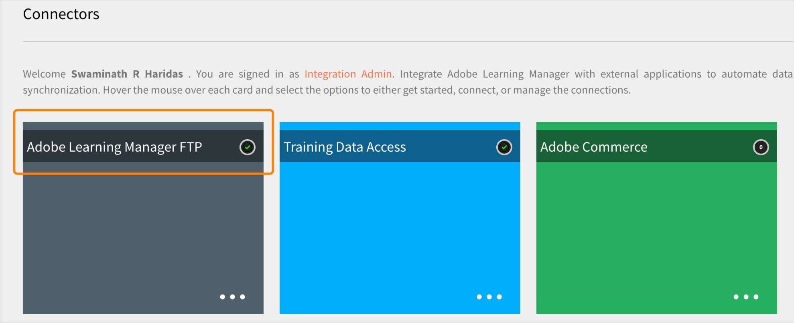

# Transición desde el Administrador de FTP Adobe

Adobe Learning Manager es compatible con un nuevo conector mediante el protocolo SFTP de la familia AWS Transfer.

Puede reemplazar cualquier cliente FTP de código abierto con el Administrador de FTP Adobe.

Algunos clientes FTP recomendados por AWS se muestran [a continuación](https://docs.aws.amazon.com/transfer/latest/userguide/transfer-file.html):

* FileZilla (Windows, macOS y Linux)
* OpenSSH (macOS y Linux); Nota: Este cliente únicamente funciona con servidores habilitados para el protocolo de transferencia de archivos (SFTP) de Secure Shell (SSH).
* WinSCP (solo Microsoft Windows)
* Cyberduck (Windows, macOS y Linux)

## Configurar el conector FTP basado en AWS

Debe configurar el nuevo conector FTP basado en AWS en el administrador de integración.

*Seleccione la opción FTP*

Una vez que se conecte, podrá ver la página Detalles de la conexión.

*Ver la página Detalles de la conexión*

Hay tres opciones de autenticación:

### Crear la autenticación generando nuevas claves SSH

Si desea generar la clave SSH en el propio sistema, puede hacerlo. Haga clic en Generar clave SSH.

La clave privada se descarga en su equipo y la clave pública se guarda en nuestros servicios. Después de hacer clic en Conectar, el usuario de FTP se crea con las claves pública y privada como autenticación.

Ha creado una conexión FTP.

### Crear autenticación mediante claves SSH existentes

Si ya dispone de una clave SSH, pegue la clave pública en el **[!UICONTROL Clave pública de FTP]** y, a continuación, haga clic en Conectar.

*Pegar las teclas*

### Crear autenticación básica mediante una contraseña

Este es el mecanismo de autenticación básico. Seleccione la primera opción, **[!UICONTROL Crear una autenticación básica mediante una contraseña]**. Introduzca la contraseña y haga clic en **[!UICONTROL Connect]**.

Esto crea una conexión.

## Pasos siguientes

### Configuración del cliente FTP

Configure la conexión en un cliente FTP (recomendado en la sección anterior) con las claves que ha descargado o las claves o contraseñas que ya existen.

### Ejemplo de exportación de prueba

* En su cliente FTP, cambie la ubicación del FTP ExaVault a la nueva ubicación de FTP. El nuevo dominio es `http://almftp.adobelearningmanager.com/`.
* También debe incluir la dirección IP en la lista blanca. `18.195.107.67`.
* Una vez se haya autenticado, debe cargar y descargar algunos archivos de muestra desde la nueva ubicación de FTP y hacia ella mediante clientes FTP externos o secuencias de comandos de automatización.
* Debe transferir los datos de la ubicación antigua a la nueva.
* La política de retención de datos del conector sigue siendo la misma. ExaVault también era compatible con algunas políticas de conservación de datos, además de la política oficial. Estas políticas de retención de datos no estarán disponibles con el nuevo conector. Compruebe si el conector emplea alguna retención de datos que no pertenezca a las políticas compatibles oficialmente.

### Qué sucede con los proyectos de migración

| Estado | Recomendación |
|---|---|
| Nueva migración | No puede iniciar nuevas migraciones desde el antiguo FTP. Debe utilizar el nuevo FTP para las nuevas migraciones. Para obtener más ayuda al respecto, póngase en contacto con el equipo de éxito del cliente. |
| Migración en curso | Crear un sprint: puede seguir utilizando el antiguo FTP, pero le recomendamos que utilice el nuevo FTP. Póngase en contacto con el equipo de éxito del cliente para cualquier sprint existente que no se pueda desplazar. |
| Migración cerrada | No hay acción. |

## Conectarse a Adobe Learning Manager mediante el cliente FTP de Filezilla

1. Conéctese al nuevo conector FTP de ALM. Haga clic en Conectar.

   
   *Conectarse al nuevo conector FTP de ALM*

1. Para conectarse mediante autenticación básica mediante contraseña, introduzca el nombre de dominio, el nombre de usuario FTP y configure la contraseña que coincida con los criterios de validación de la contraseña. Haga clic en Conectar. Se creará la nueva conexión FTP y se podrá acceder a ella a través de cualquier cliente SFTP.

   
   *mediante autenticación básica mediante contraseña*

1. Instale cualquier cliente SFTP, por ejemplo, File Zilla. Inicie File Zilla y haga clic en Abrir Site Manager en la esquina superior izquierda.

   
   *Conectar a través de SFTP c lient*

1. Haga clic en **[!UICONTROL Nuevo sitio]** para crear un sitio nuevo. Cambie el nombre del sitio según sea necesario.

   
   *Crear un sitio*

1. Asigne los detalles de la página de credenciales del conector.

   * Seleccione el protocolo como &#39;SFTP - SSH File Transfer Protocol&#39;
   * Host como dominio FTP
   * Tipo de inicio de sesión como &quot;Solicitar contraseña&quot;
   * Usuario como nombre de usuario FTP

1. Haga clic en Conectar.

   
   *Introducir credenciales*

   >[!NOTE]
   >
   >Realice este paso en el cliente File Zilla.

1. Introduzca la contraseña.

   (Opcional) Seleccione la casilla Recordar contraseña para recordar la contraseña.

   
   *Introducir contraseña*

   (Opcional) Seleccione la **[!UICONTROL Confiar siempre en este host]** para confiar en el host.

1. Haga clic en Aceptar.

   
   *Clave de host*

1. Compruebe el estado y el progreso de la conexión en la parte superior.

   La mitad izquierda es el sitio local y la mitad derecha es el sitio remoto.

   Para mover archivos de local a remoto y viceversa:

   * Puede arrastrar y soltar archivos.
   * Haga doble clic en el archivo.

   
   *Comprobar el estado de la conexión*

En cualquier momento, puede cambiar y actualizar el tipo de autenticación.

Otras formas de autenticación son a través de claves SSH:

Pegue la clave pública en el cuadro de texto para utilizar las claves SSH existentes. Haga clic en Conectar/Guardar.

Para generar nuevas claves SSH, haga clic en el icono &#39;**[!UICONTROL Generar clave SSH]** Botón &#39;. Se descargará la clave privada. Haga clic en **[!UICONTROL Conectar/Guardar]**.

*Generar clave SSH*

Asigne los detalles. Seleccione el tipo de inicio de sesión como Archivo de clave. Seleccione el archivo de clave privada.

Haga clic en **[!UICONTROL Conectar]**.

## Qué sucede cuando ExaVault se deja de utilizar

Una vez que ExaVault ya no se utilice, todos los proyectos de migración existentes que estén en curso se transferirán al nuevo FTP como ubicación de origen. A continuación, debe configurar el nuevo conector FTP y continuar con el proceso de migración.

## Recommendations migrará los sprints

Al crear un proyecto de migración, Adobe recomienda que cree el proyecto utilizando el nuevo conector AWS SFTP para evitar la migración del sprint de Exavault a AWS en una fase posterior.

Si hay una migración en curso, cierre el sprint actual que utiliza Exavault como origen de datos. Cree la conexión SFTP de AWS, pruebe la configuración y póngase en contacto con el equipo de éxito del cliente para cambiar al nuevo origen de datos SFTP de AWS. Después de cambiar, cree un nuevo sprint en el mismo proyecto de migración. Las carpetas de sprint se crean en la nueva ubicación, y puede cargar los archivos CSV de migración para continuar la actividad.

**Casos en los que no se puede cerrar un proyecto de migración**

* La asignación del ID de curso se realiza en el proyecto actual para los cursos que se migran de sistemas heredados externos a Adobe Learning Manager. Solo puede hacerlo si desea actualizar los mismos cursos en el mismo proyecto. Una vez que cierre el proyecto, no podrá modificar sus detalles.
* Para proyectos de migración basados en API, donde no debe cerrar un proyecto.
