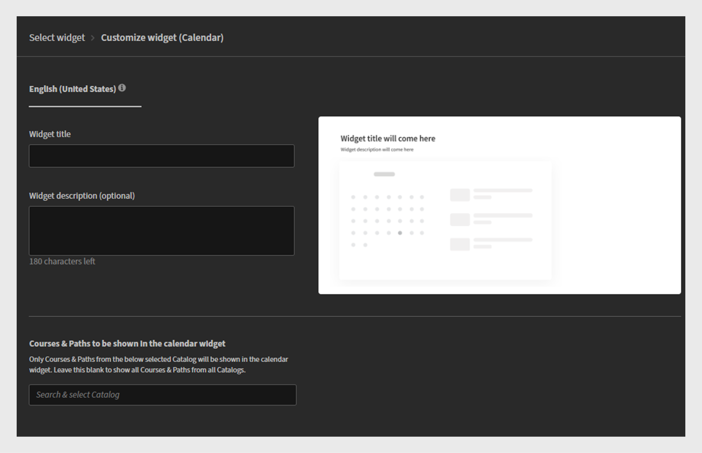
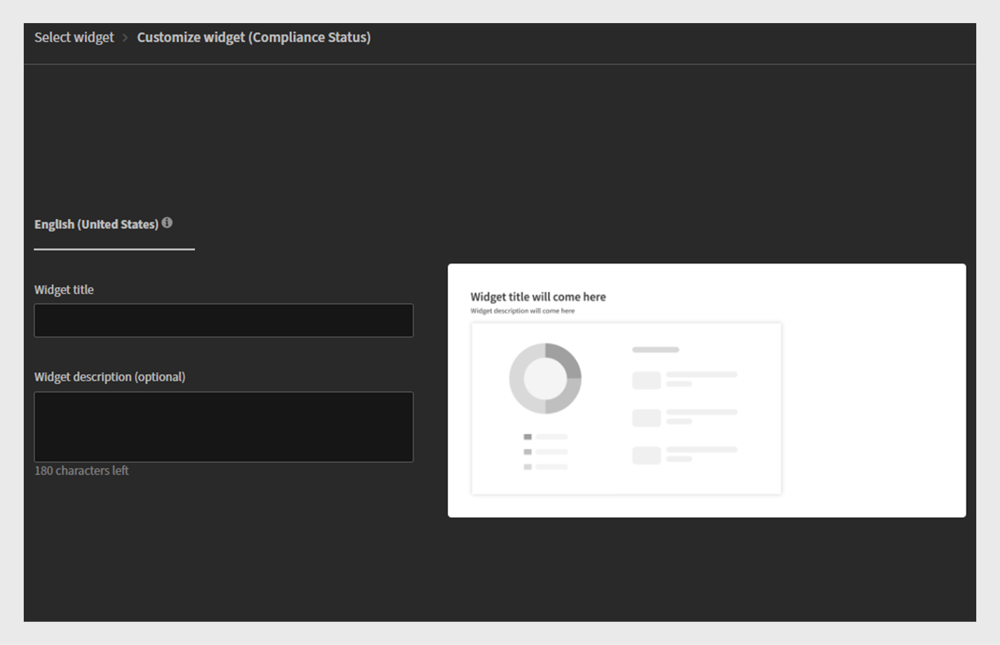
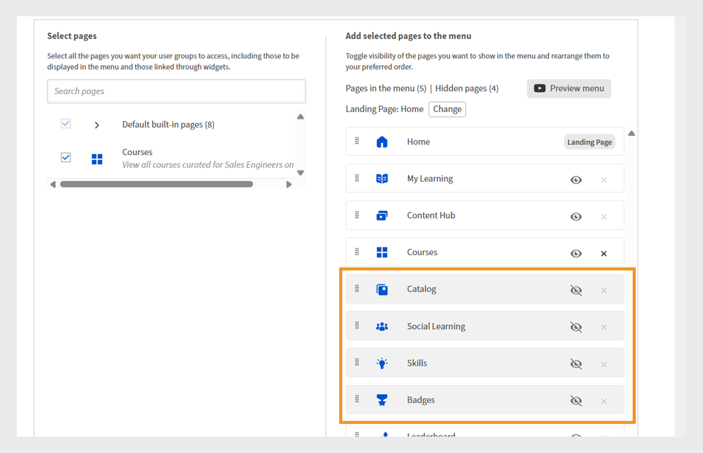

# Próximos cambios en Adobe Learning Manager

<!-- >>[!IMPORTANT]
>
>The Adobe Learning Manager October 2025 release is now live. View [What's New](/help/migrated/whats-new.md) for more information on the latest features and enhancements. This page will be updated with the new features and enhancements for the next release. Stay tuned for more updates. -->

## Descripción general de la versión

La versión de abril de 2026 de Adobe Learning Manager presenta un amplio conjunto de mejoras que facilitan el aprendizaje a los alumnos, lo facilitan para los administradores y lo hacen más flexible para los instructores, incluida una navegación más clara en el reproductor Fluidic, con la etiqueta &quot;Siguiente módulo&quot; y un botón de salida dedicado, compatibilidad con varias sesiones de Zoom simultáneas para que los equipos puedan ejecutar clases virtuales paralelas sin configuración manual, y mejor visibilidad para los cursos compartidos mostrando al autor real en lugar de &quot;Autor externo&quot; en las cuentas de igual a igual. La actualización también muestra las fechas de caducidad de los objetos de aprendizaje en las API del alumno para ayudar a los LXP a resaltar los cursos de formación en los que el tiempo es un factor importante, añade compatibilidad con varios idiomas para las ayudas de trabajo, de modo que una ayuda de trabajo pueda incluir todas las versiones de idioma, y permite a los administradores restringir cuándo se pueden iniciar los módulos definiendo ventanas de inicio/finalización útiles para cohortes o programas cronometrados.

Los sistemas externos que utilizan LTI ahora pueden configurar el idioma del reproductor automáticamente, lo que proporciona a los alumnos una experiencia de idioma coherente en todas las plataformas. También se incorporan varias actualizaciones de la lista de comprobación, incluidas la puntuación ponderada, el texto de la pregunta multilingüe y los comentarios opcionales del revisor para obtener comentarios más completos. Ahora ALM captura varios intentos de prueba controlados dentro del contenido de SCORM e informa de cada intento de forma clara en los informes de L2. Los instructores también pueden generar códigos QR por sí mismos para realizar un seguimiento instantáneo de la inscripción y la asistencia durante las sesiones en persona, y el contenido de los Captivate se reproduce de forma más limpia con una TDC unificada, pasos de finalización a nivel de diapositivas y exportaciones de notas fiables. En general, la versión se centra en la claridad, la coherencia, la preparación multilingüe, la eficiencia de la administración y una entrega de formación más flexible.

## Navegación del reproductor Fluidic: mostrar el nombre del siguiente módulo

### Información general

Esta mejora ya se incluyó en la versión de noviembre de 2025 de Adobe Learning Manager.

La acción &quot;Siguiente&quot; en el reproductor indica lo que ocurrirá al hacer clic mostrando el nombre del siguiente módulo o curso y señalando explícitamente cuando el alumno está a punto de salir del reproductor.

### Novedades

**&quot;Next Module: {ModuleName}&quot; etiqueta en el reproductor**

El icono Siguiente del reproductor Fluidic muestra ahora el nombre del siguiente módulo del curso. Por ejemplo, Módulo siguiente: Lección 2 - Introducción.

Esto se aplica siempre que el alumno pase de un módulo al siguiente en el mismo curso.

**Borrar acción de salida en el último módulo**

Cuando el alumno se encuentra en el último módulo de un curso, aparece un nuevo botón de acción Salir , que indica que al hacer clic en él se cerrará el reproductor y se volverá al contexto del curso.

**Comportamiento interactivo para contenido móvil y de PDF**

En ventanas gráficas más pequeñas (por ejemplo, de ~320 px de ancho), la etiqueta Siguiente se puede acortar u ocultar, mostrando solo el icono, para evitar superposiciones con controles de PDF.

Para los módulos de PDF, el reproductor ajusta los controles a una línea independiente, de modo que las etiquetas de navegación y los controles del PDF no interfieran entre sí.

**Administrador actualizado > Marca > Vista previa del reproductor**

La vista previa del reproductor en Administración > Marca ahora refleja la nueva etiqueta, p. ej. Próximo módulo: Lección 2. Esto permite a los administradores ver el comportamiento de navegación actualizado.

### Principales ventajas

**Navegación más clara para los alumnos**

Los alumnos ya no tienen que adivinar lo que pasará cuando seleccionen &quot;Siguiente&quot;. La etiqueta especifica claramente lo que viene después, ya sea un módulo o un curso. Esta reducción de la ambigüedad ayuda a aliviar las dudas y la confusión, especialmente en grandes audiencias del sector de la educación del cliente, donde muchos alumnos pueden no estar familiarizados con las interfaces del LMS.

**Tasas más altas de finalización de cursos**

Si se indica claramente el siguiente paso (siguiente módulo: {ModuleName}) y se agrega una acción de salida distinta para el módulo final, se reduce la probabilidad de que los alumnos abandonen el curso o pasen por alto el último paso de finalización.

**Experiencia de usuario más predecible en todos los dispositivos**

Las etiquetas actualizadas se alinean con el comportamiento Siguiente o Anterior y los iconos en el escritorio, la tableta y el móvil. Las restricciones de diseño se respetan en todos los dispositivos y flujos de PDF para que los controles puedan utilizarse y ser accesibles.

Esto es especialmente importante para las implementaciones descentralizadas en las que el reproductor Fluidic está integrado en una experiencia de aprendizaje personalizada.

### Casos de uso

**Portales educativos para clientes y socios (descentralizados o integrados en AEM)**

Cuentas que utilizan Adobe Learning Manager en una configuración totalmente descentralizada que dirigen a los alumnos desde canales de marketing externos. Estos alumnos:

* A menudo, el contenido de vídeo se consume en secuencias largas.

* Se espera una experiencia de estilo curricular donde el sistema indique claramente el próximo episodio/módulo.

En estos entornos, la etiqueta **Next Module:{ModuleName}**:

* Refuerza la naturaleza guiada del viaje.

* Minimiza la entrega entre módulos.

**Cursos de cumplimiento y certificación con módulos ordenados**

En escenarios regulados o con alto grado de cumplimiento:

* Los alumnos deben completar una secuencia estricta de módulos.

* Los autores suelen deshabilitar el índice para evitar omitirlo.

Aquí, mostrando **Siguiente módulo:{ModuleName}**:

* Confirma a los alumnos que siguen la secuencia correcta.

* Hace menos probable que malinterpreten la acción Siguiente y salgan antes de tiempo.

**Rutas de aprendizaje en las que los cursos se siguen entre sí**

Donde las rutas de aprendizaje o equivalentes encadenan varios cursos. Esto resulta útil a la hora de crear secuencias de estilo curricular para grandes audiencias.

**Consumo que da prioridad a los dispositivos móviles**

Para los alumnos que utilizan principalmente teléfonos o tabletas:

* Las etiquetas actualizadas y el comportamiento interactivo garantizan que la navegación sea comprensible sin tener que depender de pequeños iconos de cierre o controles ocultos.

* Esto es importante para la educación del cliente, los trabajadores de los pequeños encargos o los alumnos de primera línea que pueden acceder al contenido en sesiones cortas en dispositivos móviles.

## Conector de zoom: crear varias sesiones de zoom simultáneas

### Información general

La próxima actualización del conector de Zoom mejorará significativamente la forma en que Adobe Learning Manager administra la formación virtual con instructor (VILT). Antes, los usuarios solo podían crear una sesión de Zoom cada vez. Con la nueva actualización, los administradores y los autores pueden programar varias sesiones de Zoom al mismo tiempo mediante la integración estándar.

### Novedades

#### Compatibilidad con varias sesiones de zoom simultáneas a través del conector

* El conector de zoom ahora permite crear más de una sesión VILT en la misma fecha/hora desde ALM.

* La lógica de programación ya no aplica una restricción de &quot;reunión de Zoom única a la vez&quot; en el nivel de cuenta/conector.

* Los administradores y los autores pueden configurar sesiones VILT superpuestas (por ejemplo, aulas regionales, pistas paralelas o sesiones repetidas para diferentes grupos de socios) sin soluciones alternativas.

#### Las reuniones se crean utilizando la identidad de zoom del instructor (no del superadministrador de Zoom)

Para admitir reuniones simultáneas de forma segura, el conector se ha actualizado para que:

* Las reuniones de Zoom ahora se crean utilizando la dirección de correo electrónico del instructor, en lugar del correo electrónico del superadministrador de Zoom.

* La cuenta Zoom de cada instructor puede alojar sus propias reuniones en paralelo con otros instructores, sujeto a los límites del plan Zoom existente.

**Nota**:

* Solo se admite un instructor por reunión.

* Si el correo electrónico de un instructor se actualiza posteriormente en Adobe Learning Manager, las reuniones existentes permanecen asociadas al correo electrónico original utilizado en la creación.

#### Se acabó el pegado manual de URL de zoom para sesiones simultáneas

Anteriormente, cuando una segunda o tercera sesión de Zoom tenía que ejecutarse al mismo tiempo:

* Los autores tenían que crear manualmente reuniones de Zoom fuera de ALM y, a continuación, pegar la URL de unión de Zoom en la configuración de la instancia del curso.

* Esto era propenso a errores y no se beneficiaba de las funciones del conector como el seguimiento de la asistencia.

Con el conector actualizado:

* Todas las sesiones se pueden crear directamente desde la interfaz de usuario de ALM mediante el conector de Zoom, incluso si se superponen en el tiempo.

* El ciclo de vida de la sesión (creación/cancelación) sigue gestionándose de forma centralizada mediante la integración.

### Principales ventajas

#### Mejor programación de VILT a escala

Ahora, las organizaciones pueden:

* Ejecute varias clases virtuales basadas en Zoom al mismo tiempo (por ejemplo, pistas paralelas en una conferencia virtual, cohortes regionales o sesiones de formación de socios independientes).

* Evite los cuellos de botella que antes obligaban a los administradores a serializar las sesiones o confiar en la gestión manual del zoom.

#### Menor sobrecarga de administrador y autor

La mejora elimina:

* Creación manual de reuniones de Zoom fuera de Adobe Learning Manager.

* Copie y pegue las direcciones URL de zoom en cada instancia del curso para sesiones superpuestas.

* Riesgo de vínculos mal configurados, reuniones incorrectas adjuntas o seguimiento de asistencia perdida.

Los administradores y los autores pueden administrar todas las sesiones de Zoom desde Adobe Learning Manager, utilizando flujos de trabajo conocidos.

#### Mejor alineación con las funciones de instructor y aprovisionamiento de Zoom

Al vincular reuniones a cuentas de zoom de instructores individuales:

* Cada instructor puede operar dentro de sus propios límites de licencia de Zoom.

* Las organizaciones pueden utilizar su modelo de aprovisionamiento de Zoom existente (una cuenta por formador, por unidad de negocio, etc.) mientras se integran completamente con Adobe Learning Manager.

* Esto evita el cuello de botella de un solo punto que supone el uso de un usuario de Zoom superadministrador compartido en todas las sesiones.

### Casos de uso

#### Eventos y cumbres virtuales multipista

Los equipos de educación del cliente que organizan eventos grandes (por ejemplo, campamentos de inicio de productos, cumbres de partners o semanas de certificación) pueden:

* Configure varias sesiones basadas en zoom en la misma franja horaria (para diferentes pistas o temas).

* Administre todos ellos como módulos VILT en los cursos y rutas de aprendizaje de Adobe Learning Manager.

* Proporciona a los alumnos una experiencia unificada mientras el conector gestiona toda la creación de reuniones de Zoom subyacente.

#### Formación global para partners y clientes

Las organizaciones que capacitan a clientes y socios de todas las regiones pueden:

* Ejecute sesiones de Zoom independientes para EMEA, APAC y América en horas solapadas para que coincidan con las horas de trabajo locales.

* Evite forzar una única franja horaria global o la configuración manual del zoom para cohortes adicionales.

#### Habilitación interna

Los equipos de capacitación interna (ventas, asistencia, etc.) pueden:

* Programe sesiones de incorporación paralelas o sesiones en grupo basadas en funciones (por ejemplo, salas de zoom independientes para desarrolladores, administradores y responsables de departamento empresariales) en ALM.

* Mantenga todas las sesiones dentro del modelo VILT de ALM para fines de informes y cumplimiento, en lugar de realizar una transición parcial a reuniones de Zoom no administradas.

## Mostrar el autor original de los cursos compartidos en cuentas de igual a igual

### Información general

Cuando se comparte un curso a través del catálogo en una cuenta de igual a igual, Adobe Learning Manager etiqueta actualmente al autor como &quot;autor externo&quot; en las vistas de alumno, administrador y autor de la cuenta receptora. Esto puede crear problemas para los alumnos y los administradores, especialmente en las grandes empresas, ya que se hace difícil identificar y ponerse en contacto con el propietario del contenido adecuado cuando surgen problemas o preguntas.

La mejora garantiza que la información del autor se conserve y aparezca en los cursos compartidos en cuentas de igual a igual, en lugar de sustituirse por un marcador de posición genérico.

### Novedades

Mostrar el nombre del autor real de los cursos compartidos en cuentas de igual a igual

Para los cursos compartidos a través de catálogos externos o de igual a igual, el nombre del autor original de la cuenta de origen ahora se muestra en la cuenta de destino en lugar de &quot;Autor externo&quot;.

Esto se aplica a:

* Aplicación del alumno (tarjeta del curso o detalles del curso).

* Vistas de administrador y de autor al previsualizar como alumno.

### Principales ventajas

#### Visibilidad directa del propietario del contenido compartido

Los alumnos y administradores de cuentas de igual a igual ahora pueden:

* Averigüe quién es el autor del curso, incluso cuando se adquiere a través de un catálogo compartido.

* Evita la etiqueta genérica y poco útil de &quot;autor externo&quot;.

#### Experiencia más coherente de varios inquilinos y cuentas de igual a igual

Para clientes que ejecuten escenarios de varios inquilinos o de empresas extendidas:

* El mismo curso se muestra con una marca de autor coherente en todas las cuentas.

* La experiencia del alumno se alinea con las expectativas de la cuenta principal (por ejemplo, ver &quot;Equipo de la Academia en la nube&quot; en lugar de &quot;Autor externo&quot;).

### Casos de uso

#### Grandes empresas con cuentas de igual a igual

La empresa utiliza ALM con:

* Una cuenta principal que posee los cursos canónicos, y

* Cuentas de igual a igual que adquieren contenido mediante catálogos compartidos.

Los alumnos con cuentas de igual a igual deben saber qué equipo de la empresa ha creado un curso para enviar preguntas o sugerencias de mejora correctamente.

Con esta mejora:

* Los cursos compartidos ahora muestran el nombre correcto del autor de empresa en las cuentas de igual a igual.

* La carga de asistencia interna de la empresa se reduce porque los alumnos y los administradores locales saben con quién ponerse en contacto.

#### Uso compartido interno de varias unidades de negocio

Cuando una unidad empresarial gestiona el aprendizaje para otros:

* La unidad de negocio propietaria se puede identificar en el campo de autor en todas las cuentas de consumo.

* Los administradores de aprendizaje y desarrollo locales pueden ver rápidamente si un curso se mantiene de forma local o por otra unidad de negocio, y colaborar en consecuencia.

## Mostrar la fecha de caducidad del objeto de aprendizaje (retirada automática) en las API del alumno

### Información general

Esta mejora hace que la fecha de retirada automática de un objeto de aprendizaje (LO) esté disponible directamente a través de las API de Adobe Learning Manager orientadas al alumno. Cuando un curso, una ruta de aprendizaje o una certificación se configuran con una fecha de caducidad o de retirada automática, esa información ahora forma parte de los datos del objeto de aprendizaje devueltos por los puntos finales clave del alumno.

### Novedades

#### Nuevo campo de caducidad/retirada automática en las API de objetos de aprendizaje

* Las API de objetos de aprendizaje (por ejemplo, los puntos finales que devuelven objetos de aprendizaje a la experiencia del alumno y a plataformas externas) ahora incluyen la fecha de caducidad del objeto de aprendizaje (la fecha de retirada automática configurada para ese objeto de aprendizaje).

* Este campo se devuelve como parte de la entidad LO en respuestas como:

   * Obtener objeto de aprendizaje (detalles de objeto de aprendizaje).

   * Los datos de objetos de aprendizaje se utilizan para rellenar el inicio del alumno, el catálogo y los resultados de búsqueda.

* El campo complementa la fecha límite de finalización existente que ya existe en el nivel de instancia; el nuevo campo es específicamente la fecha de retirada automática en el nivel de objeto de aprendizaje.

#### Disponibilidad en experiencias de alumno respaldadas por búsquedas

Dado que la fecha de caducidad se muestra como parte de la representación de objetos de aprendizaje respaldados por búsqueda, ahora está disponible en cualquier lugar que utilice ALM o una plataforma externa:

* API de búsqueda o

* catálogos basados en búsquedas y sugerencias para crear vistas de alumno.

**Ámbito y exclusiones**

La mejora solo se aplica a las API de alumno.

### Principales ventajas

#### Experiencia del alumno con detección de caducidad en LXP personalizados

Para las grandes y medianas empresas, su LXP personalizado ahora puede obtener información de caducidad de objetos de aprendizaje directamente de ALM, lo que les permite:

* Mostrar etiquetas &quot;Expirando en {date}&quot; o &quot;Expirando pronto&quot; en las tarjetas del curso y las páginas de detalles.

* Comunicarse con urgencia de forma más clara, para que los alumnos prioricen la formación que está a punto de jubilarse.

Esto es especialmente importante para el cumplimiento normativo o la formación sobre productos con plazos precisos, en la que los objetos de aprendizaje se actualizan con regularidad y las versiones anteriores se retiran.

#### Mejor orientación para los alumnos sobre los cursos de formación que deben realizar ahora

Al exponer la caducidad del objeto de aprendizaje, la experiencia del alumno puede:

* Resalta los cursos que aún son válidos frente a los que están a punto de retirarse.

* Ayude a los alumnos a evitar inscribirse en cursos de formación que ya no estarán disponibles o no serán válidos en un futuro próximo.

#### Coherencia con los datos existentes del plazo de finalización

Anteriormente, las API de alumno ya mostraban la fecha límite de finalización a nivel de instancia, pero no la fecha de retirada automática a nivel de objeto de aprendizaje. Con este cambio:

Están disponibles los siguientes aspectos de una formación:

* &quot;¿Para cuándo debo terminar esta instancia?&quot; (fecha límite de finalización).

* &quot;¿Hasta cuándo se ofrece esta formación?&quot; (fecha de retirada/caducidad automática).

### Casos de uso

#### Una empresa global con gestión estricta del ciclo de vida de los cursos

Las empresas que retiran y sustituyen regularmente los cursos (por ejemplo, actualizaciones normativas, de productos o de metodología) pueden:

* Evita la confusión del alumno sobre si un curso de formación se va a eliminar gradualmente.

* Orienta a los alumnos hacia las ofertas más actuales y de larga duración.

Ahora, sus portales personalizados y herramientas internas pueden leer la fecha de caducidad directamente desde ALM a través de las API del alumno.

#### Academias externas de clientes o socios

Para la educación de clientes y partners, las páginas y portales de marketing suelen enfatizar la formación actualizada.

Tener fechas de caducidad en la API de objetos de aprendizaje permite a los creadores de experiencias:

* Oculta o quita el énfasis al contenido que esté cerca de la retirada.

* Crea campañas de &quot;Última oportunidad para completar&quot;.

## Compatibilidad multilingüe para ayudas de trabajo

### Información general

La mejora extiende el modelo de localización de Adobe Learning Manager a las ayudas de trabajo, lo que permite a los autores adjuntar diferentes archivos de contenido por idioma a una sola ayuda de trabajo. En lugar de crear ayudas de trabajo independientes para cada idioma, los autores ahora pueden administrar todas las versiones localizadas como una ayuda de trabajo lógica.

### Novedades

#### Carga de contenido específico del idioma para las ayudas de trabajo

Los autores pueden adjuntar diferentes archivos por idioma admitido a una sola ayuda de trabajo, como cursos y otros objetos de aprendizaje.

La experiencia de creación/edición de ayudas de trabajo ahora admite:

* Seleccionar un idioma.

* Cargar el archivo específico de idioma para ese idioma en la misma entidad de ayuda de trabajo.

#### Gestión coherente del idioma en la IU del reproductor y del alumno

El reproductor Fluidic se ha actualizado para que, cuando un alumno abra una ayuda de trabajo, se muestre la variante de contenido correspondiente al idioma del alumno (cuando esté disponible).

Los administradores y los autores pueden ver las ayudas de trabajo como objetos individuales con variantes de idioma, en lugar de elementos independientes por idioma.

### Principales ventajas

#### Ayuda de trabajo única para todos los idiomas

Los autores pueden evitar crear ayudas de trabajo independientes por idioma.

Todas las variantes de idioma de la misma ayuda de trabajo (por ejemplo, un procedimiento, SOP, PDF de lista de comprobación o guía de referencia) se pueden administrar en un solo lugar.

#### Mejor experiencia para alumnos de todo el mundo

Los alumnos ven automáticamente la ayuda de trabajo en su idioma preferido, lo que significa que hay:

* Menos confusión sobre qué versión abrir.

* Menos riesgo de acceder a copias fuera de la configuración regional o obsoletas.

Esto resulta especialmente útil en organizaciones multilingües en las que el mismo proceso o documentación del producto debe estar disponible en varios idiomas.

### Casos de uso

#### Despliegue global del contenido de referencia

Una empresa debe proporcionar ayudas de trabajo en varios idiomas a los alumnos de todo el mundo, por ejemplo:

* Hojas de referencia de productos.

* Procesar listas de comprobación.

* Libros de estrategias de soporte

En lugar de crear ayudas de trabajo independientes como &quot;Inicio rápido del producto - ES&quot;, &quot;Inicio rápido del producto - DE&quot;, &quot;Inicio rápido del producto - JP&quot;, etc., pueden crear una ayuda de trabajo, adjuntar archivos localizados para cada idioma y permitir que ALM proporcione la versión correcta a cada alumno en función de la configuración de idioma.

#### Documentación dirigida al cliente o al socio para varios mercados

Para las academias de clientes y socios, las ayudas de trabajo pueden incluir:

* Hojas de trucos de productos

* Guías de integración

* Flujos de trabajo de asistencia

Con ayudas de trabajo en varios idiomas:

* Cada socio ve la versión localizada sin tener que elegir entre las entradas específicas del idioma.

* Los equipos de marketing y capacitación pueden administrar una ayuda de trabajo por tema en todas las configuraciones regionales.

## Restringir cuándo se pueden iniciar los módulos

### Información general

La mejora permite a los autores y administradores de Adobe Learning Manager definir una ventana de tiempo durante la cual los alumnos pueden iniciar un módulo. Fuera de la ventana de inicio/finalización configurada, el módulo permanece visible en la estructura del curso, pero los alumnos no pueden iniciarlo.

Esta capacidad es fundamental para los usuarios que necesitan un control más estricto sobre cuándo está disponible determinado contenido o que deben dejar de iniciarse, por ejemplo, en programas cronometrados, formación basada en cohortes o ejercicios sensibles al tiempo.

### Novedades

Los autores ahora pueden configurar, en el nivel de módulo de un curso, una fecha/hora de inicio y una fecha/hora de finalización que determine cuándo se permite a los alumnos iniciar ese módulo. En esta ventana, el módulo se comporta de la forma habitual; antes de la hora de inicio o después de la hora de finalización, el alumno ve el módulo en el esquema del curso, pero no puede iniciarlo.

La configuración aparece en la interfaz de usuario de creación del curso como controles de programación adicionales para tipos de módulos específicos, como contenido con ritmo personalizado, pruebas o actividades. Los administradores pueden utilizar estos controles para crear módulos que se abran en fases o para evitar inicios tardíos en programas en los que se debe consumir contenido dentro de un período de tiempo definido.

#### Principales ventajas

La principal ventaja es la capacidad de controlar cuándo se puede acceder a los módulos. Los equipos de formación pueden sincronizar la disponibilidad de los módulos con eventos reales, como los lanzamientos de nuevos productos, los plazos reglamentarios y los programas internos. Esto garantiza que los alumnos completen el contenido de los requisitos previos antes de poder acceder a los módulos posteriores.

Por ejemplo, la cohorte 1 puede acceder al módulo 2 solo en la semana 2, mientras que el módulo 3 permanecerá bloqueado hasta la semana 3, lo que elimina la necesidad de ocultar y mostrar manualmente el contenido o crear versiones de cursos independientes.

Esto mejora la experiencia del alumno: en lugar de módulos opuestos a los que se puede acceder técnicamente, pero que no deberían estar en ese momento (o que ya deberían estar completados), los alumnos ven una estructura de curso en la que los módulos que se les permite iniciar están claramente alineados con el programa previsto.

#### Casos de uso

* **Programa de habilitación basado en cohorte**: En este programa, cada semana se desbloquea un nuevo módulo. El contenido de la Semana 1 está disponible inmediatamente, mientras que la Semana 2 está visible, pero no se puede iniciar hasta una fecha especificada. La semana 3 sigue el mismo proceso de control. Los alumnos pueden ver la ruta de aprendizaje completa, pero el sistema controla cuándo pueden empezar realmente cada paso.

* **Formación de productos o campañas con plazos determinados**: los equipos de marketing o de productos pueden crear un módulo de formación al que solo se debe acceder mientras una campaña está activa o cuando una versión específica de un producto aún está disponible. Esta ventana de inicio designada garantiza que los alumnos no inicien un módulo sobre una versión del producto interrumpida después de la hora de finalización especificada.

* **Entornos de evaluación o examen**: las organizaciones pueden abrir un módulo (como una prueba) para una ventana corta y bien definida (por ejemplo, &quot;puede comenzar el examen en cualquier momento entre 9:00 y 12:00 en una fecha determinada&quot;). Los alumnos no pueden comenzar el examen fuera de esa ventana, lo que permite una programación equitativa en las zonas horarias y cohortes.

## Controlar el idioma del reproductor mediante un parámetro LTI personalizado

### Información general

La mejora permite que las plataformas externas que utilizan LTI (interoperabilidad de herramientas de aprendizaje) especifiquen el idioma del contenido de Adobe Learning Manager en el momento del inicio. En lugar de depender del alumno para cambiar el idioma en el reproductor Fluidic, el consumidor de LTI puede enviar un código de idioma a través de un parámetro personalizado de LTI. Adobe Learning Manager utilizará este código para seleccionar la variante de idioma adecuada.

### Novedades

Las plataformas externas que actúan como consumidores de LTI ahora pueden pasar un parámetro de idioma personalizado (y la configuración de reproductor relacionada) al iniciar contenido de ALM. ALM lee este parámetro y:

* Define el idioma del reproductor en consecuencia.

* Inicia la variante de idioma correspondiente del módulo cuando se configura contenido en varios idiomas.

Esto significa que un alumno que selecciona francés por primera vez en la plataforma externa verá el reproductor y el módulo ALM iniciarse directamente en francés, sin tener que ajustar nada dentro de ALM.

La mejora también se adapta a escenarios en los que la plataforma externa trata a ALM como un reproductor de contenido descentralizado. Por ejemplo, permite ocultar los elementos de exploración y la tabla de contenido enviando parámetros personalizados adicionales para ajustar determinados valores de la interfaz de usuario. Estos ajustes funcionan junto con el parámetro de idioma, lo que permite a la plataforma externa proporcionar una experiencia fluida y de marca mientras se sigue utilizando ALM para la reproducción y el seguimiento.

### Principales ventajas

* **Experiencia de idioma coherente en todos los sistemas**: Cuando un alumno selecciona un idioma en el portal externo, esa elección se refleja inmediatamente en ALM. Esto garantiza que los alumnos no tengan ninguna discrepancia entre el idioma del portal y el curso. Como resultado, no tendrán que buscar un cambio de idioma dentro del reproductor.

* **Informes específicos del idioma**: En su plataforma, la selección de idioma es coherente con ALM, lo que mejora la precisión de sus análisis y el seguimiento de los alumnos. Esta alineación también admite configuraciones en las que los controles de idioma propios de ALM se deshabilitan u ocultan intencionadamente en el reproductor Fluidic para cursos específicos. En estos casos, la plataforma externa sirve como única fuente de verdad para el lenguaje.

### Casos de uso

* Un caso de uso significativo es el de las grandes empresas que utilizan integraciones basadas en ITL. Los alumnos primero se inscriben y seleccionan un idioma en la plataforma. Luego lanzan sesiones de entrenamiento de ALM a través de LTI. Con esta mejora, cuando un alumno selecciona español, el módulo ALM se abre automáticamente en español. Esto significa que los alumnos no necesitan ajustar la configuración de idioma en ALM. Además, los informes basados en el idioma siguen siendo coherentes con lo que los alumnos ven y experimentan en ALM.

* Otra aplicación es la entrega de experiencias de curso descentralizadas en un portal de clientes o socios. En esta configuración, el portal puede incrustar contenido de ALM mediante un iframe, mientras que toda la experiencia de usuario de navegación e idioma (UX) se administra fuera de ALM. Utilizando parámetros personalizados de LTI, el portal puede garantizar que el reproductor ALM se muestre en el idioma correcto y que los elementos innecesarios de la interfaz de usuario (como la tabla de contenido y los botones de navegación) estén ocultos. Esto permite a los alumnos percibir una sola aplicación coherente en lugar de una colección inconexa de herramientas.

* Esto resulta beneficioso para las organizaciones que imparten formación a gran escala en varios idiomas mediante otro LMS o plataforma de aprendizaje. Pueden estandarizar el uso de esa plataforma para administrar perfiles de alumnos, seleccionar configuraciones regionales y presentar catálogos. Mientras tanto, ALM sirve como un motor confiable de contenido y seguimiento, respetando las preferencias de idioma e interacciones del usuario especificadas por el sistema externo durante cada lanzamiento de LTI.

## Ponderación de preguntas de lista de comprobación para evaluaciones de instructores

### Información general

La mejora introduce listas de comprobación ponderadas, lo que permite a los instructores y responsables evaluar a los alumnos mediante escalas graduadas y puntuaciones totales, en lugar de tratar cada pregunta de la lista de comprobación como igual. El objetivo es facilitar la creación de listas de comprobación mediante la aplicación de evaluaciones ponderadas de las preguntas, lo que permite reflejar la importancia relativa de las distintas acciones o aptitudes en una sola lista de comprobación.

### Novedades

Las listas de comprobación admiten los siguientes tipos:

1. Sí/No
El comportamiento sigue siendo el mismo que en la actualidad: cada pregunta es Sí/No y los criterios para aprobar se basan en el número de respuestas afirmativas.

2. Preguntas del mismo peso

   * Las preguntas se marcan en una escala numérica (de 0 a 10 de forma predeterminada), donde:

      * Los valores máximos y mínimos de la escala se pueden personalizar en el nivel de lista de comprobación.

      * La escala ahora puede comenzar en 0 (la puntuación mínima anterior era 1).

   * Todas las preguntas comparten la misma puntuación máxima, por lo que la lista de comprobación se comporta como una escala graduada uniforme para cada pregunta.

3. Preguntas de peso diferente

   * Cada pregunta tiene su propia puntuación máxima (peso).

   * Los criterios para aprobar dependen del porcentaje de la puntuación total posible que el alumno obtenga en la lista de comprobación (por ejemplo, &quot;aprobar si el alumno alcanza ≥ 70 % de la puntuación total disponible&quot;).

Para todos los tipos de listas de comprobación:

* El **Revisor** (instructor o responsable) evalúa al alumno según el tipo de lista de comprobación configurada:

   * Seleccionando Sí/No.

   * Elija puntuaciones en la escala definida.

* El informe **Checklist** se ha actualizado para incluir preguntas con diferente grosor:

   * Puntuación máxima para cada pregunta.

   * Puntuación obtenida por cada alumno para esa pregunta.

Esto permite analizar el rendimiento global y el rendimiento específico de la pregunta en función de las ponderaciones previstas.

### Principales ventajas

* **Evaluaciones más ricas y realistas**: Los instructores pueden reflejar las prioridades del mundo real dando más puntos a los comportamientos críticos y menos a los menores, mientras siguen utilizando un flujo de trabajo de lista de comprobación adecuado para tareas observadas o prácticas.

* **Aprobado/suspenso basado en la puntuación total**: las evaluaciones se pueden basar en la puntuación porcentual global, no solo en cuántas preguntas pasan un umbral, sino también en cómo se alinean más estrechamente con los esquemas típicos de competencia o gradación.

* **Mejor presentación de informes**: Los informes de lista de comprobación actualizados exponen la puntuación máxima y la puntuación obtenida por pregunta, lo que permite a los propietarios del programa y a los equipos de calidad identificar puntos débiles específicos y perfeccionar la orientación de formación o evaluación.

### Casos de uso

* **Evaluaciones de habilidades empresariales**: Los ingenieros se evalúan mediante listas de comprobación prácticas basadas en escenarios en las que determinados pasos de diagnóstico o comunicación deben tener más peso que los pasos cosméticos o de bajo riesgo. Las preguntas ponderadas y los criterios de aprobación de la puntuación total hacen que estas evaluaciones sean más creíbles y predictivas del rendimiento del mundo real.

* **Observaciones de seguridad y cumplimiento**: en el sector sanitario, de fabricación o de servicios in situ, se pueden asignar puntuaciones máximas más altas a los pasos de seguridad críticos, lo que garantiza que la falta de una acción crítica de seguridad tenga un impacto mayor en la puntuación total que la falta de un paso de procedimiento menor.

* **Orientación y calibración**: con el valor máximo y las puntuaciones obtenidas por pregunta en el informe, los responsables pueden ver exactamente dónde los alumnos obtienen un rendimiento inferior y calibran a los instructores sobre cómo puntuar de forma coherente.

## Compatibilidad con varios idiomas para preguntas de lista de comprobación

### Información general

La mejora introduce la compatibilidad con varios idiomas para las preguntas de la lista de comprobación, lo que permite a los revisores evaluar y puntuar las listas de comprobación en el idioma que prefieran. Esta función es especialmente útil en las regiones multilingües y en las implementaciones globales, ya que permite a los autores crear preguntas de lista de comprobación localizadas para cada idioma de contenido admitido, al tiempo que mantiene un único módulo de lista de comprobación y un proceso de evaluación coherente.

En Adobe Learning Manager hoy:

* Todos los módulos orientados al alumno (SCORM, PDF, HTML, etc.) se pueden proporcionar en varios idiomas de contenido, lo que permite a los alumnos elegir el idioma que prefieran.

* En un módulo de lista de comprobación, los revisores (instructores/responsables) evalúan a los alumnos en función de las preguntas definidas en dicha lista de comprobación.

### Novedades

**Creación**

* Los autores ahora pueden añadir preguntas de lista de comprobación en todos los idiomas seleccionados en el nivel del curso.

* Para cada lista de comprobación:

   * Se espera que el autor proporcione un texto de pregunta equivalente en todos los idiomas de contenido en los que exista el curso.

   * Los autores son responsables de garantizar que el significado de cada pregunta sea coherente en todos los idiomas.

**Experiencia de revisión**

* Los revisores verán las preguntas de la lista de comprobación y la interfaz de usuario de evaluación en el idioma de contenido seleccionado.

* Cuando una pregunta se evalúa en un idioma:

   * La evaluación (puntuación, Sí/No, estado) es lógicamente la misma en todos los idiomas. Es una única lista de comprobación con varias vistas de idioma, no listas de comprobación independientes por idioma.

**Informes**

El informe Lista de comprobación mostrará el texto de la pregunta en el idioma de contenido del usuario:

* Un administrador o revisor que ejecute el informe en cada idioma verá los nombres de las preguntas traducidas de ese idioma.

* Las respuestas y puntuaciones subyacentes siguen siendo las mismas; solo se traducen las etiquetas de las preguntas.

### Principales ventajas

* **Mejor experiencia de revisión**: Los revisores pueden trabajar completamente en su propio idioma, leyendo preguntas y registrando evaluaciones sin barreras lingüísticas.

* **Alineación normativa y de políticas**: En las regiones con requisitos de igualdad lingüística (por ejemplo, holandés/francés en Bélgica), las listas de verificación ahora pueden cumplir los mismos estándares que otros materiales de aprendizaje, lo que reduce el riesgo de cumplimiento.

* **Lógica de evaluación coherente**: Aunque el texto está localizado, la evaluación y la puntuación se comparten en todos los idiomas, lo que garantiza que los resultados sean comparables y se administren de forma centralizada.

### Casos de uso

* Las franquicias multinacionales que operan en varios idiomas pueden implementar un solo curso y una lista de comprobación, a la vez que ofrecen experiencias de revisor localizadas en cada territorio.

* Cualquier empresa global con instructores locales (por ejemplo, EMEA, LATAM, APAC) puede hacer que los revisores trabajen en su idioma local mientras comparten el mismo diseño de lista de comprobación global y la misma generación de informes.

## Lista de comprobación con capacidad de comentario para el revisor

### Información general

La mejora introduce una función de comentarios para las evaluaciones de la lista de comprobación, que permite a los revisores, como instructores y gestores, proporcionar comentarios cualitativos junto con las puntuaciones numéricas. Estos comentarios se pueden hacer visibles para los alumnos cuando sea necesario.

El objetivo es apoyar las evaluaciones basadas en listas de comprobación donde los comentarios de los mentores son tan cruciales como el resultado numérico. Esto incluye destacar fortalezas específicas, áreas de mejora o proporcionar contexto para la puntuación dada.

Hoy en día, los revisores pueden:

* Evalúa una lista de comprobación para cada alumno, pregunta por pregunta.

* Vea los resultados y vuelva a evaluar a los alumnos que han suspendido.

En escenarios reales, como la aviación, los instructores de campo evalúan a los agentes de planta y al personal del aeropuerto. Del mismo modo, los instructores y mentores de las pequeñas y medianas empresas (PYMES) suelen utilizar listas de comprobación para evaluar el desempeño laboral. Sin embargo, estas listas de comprobación no suelen incluir una sección estructurada para capturar comentarios narrativos relacionados con la evaluación.

### Novedades

#### Opciones de creación

Los autores pueden configurar cada lista de comprobación para:

* Habilitar o deshabilitar la función de comentarios para los revisores.

* Decida si el nombre del revisor debe mostrarse a los alumnos junto con los comentarios.

Esto permite a las organizaciones adaptar la visibilidad de los comentarios a sus requisitos culturales y de privacidad.

#### Experiencia del revisor

Cuando los comentarios están activados:

* Los revisores (instructores o responsables) pueden añadir comentarios opcionales al evaluar una lista de comprobación.

* Pueden elegir si los comentarios son visibles para los alumnos, en función de la configuración de la lista de comprobación.

Si vuelven a evaluar a un alumno, pueden actualizar o cambiar los comentarios para reflejar la evaluación más reciente.

#### Informes y notificaciones

* El informe Lista de comprobación obtiene una nueva columna para los comentarios del revisor, que captura el comentario proporcionado durante la evaluación.

* Los alumnos reciben notificaciones (en la plataforma y por correo electrónico) cada vez que se realiza una evaluación de la lista de comprobación. Estas notificaciones incluyen:

   * El comentario y

   * El nombre del revisor, si se configuraron para ser visibles.

Esto garantiza que los comentarios no solo se almacenen, sino que se muestren de forma activa a los alumnos.

### Principales ventajas

* **Comentarios más ricos y parecidos a los de un entrenador**: Las puntuaciones numéricas se complementan con comentarios contextuales, lo que hace que las listas de comprobación sean una herramienta más eficaz para el entrenamiento, no solo para el cumplimiento.

* **Trazabilidad y auditabilidad**: Las organizaciones obtienen un registro persistente de quién evalúa quién, cuándo y qué dicen, lo cual es importante en entornos regulados y roles de alto riesgo.

* **Mejor participación del alumno**: Los alumnos reciben instrucciones claras vinculadas a evaluaciones específicas, lo que mejora su comprensión de las expectativas y los pasos posteriores.

### Casos de uso

* Las organizaciones con entornos regulados pueden utilizar comentarios para documentar el juicio clínico o los comentarios sobre procedimientos del personal que se observa sobre el terreno.

* Las organizaciones de aviación y de asistencia en tierra pueden adjuntar notas detalladas sobre el rendimiento operativo, las prácticas de seguridad y el comportamiento de cara al cliente, lo que convierte una lista de comprobación en una herramienta de información estructurada.

* En la orientación y la evaluación de expertos en la materia, los instructores pueden captar observaciones matizadas que no encajarían en una puntuación por sí solas, por ejemplo, &quot;se ha gestionado bien la escalada, pero es necesario mejorar la gestión del tiempo&quot; o &quot;un excelente flujo de solución de problemas; no se ha realizado un paso de documentación&quot;.

## Informes de pruebas e intentos múltiples en el nivel de contenido

### Información general

Actualmente, ALM admite varios intentos en el nivel de LMS mediante la función Varios intentos de prueba (MQA) :

* Los autores pueden configurar intentos en el nivel del curso (aplicado a todos los módulos de prueba del curso) o en el nivel del módulo (por módulo de prueba).

* Los intentos pueden ser:

   * Un número específico (por ejemplo, 3 intentos), o

   * Intentos infinitos, controlados a nivel de LMS.

* Cuando un alumno consume un módulo a través del reproductor Fluidic y luego cierra el reproductor o completa el módulo, esa sesión se trata como un único intento de LMS.

* Cada intento de LMS se captura en el informe de prueba de L2 como una nueva fila.

Sin embargo, si el propio archivo de contenido (por ejemplo, una prueba de Articulate SCORM) implementa su propia lógica de varios intentos, el informe de prueba de L2 de ALM no distingue ni realiza un seguimiento correcto de esos intentos internos.

Esta mejora introduce el seguimiento de varios intentos en el nivel de contenido de los cuestionarios, lo que permite a Adobe Learning Manager capturar con precisión cada intento dentro del propio contenido en el informe de cuestionarios de L2. Se ha diseñado para situaciones en las que la herramienta de creación de contenido (como Articulate SCORM) gestiona los intentos de las pruebas de forma independiente. Con esta función, los intentos se reflejarán correctamente en los informes de ALM sin depender de la configuración de Intento múltiple de prueba (MQA) en el nivel de LMS.

### Novedades

#### Indicador de autor para los intentos de contenido

* Al cargar contenido en la biblioteca de contenido, los autores ahora pueden indicar que un archivo de contenido específico tiene varios intentos incrustados.

* Se trata de una configuración por contenido que indica a ALM que trate los intentos definidos dentro del contenido como la fuente de confianza.

#### Comportamiento del curso/módulo

Cuando dicho contenido se utiliza en un curso:

* El módulo derivará sus intentos del contenido, no del LMS MQA.

* Los alumnos solo verán un intento en el nivel de LMS:

   * En la vista de módulo y en la vista de información general del curso no se mostrará el botón &quot;Reintentar&quot; del LMS para ese módulo.

   * El control de intentos (por ejemplo, reintentos dentro de la prueba) se rige por el propio contenido.

#### Informes

El informe de prueba de L2 se actualizará para tratar cada intento de nivel de contenido como una fila de intentos independiente:

* Cada intento de prueba interno configurado en el contenido aparece como su propia fila en el informe de prueba de L2, como en la representación actual de los intentos en el nivel de LMS.

* El formato de cada fila sigue siendo el mismo que el de las filas de varios intentos existentes en los informes de L2 (las mismas columnas, estructura y semántica).

* Esto proporciona una experiencia de creación de informes coherente:

   * Tanto si los intentos están controlados por LMS MQA o por el contenido, el informe de prueba de L2 muestra una fila por intento.

#### Principales ventajas

* Historial de intentos preciso para pruebas SCORM en las que los intentos se controlan internamente mediante herramientas como Articulate, sin forzar la configuración de MQA en el nivel de LMS.

* Experiencia de alumno más limpia: para los intentos controlados por contenido, los alumnos ven una única ranura en el nivel de LMS y no necesitan interactuar con los controles de reintento de LMS; todos los reintentos se gestionan dentro de la interfaz de usuario de la prueba que ya conocen.

* Arquitectura flexible: los usuarios pueden elegir si ALM MQA o los intentos a nivel de contenido deben impulsar el comportamiento por módulo, en función de cómo se haya creado su contenido y de cómo prefieran administrar los intentos.

* Modelo de informes coherente: los consumidores descendentes del informe de prueba de L2 pueden tratar cada fila como &quot;un intento&quot;, independientemente del lugar en el que se origine la lógica del intento.

#### Casos de uso

* Las organizaciones que utilizan Articulate SCORM pueden mantener una lógica de cuestionario autocontenida en el paquete SCORM mientras obtienen informes precisos de intentos en ALM sin configuración de LMS adicional.

* Las organizaciones que utilizan contenido SCORM proporcionado por el proveedor pueden evitar la necesidad de modificar o implementar una lógica de intentos e intentos adicional con MQA en el nivel de LMS.

## Códigos QR de instructor para la inscripción de instancias y la asistencia a sesiones

### Información general

Esta mejora añade la capacidad de los instructores de generar códigos QR por sí mismos para:

* Inscripción de instancias de cursos,

* Asistencia a la sesión, o

* Inscripción + asistencia juntos

a nivel de sesión. Se ha diseñado para situaciones en las que los alumnos entran en una clase física o híbrida y requieren una opción rápida de autoservicio para inscribirse y registrar su asistencia mediante un código QR.

### Novedades

#### Códigos QR generados por instructor

* Los instructores podrán generar códigos QR en el nivel de sesión para:

   * Inscribir en la instancia: los alumnos pueden inscribirse en la instancia que incluya la sesión actual.

   * Marcar la asistencia a la sesión: los alumnos analizan durante o después de la sesión para registrar la asistencia a esa sesión específica.

   * Inscribir en instancia + marcar asistencia a la sesión : un QR combinado para los participantes que aún no se han inscrito y necesitan que se marque su asistencia en un solo paso.

* Los instructores pueden exportar los códigos QR que necesitan en función del escenario (inscripción, asistencia o ambas cosas).

#### Empaquetado de código QR

El PDF de código QR exportado incluirá:

* Nombre del curso

* Nombre de la instancia

* Nombre de la sesión

Esto facilita a los instructores y coordinadores identificar e imprimir el código QR correcto para cada sesión.

### Principales ventajas

* **Autonomía del instructor**: los instructores ya no tienen que esperar a que los administradores creen códigos QR. Pueden generarlas directamente para cada sesión, mejorando la agilidad y reduciendo los gastos de coordinación.

* **Mejor logística en el aula**: para audiencias que entran o se encuentran en el lugar (como trabajadores de campo, personal de planta o asistentes externos), los instructores pueden administrar la inscripción y la asistencia en el lugar mediante códigos QR.

* **Menor carga de trabajo de administración**: los equipos de administración pueden centrarse en la configuración y el control en lugar de gestionar las solicitudes de generación de código QR rutinarias para cada sesión.

### Casos de uso

* Las organizaciones que ejecutan grandes volúmenes de sesiones in situ (por ejemplo, formación sobre productos para profesionales) pueden capacitar a los instructores para imprimir códigos QR específicos de la sesión que inscriben y marcan la asistencia con una digitalización.

* En la formación en venta, fabricación y atención sanitaria, en la que los alumnos suelen unirse a las sesiones directamente desde la planta o sin preinscripción, se puede colocar un código QR de &quot;Inscripción + Asistencia&quot; en la puerta. Esto permite a los alumnos realizar autoservicio de inscripción y asistencia a través de sus teléfonos.

* Los eventos de formación para socios o clientes permiten que el formador in situ se adapte fácilmente a los cambios en la sala, sesiones adicionales o asistentes adicionales sin necesidad de consultar al administrador para obtener nuevos códigos QR.

## Mejoras en el reproductor Captivate y ALM

### Información general

Esta mejora mejora mejora la experiencia de reproducción de contenido de Adobe Captivate en el reproductor Adobe Learning Manager (ALM), especialmente tras los cambios recientes en la arquitectura de Captivate. El objetivo es permitir que los alumnos interactúen con los módulos de Captivate de forma nativa en ALM, al tiempo que se garantiza que la navegación, el seguimiento de la finalización y la toma de notas sean claros, coherentes y fiables.

### Novedades

#### Experiencia unificada del índice

* En el lado izquierdo del reproductor solo se mostrará el índice de ALM.

* El índice del propio Captivate se ocultará cuando el módulo se reproduzca en ALM.

* Esto elimina la duplicación, garantiza una única fuente de confianza para la navegación y libera espacio en la pantalla.

#### Comentarios de finalización visual

* El índice ALM mostrará marcas de graduación verdes (o señales visuales equivalentes) que indican la finalización del nivel de diapositiva.

* A medida que los alumnos avanzan por las diapositivas del Captivate, la tabla de contenido de ALM refleja las diapositivas que se han completado, en consonancia con las expectativas del alumno para los participantes en los cursos modernos.

#### Controles de progreso contextual

* Los controles del reproductor se adaptarán en función del tipo de diapositiva:

   * Para diapositivas de vídeo:

      * Mostrar una barra de progreso de tiempo, que refleje la reproducción de vídeo.

* Para diapositivas que no sean de vídeo:

   * Mostrar controles de navegación de diapositivas (diapositiva siguiente/anterior, etc.) en lugar de una barra de tiempo no funcional.

      * Esto evita mostrar controles irrelevantes o que no funcionan en determinados tipos de diapositivas.

#### Navegación simplificada

* La barra de navegación del módulo (ALM) y la barra de navegación del curso independientes se combinarán en una única barra intuitiva.

* Esta navegación unificada:

   * Diferencia claramente entre desplazarse por el módulo Captivate y volver al nivel curso/módulo.

   * Reduce la confusión causada por varias barras con fines superpuestos.

#### Vinculación de notas fiables

* Las notas se vincularán a los números de diapositiva en lugar de a las marcas de tiempo.

* Este cambio:

   * Corrige errores de exportación causados por marcas de tiempo incorrectas o que faltan.

   * Garantiza que las notas se puedan exportar de forma coherente como PDF, con una asignación fiable entre las notas y el contexto de la diapositiva al que pertenecen.

### Principales ventajas

* Experiencia más limpia en un solo reproductor: los alumnos interactúan con un índice y un modelo de navegación, lo que reduce la confusión y la carga cognitiva.

* Indicaciones precisas de finalización y progreso: Las marcas de nivel de diapositiva y los controles contextuales ayudan a los alumnos a comprender dónde se encuentran y qué queda.

* Toma de notas y exportaciones más sólidas: al vincular notas a diapositivas en lugar de marcas de tiempo frágiles, los usuarios recuperan un flujo de trabajo de notas al PDF fiable, incluso con contenido de Captivate basado en diapositivas.

* Flujo de trabajo de autor preservado: los autores conservan la simplicidad de la publicación directa de Captivate en ALM, mientras que los alumnos obtienen una experiencia de reproducción moderna e integrada sin cargas de creación adicionales.

### Casos de uso

* Los programas de habilitación que dependen de Captivate para simulaciones interactivas pueden implementar contenido en ALM, lo que garantiza que la navegación, el seguimiento de la finalización y las notas funcionen de forma coherente para los alumnos.

* Las organizaciones que utilizan Captivate como su principal herramienta de creación de contenido pueden mantener la publicación en un clic y evitar la confusión de las dobles TDC y los controles no funcionales para los alumnos.

* Las organizaciones que dependen de notas exportadas desde contenido de Captivate en ALM (para orientación, cumplimiento o registros) pueden acceder a lo siguiente:

   * Las notas se vinculan correctamente a las diapositivas.

   * Los PDF se generan del modo esperado.

## Cambios en las transcripciones de alumnos

### Información general

Adobe Learning Manager ha revisado la forma en que calcula el tiempo de aprendizaje en transcripciones de alumnos en su versión de abril de 2026. Anteriormente, la lógica de informes podía provocar tiempos inexactos si los alumnos dejaban el reproductor abierto sin interactuar con el contenido, lo que provocaba discrepancias. El nuevo método ahora realiza un seguimiento del tiempo activo en función de la participación del usuario, específicamente cuando la pestaña está enfocada y cuando hay actividad del usuario. Este cambio da como resultado datos más precisos.

Esta actualización mejora los informes y los paneles, lo que ayuda a los administradores a garantizar mejor el cumplimiento normativo y realizar el seguimiento del progreso de los alumnos. Después de la versión, revise las transcripciones de alumnos para ver estas mejoras.

El método de cálculo actualizado se centra en la participación real, como el enfoque de pestaña activa y las interacciones recientes de los usuarios, lo que mejora la precisión de los informes de tiempo en las siguientes áreas:

* Transcripciones de alumnos (IU)
* Métricas de Admin Dashboard
* Informes de inscripción de cursos
* API y conectores

### Qué ha cambiado

La columna **Tiempo de aprendizaje empleado** en transcripciones de alumnos ahora usa una lógica mejorada para calcular el tiempo de forma más precisa. En lugar de simplemente hacer un seguimiento de los tiempos de apertura/cierre del reproductor, el sistema ahora distingue entre períodos activos y de inactividad en función de la participación del usuario.

* **Tiempo activo**: Tiempo en el que el alumno está involucrado de forma activa (por ejemplo, en la pestaña correcta, realizando acciones como desplazarse o ver vídeo).
* **Tiempo de inactividad**: Tiempo en el que el alumno no está involucrado (por ejemplo, cambio de tabulación, sin actividad durante más de 10 minutos), lo que se excluye del total.

Esto se aplica a la mayoría de los tipos de módulos, con excepciones para los módulos SCORM, Captivate y XAPI, que conservan la lógica original.

### Cómo funciona

El nuevo cálculo varía según el tipo de módulo:

* **Módulos de vídeo y audio**: Se activa cuando se reproduce el contenido, incluso si el alumno cambia a otra ficha. El foco de tabulación no es necesario para realizar el seguimiento del tiempo de reproducción.
* **Módulos estáticos (PDF, PPT, Excel, etc.)**: activos en la pestaña y realizando actividades (movimiento del ratón, desplazamiento, clic, entrada de teclado) en los últimos 10 minutos. Si no hay actividad durante 10 minutos, se pasa a ralentí.
* **SCORM y Captivate** conservan la lógica original de apertura/cierre.
* **xAPI** ahora usa detección de tiempo activo basada en pestañas, donde el tiempo se cuenta solo cuando la pestaña está activa. Tenga en cuenta que el contenido AICC **no es compatible**.
* **HTML, LTI y otro contenido**: Puede variar; compruebe la precisión de las transcripciones de alumnos.

El tiempo de inactividad se resta, lo que garantiza que solo se notifique el tiempo de participación real.

### Tabla de resumen

| **Tipo de módulo** | **Tiempo activo (contado)** | **Tiempo de inactividad (excluido)** |
| --- | --- | --- |
| **Vídeo / Audio** | Tiempo de reproducción | No iniciado; finalizado; pausado **\>10 min** |
| **Estático (PDF/PPT/DOC)** | Actividad **y** activas con el tabulador en los últimos **10 min** | No hay actividad **\>10 min**; ficha inactiva |
| **SCORM** | Tiempo informado por tiempo de ejecución de contenido | No se puede detectar el estado inactivo |
| **Captivate** | Temporización basada en diapositivas | No se puede detectar el estado inactivo |
| **xAPI** | Pestaña activa | Pestaña inactiva |
| **HTML** | Tiempo de apertura del reproductor con la pestaña activa | Pestaña inactiva |
| **Productor/Consumidor de LTI** | Si el contenido de LTI se reproduce dentro del reproductor de ALM (es decir, ALM consume contenido de LTI alojado en otro LMS que actúa como productor), se aplica esta lógica del tiempo empleado.<br><br>Sin embargo, si el contenido se reproduce fuera del LMS (es decir, el contenido se aloja en ALM, ALM es el productor, pero la reproducción se produce en un reproductor externo), esta parte de la lógica de cálculo de tiempo no se aplica.  <br>**Nota**: El consumidor de LTI no es compatible con Adobe Learning Manager. | Pestaña inactiva |

**Nota**:

* **Revisitas y sesiones paralelas**: Cuenta como activa cuando se cumplen las condiciones anteriores.
* **Todos los dispositivos, navegadores e idiomas**: incluido; el uso móvil sin conexión se agrega después de la sincronización.

### Ventajas del nuevo cálculo

* **Informes precisos**: Elimina los tiempos de espera de los jugadores desatendidos, lo que proporciona duraciones de aprendizaje realistas.
* **Mejor cumplimiento normativo**: Admite un seguimiento preciso de la formación obligatoria (por ejemplo, los requisitos mensuales de 5 horas de una empresa).
* **Paneles mejorados**: Los gráficos de actividad de los usuarios y los informes de tiempo empleado ahora reflejan la participación real.
* **Información del alumno**: ayuda a los administradores a identificar el progreso auténtico y a dirigirse a los alumnos desinteresados.

### Impacto de informes y análisis

* **Transcripciones de alumnos:** El &quot;tiempo de aprendizaje dedicado&quot; ahora refleja la **participación real**.
* **Panel de administración:** Las métricas que incluyen el tiempo (por ejemplo, mosaicos de &quot;tiempo empleado&quot; y tendencias) mostrarán valores **más bajos pero más realistas** en escenarios donde el tiempo de inactividad infló los resultados anteriormente.
* **Informes de inscripción de cursos:** Los campos relacionados con el tiempo adoptan el **nuevo cálculo** después del inicio.
* **Nota de comparación:** Dado que los datos históricos no se vuelven a calcular, los análisis de series temporales que abarcan la fecha de lanzamiento pueden mostrar un **cambio de paso**. Considera la anotación o segmentación por fecha en las herramientas de análisis.

### API y conectores

* **No hay cambios de esquema** en los extremos o campos existentes que informan del tiempo empleado.
* La **semántica de campos** se ha actualizado para reflejar el _cálculo de tiempo activo_ para las sesiones **después del inicio de la característica.**
* Los **conectores y exportaciones** que consumen tiempo en los campos recibirán automáticamente los valores actualizados en el futuro.

### Retrocompatibilidad y migración de datos

* **Sesiones históricas:** No recalculadas.
* **Nuevas sesiones:** Usa el cálculo de tiempo activo **new**.
* **Períodos mixtos:** Para auditorías o informes longitudinales, segmenta por **antes y después del inicio** para evitar interpretaciones erróneas.

### Limitaciones conocidas

* **El contenido interactivo** (SCORM/Captivate) sigue dependiendo de la temporización proporcionada por el contenido; no está disponible la detección de inactividad en el contenido.
* **El contenido basado en Iframe** (HTML/xAPI) limita la detección de interacciones granuladas; en su lugar, se usa el foco de tabulación.

### Preguntas frecuentes

**¿Esta actualización cambia los registros históricos?**

No. El cambio solo se aplica a las sesiones posteriores al inicio de la función.

**¿Cómo compruebo los cambios?**

Consulte las transcripciones de alumnos de los módulos recientes; compare los tiempos con las duraciones previstas.

**¿Afecta esto a todas las cuentas?**

Sí, es una actualización global para todas las cuentas de Adobe Learning Manager.

**¿Los alumnos deben realizar alguna acción?**

No. El cambio es automático y transparente para los alumnos.

**¿Qué sucede si los alumnos dejan contenido abierto?**

Ahora se excluye el tiempo de inactividad, lo que impide la generación de informes excesivos.

**¿Las sesiones de vídeo/audio se pausan automáticamente cuando la pestaña está inactiva?**

No. El comportamiento de la reproducción no cambia. El tiempo se excluye cuando está en pausa > 10 minutos o cuando no se reproduce activamente.

**¿Se reflejará la actividad móvil sin conexión?**

Sí. El uso sin conexión se incluye cuando el dispositivo se sincroniza.

**¿Qué debo hacer si mis paneles ahora muestran promedios más bajos?**

Esto se espera cuando el tiempo de inactividad haya inflado los resultados anteriormente. Anota los paneles y ajusta los destinos según sea necesario.

**¿Hay requisitos previos?**

Ninguno; el cambio es automático.


<!-- See this [article](/help/migrated/administrators/feature-summary/reports/learner-transcripts.md) for more information on Learner Transcript report.

The downloaded Learner Transcript report contains the new column: Mark Completed Date (UTC TimeZone).


_Learner Transcript report displays a new column in yellow highlighting individual completion dates for each user_

## Enhanced User Report with extended data fields

**Overview**

The User Report now includes additional fields to improve user tracking and organizational mapping.

**What's new**

* Internal User ID column: Provides unique internal identifiers for smooth user tracking across different systems and API endpoints.
* Manager Email column: Includes direct manager contact information for organizational hierarchy tracking.

**Key benefits**

* Simplified user identification and eliminates issues when mapping users across multiple systems.
* Supports downstream user management workflows through integration capabilities.
* Improved organizational mapping and better understanding of reporting relationships.
* Maintains organizational boundaries and prevents accidental cross-communication.

### User Report with the new column

See this [article](/help/migrated/administrators/feature-summary/reports.md#user-activity-dashboards) to learn how to download the User Report. 

The downloaded User Report file contains the new columns: Internal User ID and Manager Email.

 
_User Reports highlighting internal user IDs and manager email addresses to streamline user management_

## FTP User Report with Internal User ID support

**Overview**

The FTP-based User Report now includes Internal User ID support, providing a unified approach to data export and integration for headless implementations.

**What's new**

* User Reports are now available through [Custom FTP](/help/migrated/integration-admin/feature-summary/connectors.md#custom-ftp) alongside existing reports (Gamification Transcripts, Learner Transcripts, Trainings Report).
* The Internal User ID column is now consistent across all export methods (FTP, Jobs API, and UI).

**Key benefits**

* Simplified data management with a single source for all necessary reports.
* Better data consistency by ensuring uniform user identification across reporting periods.
* Automated workflow support by enabling bulk operations and analytics workflows with consistent identifiers.
The User Report downloaded from FTP folder contains the new column, Internal User ID.

## Include suspended users in Learner Transcripts

**Overview**

Organizations can now include suspended users (those with disabled external profiles) in Learner Transcripts, ensuring comprehensive historical learning data retention.

**What's new**

* Configurable suspended user visibility with an account-level flag to include suspended users in the Learner Transcripts.
* Historical data retention even after deactivation of suspended external profiles.

**Implementation requirements**

* Contact your Customer Success Manager (CSM) to enable the account-level flag.

>[!NOTE]
>
>This flag is disabled by default for existing accounts and must be explicitly requested for new accounts.

## Scoped announcement permissions for custom administrators

**Overview**

Custom administrators can now create announcements, but only for their assigned user groups or catalogs. This prevents unintended communication across organizational boundaries.

**What's new**

* Custom administrators can only create announcements for users within their assigned scope.
* Announcements can be scoped to specific user groups or catalogs.
* Full administrators maintain visibility and control over all announcements, including those created by scoped custom administrators.

**Key benefits**

* Targeted communication ensuring announcements reach only relevant audiences.
* Reduced information overload by preventing irrelevant notifications from reaching unintended users.
* Maintains organizational boundaries and prevents accidental cross-communication.

**Important considerations**

* If a custom administrator's scope changes, affected announcements display a warning icon and require individual scope resets.
* Each announcement must be updated individually when scope changes occur.
* The Notification Announcement report shows only learners within the custom administrator's assigned scope.

**Use cases**

* Franchise organizations where regional managers need to communicate only with their franchisees.
* Large organizations with regional or departmental administrators targeting announcements to their teams.

### Create announcement for the assigned scope

A custom administrator can create announcements limited to their assigned user groups and catalogs, ensuring messages reach the right audience and preventing unnecessary notifications.

To create an announcement for the assigned scope:

1. Log in to Adobe Learning Manager as an administrator.
2. Select **[!UICONTROL Announcement]** in the left navigation pane.
3. Select **[!UICONTROL Add]**. 
   
   
   _Announcements page in Adobe Learning Manager, where administrators can create and manage announcements for targeted user groups_

4. Select the **[!UICONTROL Announcement Type]** from the dropdown menu.
        a. **[!UICONTROL As Notification]**
        b. **[!UICONTROL As Masthead]**
        c. **[!UICONTROL As Recommendation]**
        d. **[!UICONTROL As Email]**
5. Select **[!UICONTROL As Masthead]**. 
6. Select the language and upload an image for the masthead. 
7. Optionally, add a URL for the action button. 
   
   
   _Create Announcement screen allowing administrators to set announcement type, upload attachments, and add action buttons_

    The assigned scope is pre-selected in the **[!UICONTROL Scope]** section and cannot be modified by administrators.
    
    >[!NOTE]
    >
    >**[!UICONTROL For Notification]** and **[!UICONTROL Email]** announcements, they can include additional user groups and catalogs if these overlap with their assigned scope.

8. Select **[!UICONTROL Save]**.

Only learners within the custom administrator's scope will be able to view the announcement. See this [article](/help/migrated/administrators/feature-summary/announcements.md) to learn how to create multiple types of announcements. 

### Reset the scope by Custom administrators

Custom administrators can reset the scope of their published announcements if an administrator has changed the scope of them. Once the scope is reset, the updated scope will be applied to the announcement, and only learners within the new scope will be able to see the announcement.

To reset the scope:

1. Log in to Adobe Learning Manager as a custom administrator.
2. Select **[!UICONTROL Announcement]** in the left navigation pane.
3. Select **[!UICONTROL Published]** tab.
4. Select any announcement and then select setting icon. 
5. Select **[!UICONTROL Edit]**. 

   
   _Announcement screen showing the published announcements with edit, publish and other options_

6. Select **Reset**. 

   
   _Announcement showing a scope change notification, with an option for custom administrators to reset and update the scope selection to reflect new access permissions_

The scope will be updated, and only users within the updated scope will be able to view the announcement.

### Edit the announcement through administrator UI

Administrators can view announcements created by custom administrators through their interface. They have the ability to edit these announcements only by modifying or removing the assigned scope. If scope changes are not made, administrators cannot make further edits to the announcement.

To edit the announcement through administrator UI:

1. Log in to Adobe Learning Manager as an administrator.
2. Select **[!UICONTROL Announcement]** in the left navigation pane.
3. Select **[!UICONTROL Published]** tab.
4. Select any announcement and then select setting icon.
5. Select **[!UICONTROL Edit]**. 

   
   _Announcement screen showing the published announcements with edit, publish and other options_

6. Select **[!UICONTROL Remove]**. 
   
   
   _Announcement screen indicating that scope must be removed to allow administrators to edit announcements created for scoped user groups_

Administrator can edit the announcement after removing the scope.

## Tag users in social boards

**Overview**

Social learning boards now support user tagging functionality, enabling more targeted discussions and improved collaboration within learning communities. Learners can be tagged in social learning posts and comments through the learner app, APIs, and Adobe Learning Manager reference site.

**What's new**

* **@username tagging**: Users can tag other board members using the "@username" format.
* **Scope-restricted tagging**: Only users with access to the specific board can be tagged, ensuring privacy and relevance.
* **Multi-channel notifications**: Tagged users receive both in-app and email notifications with direct links to relevant posts or comments.

**Key features**

* Users outside the board's scope cannot be tagged, preventing unwanted notifications.
* If a tagged user is deleted from the system, their mention appears as "anonymous".
* Tagging user groups or "@all" is not permitted to prevent notification spam.

**Use cases**

* Healthcare professionals seeking input from specific colleagues on medical cases.
* Subject matter experts being consulted on specialized topics.
* Team discussions requiring input from specific stakeholders.
* Knowledge sharing sessions with targeted expert involvement.

### Tag users in social board posts

Learners can now tag specific board members in posts or comments using @username. Tagging is limited to members with access to that board.

To tag users in a social board:

1. Log in to Adobe Learning Manager as a learner. 
2. Select **[!UICONTROL Social Learning]** in the left navigation pane.
   
   
   _Enable collaborative learning by selecting Social Learning to access discussion boards, share insights, and tag users for interactive engagement_

3. Select **[!UICONTROL New Post]**.
   
   
   _Start a new discussion by selecting New Post in Social Learning to share knowledge with the tagged users_

4. Before tagging users, select the board from the **[!UICONTROL Post this to a Discussion Board]** option.

   
   _Select a discussion board to post and tag users, enabling targeted collaborative conversations in Social Learning_

5. Type your post details, then tag a user by entering the @ symbol followed by their name (for example, @andrew). When you type @ followed by the first three letters of the user's name, it displays a list of matching users.
 
   
   _Tag users in your discussion post by typing @ followed by the username to enable targeted collaboration within Social Learning boards_

6. Select the desired user from the list.
7. Select **[!UICONTROL Post]**. 

The tagged users receive both in-app and email notifications with a direct link to the post, making discussions more targeted and collaborative.

### Tag users based on the board's scope

Scope-restricted tagging allows users to tag only those learners who have permission to access a specific board. This helps maintain privacy by preventing tagging of users outside the scope. 

If you try tagging learners who are outside the board's scope, no suggestions will appear, and you won't be able to tag them. Refer to this [article](/help/migrated/administrators/feature-summary/social-learning-configurations-as-an-admin.md) to learn more about Social Learning Scope. 

## Tag deleted users in comments

If a user who has been deleted is tagged in a Social Learning post, their name will show as Anonymous in the post. The comment and tag remain visible for context, but profile link or details are not shown.

 
_Social Learning post highlighting how a deleted user appears as Anonymous when tagged_

## Job Aids report with direct access links

**Overview**

The Job Aids report has been enhanced to include direct download links to job aids, streamlining content management and audit processes for administrators and authors.

**What's new**

* Job Aid Link column: Direct access to job aid files and external URLs from within the report.
* Role-based access control: Link accessibility depends on user roles and catalog permissions.
* Deleted job aids remain accessible if still linked to active courses.

**Key benefits**

* Direct file downloads and URL access from within the report.
* Eliminates manual effort in locating and downloading job aids for compliance or accessibility audits. 

**Use cases**

* Authors or administrators conduct regular accessibility audits on job aids, as required by large organizations.
* Any scenario where quick, role-based access to job aid files is needed for review or compliance.

### Job Aids Report with the new column

See this [article](/help/migrated/administrators/feature-summary/reports.md#job-aids-report) to learn how to download Job Aids Report.

The Job Aids Report can be downloaded from the Reports section and now includes direct download links for each job aid.

 
_Job Aids Report displays direct download links, making it easy to access and download job aids in Adobe Learning Manager_

## API updates

### Learner API enhancements for quiz performance tracking

**Overview**

The `GET /loResourceGrades` API has been enhanced to provide detailed quiz performance data, enabling more sophisticated analytics and automated decision-making.

**What's new**

The API response now includes two additional fields:

* **[!UICONTROL highestScore]**: The best score achieved by a learner across all quiz attempts
* **[!UICONTROL maxScore]**: The total possible score for the quiz

**API response example**

```
{
    "links": {
        "self": "https://learningmanagerstage1.adobe.com/primeapi/v2/loResourceGrades/course:15067_30122_41715_1_3400468"
    },
    "data": {
        "id": "course:15067_30122_41715_1_3400468",
        "type": "learningObjectResourceGrade",
        "attributes": {
            "completed": false,
            "duration": 0,
            "hasPassed": false,
            "highestScore": 0,
            "maxScore": 0,. 
            "progressPercent": 0,
            "score": 0
        },
        "relationships": {
            "loResource": {
                "data": {
                    "id": "course:15067_30122_41715_1",
                    "type": "learningObjectResource"
                }
            }
        }
    }
}
```

In response, **course:15067_30122_41715_1_3400468** is the ID of the Learning Object resource grade for which the information is being requested. The `learningObjectResourceGrad`e id can be obtained from the `GET /enrollments/{id}` API.  

**Key benefits**

* Enables detailed quiz performance analysis for learning effectiveness measurement.
* Supports progression rules based on highest achievement rather than most recent attempts.
* Provides complete picture of learner quiz performance over time.

**How the API works**

1. A user attempts a quiz multiple times; each attempt is recorded.
2. The API provides both the highest score achieved and the maximum possible score for the quiz.
3. External systems can use this data to trigger automated actions, such as enrolling users in new courses based on their best performance.

**Use cases**

* Headless learning systems require automated enrollment decisions.
* Learning analytics platforms tracking learner achievement patterns.
* Compliance systems with performance-based progression requirements.

### Migration API enhancements

**Overview**
Adobe Learning Manager now supports the migration of various data objects into an account via the migration process. This process can be initiated via both APIs and the User Interface. When a migration fails, errors are available for download via the interface. These errors are useful in debugging migration errors and managing the migration runs. 

With this release, the error logs will also be available to download via the APIs for efficient, programmatic error tracking and debugging.

**API changes**

There is a new migration API, `runStatus`, which allows integration administrators to check the status of migration runs triggered via the API, something not possible in previous versions of Adobe Learning Manager. 

Additionally, `runStatus` API now provides a direct link to download error logs (CSV) for completed runs. Note that the link is valid for seven days only, and the logs are retained for one month.

The `startRun` API's response has been updated to include the migration project ID, sprint ID, and sprint run ID, which are required to query the new status endpoint. 

#### runStatus API

**Description**

Retrieves the status of an existing migration run.

**Endpoint**

```
GET /bulkimport/runStatus
```

**Parameters**

* **migrationProjectId**: (Required). A unique identifier for a migration project. A migration project is used to transfer data and content from an existing Learning Management System (LMS) to Adobe Learning Manager. Each migration project can consist of multiple sprints, which are smaller units of migration tasks.

* **sprintId**: (Required). A unique identifier for a sprint within a migration project. A sprint is a subset of migration tasks that includes specific learning items (e.g., courses, modules, learner records) to be migrated from an existing LMS to Adobe Learning Manager. Each sprint can be executed independently, allowing for phased migration.

* **sprintRunId**: (Required). A unique identifier used to track the execution of a specific sprint within a migration project. It's associated with the actual migration process for the items defined in a sprint. The sprintRunId helps in monitoring, troubleshooting, and managing the migration job.

**Response**

```
{
  "sprintId": 2510080,
  "sprintRunId": 2740845,
  "migrationProjectId": 2509173,
  "startTime": 1746524711052,
  "endTime": 1746524711052,
  [
    {
      "id": 2609923,
      "lastHeartbeatTime": 1746524711052,
      "objectName": "content",
      "jobState": "COMPLETED",
      "errorCsvLink": "",
      "errorLogLink": "migration/5830/2509173/2510080/2740845/content_err.csv",
      "sequenceNumber": 1
    },
    {
      "id": 2609922,
      "lastHeartbeatTime": 1746524713577,
      "objectName": "course",
      "jobState": "WAITING_IN_QUEUE",
      "errorCsvLink": "",
      "errorLogLink": null,
      "sequenceNumber": 2
    }
  ]
}
```

#### startRun API

The `startRun` API response was updated to include three additional fields- migrationProjectId, sprintId, and sprintRunId. These fields allow users to track and query the status of specific migration runs using the new runStatus API.

```
curl -X GET --header 'Accept: text/html' 'https://learningmanager.adobe.com/primeapi/v2/bulkimport/runStatus?migrationProjectId=001&sprintId=10001&sprintRunId=7'
```

Produces the following response. The response contains:

* migrationId
* sprintId
* sprintRunId

**Response**

```
{
  "status": "OK",
  "title": "BULKIMPORT_RUN_INITIATED_SUCCESSFULLY",
  "source": {
    "info": "Success",
    "migrationInfo": {
      "migrationProjectId": "001",
      "sprintId": "10001",
      "sprintRunId": "7"
    }
  }
}
```

### Social API changes (user tag, comments, and replies)

**Overview**

Adobe Learning Manager now supports @user tagging functionality in Social Learning boards, enabling learners to mention and notify peers within posts, comments, and replies. This feature enhances collaboration and content discovery across the platform.

This release introduces new API capabilities to support user mentions, including enhanced POST and GET endpoints, as well as a new search functionality for tagged users.

**API changes overview**

* Updated POST APIs for creating posts/comments/replies with user mentions
* Updated GET APIs with user mention data in responses

**Format of user mentions**

A user is mentioned using the format: @(user:userId)

#### Create post with mentions

**Endpoint**

```
POST /primeapi/v2/posts
```

**Description**

Create a new social learning post with user mentions.

**Request body**

```
{
  "data": {
    "type": "post",
    "attributes": {
      "boardId": 13282,
      "accountId": 11152,
      "text": "<p>This is a new post mentioning @[user:11257229]</p>",
      "createdByUserId": 11257228,
      "postType": "discussion"
    },
    "id": null
  }
}
```

**Response**

Standard post creation response with mention data included in the _userMentions_ relationship.

#### Create comment with mentions

**Endpoint**

```
POST /primeapi/v2/comments
```

**Description** 

Add a comment to a post with user mentions.

**Request body**

```
{
  "data": {
    "type": "comment",
    "attributes": {
      "postId": 20746,
      "accountId": 11152,
      "text": "<p>Test Comment @[user:11257229]</p>",
      "createdByUserId": 11257228,
      "commentLevel": 0
    },
    "id": null
  }
}
```

#### Create reply with mentions

**Endpoint**

```
POST /primeapi/v2/replies
```

**Description**

Reply to a comment with user mentions.

**Request body**

```
{
  "data": {
    "type": "reply",
    "attributes": {
      "postId": 20746,
      "accountId": 11152,
      "text": "<p>Thanks for the update @[user:11257229]</p>",
      "createdByUserId": 11257228,
      "commentLevel": 1,
      "parentCommentId": 55621
    },
    "id": null
  }
}
```

#### Retrieve posts with mentions

**Endpoint**

```
GET /primeapi/v2/posts/{id}
```

**Description**

Retrieve post details, including mentioned users.

**Response**

```
{
  "links": {
    "self": "https://learningmanager.adobe.com/primeapi/v2/posts/7522"
  },
  "data": {
    "id": "7522",
    "type": "post",
    "attributes": {
      "commentCount": 3,
      "dateCreated": "2025-06-10T11:33:29.000Z",
      "dateUpdated": "2025-06-25T14:52:04.000Z",
      "downVote": 0,
      "postingType": "DEFAULT",
      "richText": "<p>my updated fourth post @[user:14707776] second mention my first post</p>",
      "state": "ACTIVE",
      "text": "my updated fourth post @[user:14707776] second mention my first post",
      "upVote": 0,
      "viewsCount": 0
    },
    "relationships": {
      "createdBy": {
        "data": {
          "id": "14707776",
          "type": "user"
        }
      },
      "parent": {
        "data": {
          "id": "3971",
          "type": "board"
        }
      },
      "userMentions": {
        "data": [
          {
            "id": "14707776",
            "type": "user"
          }
        ]
      }
    }
  },
  "included": [
    {
      "id": "14707776",
      "type": "user",
      "attributes": {
        "avatarUrl": "https://cpcontents.adobe.com/public/images/default_user_avatar.svg",
        "binUserId": "45664b87-75a3-43ec-b0b7-5064958eac6f",
        "email": "user@example.com",
        "enrollOnClick": false,
        "fields": {
          "Location": "BLR"
        },
        "gamificationEnabled": true,
        "lastLoginDate": "2025-06-27T11:21:17.000Z",
        "name": "John Doe",
        "pointsEarned": 1690,
        "pointsRedeemed": 0,
        "preferredResolution": "AUTO",
        "profile": "admin",
        "roles": [
          "Learner",
          "Admin",
          "Author",
          "Instructor",
          "Integration Admin",
          "Manager"
        ],
        "state": "ACTIVE",
        "userType": "Internal"
      },
      "relationships": {
        "account": {
          "data": {
            "id": "9238",
            "type": "account"
          }
        }
      }
    }
  ]
}
```

### Social API changes (user search)

**Endpoint**

```
GET /primeapi/v2/users/search?q={searchTerm}&context=tagging
```

**Description**

Search for users available for tagging based on social scope settings.

**Request parameters**


* q (required): Search term (minimum 3 characters).
* context: Set to "tagging" to get users eligible for mentions.
* boardId (optional): Board ID to filter users based on access permissions.

**Response**

```
{
  "data": [
    {
      "id": "11257229",
      "type": "user",
      "attributes": {
        "name": "Jane Smith",
        "email": "jane.smith@example.com",
        "avatarUrl": "https://cpcontents.adobe.com/public/images/default_user_avatar.svg",
        "userType": "Internal",
        "state": "ACTIVE"
      }
    }
  ]
}
```

### Implementation guidelines

#### Character limits

* Posts: 4000-character limit applies, with each tagged user reducing available characters by a fixed amount.
* Comments: 1000-character limit.

#### Mention validation

* Users can only be tagged by username or email (not UUID).
* Internal users cannot tag external users and vice versa.
* Tagging availability follows existing social scope settings.
* Board permissions determine tagging eligibility (Public/Private).

#### Notifications

* Multiple mentions of the same user in one post result in a single notification.
* Original post owner receives notifications only when specifically tagged.

#### Error handling

* Invalid user IDs in mentions return validation errors.
* GDPR and soft-deleted users appear anonymous in tagged content.

### Language-based learner progress

Currently, learner progress is tracked only for the selected locale language, causing significant progress loss when switching languages/locales in the player. This limitation creates poor user experience where learners lose their learning progress when exploring content in different languages.

**Current issues**

* **Progress override**: The progress for each module in the player is tracked at both the user and module levels. This leads to a situation where a user's progress is overridden when they switch back to a previously used locale for the same module.
* **Progress reset**: For instance, if a learner achieves 75% progress in Locale A (English) and then switches to Locale B (Spanish), upon returning to Locale A, their progress resets to 0% instead of resuming from 75%.

To resolve these limitations, the API has been enhanced to support locale-specific progress tracking:

* **Locale-specific storage**: When a learner switches locales (for example, from Locale A to Locale B) within the player, the system now saves the progress state separately for each locale of the content.
* **Progress resumption**: When the user switches back to a previously used locale (from Locale B back to Locale A), the content resumes from where they left off in that specific locale.
* **Independent progress tracking**: Each locale maintains its own state of progress, allowing learners to explore content in multiple languages without losing their individual progress in each language.

#### API changes

The following APIs have been enhanced to support the new locale parameter:

* GET Player State API
* POST Player State API

#### GET Player State API

**Endpoint**

```
GET /primeapi/v2/users/{userId}/playerState
```

**Description**

Retrieves the current state of a learning object for a specific user and locale.

**Parameters**

|Parameter |Type |Location |Required |Description |
|---|---|---|---|---|
|userId |String |Path |Yes |Unique identifier of the user |
|loId |String |Query |Yes |Learning Object identifier in format lo:{id} |
|loResourceId |String |Query |Yes |Learning Object resource identifier in format course:{loId_loInstanceId_moduleId_moduleVersion}|
|csrf_token |String |Query |Yes |CSRF protection token |
|locale |String |Query |Optional |Locale identifier for language-specific progress (e.g., "en-US", "es-ES") |

**Example request**

```
GET /primeapi/v2/users/12345/playerState?loId=lo:67890&loResourceId=course:67890_1_mod123_v2&csrf_token=abc123&locale=en-US
```

**Response behavior**

* If the locale parameter is provided and a locale-specific state exists, the API returns the progress for that locale.
* If the locale parameter is provided but no locale-specific state exists, the API performs a fallback search for the default state.
* If the locale parameter is omitted, the API returns the default state (maintains backward compatibility).
* For headless requests where the locale is null, the API falls back to the default state lookup.

#### POST Player State API

**Endpoint**

POST /primeapi/v2/users/{userId}/playerState

**Description**

Updates or creates the current state of a learning object for a specific user and locale.

**Parameters**

|Parameter |Type |Location |Required |Description |
|---|---|---|---|---|
|userId |String |Path |Yes |Unique identifier of the user |
|loId |String |Query |Yes |Learning Object identifier in format lo:{id} |
|loResourceId |String |Query |Yes |Learning Object resource identifier in format course:{loId_loInstanceId_moduleId_moduleVersion} |
|csrf_token |String |Query |Yes |CSRF protection token |
|locale |String |Query |Optional |Locale identifier for language-sp|

**Request body**

The request body contains the Learning Object state data specific to the locale.

**Example request**

```
POST /primeapi/v2/users/12345/playerState?loId=lo:67890&loResourceId=course:67890_1_mod123_v2&csrf_token=abc123&locale=en-US
```

```
{
  "progress": 75,
  "completionStatus": "incomplete",
  "timeSpent": 1800,
  "lastAccessedPage": 5,
  // Additional state data
}
```

The API creates or updates the Learning Object state for the specified locale.

## Go1 integration enhancements

**Overview**

Go1 integration is enhanced to allow direct curation of Go1 courses for creating Learning Programs (LP) within Adobe Learning Manager. This update supports the inclusion of Go1 courses in recurring certifications and introduces a new version of the Go1 content hub experience, enabling more efficient course curation.

**What's new**

* Create and manage playlists directly within Go1 using AI chat assistance or manual selection.
* Include Go1 courses in recurring certification cycles with automatic progress reset.
* Upgraded content discovery interface for improved browsing and content curation.

**Key benefits**

* AI-assisted playlist creation significantly speeds content grouping and delivery.
* Enables use of Go1 content for recurring regulatory training requirements.
* Clear preview-and-purchase model supports informed content investment decisions.
* Improved discovery and curation tools for better content management.

**Important notes**

* All Go1 features require an active Go1 license.
* Previous free Go1 content will be decommissioned. Organizations must preview and purchase required content bundles.
* Administrators and authors can create and manage playlists; learners maintain view-only access.

**Use cases**

* Organizations requiring extensive external content libraries for comprehensive training programs.
* Compliance-focused training programs needing regular content updates and delivery cycles.
* Learning teams are seeking to reduce content curation overhead through AI assistance.

### Add Go1 playlist to a Learning Path

Administrators can create a learning path that includes a Go1 playlist, so learners can access selected third-party courses as part of their training.

To create a learning path:

1. Log in to Adobe Learning Manager as an administrator.
2. Select **[!UICONTROL Learning Paths]** in the left navigation pane. 
3. Select **[!UICONTROL Add]**. 

   
   _Select Add in the Learning Paths section to create and organize new structured training programs for your learners_

4. Type the required details and select **[!UICONTROL Save]**. See this [article](/help/migrated/administrators/feature-summary/learning-paths.md) for more information. 
5. Select **[!UICONTROL Add Go1 Courses]**.

   
   _Add Go1 courses to your Sales Engineers Skill Development playlist to expand learning options with curated third-party content_

6. In the **[!UICONTROL Library]**, search for and select **[!UICONTROL Create playlist]** and choose from one of the following:
    a. **[!UICONTROL with AI]**: Create a playlist with the help of AI.
    b. **[!UICONTROL by myself]**: Create a playlist by manually adding courses to it. 

**Create a playlist with AI**

Administrators can type the playlist description in the AI prompt. The AI will curate the related courses and create a playlist based on the requirements. AI generates playlists by interpreting the learning goal or prompt provided by the user. When creating a playlist, admins can select to curate content 'with AI' which allows the system to use large language models to understand the specified learning objectives and content preferences like duration and type. The AI then searches the content library for relevant learning objects that match these criteria.

To create a playlist with AI:

1. Select **[!UICONTROL Create playlist]** and then select **[!UICONTROL with AI]**.
   
   
   _Create curated playlists with AI, which enables automated course recommendations tailored to learner needs_

2. Type a short description about your playlist in the **[!UICONTROL Enter your learning goal]** text field.
3. Select **[!UICONTROL Next]**. 
   
   
   _Type your learning goal to create a custom playlist, helping Adobe Learning Manager recommend targeted courses tailored to your learners' needs_

4. Choose the skills from the list.
   
   
   _Choose the skills from the list to curate the courses for the Sales Engineer_
5. Select the course duration and type for your playlist.
6. Select **[!UICONTROL Generate playlist]**. The playlist is created with 10 courses, and administrators can use it to create a Learning Path.
   
   
   _Review your curated Sales Engineer Skills Enhancement Playlist in Adobe Learning Manager_
7. Select **[!UICONTROL Add to Library]**.
8. Select **Yes** in the confirmation prompt.
9. Select the playlist from the **[!UICONTROL Select playlist to import prompt]**. 

   
   _Select and import the Sales Engineer Skills Enhancement Playlist from the Go1 Library in Adobe Learning Manager_

10. Select **[!UICONTROL Add Playlists to Learning Path]** and then **[!UICONTROL Publish]**. 

The courses in the playlist will be added to the Learning Path. Administrators can then enroll learners, who can immediately begin taking the courses.

**Create a playlist manually**

Manually select courses that best match learners' requirements and curate additional relevant courses.

To create a playlist manually:

1. Select **[!UICONTROL Create playlist]** and then select **[!UICONTROL by myself]**.
   
   
   _Manually create a playlist giving administrators full control to curate courses based on specific learner needs_

2. Type the title and description of your playlist.
 
   
   _Add a title and description to your playlist in Adobe Learning Manager to clearly define its purpose and help guide learners toward targeted skill development_

3. Select **[!UICONTROL Create]**. 
4. Select **[!UICONTROL Add item]** to add the related courses. 
   
   
   _Add items to your Sales Engineers Skill Development playlist in Adobe Learning Manager to curate targeted courses_

5. Search and select the required courses. 

The playlist has been created with related courses, and administrators can use it to create a learning path. 

## Save player state progress for languages

**Overview**

The Fluidic Player now saves your progress separately for each language within a module. This means you can switch between languages and pick up exactly where you left off in each one, instead of losing your progress and starting over.

**Key benefits**

* Jump between languages and resume from your exact position in each one.
* Perfect for learners who need to access content in multiple languages during their learning journey.
* Complete the module in any language while maintaining progress in all languages you've accessed.

**Use cases**

* Global organizations with employees who speak multiple languages and may need to reference content in their native language and English.
* Compliance training where learners might start in one language but need to complete in another for certification purposes.
* Technical training programs where learners might understand concepts better in their native language but need English terminology for their work.

**Important notes**

* The Fluidic Player's language preference is retained within a session. If a learner changes the language and moves to another module, the new language is used for subsequent modules, as long as the player remains open.
* The grade (completion status) is still tracked at the module level, not per locale. The first locale in which the completion criteria are met will update the grade for the module. If a learner completes the module in one language and then switches to another, any further grade updates will be overwritten from the previous grade, but progress for each locale is still preserved.

## Custom roles import support in incremental user import

Adobe Learning Manager now supports custom role imports in the existing multi-incremental user import workflow (regular full user import + incremental enabled flow). This enhancement allows role.csv and user_role.csv files to be uploaded and processed incrementally, without requiring full data uploads each time.

Previously, role.csv and user_role.csv files could only be uploaded in full mode, meaning administrators had to include all previously added role definitions and assignments in every upload. With this new incremental support, only new or modified role data needs to be uploaded, reducing overheads and improving efficiency.

**What's new**

1. Incremental support for custom roles and role assignments:

    * role.csv  and  user_role.csv can now be processed incrementally in the multi-file incremental workflow.
    * No need to upload all existing role and user role data with every import.

2. Enhanced multi-incremental workflow implementation:

    * Create separate folders in FTP for each uploaded user import file.
    * Each folder contains:

        * The user import file- (File1.csv)
        * Corresponding role and role assignment files- (File1_role.csv, File1_user_role.csv)

    For example, user1.csv corresponds to user1_role.csv (custom roles) and user1_user_roles.csv (user-role mapping).

    **Example FTP structure before processing:**

    ```
    import/user/internal/  
         File1.csv  
         File2.csv  
        File3.csv  

    UserRole/  
        File1_role.csv  
        File1_user_role.csv  
        File2_role.csv  
        File2_user_role.csv  
        File3_role.csv  
        File3_user_role.csv  
    ```
 
3. Adobe Learning Manager also supports up to 20 incremental user CSVs and their corresponding custom roles CSVs, making it suitable for large-scale operations.

**Use cases**

* Global companies manage regional teams by uploading multiple incremental user files for each region (EU, America, Asia), allowing administrators to update users and assign new roles for each region in a single workflow.
* Large enterprises automate onboarding and permissions by regularly ingesting incremental user updates from HR systems. This supports seamless updates to user profiles and granular role assignments without manual intervention.

### New columns added to CSV files

Three new columns have been introduced to enhance the data captured in user, role, and user-role CSV exports/imports:

* **User Registration State (user.csv)**: Indicates the current registration status of the user.
* **Role State (role.csv)**: Indicates the current status of roles within the system.
* **User Role State (user_role.csv)**: Indicates the status of the user-role association. 

>[!NOTE]
>
>The above CSV changes apply only to the accounts that use incremental users.

Download the [sample CSVs](assets/sample-csv-Incremnetal.zip) here. 

## Reset recommendations in Salesforce app

**Overview**

Previously, learners using the Adobe Learning Manager Salesforce app could only select roles and recommendation preferences once. If their role changed, they were required to access the native Adobe Learning Manager app to update their profile and receive relevant course recommendations. This made the learning experience and contributed to lower engagement within the Salesforce environment.

**What's new**

Adobe Learning Manager now features a  **[!UICONTROL Reset Interests]** button within the Salesforce app. Learners can now reset their roles and learning preferences without needing to leave Salesforce or sign in into the native Adobe Learning Manager app. This enhancement streamlines access to personalized learning content, ensuring recommendations remain relevant as users' roles evolve.

**Use cases**

* Learners who change job roles, teams, or responsibilities can quickly reset their preferences to receive updated and relevant course recommendations all within the Salesforce app.
* By removing the need to switch to the native Adobe Learning Manager app, the learning journey is smoother, encouraging ongoing engagement and consumption of recommended content through Salesforce.
* Administrators benefit from higher rates of learning completion and better alignment between user roles and recommended content, without extra support or guidance on switching platforms.

### Reset interest in the Salesforce app

To reset the interests and recommendations from the Salesforce app:

1. Log in to Adobe Learning Manager app for Salesforce as a learner.
2. Select **[!UICONTROL Reset Interests]** option at the bottom.

The learner's recommendation or interest will be reset from the Adobe Learning Manager Salesforce app. 

## Create learning portals with Experience Builder

>[!IMPORTANT]
>
>We are excited to announce that Experience Builder, the innovative tool for creating customizable learning portals, will be available following the October 2025 release of Adobe Learning Manager.
>
>Stay tuned for more updates as we approach the release date. We look forward to seeing how you use Experience Builder to transform your learning portals.
>
>For any questions or additional information, contact your Customer Success Manager.

**Introduction**

Experience Builder is a no-code/low-code tool in Adobe Learning Manager that helps you create customized learning portals. It allows you to design branded, user-friendly learning portals without needing technical skills or extensive coding knowledge.
With Experience Builder, you can create new pages, menus, and widgets to deliver personalized learning experiences for your audience quickly and easily. With Experience Builder, you can quickly create new pages, menus, and widgets to deliver personalized learning experiences for your audience.

**Problem statement**

Before Experience Builder, organizations faced several challenges:

1. **Limited customization**: Portals had fixed designs with few options to reflect your brand. Administrators could only make basic changes, such as modifying headers, footers, or colors, which limited the ability to create unique experiences.
2. **Cost**: Building custom portals required expensive developers and long timelines, often taking 6 to 9 months to complete. This approach increased the total cost of ownership and delayed deployment.
3. **Generic experiences**: Everyone saw the same content, even if it wasn't relevant to their role or needs. This lack of personalization reduced learner engagement and satisfaction.
4. **Technical barriers**: Non-technical administrators struggled to create or update portals because they needed coding knowledge or external support.

Experience Builder solves these problems by providing a simple, no-code/low-code solution for creating personalized, branded portals.

It allows administrators to design portals that meet their organization's needs without relying on technical expertise or external developers.

**Key benefits**

**Easy customization**

* Design portals that match your brand with custom headers, footers, logos, and layouts.
* Use widgets to add dynamic content like courses, categories, and HTML elements.
* Create pages and menus tailored to specific audiences, ensuring learners see relevant content.

**No-code/low-code solution**

* Administrators can create and manage portals without coding knowledge, making it accessible to non-technical users.
* Drag-and-drop functionality simplifies the process of building pages and menus.

**Personalized learning**

* Configure pages and menus to display content relevant to specific user groups, such as sales teams, designers, or engineers.
* Use hidden pages to provide exclusive content accessible only through direct links.

**Global reach**

* Create multilingual pages to support learners around the world.
* Localize content to cater to diverse audiences and improve accessibility.

**Mobile-friendly**

* Learners can access content on any device, including phones and tablets.
* Preview pages in both desktop and mobile views to ensure a smooth experience.

**Real-world use cases**

**Branded portals**

* Create a learning portal that looks like your company's website, complete with logos, colors, and layouts.
* For example, a healthcare company can design a portal that matches its corporate branding while integrating learning content.

**Role-based learning**

* Build pages for specific roles, like engineers, sales teams, or designers.
* For instance, sales teams might see product training, while engineers access technical courses.

**Product training**

* Set up separate pages for different products, such as Photoshop, Illustrator, or other offerings.
* Each page can include widgets displaying courses, certifications, and resources related to the product.

**Employee and customer training**

* Use the portal for onboarding new employees, training external partners, or educating customers about your products.
* For example, a software company can create a portal for customer tutorials and troubleshooting guides.

**Localized content**

* Offer content in multiple languages for global learners.
* For instance, a multinational company can create pages in English, Spanish, and French to cater to its diverse workforce.

### Building blocks of Experience Builder

The main components and building blocks of Experience Builder are structured to provide flexibility, ease of use, and targeted learning experiences. Below is a detailed breakdown:

#### Pages

Pages are the foundation of building a learning portal in Experience Builder. Administrators can create new pages tailored to specific audiences or purposes. Additionally, administrators can:

* Create custom pages with flexible layouts (rows and columns).
* Add widgets to populate pages with content.
* Manage page lifecycle with draft and published states.
* Hide pages from menus while keeping them accessible via direct links.

For example, a page for sales training might include widgets displaying relevant courses, testimonials, and a calendar of upcoming sessions.

#### Menus

Menus organize pages into navigable structures for learners. Administrators can:

* Create custom menus to group pages for specific user groups.
* Add hierarchy and ordering to prioritize visibility for specific audiences.
* Include submenus for grouping related pages.

For example, a menu called Resources might include pages for eBooks, videos, and FAQs.

#### Widgets

Widgets allow administrators to add dynamic content and functionality to pages. The following widgets are available:

* Calendar
* Categories
* Compliance Status
* Courses & Paths
* Content Box
* Gamification
* HTML
* Iframe
* My Learning
* Social Learning

For example, a page might include a Courses & Paths widget to display recommended courses and a Calendar widget for upcoming training sessions.

#### Branding tools

Experience Builder provides tools to customize the appearance of the portal. Administrators can:

* Customize headers, footers, and layouts to match corporate branding.
* Use CSS and JavaScript for advanced styling.

For example, a healthcare company might use branding tools to create a portal that matches their corporate website's look and feel.

### Get started with Experience Builder

A software company wants to build a training portal for its customers. The portal will have pages for different products like Photoshop and Illustrator, organized in menus. It will include widgets that show courses, certifications, and upcoming training sessions.

#### Create a page

To create a page in Adobe Learning Manager:

1. Log in to Adobe Learning Manager as an administrator. 
2. Select **[!UICONTROL Branding]** in the left navigation pane. 
3. Select **[!UICONTROL Custom Pages]**.
4. Select **[!UICONTROL Create page]**.

   
   _Custom Pages screen showing the Create page option to design new custom learning experiences_

5. Type the **[!UICONTROL Page name]** (for example, Photoshop training).
6. Type the **[!UICONTROL Page description]** (for example, Learn how to use Photoshop effectively). 
7. Select the page type from the following:

    * **[!UICONTROL Build using ALM widgets]**: Administrator can create a page using the existing Adobe Learning Manager widgets.
    * **[!UICONTROL External page]**: The administrator can add a URL for the external page. If you select the page type as external, add the URL in the Page URL text field.

8. Select the **[!UICONTROL Change icon]** to change the page's icon.
 
   
   _Courses page creation screen displaying options to type the page name, description, type, and icon for a customized learner page_
9. Select **[!UICONTROL Add New Language]** to add the default language for the page. 
10. Select **[!UICONTROL Save]**. 

The page has been created and saved as a draft in the Custom Pages section. Administrators can edit and design the drafted pages using the widgets. 

#### Design page in Experience Builder

Adobe Learning Manager enables administrators to design pages tailored to their requirements using customizable widgets.
To design the page in Experience Builder:

1. Log in to Adobe Learning Manager as an administrator. 
2. Select **[!UICONTROL Branding]** in the left navigation pane. 
3. Select **[!UICONTROL Custom Pages]** and then select the required page. 
4. Select **[!UICONTROL Page Design]**.  
5. Select **[!UICONTROL Edit]**. 
 
   
   _Edit mode allows administrators to design course pages by organizing sections and adding widgets in their preferred language_

6. Choose the options from **[!UICONTROL Select section layout]** dropdown.
7. Select a section from the following based on the number and size of the widgets you want to add in the section:

    * **[!UICONTROL 1 column-Full section width]**: Content spans the entire section width for maximum space.
    * **[!UICONTROL 2 columns-1/2 section width each]**: Two equal-width columns split the section evenly.
    * **[!UICONTROL 2 columns-2/3 and 1/3 section width respectively]**: Main content takes two-thirds, side content one-third.
    * **[!UICONTROL 2 columns-1/3 and 2/3 section width respectively]**: Side content takes one-third, main content two-thirds.
    * **[!UICONTROL 3 columns-1/3 section width each]**: Three equal-width columns divide the section into thirds.
 
   
   _Section layout selection dialog allows administrators to choose single or multi-column widget arrangements for custom page design_

8. Select **[!UICONTROL Proceed]**.
9. Select **[!UICONTROL Add widget]**.
 
   
   _The page design screen allows administrators to select and add widgets to customize their course pages_

10. Choose the required widget and then select **[!UICONTROL Proceed]**. 
11. Configure the widget and select **[!UICONTROL Add widget]**. See this [section](#add-and-configure-widgets) for adding and configuring the widgets.
12. Select **[!UICONTROL Save]** and choose from the following options:

    * **[!UICONTROL Save as Draft]**: The page will be saved as a draft. The administrator can edit the page later.
    * **[!UICONTROL Save & Publish]**: The page will be published, and the administrator can add this page to the Menu. 
   
   
   _Save options allow administrators to choose between saving a page as a draft for future editing or publishing it for learner access_

The page can be saved as a draft or published. Administrators can edit drafts before publishing and can also update and republish published pages.

#### Add and configure widgets

**Calendar widget**

This widget visually presents courses and schedules in calendar format. It supports filters by catalog, enrollment status, location, product, and role. The responsive design adapts to various grid sizes.

To configure the Calendar widget:

1. Follow steps 1-9 from the [Design page in Experience Builder](#design-page-in-experience-builder). 
2. Select **[!UICONTROL Calendar]** and then select **[!UICONTROL Proceed]**.
 
   
   _Widget selection screen highlighting the Calendar widget option to display training sessions in a calendar_

3. Type a **[!UICONTROL Widget title]** and **[!UICONTROL Widget description]**.
 
   
   _Calendar widget customization screen, where administrators can set the widget title, description, and select catalogs_

4. Select a catalog by searching to display its courses and learning paths within the **[!UICONTROL Calendar]** widget.
5. Select **[!UICONTROL Add Widget]**.

The Calendar widget will be added to the page. Administrator can add other widgets and publish the page.

**Categories widget**

This widget displays categories (e.g., roles, catalogs) as tiles, leading to filtered views or specific pages.

To configure the Categories widget:

1. Follow steps 1-9 from the [Design page in Experience Builder](#design-page-in-experience-builder).  
2. Select **[!UICONTROL Categories]** and then select **[!UICONTROL Proceed]**. 
 
   
   _Widget selection screen highlighting the Categories widget option to organize learning content by catalog, product, or role for easy navigation_

3. Select the details to display on the category cards:

    * **[!UICONTROL Category Image]**
    * **[!UICONTROL Category Description]**

4. Type a **[!UICONTROL Widget title]** and **[!UICONTROL Widget description]**.
5. Search for and choose a catalog from the **[!UICONTROL Category source]**.
 
   
   _Configure Categories widget options to set widget title and description, and select the category source_

6. Select **[!UICONTROL Add Widget]**.

The Categories widget will be added to the page. Administrators can add other widgets and publish the page.

**Compliance widget**

This widget supports filtering similar to a calendar, but is focused on compliance-related learning objects. It allows learners to modify or remove compliance label filters dynamically.

To configure the Compliance widget:

1. Follow steps 1-9 from the [Design page in Experience Builder](#design-page-in-experience-builder).  
2. Select **[!UICONTROL Compliance Status]** and then select **[!UICONTROL Proceed]**.
 
   
   _Widget selection screen highlighting the Compliance Status widget used to display learner enrollments with deadlines and status indicators_

3. Type a **[!UICONTROL Widget title]** and **[!UICONTROL Widget description]**.
 
   
   _Compliance Status widget screen, where administrators can set the widget title and description to display enrollment deadlines and status for learners_

4. Select **[!UICONTROL Add widget]**.

The Compliance status widget will be added to the page. Administrators can add other widgets and publish the page.

**Courses and paths widget**

This widget displays a strip of course or path tiles, customizable to show different details. 

To configure the Courses and Paths widget:

1. Follow steps 1-9 from the [Design page in Experience Builder](#design-page-in-experience-builder). 
2. Select **[!UICONTROL Courses & Paths]**.
 
   
   _Widget selection screen highlighting the Courses & Paths widget for displaying courses, learning paths, certifications, and job aids as interactive cards for learners_

3. Select **[!UICONTROL Proceed]**. 
4. Type **[!UICONTROL Widget title]** and **[!UICONTROL Widget description]**. 
5. Select the catalogs or manually choose up to 25 courses to display.
    
   
   _Courses & Paths widget where administrators set the widget title, description, and select courses or learning paths to display as interactive cards_

6. Select **[!UICONTROL Add widget]**. 

The Courses & Paths widget will be added to the page. Administrators can add other widgets and publish the page.

**Content Box widget**

This widget allows creating sections with titles, descriptions, images, and CTAs. 

To configure Content Box widget:

1. Follow steps 1-9 from the [Design page in Experience Builder](#design-page-in-experience-builder).
2. Select **[!UICONTROL Content Box]** and then select **[!UICONTROL Proceed]**. 
 
   
   _Widget selection screen highlighting the Content Box widget for displaying custom images, text, and action buttons to enhance learner engagement_

3. Type the **[!UICONTROL Title]** and **[!UICONTROL Description]**.
4. Type the text into the **[!UICONTROL Action button label]** and provide a link. 
5. Select any of the options for Background fill:

    * **[!UICONTROL Color]**: Select the color from the color picker or type the color code in the text field.
    * **[!UICONTROL Image]**: Browse and upload a picture.

6. Adjust the box height using the **[!UICONTROL Content box height]** option. 
7. Select the text formatting options.
 
   
   _Content Box widget customization screen, where administrators can enter a title, description, action button label, and link_

8. Select **[!UICONTROL Add widgets]**. 

The Content Box widget will be added to the page. Administrators can add other widgets and publish the page.

**Gamification widget**

This widget shows gamification and points earned by learners in a leaderboard format. It has been updated for Experience Builder with a name, description, and localization customization.

To configure the Gamification widget:

1. Follow steps 1-9 from the [Design page in Experience Builder](#design-page-in-experience-builder).
2. Select **[!UICONTROL Gamification]** and then select **[!UICONTROL Proceed]**. 
 
   
   _Widget selection screen highlighting the Gamification widget used to display learning activities and achievements on the leaderboard_

3. Type the **[!UICONTROL Widget title]** and **[!UICONTROL Widget description]**. 
4. Select **[!UICONTROL Add widgets]**. 

The Gamification widget will be added to the page. Administrators can add other widgets and publish the page.

**HTML widget**

This widget allows custom HTML, CSS, and JS code to be embedded, providing flexibility for static content like testimonials. 

To configure the HTML widget:

1. Follow steps 1-9 from the [Design page in Experience Builder](#design-page-in-experience-builder).
2. Select **[!UICONTROL HTML]** and then select **[!UICONTROL Proceed]**. 
 
   
   _Widget selection screen highlighting the HTML widget for customizing pages using HTML, CSS, and JavaScript code_

3. Type your **[!UICONTROL HTML]**, **[!UICONTROL CSS]**, and **[!UICONTROL JavaScript]** code in the respective fields. 
4. Select **[!UICONTROL Add widget]**. 

The HTML widget will be added to the page. Administrators can add other widgets and publish the page.

**IFrame widget**

This widget allows embedding external web applications or webpages directly within the page. Includes options to name, describe, and localize the iframe content.

To configure the Iframe widget:

1. Follow steps 1-9 from the [Design page in Experience Builder](#design-page-in-experience-builder).
2. Select **[!UICONTROL Iframe]** and then select **[!UICONTROL Proceed]**. 
 
   
   _Widget selection screen highlighting the Iframe widget for embedding external applications or web pages within a selected section_

3. Type the URL in the **[!UICONTROL Page linked to Action button]** option.
4. Adjust the Iframe height using the **[!UICONTROL Iframe height]** option.     
 
   
   _Iframe widget customization screen, where administrators can enter a page URL and specify iframe height to embed external content_

5. Select **[!UICONTROL Add widget]**. 

The Iframe widget will be added to the page. Administrators can add other widgets and publish the page.

**My Learning widget**

This widget is similar to the Courses and Paths widget, but filters content specifically for each learner, showing their personalized set of enrolled learning objects.

To configure the My Learning widget:

1. Follow steps 1-9 from the [Design page in Experience Builder](#design-page-in-experience-builder). 
2. Select **[!UICONTROL My Learning]** and then select **[!UICONTROL Proceed]**. 
 
   
   _Widget selection screen, highlighting the My Learning widget used to display the learner's personalized list of enrolled courses_

3. Type the **[!UICONTROL Widget title]** and **[!UICONTROL Widget description]**.
4. Select **[!UICONTROL Add widget]**.

My Learning widget will be added to the page. Administrators can add other widgets and publish the page.

**Social Learning widget**

This widget enables social collaboration functionalities such as posts, comments, and user tagging within the platform. It is enhanced for Experience Builder with customization options, including name and localization.

To configure the Social Learning widget:

1. Follow steps 1-9 from the [Design page in Experience Builder](#design-page-in-experience-builder). 
2. Select **[!UICONTROL Social Learning]** and then select **[!UICONTROL Proceed]**. 
 
    
   _Widget selection screen highlighting the Social Learning widget for displaying a posts to encourage collaboration and engagement_

3. Type the **[!UICONTROL Widget title]** and **[!UICONTROL Widget description]**.
4. Select **[!UICONTROL Add widget]**. 

The Social Learning widget will be added to the page. Administrators can add other widgets and publish the page.

#### Organize pages into a menu

Menus help organize and link pages in Experience Builder, making it easy for learners to navigate your learning portal. Administrators can create menus, add pages to them, and customize which menus are shown to specific audiences. 

**Create a menu**

To create a menu:

1. Log in to Adobe Learning Manager as an administrator.
2. Select **[!UICONTROL Branding]** in the left navigation pane.
3. Select **[!UICONTROL Menu]** and then select **[!UICONTROL Create]**.
 
   
   _Menu screen showing options to view, organize, and create customized menus for different learner groups_

4. Type the **[!UICONTROL Menu name]** (for example, Product Training) and select the user group in the **[!UICONTROL Visible to]** option.
   
   
   _Create menu screen, where administrators can enter a menu name for internal use and specify user groups to control menu visibility_

5. Choose the custom page from the **[!UICONTROL Select pages]** option. 
 
   
   _Page selection screen, highlighting the option to include the custom page for user groups and customize the menu order_

6. Select **[!UICONTROL Preview menu]** to view the menu before saving it. 
7. Select **[!UICONTROL Save]**.

The created menu will be visible for the selected learners. They can access the custom pages through their Learner UI. 
 

_Learner UI displaying the custom page with featured training modules and easy navigation from the sidebar menu_

#### Manage pages lifecycle

Administrators can use the Custom Pages section to edit, delete, and duplicate the pages.

**Edit the page**

To edit the custom pages:

1. Log in to Adobe Learning Manager as an administrator.
2. Select **[!UICONTROL Branding]** in the left navigation pane.
3. Select **[!UICONTROL Custom Pages]**.
4. Select the required page and then select **[!UICONTROL Edit]**. 
5. Select **[!UICONTROL Save]**.

The page will be updated with the changes. 


_Edit the custom page, allowing administrators to update the page name, description, and type_

**Delete the page**

To delete the page:

1. Log in to Adobe Learning Manager as an administrator.
2. Select **[!UICONTROL Branding]** in the left navigation pane.
3. Select **[!UICONTROL Custom Pages]**.
4. Select the required page.
5. Select **[!UICONTROL Action]** and then select **[!UICONTROL Delete]**. 
 

_Custom Pages screen displaying options to delete custom pages created for product training_

**Duplicate the page**

To duplicate the page:

1. Log in to Adobe Learning Manager as an administrator.
2. Select **[!UICONTROL Branding]** in the left navigation pane.
3. Select **[!UICONTROL Custom Pages]**.
4. Select the required page.
5. Select **[!UICONTROL Action]** and then select **[!UICONTROL Duplicate]**. 
 

_Custom Pages screen displaying options to duplicate the custom pages created for product training_

#### Preview the pages

To preview the pages:

1. Log in to Adobe Learning Manager as an administrator.
2. Select **[!UICONTROL Branding]** in the left navigation pane.
3. Select **[!UICONTROL Custom Pages]**.
4. Select the required page and then select **[!UICONTROL Page Design]**
5. Select **[!UICONTROL Edit]** and then select **[!UICONTROL Preview page]** to view the portal's preview. 


_Page preview showing a custom page layout with a banner, featured courses_

#### Localize the pages

When an admin adds multiple languages to the custom pages, add the widget details for each language in the corresponding language tab next to the default language tab.

 
_Administrators can add widget details for additional languages, such as French, alongside the default language_

#### Set up hidden pages

The hide pages option allows administrators to keep the Learner UI clean by showing fewer pages. Administrators can hide pages from the menu so learners don't see them in learner UI, but learners can still reach those pages in other ways. For example, the Catalog page can be hidden from the menu but accessed through other navigation paths.
 

_Menu configuration screen showing hidden pages such as Catalog, Social Learning, Skills, and Badges_ -->


<!-- We're excited to share several important updates coming to Adobe Learning Manager with the upcoming releases. These enhancements aim to streamline admin workflows, improve data reporting accuracy, and strengthen role-based controls.

These changes are designed to reduce manual effort, support automation, and improve governance across training operations.

## Capture instructor-marked completions in Learner Transcript

### Audience  

Administrator and automation owners 

### Overview 

In Adobe Learning Manager, when using incremental Learner Transcripts (LT) for automation workflows, instructor-marked completions made after the session date are not captured. The completion timestamp reflects the original session end time (not the time the instructor marked the completion). Since these updates fall outside the one-day change window used for incremental LT generation, as a result, learners' attendance and completion data are excluded from reports, leading to inaccurate or incomplete downstream reporting and potential compliance gaps. 

### What has changed 

Learner Transcript (LT) reports include completions marked by instructors after the session date. This ensures that any delayed attendance marking is correctly reflected in the transcript export. 

Attendance states like "Attended with pass/fail" will appear automatically in incremental LT exports. 

### What's new 

* New column: Mark Completed Date (UTC TimeZone). 
* Completion Source is available at module level. 
* Compatible with connector-based or job API-generated LT reports. 


**Action required**

* If your automation depends on column positions, ensure logic accounts for the new column. 
* If using column names, no changes are required. 
* Retrofitted completions (manual imports) are not included. 

## Download links in Job Aids report

### Audience 

Administrator, custom administrator, and automation owners 

### Overview 

The Job Aids report includes a direct download link for each job aid, allowing quick access from the report itself. 

### What's new  

A new column, **[!UICONTROL Job Aid Link]**, has been added to the third position in the report. It links directly to the job aid if it's a file or shows the external URL provided by the author. 

Users with access (admin/authors and custom roles) can download the job aid using this link. 

 

### Action required 

* Review automated workflows using Job Aids reports (using Jobs API). 
* If the script is based on column position, update scripts accordingly. 
* No action is needed if using column names. 

## Internal User ID and Manager Email columns added to User Report

### Audience 

Administrators (and custom administrators) using the **[!UICONTROL User Report]** (**[!UICONTROL Admin]** > **[!UICONTROL Users]** > **[!UICONTROL Internal]** > **[!UICONTROL Export User data]**) downloaded from the administrator User Interface. 

### Overview 

To assist in user identification and integration workflows, two columns, **[!UICONTROL Internal User ID]** and **[!UICONTROL Manager Email]** have been added to the User report, exported via the User Interface. 

### What's new 

The User report includes a user's internal user ID and their manager's email address, to map them uniquely across different tools or API endpoints. 

### Action required 

* If using this report in automated flows, then this newly added column should be taken care of in automation.  
* No changes are needed if workflows are not impacted. 

## Scoped announcement permissions for custom administrators

### Audience 

Custom administrators 

### Overview 

Custom administrators can create announcements only for the user groups or catalogs within their defined scope. 

### What's new 

* Scoping rules allow custom administrators to create announcements for specific user groups or catalogs only. 
* When defining a custom role, administrators can assign announcement permissions with scope on user groups or catalogs. 
* Custom administrators are limited to creating announcements within their given scope. 
* The notification announcement report for custom administrators will display learners only within their assigned scope. 

### Action required 

* The format of the report will remain unchanged. If custom administrators download it from the User Interface, the content of the report will be subject to their scope. 
* No modifications are necessary if this report is not utilized in any automated or downstream workflow.

See the [Release notes](https://experienceleague.adobe.com/es/docs/learning-manager/using/introduction/release-notes) article for a cumulative list of new features and changes to Adobe Learning Manager.-->
