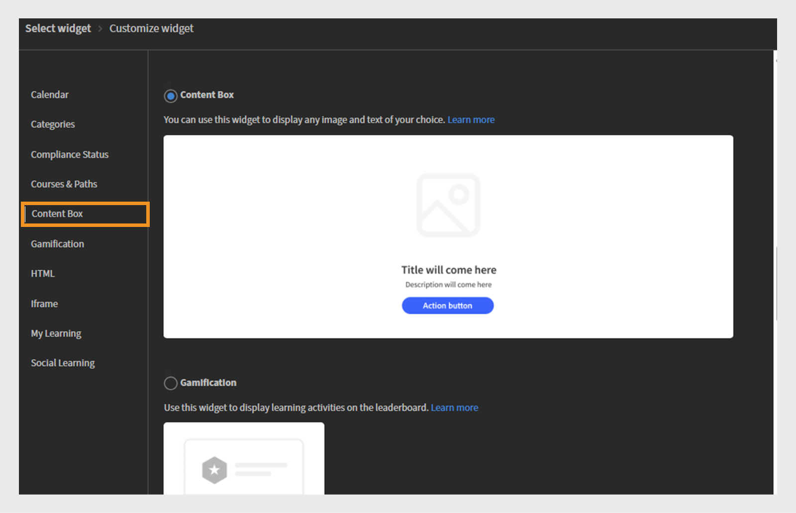
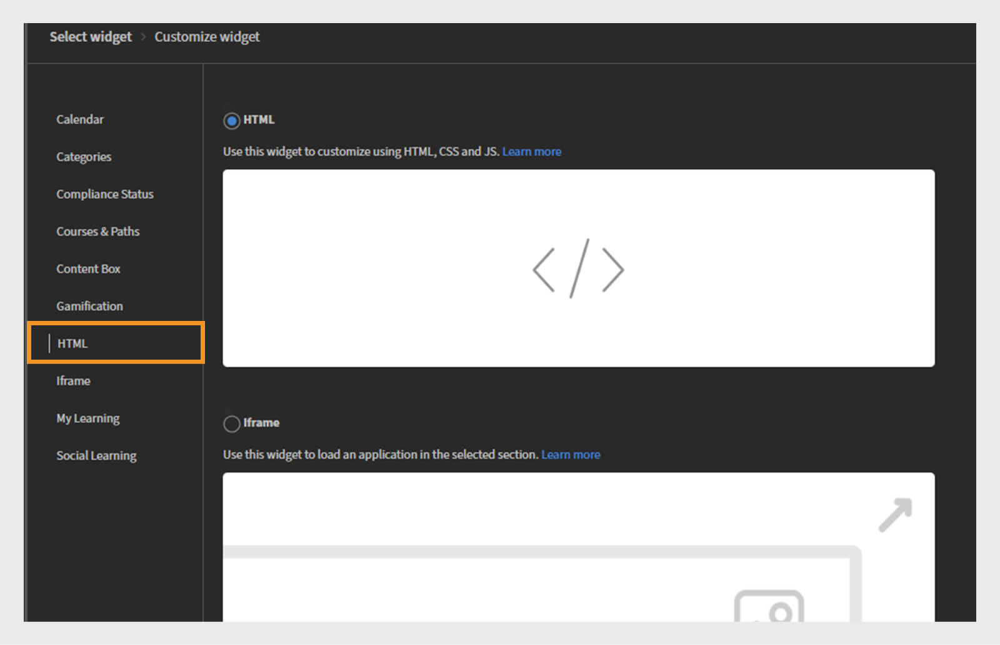

# Novedades de la versión de octubre de 2025 de Adobe Learning Manager

>[!IMPORTANT]
>
>Tenga en cuenta que las funciones descritas son provisionales y están sujetas a cambios. Para obtener información más detallada y una confirmación, ponte en contacto con el administrador de éxito de clientes que hayas designado. Si tienes algún problema, ponte en contacto con nuestro equipo de Asistencia al cliente en [learningmanagersupport@adobe.com](mailto:learningmanagersupport@adobe.com).

## Descripción general de la versión

La versión de octubre de 2025 de Adobe Learning Manager presenta importantes mejoras diseñadas para mejorar la precisión de los informes, expandir las capacidades de integración y mejorar la experiencia de aprendizaje para administradores, autores y alumnos. Las mejoras clave incluyen transcripciones de alumnos mejoradas que capturan con precisión las finalizaciones marcadas por el instructor, informes de usuarios ampliados con campos de identificación adicionales e informes de ayudas de trabajo con vínculos de descarga directa.

Esta versión también introduce permisos de anuncio con ámbito para administradores personalizados, funcionalidad de etiquetado de usuarios en tableros de aprendizaje social y seguimiento del progreso basado en el idioma que conserva el progreso del alumno en diferentes configuraciones regionales. Entre las funciones adicionales se incluyen las mejoras en la integración de Go1 con la creación de listas de reproducción asistida por IA, la administración de funciones personalizada mejorada con compatibilidad de importación incremental y las API mejoradas para un mejor seguimiento del rendimiento de las pruebas y la supervisión del estado de la migración.

## Finalizaciones marcadas por el instructor en transcripciones de alumnos

**Información general**

Las transcripciones incrementales de alumnos ahora capturan las finalizaciones marcadas por el instructor, incluso si la asistencia se registra después de la fecha de la sesión.
Esta mejora corrige una laguna crítica en las transcripciones incrementales de alumnos, donde antes no se cumplían las finalizaciones marcadas por el instructor si la asistencia se registraba después de la fecha original de la sesión.

Las transcripciones incrementales de alumnos son informes programados que capturan solo los cambios (como finalizaciones o actualizaciones de progreso) que se producen dentro de un período especificado, en lugar de proporcionar un volcado de datos históricos completo. Se suelen utilizar para automatización, paneles e integraciones, lo que permite a los usuarios realizar un seguimiento eficaz de las actividades de aprendizaje recientes sin procesar todo el historial de transcripciones en cada ocasión.

**Novedades**

* **Marcar fecha de finalización (zona horaria UTC), columna**: una nueva columna de marca de tiempo que captura la fecha y hora exactas cuando un instructor marca una sesión o módulo como completada.
* **Seguimiento mejorado del origen de finalización**: realiza un seguimiento del instructor y el módulo específicos (por ejemplo, &quot;Clase&quot;) en los que se registraron las finalizaciones.

Estos cambios garantizan que las finalizaciones marcadas después de la fecha de la sesión se reflejen con precisión en las transcripciones incrementales de alumnos.

**Principales ventajas**

* Captura todas las finalizaciones en informes incrementales, independientemente de cuándo se marque la asistencia.
* Proporciona un seguimiento de auditoría claro para el cumplimiento normativo y la creación de informes.
* Compatible con la automatización y los paneles para los requisitos normativos.

**Casos prácticos**

* Organizaciones con sesiones de clase en las que los instructores pueden marcar los días de asistencia después de la sesión real.
* Sistemas automatizados o paneles que dependen de transcripciones incrementales de alumnos para el cumplimiento normativo o la creación de informes.

### Transcripciones de alumnos con la nueva columna

Consulte este [artículo](/help/migrated/administrators/feature-summary/learner-transcripts.md) para obtener información sobre cómo descargar transcripciones de alumnos.

El informe de transcripciones de alumnos descargado contiene la nueva columna: Marcar fecha de finalización (zona horaria UTC).


_El informe de transcripciones de alumnos muestra una nueva columna en amarillo en la que se resaltan las fechas de finalización individuales de cada usuario_

## Informe de usuario mejorado con campos de datos ampliados

**Información general**

El informe de usuarios ahora incluye campos adicionales para mejorar el seguimiento de los usuarios y la asignación de la organización.

**Novedades**

* Columna ID de usuario interno: proporciona identificadores internos únicos para facilitar el seguimiento de usuarios en diferentes sistemas y puntos finales de API.
* Columna Correo electrónico del responsable: incluye información de contacto del responsable directo para el seguimiento de la jerarquía organizativa.

**Principales ventajas**

* Simplifica la identificación de usuarios y elimina los problemas al asignar usuarios en varios sistemas.
* Admite flujos de trabajo de administración de usuarios descendentes mediante funciones de integración.
* Mejora de la asignación organizativa y mejor comprensión de las relaciones de notificación.
* Mantiene los límites de la organización y evita la comunicación cruzada accidental.

### Informe del usuario con la nueva columna

Consulte este [artículo](/help/migrated/administrators/feature-summary/reports.md#user-activity-dashboards) para obtener información sobre cómo descargar el informe de usuarios.

El archivo del informe de usuarios descargado contiene las nuevas columnas: ID de usuario interno y correo electrónico del responsable.


_Informes de usuarios que destacan los ID de usuario internos y las direcciones de correo electrónico del administrador para agilizar la administración de usuarios_

## Informe de usuarios de FTP con compatibilidad con ID de usuario interno

**Información general**

El informe de usuarios basado en FTP ahora incluye compatibilidad con ID de usuario internos, lo que proporciona un enfoque unificado para la exportación e integración de datos para implementaciones descentralizadas.

**Novedades**

* Los informes de usuarios ahora están disponibles en [FTP personalizado](/help/migrated/integration-admin/feature-summary/connectors.md#custom-ftp), junto con los informes existentes (transcripciones de interacciones, transcripciones de alumnos e informes de formación).
* La columna ID de usuario interno ahora es coherente en todos los métodos de exportación (FTP, API de trabajos e IU).

**Principales ventajas**

* Gestión de datos simplificada con una única fuente para todos los informes necesarios.
* Mayor coherencia de los datos al garantizar una identificación uniforme de los usuarios en los distintos períodos de notificación.
* Compatibilidad automatizada con flujos de trabajo al habilitar operaciones en bloque y flujos de trabajo de análisis con identificadores coherentes.
El informe de usuario descargado de la carpeta FTP contiene la nueva columna, ID de usuario interno.

## Incluir usuarios suspendidos en transcripciones de alumnos

**Información general**

Ahora, las organizaciones pueden incluir usuarios suspendidos (aquellos con perfiles externos deshabilitados) en transcripciones de alumnos, lo que garantiza una retención completa de los datos de aprendizaje históricos.

**Novedades**

* Se puede configurar la visibilidad de los usuarios suspendidos con un indicador de nivel de cuenta para incluir a los usuarios suspendidos en las transcripciones de alumnos.
* Retención de datos históricos incluso después de la desactivación de perfiles externos suspendidos.

**Requisitos de implementación**

* Póngase en contacto con el administrador de éxito de clientes (CSM) para activar el indicador de nivel de cuenta.

>[!NOTE]
>
>Este indicador está desactivado de forma predeterminada para las cuentas existentes y debe solicitarse explícitamente para las nuevas cuentas.

## Permisos de anuncios con ámbito para administradores personalizados

**Información general**

Los administradores personalizados ahora pueden crear anuncios, pero solo para sus grupos de usuarios o catálogos asignados. Esto evita la comunicación involuntaria entre las fronteras de la organización.

**Novedades**

* Los administradores personalizados solo pueden crear anuncios para los usuarios dentro de su ámbito asignado.
* Los anuncios se pueden definir como ámbito para grupos de usuarios o catálogos específicos.
* Los administradores completos mantienen la visibilidad y el control sobre todos los anuncios, incluidos los creados por los administradores personalizados del ámbito.

**Principales ventajas**

* Comunicación dirigida que garantiza que los anuncios lleguen solo a las audiencias relevantes.
* Se ha reducido la sobrecarga de información al evitar que las notificaciones irrelevantes lleguen a usuarios no deseados.
* Mantiene los límites de la organización y evita la comunicación cruzada accidental.

**Consideraciones importantes**

* Si cambia el ámbito de un administrador personalizado, los anuncios afectados muestran un icono de advertencia y requieren restablecimientos de ámbito individuales.
* Cada anuncio debe actualizarse individualmente cuando se produzcan cambios en el ámbito.
* El informe Anuncio de notificación muestra solo a los alumnos dentro del ámbito asignado por el administrador personalizado.

**Casos prácticos**

* Organizaciones de franquicias en las que los gestores regionales solo necesitan comunicarse con sus franquiciados.
* Grandes organizaciones con administradores regionales o departamentales que dirigen los anuncios a sus equipos.

### Crear anuncio para el ámbito asignado

Un administrador personalizado puede crear anuncios limitados a sus grupos de usuarios y catálogos asignados, lo que garantiza que los mensajes lleguen a la audiencia adecuada y evita notificaciones innecesarias.

Para crear un anuncio para el ámbito asignado:

1. Inicie sesión en Adobe Learning Manager como administrador.
2. Seleccione **[!UICONTROL Anuncio]** en el panel de navegación izquierdo.
3. Seleccione **[!UICONTROL Agregar]**.

   
   _Página de anuncios en Adobe Learning Manager, donde los administradores pueden crear y administrar anuncios para grupos de usuarios específicos_

4. Seleccione **[!UICONTROL Tipo de anuncio]** en el menú desplegable.
a. **[!UICONTROL Como notificación]**
b. **[!UICONTROL Como cabecera]**
c. **[!UICONTROL Como recomendación]**
d. **[!UICONTROL Como correo electrónico]**
5. Seleccione **[!UICONTROL Como Cabecera]**.
6. Seleccione el idioma y cargue una imagen para la cabecera.
7. Opcionalmente, añada una dirección URL para el botón de acción.

   
   _Pantalla Crear anuncio que permite a los administradores establecer el tipo de anuncio, cargar archivos adjuntos y agregar botones de acción_

   El ámbito asignado está preseleccionado en la sección **[!UICONTROL Ámbito]** y los administradores no pueden modificarlo.

   >[!NOTE]
   >
   >**[!UICONTROL Para los anuncios Notification]** y **[!UICONTROL Email]**, pueden incluir grupos de usuarios y catálogos adicionales si estos se superponen con su ámbito asignado.

8. Seleccione **[!UICONTROL Guardar]**.

Solo los alumnos que se encuentren dentro del ámbito del administrador personalizado podrán ver el anuncio. Consulte este [artículo](/help/migrated/administrators/feature-summary/announcements.md) para aprender a crear varios tipos de anuncios.

### Restablecer el ámbito por administradores personalizados

Los administradores personalizados pueden restablecer el ámbito de sus anuncios publicados si un administrador ha cambiado el ámbito de los mismos. Una vez restablecido el ámbito, el ámbito actualizado se aplicará al anuncio y solo los alumnos del nuevo ámbito podrán ver el anuncio.

Para restablecer el ámbito:

1. Inicie sesión en Adobe Learning Manager como administrador personalizado.
2. Seleccione **[!UICONTROL Anuncio]** en el panel de navegación izquierdo.
3. Seleccione la pestaña **[!UICONTROL Publicado]**.
4. Seleccione cualquier anuncio y, a continuación, seleccione el icono de configuración.
5. Seleccione **[!UICONTROL Editar]**.

   
   _Pantalla de anuncio que muestra los anuncios publicados con las opciones de edición, publicación y otras_

6. Seleccione **Restablecer**.

   
   _Anuncio que muestra una notificación de cambio de ámbito, con una opción para que los administradores personalizados restablezcan y actualicen la selección de ámbito para reflejar los nuevos permisos de acceso_

El ámbito se actualizará y solo los usuarios dentro del ámbito actualizado podrán ver el anuncio.

### Editar el anuncio mediante la IU del administrador

Los administradores pueden ver los anuncios creados por los administradores personalizados a través de su interfaz. Sólo pueden editar estos anuncios modificando o quitando el ámbito asignado. Si no se realizan cambios de ámbito, los administradores no podrán realizar más modificaciones en el anuncio.

Para editar el anuncio a través de la IU del administrador:

1. Inicie sesión en Adobe Learning Manager como administrador.
2. Seleccione **[!UICONTROL Anuncio]** en el panel de navegación izquierdo.
3. Seleccione la pestaña **[!UICONTROL Publicado]**.
4. Seleccione cualquier anuncio y, a continuación, seleccione el icono de configuración.
5. Seleccione **[!UICONTROL Editar]**.

   
   _Pantalla de anuncio que muestra los anuncios publicados con las opciones de edición, publicación y otras_

6. Seleccione **[!UICONTROL Quitar]**.

   
   _Pantalla de anuncio que indica que se debe quitar el ámbito para permitir a los administradores editar los anuncios creados para grupos de usuarios con ámbito_

El administrador puede editar el anuncio después de eliminar el ámbito.

## Etiquetado de usuarios en tableros sociales

**Información general**

Los tableros de aprendizaje social ahora admiten la funcionalidad de etiquetado de usuarios, lo que permite debates más específicos y una mejor colaboración en las comunidades de aprendizaje. Los alumnos pueden etiquetarse en publicaciones y comentarios de aprendizaje social mediante la aplicación del alumno, las API y el sitio de referencia de Adobe Learning Manager.

**Novedades**

* Etiquetado de **@nombre_usuario**: los usuarios pueden etiquetar a otros miembros del tablero usando el formato &quot;@nombre_usuario&quot;.
* **Etiquetado con ámbito restringido**: solo se pueden etiquetar los usuarios con acceso al tablero específico, lo que garantiza la privacidad y la relevancia.
* **Notificaciones multicanal**: Los usuarios etiquetados reciben notificaciones en la aplicación y por correo electrónico con vínculos directos a publicaciones o comentarios relevantes.

**Características principales**

* Los usuarios fuera del ámbito del tablero no se pueden etiquetar, lo que evita notificaciones no deseadas.
* Si se elimina un usuario etiquetado del sistema, su mención aparece como &quot;anónimo&quot;.
* No se permite etiquetar grupos de usuarios o &quot;@all&quot; para evitar el spam de notificaciones.

**Casos prácticos**

* Profesionales de la salud que buscan comentarios de colegas específicos sobre casos médicos.
* Se consulta a expertos en la materia sobre temas especializados.
* Debates en equipo que requieran aportaciones de interesados concretos.
* Sesiones de intercambio de conocimientos con la participación de expertos.

### Etiquetar usuarios en publicaciones de tableros sociales

Los alumnos ahora pueden etiquetar miembros específicos del tablero en publicaciones o comentarios mediante @username. El etiquetado se limita a los miembros con acceso a dicho tablero.

Para etiquetar usuarios en un tablero social:

1. Inicie sesión en Adobe Learning Manager como alumno.
2. Seleccione **[!UICONTROL Aprendizaje social]** en el panel de navegación izquierdo.

   
   _Permite el aprendizaje colaborativo al seleccionar Aprendizaje social para acceder a foros de debate, compartir información y etiquetar a usuarios para la participación interactiva_

3. Seleccione **[!UICONTROL Nueva publicación]**.

   
   _Inicie una nueva discusión seleccionando Nueva publicación en Aprendizaje social para compartir conocimientos con los usuarios etiquetados_

4. Antes de etiquetar a los usuarios, seleccione el tablero en la opción **[!UICONTROL Publicar en un foro de debate]**.

   
   _Selecciona un foro de debate para publicar y etiquetar usuarios, lo que permite conversaciones colaborativas orientadas en Aprendizaje social_

5. Escriba los detalles de la publicación y, a continuación, etiquete a un usuario introduciendo el símbolo @ seguido del nombre (por ejemplo, @andrew). Al escribir @ seguido de las tres primeras letras del nombre del usuario, se muestra una lista de usuarios coincidentes.

   
   _Etiquete a los usuarios en su publicación de discusión escribiendo @ seguido del nombre de usuario para habilitar la colaboración específica en los tableros de Aprendizaje social_

6. Seleccione el usuario deseado de la lista.
7. Seleccione **[!UICONTROL Publicación]**.

Los usuarios etiquetados reciben notificaciones en la aplicación y por correo electrónico con un vínculo directo a la publicación, lo que hace que los debates sean más específicos y colaborativos.

### Etiquetar usuarios según el ámbito del tablero

El etiquetado restringido por ámbito permite a los usuarios etiquetar solo a los alumnos que tienen permiso para acceder a un tablero específico. Esto ayuda a mantener la privacidad al evitar el etiquetado de usuarios fuera del ámbito.

Si intenta etiquetar alumnos que están fuera del ámbito del tablero, no aparecerá ninguna sugerencia y no podrá etiquetarlos. Consulte este [artículo](/help/migrated/administrators/feature-summary/social-learning-configurations-as-an-admin.md) para obtener más información sobre el ámbito de aprendizaje social.

## Etiquetar usuarios eliminados en comentarios

Si un usuario que se ha eliminado está etiquetado en una publicación de Aprendizaje social, su nombre se mostrará como anónimo en la publicación. El comentario y la etiqueta permanecen visibles para el contexto, pero no se muestran el vínculo o los detalles del perfil.


_Publicación de aprendizaje social que resalta cómo un usuario eliminado aparece como anónimo cuando se etiqueta_

## Informe de ayudas de trabajo con vínculos de acceso directo

**Información general**

El informe Ayudas de trabajo se ha mejorado para incluir vínculos de descarga directa a las ayudas de trabajo, lo que simplifica la administración de contenido y los procesos de auditoría para administradores y autores.

**Novedades**

* Columna Vínculo de ayuda de trabajo: acceso directo a archivos de ayuda de trabajo y direcciones URL externas desde el informe.
* Control de acceso basado en funciones: la accesibilidad de los vínculos depende de las funciones del usuario y de los permisos del catálogo.
* Las ayudas de trabajo eliminadas siguen siendo accesibles si siguen vinculadas a cursos activos.

**Principales ventajas**

* Dirige las descargas de archivos y el acceso a URL desde el informe.
* Elimina el esfuerzo manual de localizar y descargar ayudas de trabajo para auditorías de conformidad o accesibilidad.

**Casos prácticos**

* Los autores o administradores realizan auditorías de accesibilidad periódicas en las ayudas de trabajo, según lo requieran las grandes organizaciones.
* Cualquier escenario en el que se necesite un acceso rápido y basado en funciones a los archivos de ayuda de trabajo para la revisión o el cumplimiento.

### Informe Ayudas de trabajo con la nueva columna

Consulte este [artículo](/help/migrated/administrators/feature-summary/reports.md#job-aids-report) para obtener información sobre cómo descargar el informe de ayudas de trabajo.

El informe de ayudas de trabajo se puede descargar desde la sección Informes y ahora incluye vínculos de descarga directa para cada ayuda de trabajo.


El _Informe de ayudas de trabajo muestra vínculos de descarga directa, lo que facilita el acceso y la descarga de ayudas de trabajo en Adobe Learning Manager_

## Actualizaciones de API

### Mejoras de la API del alumno para el seguimiento del rendimiento de pruebas

**Información general**

La API `GET /loResourceGrades` se ha mejorado para proporcionar datos detallados del rendimiento de las pruebas, lo que permite análisis más sofisticados y toma de decisiones automatizada.

**Novedades**

La respuesta de la API ahora incluye dos campos adicionales:

* **[!UICONTROL puntuación más alta]**: la mejor puntuación obtenida por un alumno en todos los intentos de prueba
* **[!UICONTROL maxScore]**: La puntuación total posible de la prueba

**Ejemplo de respuesta de API**

```
{
    "links": {
        "self": "https://learningmanagerstage1.adobe.com/primeapi/v2/loResourceGrades/course:15067_30122_41715_1_3400468"
    },
    "data": {
        "id": "course:15067_30122_41715_1_3400468",
        "type": "learningObjectResourceGrade",
        "attributes": {
            "completed": false,
            "duration": 0,
            "hasPassed": false,
            "highestScore": 0,
            "maxScore": 0,. 
            "progressPercent": 0,
            "score": 0
        },
        "relationships": {
            "loResource": {
                "data": {
                    "id": "course:15067_30122_41715_1",
                    "type": "learningObjectResource"
                }
            }
        }
    }
}
```

En respuesta, **course:15067_30122_41715_1_3400468** es el identificador del grado de recurso del objeto de aprendizaje para el que se solicita la información. El `learningObjectResourceGrad`e id se puede obtener de la API `GET /enrollments/{id}`.

**Principales ventajas**

* Permite realizar un análisis detallado del rendimiento de las pruebas para medir la eficacia del aprendizaje.
* Apoya las reglas de progresión basadas en los logros más altos en lugar de los intentos más recientes.
* Proporciona una imagen completa del rendimiento de las pruebas de los alumnos a lo largo del tiempo.

**Cómo funciona la API**

1. Un usuario intenta realizar una prueba varias veces; se registra cada intento.
2. La API proporciona la puntuación más alta obtenida y la máxima puntuación posible para la prueba.
3. Los sistemas externos pueden utilizar estos datos para activar acciones automatizadas, como inscribir usuarios en nuevos cursos en función de su mejor rendimiento.

**Casos prácticos**

* Los sistemas de aprendizaje descentralizado requieren decisiones de inscripción automatizadas.
* Las plataformas de análisis de aprendizaje realizan un seguimiento de los patrones de logros de alumnos.
* Sistemas de cumplimiento con requisitos de progresión basados en el rendimiento.

### Mejoras de la API de migración

**Información general**
Adobe Learning Manager ahora admite la migración de varios objetos de datos a una cuenta a través del proceso de migración. Este proceso se puede iniciar a través de las API y la interfaz de usuario. Cuando se produce un error en la migración, los errores están disponibles para su descarga a través de la interfaz. Estos errores son útiles para depurar errores de migración y administrar las ejecuciones de migración.

Con esta versión, los registros de errores también estarán disponibles para descargar a través de las API para realizar un seguimiento de errores y una depuración eficaces y programáticos.

**Cambios en la API**

Hay una nueva API de migración, `runStatus`, que permite a los administradores de integración comprobar el estado de las ejecuciones de migración desencadenadas a través de la API, algo que no era posible en versiones anteriores de Adobe Learning Manager.

Además, la API `runStatus` ahora proporciona un vínculo directo a los registros de errores de descarga (CSV) para las ejecuciones completadas. Tenga en cuenta que el vínculo solo es válido durante siete días y los registros se conservan durante un mes.

La respuesta de la API `startRun` se ha actualizado para incluir el id. del proyecto de migración, el id. de sprint y el id. de ejecución de sprint, que son necesarios para consultar el nuevo extremo de estado.

#### API runStatus

**Descripción**

Recupera el estado de una ejecución de migración existente.

**Punto final**

```
GET /bulkimport/runStatus
```

**Parámetros**

* **migrationProjectId**: (obligatorio). Identificador único de un proyecto de migración. Un proyecto de migración se utiliza para transferir datos y contenido de un sistema de gestión de aprendizaje (LMS) existente a Adobe Learning Manager. Cada proyecto de migración puede constar de varios sprints, que son unidades más pequeñas de tareas de migración.

* **sprintId**: (obligatorio). Identificador único de un sprint dentro de un proyecto de migración. Un sprint es un subconjunto de tareas de migración que incluye elementos de aprendizaje específicos (por ejemplo, cursos, módulos o registros de alumnos) que se migran de un LMS existente a Adobe Learning Manager. Cada sprint se puede ejecutar de forma independiente, lo que permite la migración por fases.

* **sprintRunId**: (obligatorio). Identificador único utilizado para hacer un seguimiento de la ejecución de un sprint específico dentro de un proyecto de migración. Se asocia con el proceso de migración real de los elementos definidos en un sprint. El sprintRunId ayuda a supervisar, solucionar problemas y administrar el trabajo de migración.

**Respuesta**

```
{
  "sprintId": 2510080,
  "sprintRunId": 2740845,
  "migrationProjectId": 2509173,
  "startTime": 1746524711052,
  "endTime": 1746524711052,
  [
    {
      "id": 2609923,
      "lastHeartbeatTime": 1746524711052,
      "objectName": "content",
      "jobState": "COMPLETED",
      "errorCsvLink": "",
      "errorLogLink": "migration/5830/2509173/2510080/2740845/content_err.csv",
      "sequenceNumber": 1
    },
    {
      "id": 2609922,
      "lastHeartbeatTime": 1746524713577,
      "objectName": "course",
      "jobState": "WAITING_IN_QUEUE",
      "errorCsvLink": "",
      "errorLogLink": null,
      "sequenceNumber": 2
    }
  ]
}
```

#### API startRun

La respuesta de la API `startRun` se actualizó para incluir tres campos adicionales: migrationProjectId, sprintId y sprintRunId. Estos campos permiten a los usuarios realizar un seguimiento y consultar el estado de ejecuciones de migración específicas mediante la nueva API runStatus.

```
curl -X GET --header 'Accept: text/html' 'https://learningmanager.adobe.com/primeapi/v2/bulkimport/runStatus?migrationProjectId=001&sprintId=10001&sprintRunId=7'
```

Produce la siguiente respuesta. La respuesta contiene:

* migrationId
* sprintId
* sprintRunId

**Respuesta**

```
{
  "status": "OK",
  "title": "BULKIMPORT_RUN_INITIATED_SUCCESSFULLY",
  "source": {
    "info": "Success",
    "migrationInfo": {
      "migrationProjectId": "001",
      "sprintId": "10001",
      "sprintRunId": "7"
    }
  }
}
```

### Cambios en la API social (etiqueta de usuario, comentarios y respuestas)

**Información general**

Adobe Learning Manager ahora admite la funcionalidad de etiquetado @user en los tableros de aprendizaje social, lo que permite a los alumnos mencionar y notificar a sus compañeros en las publicaciones, los comentarios y las respuestas. Esta función mejora la colaboración y el descubrimiento de contenido en toda la plataforma.

Esta versión presenta nuevas funciones de API para admitir menciones de usuarios, incluidos puntos finales de POST y GET mejorados, así como una nueva funcionalidad de búsqueda para usuarios etiquetados.

**Introducción a los cambios en la API**

* API de POST actualizadas para crear publicaciones, comentarios y respuestas con menciones de usuarios
* API de GET actualizadas con datos de menciones de usuarios en las respuestas

**Formato de menciones de usuario**

Se menciona a un usuario con el formato: @(usuario:userId)

#### Crear publicación con menciones

**Punto final**

```
POST /primeapi/v2/posts
```

**Descripción**

Crea una nueva publicación de aprendizaje social con menciones de usuarios.

**Cuerpo de solicitud**

```
{
  "data": {
    "type": "post",
    "attributes": {
      "boardId": 13282,
      "accountId": 11152,
      "text": "<p>This is a new post mentioning @[user:11257229]</p>",
      "createdByUserId": 11257228,
      "postType": "discussion"
    },
    "id": null
  }
}
```

**Respuesta**

Respuesta estándar posterior a la creación con datos de mención incluidos en la relación _userMentions_.

#### Crear comentario con menciones

**Punto final**

```
POST /primeapi/v2/comments
```

**Descripción**

Añadir un comentario a una publicación con menciones de usuarios.

**Cuerpo de solicitud**

```
{
  "data": {
    "type": "comment",
    "attributes": {
      "postId": 20746,
      "accountId": 11152,
      "text": "<p>Test Comment @[user:11257229]</p>",
      "createdByUserId": 11257228,
      "commentLevel": 0
    },
    "id": null
  }
}
```

#### Crear respuesta con menciones

**Punto final**

```
POST /primeapi/v2/replies
```

**Descripción**

Responder a un comentario con menciones del usuario.

**Cuerpo de solicitud**

```
{
  "data": {
    "type": "reply",
    "attributes": {
      "postId": 20746,
      "accountId": 11152,
      "text": "<p>Thanks for the update @[user:11257229]</p>",
      "createdByUserId": 11257228,
      "commentLevel": 1,
      "parentCommentId": 55621
    },
    "id": null
  }
}
```

#### Recuperar publicaciones con menciones

**Punto final**

```
GET /primeapi/v2/posts/{id}
```

**Descripción**

Recuperar detalles de la publicación, incluidos los usuarios mencionados.

**Respuesta**

```
{
  "links": {
    "self": "https://learningmanager.adobe.com/primeapi/v2/posts/7522"
  },
  "data": {
    "id": "7522",
    "type": "post",
    "attributes": {
      "commentCount": 3,
      "dateCreated": "2025-06-10T11:33:29.000Z",
      "dateUpdated": "2025-06-25T14:52:04.000Z",
      "downVote": 0,
      "postingType": "DEFAULT",
      "richText": "<p>my updated fourth post @[user:14707776] second mention my first post</p>",
      "state": "ACTIVE",
      "text": "my updated fourth post @[user:14707776] second mention my first post",
      "upVote": 0,
      "viewsCount": 0
    },
    "relationships": {
      "createdBy": {
        "data": {
          "id": "14707776",
          "type": "user"
        }
      },
      "parent": {
        "data": {
          "id": "3971",
          "type": "board"
        }
      },
      "userMentions": {
        "data": [
          {
            "id": "14707776",
            "type": "user"
          }
        ]
      }
    }
  },
  "included": [
    {
      "id": "14707776",
      "type": "user",
      "attributes": {
        "avatarUrl": "https://cpcontents.adobe.com/public/images/default_user_avatar.svg",
        "binUserId": "45664b87-75a3-43ec-b0b7-5064958eac6f",
        "email": "user@example.com",
        "enrollOnClick": false,
        "fields": {
          "Location": "BLR"
        },
        "gamificationEnabled": true,
        "lastLoginDate": "2025-06-27T11:21:17.000Z",
        "name": "John Doe",
        "pointsEarned": 1690,
        "pointsRedeemed": 0,
        "preferredResolution": "AUTO",
        "profile": "admin",
        "roles": [
          "Learner",
          "Admin",
          "Author",
          "Instructor",
          "Integration Admin",
          "Manager"
        ],
        "state": "ACTIVE",
        "userType": "Internal"
      },
      "relationships": {
        "account": {
          "data": {
            "id": "9238",
            "type": "account"
          }
        }
      }
    }
  ]
}
```

### Cambios en la API social (búsqueda de usuarios)

**Punto final**

```
GET /primeapi/v2/users/search?q={searchTerm}&context=tagging
```

**Descripción**

Busque usuarios disponibles para etiquetar según la configuración del ámbito social.

**Parámetros de solicitud**


* q (obligatorio): Término de búsqueda (mínimo 3 caracteres).
* context: establézcalo en &quot;etiquetado&quot; para que los usuarios puedan recibir menciones.
* boardId (opcional): ID de tablero para filtrar usuarios en función de los permisos de acceso.

**Respuesta**

```
{
  "data": [
    {
      "id": "11257229",
      "type": "user",
      "attributes": {
        "name": "Jane Smith",
        "email": "jane.smith@example.com",
        "avatarUrl": "https://cpcontents.adobe.com/public/images/default_user_avatar.svg",
        "userType": "Internal",
        "state": "ACTIVE"
      }
    }
  ]
}
```

### Directrices de implementación

#### Character limits

* Publicaciones: se aplica el límite de 4000 caracteres, y cada usuario etiquetado reduce los caracteres disponibles en una cantidad fija.
* Comentarios: límite de 1000 caracteres.

#### Validación de mención

* Los usuarios solo se pueden etiquetar por nombre de usuario o correo electrónico (no UUID).
* Los usuarios internos no pueden etiquetar a usuarios externos y viceversa.
* El etiquetado de disponibilidad sigue la configuración del ámbito social existente.
* Los permisos del tablero determinan la idoneidad del etiquetado (público/privado).

#### Notificaciones

* Varias menciones del mismo usuario en una publicación dan como resultado una única notificación.
* El propietario de la publicación original recibe notificaciones solo cuando está etiquetado específicamente.

#### Gestión de errores

* Los identificadores de usuario no válidos en las menciones devuelven errores de validación.
* El RGPD y los usuarios eliminados de forma suave aparecen anónimos en el contenido etiquetado.

### Progreso del alumno basado en el idioma

Actualmente, solo se realiza un seguimiento del progreso del alumno para el idioma local seleccionado, lo que provoca una pérdida de progreso significativa al cambiar de idioma o configuración regional en el reproductor. Esta limitación crea una experiencia de usuario deficiente en la que los alumnos pierden su progreso de aprendizaje al explorar contenido en diferentes idiomas.

**Problemas actuales**

* **Anulación de progreso**: se realiza un seguimiento del progreso de cada módulo en el reproductor tanto en el nivel de usuario como en el de módulo. Esto da lugar a una situación en la que el progreso de un usuario se anula cuando vuelve a una configuración regional utilizada anteriormente para el mismo módulo.
* **Restablecimiento del progreso**: Por ejemplo, si un alumno consigue un progreso del 75 % en la Configuración regional A (inglés) y, a continuación, cambia a la Configuración regional B (español) al volver a la Configuración regional A, su progreso se restablece en el 0 % en lugar de reanudarse a partir del 75 %.

Para resolver estas limitaciones, la API se ha mejorado para admitir el seguimiento del progreso específico de la configuración regional:

* **Almacenamiento específico de la configuración regional**: cuando un alumno cambia la configuración regional (por ejemplo, de la configuración regional A a la B) dentro del reproductor, el sistema guarda ahora el estado de progreso por separado para cada configuración regional del contenido.
* **Reanudación del progreso**: cuando el usuario vuelve a una configuración regional utilizada anteriormente (de la configuración regional B a la A), el contenido se reanuda desde el punto en el que se detuvo en esa configuración regional específica.
* **Seguimiento independiente del progreso**: cada configuración regional mantiene su propio estado de progreso, lo que permite a los alumnos explorar el contenido en varios idiomas sin perder el progreso individual en cada idioma.

#### Cambios en la API

Las siguientes API se han mejorado para admitir el nuevo parámetro de configuración regional:

* API de estado de GET Player
* API de estado de POST Player

#### API de estado de GET Player

**Punto final**

```
GET /primeapi/v2/users/{userId}/playerState
```

**Descripción**

Recupera el estado actual de un objeto de aprendizaje para un usuario y una configuración regional específicos.

**Parámetros**

| Parámetro | Tipo | Ubicación | Obligatorio | Descripción |
|---|---|---|---|---|
| userId | Cadena | Trazado | Sí | Identificador único del usuario |
| loId | Cadena | Consulta | Sí | Identificador de objeto de aprendizaje en el registro de formato:{id} |
| loResourceId | Cadena | Consulta | Sí | Identificador de recurso de objeto de aprendizaje en el curso de formato:{loId_loInstanceId_moduleId_moduleVersion} |
| csrf_token | Cadena | Consulta | Sí | token de protección de CSRF |
| configuración regional | Cadena | Consulta | Opcional | Identificador local para el progreso específico del idioma (p. ej., &quot;en-US&quot;, &quot;es-ES&quot;) |

**Ejemplo de solicitud**

```
GET /primeapi/v2/users/12345/playerState?loId=lo:67890&loResourceId=course:67890_1_mod123_v2&csrf_token=abc123&locale=en-US
```

**Comportamiento de la respuesta**

* Si se proporciona el parámetro de configuración regional y existe un estado específico de la configuración regional, la API devuelve el progreso de esa configuración regional.
* Si se proporciona el parámetro de configuración regional pero no existe ningún estado específico de la configuración regional, la API realiza una búsqueda de reserva para el estado predeterminado.
* Si se omite el parámetro de configuración regional, la API devuelve el estado predeterminado (mantiene la compatibilidad con versiones anteriores).
* Para las solicitudes sin encabezado en las que la configuración regional es nula, la API vuelve a la búsqueda de estado predeterminada.

#### API de estado de POST Player

**Punto final**

POST /primeapi/v2/users/{userId}/playerState

**Descripción**

Actualiza o crea el estado actual de un objeto de aprendizaje para un usuario y una configuración regional específicos.

**Parámetros**

| Parámetro | Tipo | Ubicación | Obligatorio | Descripción |
|---|---|---|---|---|
| userId | Cadena | Trazado | Sí | Identificador único del usuario |
| loId | Cadena | Consulta | Sí | Identificador de objeto de aprendizaje en el registro de formato:{id} |
| loResourceId | Cadena | Consulta | Sí | Identificador de recurso de objeto de aprendizaje en el curso de formato:{loId_loInstanceId_moduleId_moduleVersion} |
| csrf_token | Cadena | Consulta | Sí | token de protección de CSRF |
| configuración regional | Cadena | Consulta | Opcional | Identificador de configuración regional para language-sp |

**Cuerpo de solicitud**

El cuerpo de la solicitud contiene los datos de estado del objeto de aprendizaje específicos de la configuración regional.

**Ejemplo de solicitud**

```
POST /primeapi/v2/users/12345/playerState?loId=lo:67890&loResourceId=course:67890_1_mod123_v2&csrf_token=abc123&locale=en-US
```

```
{
  "progress": 75,
  "completionStatus": "incomplete",
  "timeSpent": 1800,
  "lastAccessedPage": 5,
  // Additional state data
}
```

La API crea o actualiza el estado del objeto de aprendizaje para la configuración regional especificada.

## Mejoras en la integración con Go1

**Información general**

La integración de Go1 se ha mejorado para permitir la selección directa de cursos de Go1 para crear programas de aprendizaje (LP) en Adobe Learning Manager. Esta actualización admite la inclusión de cursos de Go1 en certificaciones recurrentes e introduce una nueva versión de la experiencia del centro de contenido de Go1, lo que permite una gestión de cursos más eficaz.

**Novedades**

* Cree y administre listas de reproducción directamente en Go1 mediante la asistencia por chat de IA o la selección manual.
* Incluye cursos de Go1 en ciclos de certificación recurrentes con restablecimiento automático del progreso.
* Se ha actualizado la interfaz de detección de contenido para mejorar la exploración y la selección de contenido.

**Principales ventajas**

* La creación de listas de reproducción asistida por IA acelera significativamente la agrupación y distribución de contenido.
* Permite el uso del contenido de Go1 para los requisitos de formación reglamentaria recurrentes.
* Un modelo claro de vista previa y compra respalda las decisiones fundamentadas de inversión en contenido.
* Herramientas de detección y revisión mejoradas para una mejor gestión del contenido.

**Notas importantes**

* Todas las funciones de Go1 requieren una licencia de Go1 activa.
* El contenido gratuito anterior de Go1 se retirará. Las organizaciones deben obtener una vista previa y comprar los paquetes de contenido necesarios.
* Los administradores y los autores pueden crear y administrar listas de reproducción; los alumnos mantienen el acceso de solo vista.

**Casos prácticos**

* Organizaciones que necesiten amplias bibliotecas de contenidos externos para programas de formación completos.
* Programas de formación centrados en el cumplimiento que necesiten actualizaciones de contenido y ciclos de distribución periódicos.
* Los equipos de aprendizaje intentan reducir la sobrecarga de la revisión de contenido mediante la asistencia de IA.

### Añadir lista de reproducción de Go1 a una ruta de aprendizaje

Los administradores pueden crear una ruta de aprendizaje que incluya una lista de reproducción de Go1 para que los alumnos puedan acceder a cursos de terceros seleccionados como parte de su formación.

Para crear una ruta de aprendizaje:

1. Inicie sesión en Adobe Learning Manager como administrador.
2. Seleccione **[!UICONTROL Rutas de aprendizaje]** en el panel de navegación izquierdo.
3. Seleccione **[!UICONTROL Agregar]**.

   
   _Selecciona Añadir en la sección Rutas de aprendizaje para crear y organizar nuevos programas de formación estructurados para tus alumnos_

4. Escriba los detalles necesarios y seleccione **[!UICONTROL Guardar]**. Consulte este [artículo](/help/migrated/administrators/feature-summary/learning-paths.md) para obtener más información.
5. Seleccione **[!UICONTROL Agregar cursos Go1]**.

   
   _Añade cursos de Go1 a la lista de reproducción de Desarrollo de habilidades de ingenieros de ventas para ampliar las opciones de aprendizaje con contenido seleccionado de terceros_

6. En **[!UICONTROL Biblioteca]**, busca y selecciona **[!UICONTROL Crear lista de reproducción]** y elige una de las siguientes opciones:
a. **[!UICONTROL con IA]**: Crea una lista de reproducción con la ayuda de la IA.
b. **[!UICONTROL por mí mismo]**: Cree una lista de reproducción agregándole cursos manualmente.

**Crear una lista de reproducción con IA**

Los administradores pueden escribir la descripción de la lista de reproducción en el aviso de AI. La IA seleccionará los cursos relacionados y creará una lista de reproducción basada en los requisitos. La inteligencia artificial genera listas de reproducción interpretando el objetivo de aprendizaje o el mensaje proporcionado por el usuario. Al crear una lista de reproducción, los administradores pueden seleccionar seleccionar contenido &quot;con IA&quot;, lo que permite al sistema utilizar modelos de lenguaje de gran tamaño para comprender los objetivos de aprendizaje y las preferencias de contenido especificados, como la duración y el tipo. A continuación, la IA busca en la biblioteca de contenido los objetos de aprendizaje relevantes que coincidan con estos criterios.

Para crear una lista de reproducción con IA:

1. Selecciona **[!UICONTROL Crear lista de reproducción]** y luego selecciona **[!UICONTROL con IA]**.

   
   _Crea listas de reproducción revisadas con IA, lo que permite realizar recomendaciones automatizadas de cursos adaptadas a las necesidades de los alumnos_

2. Escribe una breve descripción de la lista de reproducción en el campo de texto **[!UICONTROL Introduce tu objetivo de aprendizaje]**.
3. Seleccione **[!UICONTROL Siguiente]**.

   
   _Escribe tu objetivo de aprendizaje para crear una lista de reproducción personalizada, lo que ayuda a que Adobe Learning Manager recomiende cursos específicos adaptados a las necesidades de tus alumnos_

4. Elija las aptitudes de la lista.

   
   _Elija las aptitudes de la lista para seleccionar los cursos del ingeniero de ventas_
5. Seleccione la duración del curso y escriba para la lista de reproducción.
6. Seleccione **[!UICONTROL Generar lista de reproducción]**. La lista de reproducción se crea con 10 cursos y los administradores pueden utilizarla para crear una ruta de aprendizaje.

   
   _Revisar la lista de reproducción de la mejora de aptitudes del ingeniero de ventas seleccionado en Adobe Learning Manager_
7. Seleccione **[!UICONTROL Agregar a biblioteca]**.
8. Seleccione **Sí** en el mensaje de confirmación.
9. Seleccione la lista de reproducción en el **[!UICONTROL Aviso de selección de lista de reproducción para importar]**.

   
   _Seleccione e importe la lista de reproducción de mejora de aptitudes del ingeniero de ventas de la biblioteca Go1 en Adobe Learning Manager_

10. Seleccione **[!UICONTROL Agregar listas de reproducción a la ruta de aprendizaje]** y, a continuación, **[!UICONTROL Publish]**.

Los cursos de la lista de reproducción se añadirán a la ruta de aprendizaje. Los administradores pueden inscribir a los alumnos, que pueden comenzar inmediatamente a realizar los cursos.

**Crear una lista de reproducción manualmente**

Seleccione manualmente los cursos que mejor se adapten a los requisitos de los alumnos y seleccione otros cursos relevantes.

Para crear una lista de reproducción manualmente:

1. Seleccione **[!UICONTROL Crear lista de reproducción]** y, a continuación, seleccione **[!UICONTROL yo mismo]**.

   
   _Crea manualmente una lista de reproducción que ofrezca a los administradores control total para seleccionar los cursos según las necesidades específicas de los alumnos_

2. Escriba el título y la descripción de la lista de reproducción.

   
   _Agrega un título y una descripción a tu lista de reproducción en Adobe Learning Manager para definir claramente su propósito y ayudar a guiar a los alumnos hacia el desarrollo de habilidades específicas_

3. Seleccione **[!UICONTROL Crear]**.
4. Seleccione **[!UICONTROL Agregar elemento]** para agregar los cursos relacionados.

   
   _Agrega elementos a tu lista de reproducción de Desarrollo de habilidades de ingenieros de ventas en Adobe Learning Manager para seleccionar cursos específicos_

5. Busque y seleccione los cursos requeridos.

La lista de reproducción se ha creado con cursos relacionados y los administradores pueden utilizarla para crear una ruta de aprendizaje.

## Guardar el progreso del estado del reproductor para idiomas

**Información general**

El reproductor Fluidic ahora guarda el progreso por separado para cada idioma dentro de un módulo. Esto significa que puede cambiar de idioma y continuar exactamente donde lo dejó en cada uno, en lugar de perder su progreso y comenzar de nuevo.

**Principales ventajas**

* Salta entre idiomas y reanuda tu trabajo desde tu posición exacta en cada uno de ellos.
* Es perfecto para los alumnos que necesitan acceder al contenido en varios idiomas durante su recorrido de aprendizaje.
* Complete el módulo en cualquier idioma mientras mantiene el progreso en todos los idiomas a los que ha accedido.

**Casos prácticos**

* Organizaciones globales con empleados que hablan varios idiomas y que pueden necesitar contenido de referencia en su idioma nativo y en inglés.
* Formación de cumplimiento en la que los alumnos pueden empezar en un idioma pero deben completar otro para obtener la certificación.
* Programas de formación técnica en los que los alumnos pueden comprender mejor los conceptos en su lengua materna, pero necesitan terminología inglesa para su trabajo.

**Notas importantes**

* La preferencia de idioma del reproductor Fluidic se mantiene en una sesión. Si un alumno cambia el idioma y se traslada a otro módulo, el nuevo idioma se utilizará en los módulos siguientes, siempre y cuando el reproductor permanezca abierto.
* Todavía se realiza un seguimiento del grado (estado de finalización) en el nivel de módulo, no por configuración regional. La primera configuración regional en la que se cumplan los criterios de finalización actualizará el grado del módulo. Si un alumno finaliza el módulo en un idioma y luego cambia a otro, cualquier actualización de nota adicional se sobrescribirá con respecto al grado anterior, pero se conservará el progreso de cada configuración regional.

## Compatibilidad de importación de funciones personalizadas en la importación incremental de usuarios

Adobe Learning Manager ahora admite la importación de funciones personalizadas en el flujo de trabajo de importación de usuarios multiincremental existente (importación de usuarios completa normal + flujo incremental habilitado). Esta mejora permite que los archivos role.csv y user_role.csv se carguen y procesen de forma incremental, sin necesidad de cargar todos los datos cada vez.

Anteriormente, los archivos role.csv y user_role.csv solo se podían cargar en modo completo, lo que significa que los administradores tenían que incluir todas las definiciones de funciones y asignaciones añadidas anteriormente en cada carga. Con esta nueva compatibilidad incremental, solo es necesario cargar datos de funciones nuevas o modificadas, lo que reduce los gastos generales y mejora la eficiencia.

**Novedades**

1. Compatibilidad incremental para funciones personalizadas y asignaciones de funciones:

   * role.csv y user_role.csv ahora se pueden procesar de forma incremental en el flujo de trabajo incremental de varios archivos.
   * No es necesario cargar todos los datos de funciones y funciones de usuario existentes con cada importación.

2. Implementación mejorada del flujo de trabajo multiincremental:

   * Cree carpetas independientes en FTP para cada archivo de importación de usuarios cargado.
   * Cada carpeta contiene:

      * El archivo de importación de usuarios: (Archivo1.csv)
      * Archivos de asignación de funciones y roles correspondientes: (Archivo1_rol.csv, Archivo1_usuario_rol.csv)

   Por ejemplo, user1.csv corresponde a user1_role.csv (funciones personalizadas) y user1_user_roles.csv (asignación de funciones de usuario).

   **Ejemplo de estructura FTP antes de procesar:**

   ```
   import/user/internal/  
        File1.csv  
        File2.csv  
       File3.csv  
   
   UserRole/  
       File1_role.csv  
       File1_user_role.csv  
       File2_role.csv  
       File2_user_role.csv  
       File3_role.csv  
       File3_user_role.csv  
   ```

3. Adobe Learning Manager también admite hasta 20 archivos CSV de usuarios incrementales y sus correspondientes funciones personalizadas, lo que los hace adecuados para operaciones a gran escala.

**Casos prácticos**

* Las empresas globales gestionan los equipos regionales cargando varios archivos de usuarios incrementales para cada región (UE, América, Asia), lo que permite a los administradores actualizar a los usuarios y asignar nuevas funciones para cada región en un único flujo de trabajo.
* Las grandes empresas automatizan la incorporación y los permisos incorporando regularmente actualizaciones incrementales de los usuarios desde los sistemas de RR. HH. Esto admite actualizaciones perfectas de los perfiles de usuario y asignaciones de funciones específicas sin intervención manual.

### Nuevas columnas añadidas a archivos CSV

Se han introducido tres nuevas columnas para mejorar los datos capturados en las exportaciones/importaciones de CSV de usuarios, funciones y funciones de usuarios:

* **Estado de registro del usuario (user.csv)**: indica el estado de registro actual del usuario.
* **Estado del rol (role.csv)**: indica el estado actual de los roles dentro del sistema.
* **Estado de rol de usuario (user_role.csv)**: indica el estado de la asociación de rol de usuario.

>[!NOTE]
>
>Los cambios de CSV anteriores se aplican solo a las cuentas que utilizan usuarios incrementales.

Descargue los [archivos CSV de muestra](assets/sample-csv-Incremnetal.zip) aquí.

## Restablecer recomendaciones en la aplicación de Salesforce

**Información general**

Anteriormente, los alumnos que utilizaban la aplicación Adobe Learning Manager Salesforce solo podían seleccionar funciones y preferencias de recomendación una vez. Si su función cambiaba, debían acceder a la aplicación nativa de Adobe Learning Manager para actualizar su perfil y recibir recomendaciones de cursos relevantes. Esto contribuyó a mejorar la experiencia de aprendizaje y a reducir la participación en el entorno de Salesforce.

**Novedades**

Adobe Learning Manager ahora incluye el botón **[!UICONTROL Restablecer intereses]** en la aplicación de Salesforce. Los alumnos ahora pueden restablecer sus funciones y preferencias de aprendizaje sin necesidad de salir de Salesforce o iniciar sesión en la aplicación nativa de Adobe Learning Manager. Esta mejora simplifica el acceso a contenido de aprendizaje personalizado, lo que garantiza que las recomendaciones sigan siendo relevantes a medida que evolucionan las funciones de los usuarios.

**Casos prácticos**

* Los alumnos que cambian funciones de trabajo, equipos o responsabilidades pueden restablecer rápidamente sus preferencias para recibir recomendaciones de cursos actualizadas y relevantes, todo ello dentro de la aplicación Salesforce.
* Al eliminar la necesidad de cambiar a la aplicación nativa de Adobe Learning Manager, el recorrido de aprendizaje es más fluido, lo que fomenta la participación y el consumo continuos de contenido recomendado a través de Salesforce.
* Los administradores se benefician de tasas más altas de finalización del aprendizaje y una mejor alineación entre las funciones de usuario y el contenido recomendado, sin asistencia ni orientación adicionales sobre el cambio de plataformas.

### Restablecer el interés en la aplicación de Salesforce

Para restablecer los intereses y las recomendaciones desde la aplicación Salesforce:

1. Inicie sesión en la aplicación Adobe Learning Manager para Salesforce como alumno.
2. Seleccione la opción **[!UICONTROL Restablecer intereses]** en la parte inferior.

La recomendación o el interés del alumno se restablecerán a partir de la aplicación Adobe Learning Manager Salesforce.

## Creación de portales de aprendizaje con Experience Builder

>[!IMPORTANT]
>
>Nos complace anunciar que Experience Builder, la innovadora herramienta para crear portales de aprendizaje personalizables, estará disponible tras la versión de octubre de 2025 de Adobe Learning Manager.
>
>Mantente atento a más actualizaciones a medida que nos acercamos a la fecha de lanzamiento. Esperamos ver cómo utilizas Experience Builder para transformar tus portales de aprendizaje.
>
>Si tiene alguna pregunta o desea obtener información adicional, póngase en contacto con el administrador de éxito de clientes.

**Introducción**

Experience Builder es una herramienta sin código/de código bajo en Adobe Learning Manager que te ayuda a crear portales de aprendizaje personalizados. Te permite diseñar portales de aprendizaje de marca y fáciles de usar sin necesidad de conocimientos técnicos o amplios conocimientos de codificación.
Con Experience Builder, puedes crear nuevas páginas, menús y widgets para ofrecer experiencias de aprendizaje personalizadas a tu audiencia de forma rápida y sencilla. Con Experience Builder, puedes crear rápidamente nuevas páginas, menús y widgets para ofrecer experiencias de aprendizaje personalizadas a tu audiencia.

**Instrucción del problema**

Antes de utilizar Experience Builder, las organizaciones se enfrentaban a varios desafíos:

1. **Personalización limitada**: los portales tenían diseños fijos con pocas opciones para reflejar tu marca. Los administradores solo podían realizar cambios básicos, como modificar encabezados, pies de página o colores, lo que limitaba la capacidad de crear experiencias únicas.
2. **Costo**: para crear portales personalizados, se requieren desarrolladores caros y cronologías largas, que a menudo tardan de 6 a 9 meses en completarse. Este enfoque aumentó el costo total de propiedad y el retraso en el despliegue.
3. **Experiencias genéricas**: Todos vieron el mismo contenido, incluso si no era relevante para su función o necesidades. Esta falta de personalización redujo la participación y la satisfacción del alumno.
4. **Barreras técnicas**: Los administradores no técnicos tuvieron problemas para crear o actualizar portales porque necesitaban conocimientos de codificación o soporte externo.

Experience Builder resuelve estos problemas proporcionando una solución sencilla, sin código y código bajo para crear portales personalizados y de marca.

Permite a los administradores diseñar portales que satisfagan las necesidades de su organización sin tener que depender de expertos técnicos o desarrolladores externos.

**Principales ventajas**

**Personalización sencilla**

* Diseña portales que combinen tu marca con encabezados, pies de página, logotipos y diseños personalizados.
* Utilice widgets para añadir contenido dinámico, como cursos, categorías y elementos de HTML.
* Crea páginas y menús adaptados a audiencias específicas para garantizar que los alumnos vean el contenido relevante.

**Solución sin código/de código bajo**

* Los administradores pueden crear y administrar portales sin conocimientos de codificación, lo que hace que sean accesibles para usuarios no técnicos.
* La funcionalidad de arrastrar y soltar simplifica el proceso de creación de páginas y menús.

**Aprendizaje personalizado**

* Configura páginas y menús para mostrar contenido relevante para grupos de usuarios específicos, como equipos de ventas, diseñadores o ingenieros.
* Utilice páginas ocultas para proporcionar contenido exclusivo al que se pueda acceder sólo a través de vínculos directos.

**Alcance global**

* Crea páginas multilingües para ayudar a los alumnos de todo el mundo.
* Localiza contenido para atender a audiencias diversas y mejorar la accesibilidad.

**Compatible con dispositivos móviles**

* Los alumnos pueden acceder al contenido desde cualquier dispositivo, incluidos teléfonos y tabletas.
* Obtén una vista previa de las páginas en las vistas de escritorio y móvil para garantizar una experiencia fluida.

**Casos prácticos reales**

**Portales de marca**

* Crea un portal de aprendizaje similar al sitio web de tu empresa, con logotipos, colores y diseños.
* Por ejemplo, una empresa del sector sanitario puede diseñar un portal que se corresponda con su marca corporativa al tiempo que integra contenido de aprendizaje.

**Aprendizaje basado en funciones**

* Crea páginas para funciones específicas, como ingenieros, equipos de ventas o diseñadores.
* Por ejemplo, los equipos de ventas pueden ver la formación sobre los productos, mientras que los ingenieros acceden a los cursos técnicos.

**Formación sobre productos**

* Configura páginas independientes para diferentes productos, como Photoshop, Illustrator u otras ofertas.
* Cada página puede incluir widgets que muestren cursos, certificaciones y recursos relacionados con el producto.

**Formación para empleados y clientes**

* Utiliza el portal para incorporar nuevos empleados, formar a partners externos o informar a los clientes sobre tus productos.
* Por ejemplo, una empresa de software puede crear un portal para tutoriales de clientes y guías de solución de problemas.

**Contenido localizado**

* Ofrece contenido en varios idiomas para alumnos de todo el mundo.
* Por ejemplo, una empresa multinacional puede crear páginas en inglés, español y francés para atender a su variada fuerza laboral.

### Componentes de Experience Builder

Los componentes principales y los pilares de Experience Builder están estructurados para ofrecer flexibilidad, facilidad de uso y experiencias de aprendizaje específicas. A continuación se presenta un desglose detallado:

#### Páginas

Las páginas son la base para crear un portal de aprendizaje en Experience Builder. Los administradores pueden crear nuevas páginas adaptadas a audiencias o propósitos específicos. Además, los administradores pueden:

* Crea páginas personalizadas con diseños flexibles (filas y columnas).
* Añade widgets para rellenar las páginas con contenido.
* Gestiona el ciclo de vida de la página con estados de borrador y publicado.
* Oculta las páginas de los menús y, al mismo tiempo, mantén su acceso mediante enlaces directos.

Por ejemplo, una página de formación de ventas podría incluir widgets que muestren cursos, testimonios y un calendario de las próximas sesiones relevantes.

#### Menús

Los menús organizan las páginas en estructuras navegables para los alumnos. Los administradores pueden:

* Crear menús personalizados para agrupar páginas para grupos de usuarios específicos.
* Añade jerarquía y orden para priorizar la visibilidad para audiencias específicas.
* Incluir submenús para agrupar páginas relacionadas.

Por ejemplo, un menú denominado Recursos podría incluir páginas para libros electrónicos, vídeos y preguntas más frecuentes.

#### Widgets

Los widgets permiten a los administradores añadir contenido dinámico y funcionalidad a las páginas. Están disponibles los siguientes widgets:

* Calendario
* Categorías
* Estado de cumplimiento
* Cursos y trazados
* Cuadro de contenido
* Interacción
* HTML
* Iframe
* Mi aprendizaje
* Aprendizaje social

Por ejemplo, una página podría incluir un widget Cursos y trazados para mostrar los cursos recomendados y un widget Calendario para las próximas sesiones de formación.

#### Herramientas de promoción de marca

Experience Builder proporciona herramientas para personalizar la apariencia del portal. Los administradores pueden:

* Personaliza encabezados, pies de página y diseños para que coincidan con la construcción de marca corporativa.
* Utiliza CSS y JavaScript para aplicar estilos avanzados.

Por ejemplo, una empresa del sector sanitario podría utilizar herramientas de construcción de marca para crear un portal que se adapte a la apariencia de su sitio web corporativo.

### Introducción a Experience Builder

Una empresa de software quiere crear un portal de formación para sus clientes. El portal tendrá páginas para diferentes productos como Photoshop y Illustrator, organizadas en menús. Incluirá widgets que mostrarán cursos, certificaciones y próximas sesiones de formación.

#### Crear una página

Para crear una página en Adobe Learning Manager:

1. Inicie sesión en Adobe Learning Manager como administrador.
2. Seleccione **[!UICONTROL Marca]** en el panel de navegación izquierdo.
3. Seleccione **[!UICONTROL Páginas personalizadas]**.
4. Seleccione **[!UICONTROL Crear página]**.

   
   Pantalla _Páginas personalizadas que muestra la opción Crear página para diseñar nuevas experiencias de aprendizaje personalizadas_

5. Escriba el **[!UICONTROL nombre de la página]** (por ejemplo, formación de Photoshop).
6. Escriba la **[!UICONTROL descripción de la página]** (por ejemplo, Aprenda a usar Photoshop de manera efectiva).
7. Seleccione el tipo de página de las siguientes:

   * **[!UICONTROL Generar usando widgets de ALM]**: el administrador puede crear una página usando los widgets de Adobe Learning Manager existentes.
   * **[!UICONTROL Página externa]**: el administrador puede agregar una dirección URL para la página externa. Si selecciona el tipo de página como externo, agregue la dirección URL en el campo de texto URL de página.

8. Seleccione **[!UICONTROL Cambiar icono]** para cambiar el icono de la página.

   
   Pantalla de creación de página de _Cursos que muestra opciones para escribir el nombre de página, la descripción, el tipo y el icono para una página de alumno personalizada_
9. Seleccione **[!UICONTROL Agregar nuevo idioma]** para agregar el idioma predeterminado para la página.
10. Seleccione **[!UICONTROL Guardar]**.

La página se ha creado y guardado como borrador en la sección Páginas personalizadas . Los administradores pueden editar y diseñar las páginas de borrador con los widgets.

Sigue los mismos pasos para crear páginas para otros productos como Illustrator.

#### Página de diseño en Experience Builder

Adobe Learning Manager permite a los administradores diseñar páginas adaptadas a sus necesidades mediante widgets personalizables.
Para diseñar la página en Experience Builder:

1. Inicie sesión en Adobe Learning Manager como administrador.
2. Seleccione **[!UICONTROL Marca]** en el panel de navegación izquierdo.
3. Seleccione **[!UICONTROL Páginas personalizadas]** y, a continuación, seleccione la página requerida.
4. Seleccione **[!UICONTROL Diseño de página]**.
5. Seleccione **[!UICONTROL Editar]**.

   
   El modo de edición _permite a los administradores diseñar páginas de cursos organizando secciones y agregando widgets en el idioma que prefieran_

6. Elija las opciones del menú desplegable **[!UICONTROL Seleccionar diseño de sección]**.
7. Seleccione una sección de las siguientes en función del número y tamaño de los widgets que desee añadir a la sección:

   * **[!UICONTROL 1 columna-Ancho completo de sección]**: el contenido abarca todo el ancho de sección para obtener el máximo espacio.
   * **[!UICONTROL 2 columnas-1/2 ancho de sección cada una]**: dos columnas de igual ancho dividen la sección uniformemente.
   * **[!UICONTROL 2 columnas-2/3 y 1/3 de ancho de sección, respectivamente]**: El contenido principal ocupa dos tercios y el contenido lateral un tercio.
   * **[!UICONTROL 2 columnas-1/3 y 2/3 de ancho de sección, respectivamente]**: El contenido lateral ocupa un tercio, el contenido principal dos tercios.
   * **[!UICONTROL 3 columnas-1/3 de ancho de sección cada una]**: Tres columnas de igual ancho dividen la sección en tercios.

   
   El cuadro de diálogo de selección de diseño de sección _permite a los administradores elegir arreglos de widget de una o varias columnas para el diseño de página personalizado_

8. Seleccione **[!UICONTROL Continuar]**.
9. Seleccione **[!UICONTROL Agregar widget]**.

   
   _La pantalla de diseño de página permite a los administradores seleccionar y agregar widgets para personalizar las páginas de sus cursos_

10. Elija el widget requerido y luego seleccione **[!UICONTROL Continuar]**.
11. Configure el widget y seleccione **[!UICONTROL Agregar widget]**. Consulte esta [sección](#add-and-configure-widgets) para agregar y configurar los widgets.
12. Seleccione **[!UICONTROL Guardar]** y elija una de las siguientes opciones:

   * **[!UICONTROL Guardar como borrador]**: la página se guardará como borrador. El administrador puede editar la página más adelante.
   * **[!UICONTROL Guardar y Publish]**: La página se publicará y el administrador podrá agregarla al menú.


_Las opciones de guardado permiten a los administradores elegir entre guardar una página como borrador para editarla en el futuro o publicarla para que el alumno tenga acceso_

La página se puede guardar como borrador o publicar. Los administradores pueden editar borradores antes de publicar y también pueden actualizar y volver a publicar páginas publicadas.

#### Añadir y configurar widgets

**Widget de calendario**

Este widget presenta visualmente los cursos y las programaciones en formato de calendario. Admite filtros por catálogo, estado de inscripción, ubicación, producto y función. El diseño interactivo se adapta a varios tamaños de cuadrícula.

Para configurar el widget de calendario:

1. Siga los pasos del 1 al 9 de la [página Diseño en Experience Builder](#design-page-in-experience-builder).
2. Seleccione **[!UICONTROL Calendario]** y, a continuación, **[!UICONTROL Continuar]**.

   
   _Pantalla de selección de widget que resalta la opción de widget de calendario para mostrar sesiones de formación en un calendario_

3. Escriba un **[!UICONTROL título del widget]** y una **[!UICONTROL descripción del widget]**.

   
   _Pantalla de personalización del widget de calendario, donde los administradores pueden establecer el título del widget, la descripción y seleccionar catálogos_

4. Seleccione un catálogo buscando para mostrar sus cursos y rutas de aprendizaje en el widget **[!UICONTROL Calendar]**.
5. Seleccione **[!UICONTROL Agregar widget]**.

El widget Calendario se agregará a la página. El administrador puede añadir otros widgets y publicar la página.

Widget **Categorías**

Este widget muestra categorías (por ejemplo, roles, catálogos) como mosaicos, lo que lleva a vistas filtradas o páginas específicas.

Para configurar el widget Categorías:

1. Siga los pasos del 1 al 9 de la [página Diseño en Experience Builder](#design-page-in-experience-builder).
2. Seleccione **[!UICONTROL Categorías]** y, a continuación, seleccione **[!UICONTROL Continuar]**.

   
   _Pantalla de selección de widget que resalta la opción del widget Categorías para organizar el contenido de aprendizaje por catálogo, producto o función para facilitar la navegación_

3. Seleccione los detalles que se mostrarán en las tarjetas de categoría:

   * **[!UICONTROL Imagen de categoría]**
   * **[!UICONTROL Descripción de categoría]**

4. Escriba un **[!UICONTROL título del widget]** y una **[!UICONTROL descripción del widget]**.
5. Busque y elija un catálogo del **[!UICONTROL origen de categoría]**.

   
   _Configure las opciones del widget Categorías para establecer el título y la descripción del widget, y seleccione la categoría de origen_

6. Seleccione **[!UICONTROL Agregar widget]**.

El widget Categorías se agregará a la página. Los administradores pueden añadir otros widgets y publicar la página.

**Widget de cumplimiento**

Este widget admite filtros similares a un calendario, pero se centra en objetos de aprendizaje relacionados con la conformidad. Permite a los alumnos modificar o eliminar de forma dinámica los filtros de etiquetas de conformidad.

Para configurar el widget de cumplimiento:

1. Siga los pasos del 1 al 9 de la [página Diseño en Experience Builder](#design-page-in-experience-builder).
2. Seleccione **[!UICONTROL Estado de cumplimiento]** y, a continuación, **[!UICONTROL Continuar]**.

   
   _La pantalla de selección del widget resalta el widget Estado de cumplimiento que se usa para mostrar las inscripciones de alumnos con fechas límite e indicadores de estado_

3. Escriba un **[!UICONTROL título del widget]** y una **[!UICONTROL descripción del widget]**.

   
   _Pantalla del widget Estado de cumplimiento normativo, donde los administradores pueden establecer el título y la descripción del widget para mostrar las fechas límite de inscripción y el estado de los alumnos_

4. Seleccione **[!UICONTROL Agregar widget]**.

El widget de estado de cumplimiento se agregará a la página. Los administradores pueden añadir otros widgets y publicar la página.

**Widget de rutas y cursos**

Este widget muestra una tira de mosaicos de ruta o de curso, personalizable para mostrar diferentes detalles.

Para configurar el widget Cursos y trazados:

1. Siga los pasos del 1 al 9 de la [página Diseño en Experience Builder](#design-page-in-experience-builder).
2. Seleccione **[!UICONTROL Cursos y rutas]**.

   
   _Pantalla de selección de widget que resalta el widget Cursos y rutas para mostrar cursos, rutas de aprendizaje, certificaciones y ayudas de trabajo como tarjetas interactivas para alumnos_

3. Seleccione **[!UICONTROL Continuar]**.
4. Escriba **[!UICONTROL Título del widget]** y **[!UICONTROL Descripción del widget]**.
5. Seleccione los catálogos o elija manualmente un máximo de 25 cursos para mostrar.

   
   Widget de _cursos y rutas donde los administradores establecen el título del widget, la descripción y seleccionan los cursos o rutas de aprendizaje para mostrarlos como tarjetas interactivas_

6. Seleccione **[!UICONTROL Agregar widget]**.

El widget Cursos y trazados se añadirá a la página. Los administradores pueden añadir otros widgets y publicar la página.

**Widget de cuadro de contenido**

Este widget permite crear secciones con títulos, descripciones, imágenes y CTA.

Para configurar el widget de cuadro de contenido:

1. Siga los pasos del 1 al 9 de la [página Diseño en Experience Builder](#design-page-in-experience-builder).
2. Seleccione **[!UICONTROL Cuadro de contenido]** y, a continuación, seleccione **[!UICONTROL Continuar]**.

   
   _Pantalla de selección de widget que resalta el widget de cuadro de contenido para mostrar imágenes personalizadas, texto y botones de acción para mejorar la participación del alumno_

3. Escriba **[!UICONTROL Title]** y **[!UICONTROL Description]**.
4. Escriba el texto en la **[!UICONTROL etiqueta del botón Acción]** y proporcione un vínculo.
5. Seleccione cualquiera de las opciones de Relleno de fondo:

   * **[!UICONTROL Color]**: seleccione el color en el selector de color o escriba el código de color en el campo de texto.
   * **[!UICONTROL Imagen]**: examine y cargue una imagen.

6. Ajuste la altura del cuadro mediante la opción **[!UICONTROL Altura del cuadro de contenido]**.
7. Seleccione las opciones de formato de texto.

   
   _Pantalla de personalización del widget de cuadro de contenido, donde los administradores pueden introducir un título, descripción, etiqueta de botón de acción y vínculo_

8. Seleccione **[!UICONTROL Agregar widgets]**.

El widget Cuadro de contenido se agregará a la página. Los administradores pueden añadir otros widgets y publicar la página.

**Widget de interacción**

Este widget muestra la interacción lúdica y los puntos obtenidos por los alumnos en formato de tabla de posiciones. Se ha actualizado para Experience Builder con una personalización de nombre, descripción y localización.

Para configurar el widget Interacción:

1. Siga los pasos del 1 al 9 de la [página Diseño en Experience Builder](#design-page-in-experience-builder).
2. Seleccione **[!UICONTROL Interacción]** y luego **[!UICONTROL Continuar]**.

   
   _Pantalla de selección de widgets que destaca el widget de interacción lúdica utilizado para mostrar las actividades de aprendizaje y los logros en la tabla de posiciones_

3. Escriba el **[!UICONTROL título del widget]** y la **[!UICONTROL descripción del widget]**.
4. Seleccione **[!UICONTROL Agregar widgets]**.

El widget Interacción se agregará a la página. Los administradores pueden añadir otros widgets y publicar la página.

**widget de HTML**

Este widget permite incrustar código personalizado de HTML, CSS y JS, lo que proporciona flexibilidad para contenido estático como testimonios.

Para configurar el widget de HTML:

1. Siga los pasos del 1 al 9 de la [página Diseño en Experience Builder](#design-page-in-experience-builder).
2. Seleccione **[!UICONTROL HTML]** y, a continuación, **[!UICONTROL Continuar]**.

   
   _Pantalla de selección de widget que resalta el widget de HTML para personalizar páginas con código de HTML, CSS y JavaScript_

3. Escriba el código **[!UICONTROL HTML]**, **[!UICONTROL CSS]** y **[!UICONTROL JavaScript]** en los campos correspondientes.
4. Seleccione **[!UICONTROL Agregar widget]**.

El widget HTML se agregará a la página. Los administradores pueden añadir otros widgets y publicar la página.

**Widget IFrame**

Este widget permite incrustar aplicaciones web o páginas web externas directamente en la página. Incluye opciones para nombrar, describir y localizar el contenido de iframe.

Para configurar el widget de Iframe:

1. Siga los pasos del 1 al 9 de la [página Diseño en Experience Builder](#design-page-in-experience-builder).
2. Seleccione **[!UICONTROL Iframe]** y, a continuación, seleccione **[!UICONTROL Continuar]**.

   
   _Pantalla de selección de widgets que resalta el widget de Iframe para incrustar aplicaciones o páginas web externas en una sección seleccionada_

3. Escriba la dirección URL en la opción **[!UICONTROL Página vinculada al botón Acción]**.
4. Ajuste la altura de iframe mediante la opción **[!UICONTROL Altura de iframe]**.

   
   _Pantalla de personalización del widget de iframe, donde los administradores pueden introducir una URL de página y especificar la altura de iframe para incrustar contenido externo_

5. Seleccione **[!UICONTROL Agregar widget]**.

El widget Iframe se agregará a la página. Los administradores pueden añadir otros widgets y publicar la página.

**Widget Mi aprendizaje**

Este widget es similar al widget Cursos y rutas, pero filtra el contenido específicamente para cada alumno, y muestra su conjunto personalizado de objetos de aprendizaje en los que se ha inscrito.

Para configurar el widget Mi aprendizaje:

1. Siga los pasos del 1 al 9 de la [página Diseño en Experience Builder](#design-page-in-experience-builder).
2. Seleccione **[!UICONTROL Mi aprendizaje]** y, a continuación, **[!UICONTROL Continuar]**.

   
   _Pantalla de selección de widget, que resalta el widget Mi aprendizaje utilizado para mostrar la lista personalizada de cursos inscritos del alumno_

3. Escriba el **[!UICONTROL título del widget]** y la **[!UICONTROL descripción del widget]**.
4. Seleccione **[!UICONTROL Agregar widget]**.

El widget Mi aprendizaje se agregará a la página. Los administradores pueden añadir otros widgets y publicar la página.

**Widget de aprendizaje social**

Este widget habilita funciones de colaboración social como publicaciones, comentarios y etiquetado de usuarios en la plataforma. Se ha mejorado para Experience Builder con opciones de personalización, como el nombre y la localización.

Para configurar el widget de Aprendizaje social:

1. Siga los pasos del 1 al 9 de la [página Diseño en Experience Builder](#design-page-in-experience-builder).
2. Seleccione **[!UICONTROL Aprendizaje social]** y, a continuación, **[!UICONTROL Continuar]**.

   
   _Pantalla de selección de widget que resalta el widget de Aprendizaje social para mostrar publicaciones que alienten la colaboración y la participación_

3. Escriba el **[!UICONTROL título del widget]** y la **[!UICONTROL descripción del widget]**.
4. Seleccione **[!UICONTROL Agregar widget]**.

El widget de Aprendizaje social se agregará a la página. Los administradores pueden añadir otros widgets y publicar la página.

#### Organizar páginas en un menú

Los menús ayudan a organizar y vincular páginas en Experience Builder, lo que facilita a los alumnos la navegación por el portal de aprendizaje. Los administradores pueden crear menús, añadirles páginas y personalizar los menús que se muestran a audiencias específicas.

**Crear un menú**

Para crear un menú:

1. Inicie sesión en Adobe Learning Manager como administrador.
2. Seleccione **[!UICONTROL Marca]** en el panel de navegación izquierdo.
3. Seleccione **[!UICONTROL Menú]** y, a continuación, seleccione **[!UICONTROL Crear]**.

   
   _Pantalla Menú que muestra opciones para ver, organizar y crear menús personalizados para diferentes grupos de alumnos_

4. Escriba el **[!UICONTROL nombre del menú]** (por ejemplo, Formación de productos) y seleccione el grupo de usuarios en la opción **[!UICONTROL Visible para]**.

   
   _Pantalla Crear menú, donde los administradores pueden introducir un nombre de menú para uso interno y especificar grupos de usuarios para controlar la visibilidad del menú_

5. Elige la página personalizada de la opción **[!UICONTROL Seleccionar páginas]**.

   
   _Pantalla de selección de página, resaltando la opción de incluir la página personalizada para grupos de usuarios y personalizar el orden del menú_

6. Seleccione **[!UICONTROL Menú de vista previa]** para ver el menú antes de guardarlo.
7. Seleccione **[!UICONTROL Guardar]**.

El menú creado estará visible para los alumnos seleccionados. Pueden acceder a las páginas personalizadas a través de su interfaz de usuario de alumno.


_La interfaz de usuario del alumno muestra la página personalizada con módulos de formación destacados y navegación sencilla desde el menú de la barra lateral_

#### Administrar el ciclo de vida de páginas

Los administradores pueden utilizar la sección Páginas personalizadas para editar, eliminar y duplicar las páginas.

**Editar la página**

Para editar las páginas personalizadas:

1. Inicie sesión en Adobe Learning Manager como administrador.
2. Seleccione **[!UICONTROL Marca]** en el panel de navegación izquierdo.
3. Seleccione **[!UICONTROL Páginas personalizadas]**.
4. Seleccione la página requerida y, a continuación, seleccione **[!UICONTROL Editar]**.
5. Seleccione **[!UICONTROL Guardar]**.

La página se actualizará con los cambios.


_Edita la página personalizada, lo que permite a los administradores actualizar el nombre de la página, la descripción y el tipo_

**Eliminar la página**

Para eliminar la página:

1. Inicie sesión en Adobe Learning Manager como administrador.
2. Seleccione **[!UICONTROL Marca]** en el panel de navegación izquierdo.
3. Seleccione **[!UICONTROL Páginas personalizadas]**.
4. Seleccione la página correspondiente.
5. Seleccione **[!UICONTROL Acción]** y, a continuación, seleccione **[!UICONTROL Eliminar]**.


La pantalla _Páginas personalizadas muestra opciones para eliminar páginas personalizadas creadas para la formación sobre productos_

**Duplicar la página**

Para duplicar la página:

1. Inicie sesión en Adobe Learning Manager como administrador.
2. Seleccione **[!UICONTROL Marca]** en el panel de navegación izquierdo.
3. Seleccione **[!UICONTROL Páginas personalizadas]**.
4. Seleccione la página correspondiente.
5. Seleccione **[!UICONTROL Acción]** y, a continuación, seleccione **[!UICONTROL Duplicar]**.


La pantalla _Páginas personalizadas muestra opciones para duplicar las páginas personalizadas creadas para la formación sobre productos_

#### Vista previa de las páginas

Para previsualizar las páginas:

1. Inicie sesión en Adobe Learning Manager como administrador.
2. Seleccione **[!UICONTROL Marca]** en el panel de navegación izquierdo.
3. Seleccione **[!UICONTROL Páginas personalizadas]**.
4. Seleccione la página requerida y, a continuación, seleccione **[!UICONTROL Diseño de página]**
5. Seleccione **[!UICONTROL Editar]** y, a continuación, seleccione **[!UICONTROL Vista previa de la página]** para ver la vista previa del portal.


_Vista previa de página que muestra un diseño de página personalizado con un banner, cursos destacados_

#### Localizar las páginas

Cuando un administrador añada varios idiomas a las páginas personalizadas, agregue los detalles del widget para cada idioma en la pestaña de idioma correspondiente, junto a la pestaña de idioma predeterminado.


_Los administradores pueden agregar detalles de widget para idiomas adicionales, como el francés, junto con el idioma predeterminado_

#### Configurar páginas ocultas

La opción Ocultar páginas permite a los administradores mantener limpia la interfaz de usuario del alumno al mostrar menos páginas. Los administradores pueden ocultar páginas en el menú para que los alumnos no las vean en la interfaz de usuario del alumno, pero los alumnos pueden llegar a esas páginas de otras formas. Por ejemplo, la página Catálogo se puede ocultar en el menú, pero se puede acceder a ella a través de otras rutas de exploración.


_Pantalla de configuración de menú que muestra páginas ocultas como Catálogo, Aprendizaje social, Aptitudes e Insignias_


<!-- We're excited to share several important updates coming to Adobe Learning Manager with the upcoming releases. These enhancements aim to streamline admin workflows, improve data reporting accuracy, and strengthen role-based controls.

These changes are designed to reduce manual effort, support automation, and improve governance across training operations.

## Capture instructor-marked completions in Learner Transcript

### Audience  

Administrator and automation owners 

### Overview 

In Adobe Learning Manager, when using incremental Learner Transcripts (LT) for automation workflows, instructor-marked completions made after the session date are not captured. The completion timestamp reflects the original session end time (not the time the instructor marked the completion). Since these updates fall outside the one-day change window used for incremental LT generation, as a result, learners' attendance and completion data are excluded from reports, leading to inaccurate or incomplete downstream reporting and potential compliance gaps. 

### What has changed 

Learner Transcript (LT) reports include completions marked by instructors after the session date. This ensures that any delayed attendance marking is correctly reflected in the transcript export. 

Attendance states like "Attended with pass/fail" will appear automatically in incremental LT exports. 

### What's new 

* New column: Mark Completed Date (UTC TimeZone). 
* Completion Source is available at module level. 
* Compatible with connector-based or job API-generated LT reports. 


**Action required**

* If your automation depends on column positions, ensure logic accounts for the new column. 
* If using column names, no changes are required. 
* Retrofitted completions (manual imports) are not included. 

## Download links in Job Aids report

### Audience 

Administrator, custom administrator, and automation owners 

### Overview 

The Job Aids report includes a direct download link for each job aid, allowing quick access from the report itself. 

### What's new  

A new column, **[!UICONTROL Job Aid Link]**, has been added to the third position in the report. It links directly to the job aid if it's a file or shows the external URL provided by the author. 

Users with access (admin/authors and custom roles) can download the job aid using this link. 

 

### Action required 

* Review automated workflows using Job Aids reports (using Jobs API). 
* If the script is based on column position, update scripts accordingly. 
* No action is needed if using column names. 

## Internal User ID and Manager Email columns added to User Report

### Audience 

Administrators (and custom administrators) using the **[!UICONTROL User Report]** (**[!UICONTROL Admin]** > **[!UICONTROL Users]** > **[!UICONTROL Internal]** > **[!UICONTROL Export User data]**) downloaded from the administrator User Interface. 

### Overview 

To assist in user identification and integration workflows, two columns, **[!UICONTROL Internal User ID]** and **[!UICONTROL Manager Email]** have been added to the User report, exported via the User Interface. 

### What's new 

The User report includes a user's internal user ID and their manager's email address, to map them uniquely across different tools or API endpoints. 

### Action required 

* If using this report in automated flows, then this newly added column should be taken care of in automation.  
* No changes are needed if workflows are not impacted. 

## Scoped announcement permissions for custom administrators

### Audience 

Custom administrators 

### Overview 

Custom administrators can create announcements only for the user groups or catalogs within their defined scope. 

### What's new 

* Scoping rules allow custom administrators to create announcements for specific user groups or catalogs only. 
* When defining a custom role, administrators can assign announcement permissions with scope on user groups or catalogs. 
* Custom administrators are limited to creating announcements within their given scope. 
* The notification announcement report for custom administrators will display learners only within their assigned scope. 

### Action required 

* The format of the report will remain unchanged. If custom administrators download it from the User Interface, the content of the report will be subject to their scope. 
* No modifications are necessary if this report is not utilized in any automated or downstream workflow.

See the [Release notes](https://experienceleague.adobe.com/en/docs/learning-manager/using/introduction/release-notes) article for a cumulative list of new features and changes to Adobe Learning Manager.-->
