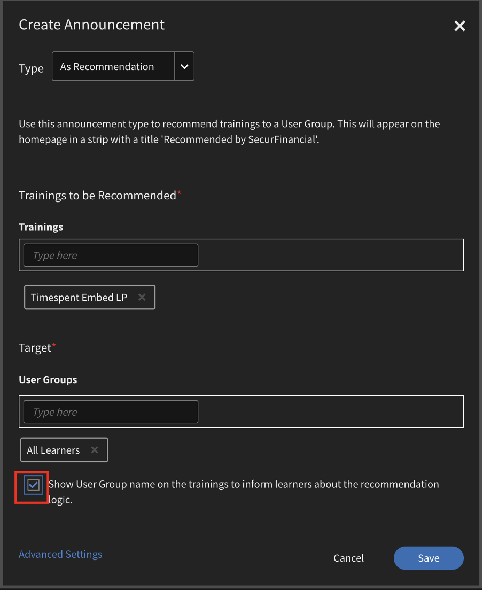

# Novedades de esta versión (abril de 2023)

## Aplicación Adobe Learning Manager para Microsofts Teams

La nueva aplicación Adobe Learning Manager en Microsofts Teams está diseñada para fomentar el aprendizaje en el flujo de trabajo y favorecer el aprendizaje social. Los estudiantes podrán acceder al contenido de aprendizaje en la plataforma Microsofts Teams sin necesidad de cambiar a un navegador. Póngase en contacto con su CSAM para obtener la versión beta de la aplicación Adobe Learning Manager en MS Teams.

Para obtener más información, consulte [Aplicación Adobe Learning Manager para Microsofts Teams](/help/migrated/adobe-learning-manager-app-microsoft-teams.md).

## Mejoras en la experiencia de formación dirigida por un instructor (ILT)

Se han llevado a cabo varias mejoras en la experiencia de formación dirigida por un instructor (ILT). Entre las mejoras clave se incluyen: la capacidad de filtrar sesiones según la ubicación, la capacidad de cambiar instancias (VILT) sin perder el progreso, un nuevo &quot;Asistente de programación&quot; para gestionar los conflictos en las sesiones de reserva, la capacidad de adjuntar &quot;Aptitudes&quot; a los instructores y elegir instructores en función de las aptitudes.

### Cambios habidos

* La página Aptitudes de la aplicación de administrador tiene la opción de cargar la asignación de aptitudes a los instructores.
* En la página Aptitudes, hay una nueva columna, Instructores. La columna muestra el número de instructores en relación con la aptitud. Si hace clic en el número de la columna Instructores, se le redirigirá a una ventana emergente que muestra el número de instructores asignados a una aptitud.

Para obtener más información, consulte [Asignar aptitudes a instructores](/help/migrated/administrators/feature-summary/skills-levels.md#assign-skills-to-instructors).


### Asistente de programación

Gestione conflictos en instructores de reservas y aulas o aulas virtuales. Si desea saber a qué hora y fecha está disponible un instructor antes de asignarlo al curso, utilice el Ayudante de programación.

Los autores, administradores y administradores/autores personalizados pueden utilizar el Asistente de programación.

Para obtener más información, consulte [Asistente de programación](/help/migrated/authors/feature-summary/courses.md#scheduling-assistant).

## Nueva aplicación móvil Adobe Learning Manager

Una nueva aplicación móvil Adobe Learning Manager para Android y iOS que proporciona a los alumnos un acceso sencillo al aprendizaje sobre la marcha. La aplicación permite que los alumnos reciban formación en sus dispositivos móviles y la puedan reanudar posteriormente en sus equipos de escritorio. Gracias a la compatibilidad con las notificaciones, la carga de archivos, la facilidad para marcar y compartir contenido de aprendizaje y aprendizaje social, entre otros muchos aspectos, la aplicación móvil proporciona una flexibilidad adicional a los alumnos y es compatible con el aprendizaje en el momento adecuado.


Descargue el dispositivo móvil desde Google Play Store y Apple App Store. Se solicitará a los usuarios de la versión anterior de la aplicación que descarguen e instalen la nueva aplicación.

En esta versión, la aplicación es compatible con estas funciones:

La nueva aplicación móvil es compatible con las siguientes funciones clave en esta versión:

* Búsqueda mejorada, que incluye la visualización de búsquedas recientes por parte del alumno y búsquedas populares en la organización en el cuadro de entrada de la búsqueda.
* Posibilidad de descargar transcripciones de alumnos.
* Centro de notificaciones mejorado : proporciona actualizaciones importantes a los alumnos como notificaciones dentro de la aplicación
* Posibilidad de ordenar y filtrar objetos de aprendizaje en las páginas Catálogo/Mi aprendizaje
* Posibilidad de marcar objetos de aprendizaje: los objetos de aprendizaje marcados estarán disponibles en la sección Guardados por mí en la página de inicio del alumno.
* Compatibilidad con programas de aprendizaje mejorados
* Posibilidad de cambiar el idioma de la interfaz móvil a cualquier idioma compatible con Adobe Learning Manager.
* Compatibilidad con cargas de archivos en certificaciones externas, sesiones de clase reales y virtuales y módulos de actividad.
* Posibilidad de enviar comentarios del curso de L1 dentro de la aplicación.
* Compatibilidad con vínculos profundos.
* Compatibilidad con el aprendizaje social.
* Compatibilidad con las insignias.
* Compatibilidad con inicio de sesión de usuario externo.

**Elementos no admitidos en esta versión**

* Compatibilidad con varios intentos de añadir un módulo de prueba en un curso cuando este se realiza desde la aplicación móvil.
* Opciones de búsqueda que permiten especificar parámetros de búsqueda, como metadatos del curso, etiquetas y aptitudes para especificar el ámbito de búsqueda.
* Anuncios personalizados habilitados por el administrador que se muestran como mensajes emergentes para el usuario en la aplicación móvil.
* No puede añadir aptitudes en la página de aptitudes de la aplicación.
* Realizar cursos sin conexión.

Para obtener más información, consulte la [aplicación móvil de API de Learning Manager](/help/migrated/learners/feature-summary/ipad-android-tablet-users.md).

## Uso de cualquier aplicación de escaneado de códigos QR para escanear códigos QR de Learning Manager

Adobe Learning Manager ahora admite una forma más intuitiva de escanear códigos QR con la ayuda de la aplicación de cámara nativa sin tener que descargar una aplicación que escanea un código QR.

Para admitir el flujo de trabajo anterior, en el que se podía escanear un código QR utilizando el menú de la aplicación ALM, en esta versión hemos proporcionado información sobre cómo cambiar al nuevo flujo de trabajo.

Con las mejoras en los flujos de trabajo basados en código QR, los códigos QR antiguos generados antes de esta versión ya no serán compatibles. Por lo tanto, si ha generado un código QR con una versión anterior de Learning Manager para una sesión de clase o clase virtual que se llevará a cabo después de esta versión, debe generar un nuevo código QR.

### Mejoras en el anuncio de recomendación

En esta versión, hemos actualizado la tira de recomendaciones de una organización a una recomendación basada en el grupo de usuarios, del que forma parte el alumno, para mostrar los cursos relevantes para el alumno.

Los administradores pueden orientar determinados cursos o cursos de formación a los alumnos en función de sus perfiles. A continuación, los alumnos pueden buscar cursos según el perfil del que formen parte.

**Qué ha cambiado**

En la página Anuncio hay una opción que muestra a un alumno por qué se le recomendó este curso o formación.



### Nueva configuración de administrador

El administrador tiene una nueva opción denominada Grupos en Configuración > Mostrar paneles de filtro. Cuando la opción Grupos está activada, se muestra el filtro Grupos en la página de inicio del alumno. A continuación, el alumno puede elegir mostrar los cursos en función de los grupos de usuarios.

|   | Cuando la opción está activada | Cuando la opción está desactivada |
|--- |--- |--- |
| La opción Grupos está activada | <ul><li> Muestra el grupo de usuarios en el icono junto con el vínculo a la página del catálogo.</li><li> El grupo de usuarios aparece en el filtro de catálogo.</li></ul> | <ul><li>El nombre del grupo de usuarios no se muestra en el mosaico.</li><li>El grupo de usuarios no aparece en el filtro de catálogo.</li></ul> |
| La opción Grupos está desactivada | <ul><li>Muestra el nombre del grupo de usuarios en el mosaico del curso como texto sin formato.</li><li>El grupo de usuarios no aparece en el filtro de catálogo.</li></ul> | <ul><li>El icono del curso no muestra el texto ni el nombre del grupo de usuarios.</li><li>El grupo de usuarios no aparece en el filtro de catálogo.</li></ul> |

**Cómo funciona**

El administrador crea un anuncio añadiendo el curso a cualquier grupo de usuarios y lo publica.

Lo que ve un alumno es una tira con cursos recomendados en la página de inicio y un vínculo al curso en el icono.


Cuando el alumno hace clic en el vínculo o en el botón Ir al catálogo, se le redirige a la página del catálogo del curso. A continuación, el alumno ve la lista de grupos de usuarios que se van a filtrar en función de los grupos de usuarios del catálogo y de la página Mi aprendizaje.


## Buscar sesiones mediante ubicaciones

### Administrar ubicaciones de clase

Es posible que en ocasiones quiera que un alumno filtre una sesión en el calendario en función de la ubicación. Una vez que haya añadido una ubicación mediante el cuadro de diálogo Ubicaciones de clase o el archivo CSV, el alumno podrá aplicar el filtro.


Para obtener más información, consulte [Añadir ubicaciones de clase](/help/migrated/administrators/feature-summary/settings.md#classroom-locations).

### Widget Calendario

Como alumno, puede filtrar las sesiones que se le asignan por ubicación. Vaya al widget Calendario, seleccione Filtrar sesiones y seleccione la ubicación.


Además, la ubicación del curso ahora se muestra en la página de descripción general del curso si el autor la ha añadido al crearlo.

### Administrador

Como administrador, puede controlar si un alumno puede filtrar cursos según las ubicaciones. En Configuración > General, active o desactive Ubicaciones de aprendizaje.

Para obtener más información, consulte [Configuración de administrador](/help/migrated/administrators/feature-summary/settings.md).

## Cambios en la experiencia de prueba

Después de crear la cuenta de prueba, los cursos en Mercado de contenido estarán disponibles sin demora.

## Chatbot

Chatee con un agente o con varios agentes mediante un bot de chat. Solo los administradores personalizados de cuentas de prueba pueden utilizar esta función.

El chatbot:

* Le dará la bienvenida con un mensaje.
* Proporcione una opción para obtener información sobre el producto o una demostración del producto.
* Transferirá el chat a un agente en persona.
* Conservará su historial de chat.


## Mejorará de la lista de verificación de observaciones

Los autores ahora pueden seleccionar responsables y responsables de tienda/ubicación como revisores de las listas de comprobación. Los responsables y los responsables de tienda/ubicación, si se seleccionan como revisores, también pueden ver y completar las listas de comprobación de sus equipos sin tener que cambiar a las funciones de instructor. Los instructores siguen revisando las listas de comprobación. Se envía una nueva notificación de &quot;Lista de comprobación de revisión&quot; a los revisores (instructores/responsables) de una instancia para la lista de comprobación de las inscripciones.

Si se añade un responsable como revisor en el módulo de lista de comprobación, este podrá revisar la lista de comprobación en la aplicación del responsable. Los instructores seguirán revisando la lista de comprobación según lo previsto.

Para obtener más información, consulte [Lista de verificación de observaciones](/help/migrated/authors/feature-summary/courses.md#observation-checklist).

## Otras mejoras

### Búsqueda de alumnos

Los resultados de la búsqueda también se clasifican como:

* Búsquedas recientes realizadas por usted
* Búsquedas más populares en su organización

La funcionalidad de búsqueda también se ha mejorado para los alumnos. Los alumnos ahora pueden usar comillas dobles &quot;...&quot;, más &quot;+&quot; y menos &quot;-&quot; para encontrar resultados relevantes más rápido y tener una experiencia similar a la de una búsqueda de Google.

* Use comillas dobles (&quot;...&quot;) para buscar cursos que contengan la frase o palabra exacta. Por ejemplo, si introduce &quot;ciencia de datos&quot;, se devolverán los cursos que empiecen por la frase ciencia de datos.
* Utilice el operador + para asegurarse de que solo se muestran los resultados que contienen la frase o palabra específica. Por ejemplo, Programación informática +python mostrará solo los cursos de programación informática que contengan la palabra &quot;python&quot;.
* Utilice el operador - para asegurarse de que sólo se muestran los resultados que no contienen la frase o palabra específica. Por ejemplo, Programación informática -python mostrará todos los cursos de programación informática excepto los que contengan la palabra &quot;python&quot;.

### Ventana emergente conflictiva para objetos de aprendizaje

La página Información general muestra un mensaje emergente sobre la inscripción cuando un alumno tiene sesiones conflictivas. Si al inscribirse desde la página del catálogo o la página de descripción general un alumno ya tiene sesiones conflictivas, se activará una ventana emergente conflictiva con detalles de sesión conflictivos. Aunque un alumno tenga una sesión conflictiva, puede inscribirse en la nueva sesión.


Tenga en cuenta que este mensaje es sólo una advertencia. Todavía puede inscribirse en un curso.

### Nueva plantilla

Hemos añadido una nueva plantilla de correo electrónico denominada Sesión cancelada debido a la cancelación de la inscripción. Cuando se da de baja a un usuario de un curso de formación, este recibe el correo electrónico de cancelación.

### Nueva función de precios para los cursos

Ahora, los administradores pueden definir la moneda de la cuenta en la sección Configuración de administrador > Información básica. Los administradores pueden especificar tanto el símbolo como el código de moneda ISO, por ejemplo, USD, GBP, etc. El valor predeterminado para todas las cuentas nuevas será $. Este cambio solo se aplica a aplicaciones que no son de alumno. Los administradores pueden ver el cambio cuando previsualizan el curso como alumnos. El símbolo de moneda también aparece en transcripciones de alumnos e informes de formación.

Para obtener más información, consulte [Configuración de administrador](/help/migrated/administrators/feature-summary/settings.md).

### Cambiar instancias

Un alumno inscrito en una instancia concreta de un curso puede ver una lista de todas las instancias disponibles del curso y cambiar a otra instancia que funcione mejor para él. El motivo del cambio puede ser que el alumno no haya asistido a la instancia anterior o que la hora de sesión de la nueva instancia sea más adecuada, entre otros motivos.

Cualquier progreso realizado por el alumno como parte del curso, las puntuaciones de las pruebas de los alumnos, etc., se transfieren a la nueva instancia. Esta función está pensada principalmente para cursos en aula y mixtos, pero se admiten todos los tipos de cursos, incluidos los de ritmo personalizado.

La opción Ver todas las instancias aparece independientemente de la configuración del conmutador de instancias. Los alumnos verán ahora una opción para ver todas las instancias si hay más de una instancia de un curso.

Si la opción Cambio de instancia está activada, los alumnos pueden cambiar a varias instancias hasta que completen el curso. Si la opción está desactivada, los alumnos pueden ver las instancias, pero no se podrán inscribir en el curso.

Cuando el alumno selecciona **Ver todas las instancias**, puede ver todas las instancias del curso.


Un administrador puede cambiar las instancias de los alumnos.


No puede cambiar de instancia hasta que se complete cualquier instancia del curso desde la aplicación del alumno o del administrador.

Los autores, al crear un curso, pueden alternar entre activar o desactivar &quot;Cambio de instancia&quot;. El cambio de instancia solo está disponible para cursos gratuitos.

Para obtener más información, vea [Configuración de instancias](/help/migrated/authors/feature-summary/courses.md).

**Alumnos**

Los alumnos pueden cambiar de una instancia de curso en lista de espera a otra instancia. También pueden cambiar una instancia de curso en una ruta de aprendizaje o certificación.

Después de inscribirse en la ruta de aprendizaje o certificación, en la página del curso, pueden hacer clic en Ver instancias y, a continuación, cambiar a una instancia.

>[!NOTE]
>
>La configuración del conmutador de instancia no es compatible con los tipos de inscripción con nominación de responsable.
>
>Si va a cambiar instancias de un programa de aprendizaje de Flex, el progreso se trasladará a la otra instancia.

### Registro de auditoría de usuarios

El informe de seguimiento de auditoría de usuarios capturará información sobre los alumnos que cambiaron instancias, &quot;de instancia&quot; a &quot;a instancia&quot;, cambiaron por hora, fecha, etc.


Para obtener más información, consulte [Informe de registro de auditoría de usuarios](/help/migrated/administrators/feature-summary/reports.md#useraudittrailreports).

### Informe de utilización del instructor

Este informe captura el tiempo (en minutos) que un instructor dedica diariamente a impartir las sesiones asignadas. El informe se puede descargar durante un período de tres meses a partir de la fecha de inicio seleccionada.

Para obtener más información, consulte [Informe de uso del instructor](/help/migrated/administrators/feature-summary/reports.md#instructor-utilization-report).


### Informe de ayudas de trabajo

Un nuevo informe para hacer un seguimiento de las ayudas de trabajo presentes en la cuenta y otra información sobre las ayudas de trabajo, como el idioma, el tipo, la duración, el autor, las etiquetas, etc.

Para obtener más información, consulte el [informe de inscripción de ayudas de trabajo](/help/migrated/administrators/feature-summary/reports.md).

### Correos electrónicos ad hoc específicos para alumnos inscritos en una instancia de curso específica

Los administradores y los autores podrán enviar comunicaciones de correo electrónico específicas y ad hoc a los alumnos inscritos en una instancia específica de un curso. Se ha añadido la opción de enviar correos electrónicos a nivel de instancia para cursos y programas de aprendizaje.


*Enviar correos electrónicos a nivel de instancia*

En el cuadro de diálogo Crear anuncio, la opción Escribir como correo electrónico y Formación, junto con Instancia, están seleccionadas de forma predeterminada. Especifique el asunto, escriba el mensaje y haga clic en Guardar.

Para obtener más información, consulte [Correos electrónicos a nivel de instancia](/help/migrated/administrators/feature-summary/courses.md#send-instance-level-emails).

### Correos electrónicos ad hoc dirigidos a alumnos mediante anuncios del administrador

Para los administradores, se ha añadido un nuevo tipo de anuncio: «Como correo electrónico». Se puede utilizar para enviar correos electrónicos ad hoc específicos a los alumnos de un grupo de usuarios seleccionado o a los alumnos inscritos en un curso de formación específico.

Los administradores y autores personalizados también pueden ver esta opción en el nivel de instancia si tienen el acceso necesario.

Para obtener más información, vea [Anuncios](/help/migrated/administrators/feature-summary/announcements.md#as-email).

### Nuevas plantillas de correo electrónico

En esta versión, hemos añadido plantillas de correo electrónico para gestores que pueden saltarse niveles. Estas plantillas se han concebido para los casos en los que los responsables reciben correos electrónicos relativos a los informes de segundo nivel en los que no se han respetado las fechas límite de cualquier curso, ruta de aprendizaje o certificación. Además, recibirán correos electrónicos cuando sus informes de segundo nivel se acerquen a los plazos de finalización de estos cursos, rutas de aprendizaje o certificaciones.

* Omitir escalación de nivel para la finalización del curso: antes de la fecha límite
* Omitir escalación de nivel para la fecha límite del curso incumplida
* Omitir escalación de nivel para finalizar la ruta de aprendizaje: antes de la fecha límite
* Omitir escalación de nivel para la fecha límite de ruta de aprendizaje incumplida
* Omitir escalación de nivel para la finalización de la certificación: antes de la fecha límite
* Omitir escalación de nivel del plazo de certificación incumplido

Las opciones están activadas de forma predeterminada.

## Cambios en la API en esta versión

### Nuevos informes

Hemos añadido un nuevo atributo, jobType a la API de trabajos. El atributo acepta los siguientes valores:

* **generateInstructorUtilisationReport**: Devuelve el informe de utilización de un instructor.
* **generateJobAidMetadataReport**: devuelve los metadatos de un informe de ayuda de trabajo.

**Extremo**: POST /primeapi/v2/jobs

Solicitud generateJobAidMetadataReport:

```javascript {line-numbers="true"}
{ 
    "data": { 
        "type": "job", 
            "attributes": { 
                "description": "description of your choice", 
                "jobType": "generateJobAidMetadataReport" 
            } 
    }
} 
```

respuesta generateJobAidMetadataReport:

```javascript {line-numbers="true"}
{ 
  "links": { 
    "self": "https://learningmanagerstage1.adobe.com/primeapi/v2/jobs" 
  }, 
  "data": { 
    "id": "31126", 
    "type": "job", 
    "attributes": { 
      "dateCreated": "2023-02-28T18:36:48.000Z", 
      "description": "description of your choice", 
      "jobType": "generateJobAidMetadataReport", 
      "status": { 
        "code": "Submitted" 
      } 
    } 
  } 
} 
```

solicitud generateInstructorUtilisationReport:

```javascript {line-numbers="true"}
{
    "data": { 
        "type": "job", 
            "attributes": { 
                "description": "description of your choice", 
                "jobType": "generateInstructorUtilisationReport", 
                "payload": { 
                    "year": "2023", 
                    "month": "2" 
                } 
            } 
    } 
}
```

respuesta generateInstructorUtilisationReport:

```javascript {line-numbers="true"}
{ 
  "links": { 
    "self": "https://learningmanagerstage1.adobe.com/primeapi/v2/jobs" 
  }, 
  "data": { 
    "id": "31130", 
    "type": "job", 
    "attributes": { 
      "dateCreated": "2023-02-28T18:43:43.000Z", 
      "description": "description of your choice", 
      "jobType": "generateInstructorUtilisationReport", 
      "payload": { 
        "month": "2", 
        "year": "2023" 
      }, 
      "status": { 
        "code": "Submitted" 
      } 
    } 
} 
} 
```

Para obtener más información, consulte el [documento de referencia de la API](https://captivateprime.adobe.com/docs/primeapi/v2/).

### Cambio de instancia de alumno

La API de inscripción de alumnos le permite acceder a todas las instancias disponibles y cambiar a una instancia diferente de un curso. La nueva instancia hereda todas las propiedades del curso anterior.

Hemos agregado un nuevo parámetro de consulta, enrollmentID, para el que se solicita la información.

>[!NOTE]
>
>El cuerpo sólo es necesario en los siguientes casos:
>
>1. Plan de aprendizaje flexible
>1. Cambio de instancia de curso

### Cuentas

La respuesta contiene un nuevo atributo, currencyCode.

**Extremo**: GET /primeapi/v2/account

### Asociación de aptitudes y nivel de aptitud para instructores

Hemos introducido una nueva función, que captura la experiencia de los instructores, es decir, para cada instructor, se mantiene su experiencia, y esto puede estar disponible para operaciones descendentes como la búsqueda y el filtrado.

Se añaden los siguientes atributos:

* instructorSkills
* instructorSkillLevel

**Extremo**: GET /primeapi/v2/account /&lt;ID_cuenta>/instructorskill/search

### Cambios de ILT

| Descripción | Nuevo parámetro/respuesta | Punto final |
|--- |--- |--- |
| Enumerar todas las ciudades | filter.cityName=true/false | GET /primeapi/v2/data |
| Buscar y filtrar ciudades | filter.cityName=city_name<br>También admite una lista de ciudades separadas por comas |
| GET /primeapi/v2/search |
| Detalles de la sala de retorno | include=room | GET /primeapi/v2/users/`<id>`/calendar |
| Objeto de aprendizaje para filtrar ciudades | filter.cityName=city_name <br> También admite una lista de ciudades separadas por comas. | GET /primeapi/v2/learningObjects |
| Agregar panel de ciudad | La respuesta contiene un nuevo atributo, filterPanelSetting=true/false. | GET /primeapi/v2/account |

### Sesiones de alumno que tienen un conflicto

Recupere una lista de todas las sesiones en conflicto de una instancia.

Hemos añadido estos campos:

* loID
* loInstanceID

**Extremo**: `GET /primeapi/v2/learningObjects/{loId}/instances/loInstanceId/conflictingSessions?page[offset]=0&page[limit]=10`

### Aula de clase virtual

Ejecute la búsqueda basada en la ubicación de cursos de clase virtual. Hay un nuevo atributo roomLocation en el modelo de recursos para indicar la ubicación de forma libre proporcionada al crear un curso de clase virtual.

Hemos realizado los siguientes cambios:

**LO**

Un nuevo parámetro de consulta, filter.loFormat=Virtual Classroom para la API learningObjects.

**Extremo**: GET /primeapi/v2/learningObjects

**Calendario**

Un nuevo parámetro de consulta, filter.allSessions=false para la API de calendario. El valor predeterminado del parámetro es false. Si es true, la API devuelve todas las sesiones del calendario de un alumno.

**Extremo**: `GET /primeapi/v2/users/<id>/calendar?filter.allSessions=false`

### Historial de búsquedas de alumnos

**Buscar**

Un nuevo parámetro de consulta, persistSearchHistory. El valor predeterminado es true, que mantiene la consulta para las sugerencias de búsqueda.

**Extremo**: GET /primeapi/v2/search?persistSearchHistory=true

**Sugerencias**

Un nuevo parámetro de consulta, suggestionType. Los valores aceptados son:

* learnerHistory (predeterminado)
* accountHistory

**Extremo**: GET /primeapi/v2/search/tips/?recommendationType=learnerHistory

### Filtrado de grupos de usuarios

El objeto de aprendizaje y las API de búsqueda proporcionarán filtros para obtener todos los objetos de aprendizaje que pertenecen al grupo de usuarios mediante los filtros especificados. Las API admiten filtros como una lista separada por comas.

Hemos proporcionado un nuevo filtro, filter.lo.announctionGroups, para obtener todos los objetos de aprendizaje que pertenecen a los filtros de grupos de usuarios proporcionados.

Puede ser una lista de varios valores separados por comas para aportar mayor flexibilidad y el procesamiento se basaría en la operación «O» entre los diferentes grupos, es decir, la obtención de todos los objetos de aprendizaje que se incluyen en los grupos de usuarios especificados.

### Grupo personalizado

Puede añadir y quitar usuarios externos a y de grupos personalizados mediante la API.

**POST**

POST /userGroups/{id}/users

**Cuerpo**

```javascript {line-numbers="true"}
"data": [ 
     { 
           "type": "user",  
           "id": "{id}"   
     }  
]  
```

**DELETE**

DELETE /userGroups/{id}/users

**Cuerpo**

```javascript {line-numbers="true"}
"data": [  
     {  
          "type": "user",  
           "id": "11218291"  
     }  
]   
```

### Filtrado de grupos de usuarios de anuncios para pérdida en aplicación de alumno

* La API GET /users/{userId}/userGroups tiene un nuevo parámetro, filter.annuncigroupOnly, que toma un valor booleano (true/false). Esto filtra solo los grupos de usuarios que el administrador anuncia. El valor predeterminado de este parámetro es false.
* La API GET/learningObjects tiene un nuevo parámetro, filter.annunciedGroups, que acepta identificadores de grupos de anuncios para filtrar resultados.
* La API de GET/búsqueda tiene un nuevo parámetro, filter.annunciedGroups, que acepta identificadores de grupos de anuncios para filtrar resultados.

Ejemplo de respuesta a continuación:

```javascript {line-numbers="true"}
{
  "links": {
    "self": "https://learningmanagerstage1.adobe.com/primeapi/v2/recommendations?page[offset]=0&page[limit]=10&strip=1&filter.recType=announcement&filter.loTypes=course"
  },
  "data": [
    {
      "id": "course:5836866_10855885_recommendation",
      "type": "recommendation",
      "attributes": {
        "reason": [
          "Based on your Group - UGforAnnouncement"
        ],
        "reasonModel": [
          {
            "modelId": 1781592,
            "modelType": "userGroup",
            "modelValues": {
              "group_name": "UGforAnnouncement"
            },
            "template": "Based on your Group - {{group_name}}"
          }
        ]
      },
      "relationships": {
        "learningObject": {
          "data": {
            "id": "course:5836866",
            "type": "learningObject"
          }
        }
      }
    },
    {
      "id": "course:7013328_10855885_recommendation",
      "type": "recommendation",
      "attributes": {
        "reason": [
          "Based on your Group - All Learners"
        ],
        "reasonModel": [
          {
            "modelId": 1410724,
            "modelType": "userGroup",
            "modelValues": {
              "group_name": "All Learners"
            },
            "template": "Based on your Group - {{group_name}}"
          }
        ]
      },
      "relationships": {
        "learningObject": {
          "data": {
            "id": "course:7013328",
            "type": "learningObject"
          }
        }
      }
    },
    {
      "id": "course:6408989_10855885_recommendation",
      "type": "recommendation",
      "attributes": {},
      "relationships": {
        "learningObject": {
          "data": {
            "id": "course:6408989",
            "type": "learningObject"
          }
        }
      }
    },
    {
      "id": "course:6409761_10855885_recommendation",
      "type": "recommendation",
      "attributes": {},
      "relationships": {
        "learningObject": {
          "data": {
            "id": "course:6409761",
            "type": "learningObject"
          }
        }
      }
    },
    {
      "id": "course:6979586_10855885_recommendation",
      "type": "recommendation",
      "attributes": {},
      "relationships": {
        "learningObject": {
          "data": {
            "id": "course:6979586",
            "type": "learningObject"
          }
        }
      }
    }
  ]
}
```

## Notas de la versión

Para obtener información sobre las versiones actuales y anteriores de la aplicación web y para dispositivos de Learning Manager, consulte las [Notas de la versión](/help/migrated/release-note/release-notes.md).

## Correcciones de errores

Para ver los errores corregidos en esta actualización, consulte la [lista de errores corregidos](release-note/release-notes.md#bugs-fixed-in-this-release).

## Requisitos del sistema

[Requisitos del sistema de Learning Manager](/help/migrated/system-requirements.md)
