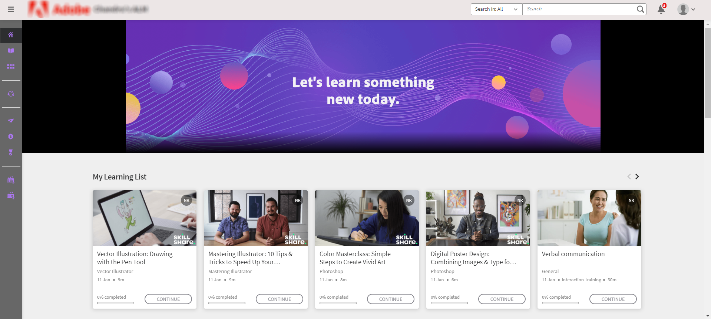

# Resumen de nuevas funciones {#new-features-summary}

Obtenga más información sobre las nuevas funciones y mejoras de la versión de julio de 2024 de Adobe Learning Manager.

## Mejora en el tablero de cumplimiento

### ¿Qué es un tablero de cumplimiento? {#whatiscompliancedashboard}

El **[!UICONTROL tablero]** de cumplimiento de **Adobe Learning Manager** permite a los responsables supervisar y supervisar el progreso de los alumnos hacia sus objetivos de aprendizaje. Pueden comprobar si los miembros del equipo cumplen con los plazos y se mantienen al día con su proceso de aprendizaje, lo que ayuda a garantizar el cumplimiento. El administrador puede configurar el tablero de cumplimiento y compartirlo con los responsables.

Para acceder al tablero de cumplimiento en la aplicación Administrador, seleccione **[!UICONTROL Informes]** > **[!UICONTROL Resumen]** de aprendizaje > **[!UICONTROL Panel]** de cumplimiento.

### Qué cambia en la versión

Con el tablero de cumplimiento mejorado, los administradores y los gerentes pueden ver los cursos, la ruta de aprendizaje o las certificaciones de tipo cumplimiento relacionadas con su categoría específica (por ejemplo, Ventas, Marketing y Asuntos legales). Los administradores pueden clasificar los cursos de cumplimiento personalizados en categorías específicas. Las categorías de cumplimiento personalizadas funcionan con etiquetas de catálogo.  Los administradores pueden crear un tablero del curso y compartirlo con los gerentes. A continuación, los responsables pueden ver el mismo tablero en sus instancias respectivas. También se han realizado mejoras en la interfaz de usuario del tablero de cumplimiento y en las notificaciones de correo electrónico de cumplimiento.

#### Flujo de trabajo

A continuación se indican los pasos para usar el tablero de cumplimiento mejorado:

| Función | Tarea | Información adicional |
|---|---|---|
| Administrador | Crear etiquetas de cumplimiento personalizadas | Consulte este artículo [Creación de etiquetas](/help/migrated/administrators/feature-summary/reports.md#compliance-dashboard) de cumplimiento personalizadas para obtener más información |
| Autor | Añada estas etiquetas al curso | Consulte este artículo [Añadir etiquetas de cumplimiento al curso, la ruta de aprendizaje o la certificación](/help/migrated/authors/feature-summary/courses.md#add-compliance-labels-to-courselearning-pathcertification) para obtener más información. |
| Administrador | Cree el tablero con el curso de cumplimiento y compártalo con los gerentes | Consulte este artículo: [Crear y compartir un tablero](/help/migrated/administrators/feature-summary/reports.md#create-and-share-a-compliance-dashboard) de cumplimiento para obtener más información. |
| Responsable | Ver el tablero de cumplimiento | Consulte este artículo [Estado de](/help/migrated/managers/feature-summary/manager-dashboard.md#compliance-status) cumplimiento para obtener más información |

## Renovación de la interfaz de usuario del alumno

>[!IMPORTANT]
>
>La nueva interfaz de usuario de alumno se publicará en fases.

La **IU** del alumno se ha actualizado con un diseño más elegante y moderno. Las **[!UICONTROL páginas de destino Página de inicio]** del alumno, **[!UICONTROL Mi aprendizaje]**, **[!UICONTROL Catálogo]** y **[!UICONTROL Descripción general]** del curso adquieren un aspecto nuevo y moderno. Las tarjetas de curso también tienen un nuevo diseño para mostrar los detalles de una manera moderna. Al pasar el ratón sobre una tarjeta de curso, aparece la descripción del curso y la fecha de publicación.

>[!NOTE]
>
>La interfaz de usuario mejorada solo se aplica al diseño inmersivo. Estos cambios aún no se admiten en la web móvil ni en la aplicación y se actualizarán en una versión posterior.


_Interfaz de usuario antigua_


_Nueva interfaz de usuario_

### Qué es lo que cambia en esta versión

**Modernice el aspecto y la sensación**

Los nuevos elementos visuales renovados se alinean con las tendencias de diseño moderno, haciendo que el producto se vea intuitivo y atractivo. Esto incluye una nueva cabecera, un panel lateral y widgets de aspecto moderno.

**Experiencia de usuario mejorada**

Ahora, los alumnos verán una vista de tarjeta similar en las páginas siguientes: Página principal, Catálogo, Mi aprendizaje y Resumen del curso, que ofrecen una experiencia unificada.

Vea [la página](/help/migrated/learners/feature-summary/learner-home-page.md) de inicio del alumno para obtener más información.

**Cambios en las fechas de publicación del curso**

Con esta mejora, las fechas de publicación de los cursos de LinkedIn y Go1 importados a Adobe Learning Manager serán las fechas de publicación reales en LinkedIn y Go1. También puede ver las fechas reales de publicación de los cursos de LinkedIn y Go1 en la interfaz de usuario. Vea [las tarjetas de](/help/migrated/learners/feature-summary/learner-home-page.md#course-cards) curso para obtener más información.

## Actualizaciones de la experiencia de no haber iniciado sesión

La experiencia de no haber iniciado sesión le permite crear una experiencia en tiempo real para los clientes que no han iniciado sesión. Esto sirve como una página de destino para sus campañas de marketing, proporcionando suficiente información para alentar las suscripciones.

### Qué es lo que cambia en esta versión

Los clientes pueden comprar un plan premium para crear estas experiencias altamente escalables sin sesión iniciada. Esta experiencia no registrada, con tecnología de Acceso a datos](/help/migrated/integration-admin/feature-summary/connectors.md#training-data-access) de formación, proporciona datos en tiempo real sobre los límites de puestos, puestos ocupados, los límites de la lista de espera y el recuento de la lista de espera utilizando las API de [Adobe Learning Manager. Los clientes pueden utilizar estas API para ofrecer a los alumnos que no han iniciado sesión capacidades de búsqueda y filtro, así como un resumen completo del curso. Consulte este artículo [API](/help/migrated/integration-admin/feature-summary/non-logged-in-apis.md) no conectadas para obtener más información sobre las API.

>[!NOTE]
>
>Póngase en contacto con el equipo de asistencia o con CSAM para adquirir el plan premium.

## Compatibilidad con varias unidades de mantenimiento de existencias (SKU)

Los alumnos ahora pueden agregar varios cursos, rutas de aprendizaje o certificaciones al carrito y comprarlos conjuntamente.

### Qué cambia en la versión

Anteriormente, los alumnos solo podían comprar un curso a la vez. En esta versión de Adobe Learning Manager **, pueden adquirir varios cursos, rutas de** aprendizaje o certificaciones al mismo tiempo mediante el carrito.

Esta función solo está disponible en las aplicaciones de alumno (interfaz de usuario existente, nueva interfaz de usuario de alumno y aplicación móvil inmersiva).

Ver [carrito de varios artículos en ALM](/help/migrated/learners/feature-summary/multi-item-cart.md)

## Compatibilidad con contenido HTML5 en el reproductor Fluidic

**Adobe Learning Manager** ahora admite la carga de contenido HTML5 como archivo .zip en la biblioteca de contenido. Una vez cargados, estos archivos se pueden incluir como módulos en un curso. Asimismo, los autores pueden definir los criterios de finalización para los módulos HTML5 con ritmo personalizado, lo que permite la finalización marcada por el alumno o la finalización automática al iniciar.

### Qué es lo que cambia en esta versión

Adobe Learning Manager ahora admite contenido compatible con HTML5 en los cursos con ritmo personalizado. Los autores pueden agregar contenido HTML5 como un archivo .zip a contenido con ritmo personalizado. Los estudiantes pueden ver el contenido de HTML5 en el reproductor Fluidic. Con la nueva función, ahora los alumnos pueden marcar el curso como completado directamente en el reproductor Fluidic para los cursos con ritmo personalizado. Consulte [Agregar tipo de archivo HTML5 en la biblioteca](/help/migrated/authors/feature-summary/content-library.md#add-html5-file-type-in-the-content-library) de contenido para obtener más información.

Con la nueva mejora, el curso con el enlace externo se marcará automáticamente como completado cuando se visite la URL, siempre y cuando el autor haya establecido los criterios de finalización para la nueva opción **[!UICONTROL Al iniciar contenido]**. Se ha agregado la nueva opción **[!UICONTROL Criterios]** de finalización en la página Módulo de actividad, donde el autor puede establecer los criterios de finalización para los enlaces externos. Consulte [el vínculo Añadir HTML en el módulo](/help/migrated/authors/feature-summary/courses.md#add-html-link-in-the-activity-module) de actividad para obtener más información.


_Opción Criterios de finalización-Módulo de actividad_

## Notificaciones push vencidas del curso en la aplicación móvil

Los alumnos recibirán notificaciones push cada vez que incumplan la fecha límite del curso. Con esta nueva mejora, los alumnos ahora tienen la opción de posponer un recordatorio durante 24 horas o de recordar la próxima semana por cada recordatorio vencido que reciban. Esto solo se aplica a las notificaciones de plazos vencidos. Ver [Programar la notificación push](/help/migrated/learners/feature-summary/user-notifications.md#schedule-the-push-notification)

## Cambios en las API de esta versión

### API de búsqueda

La API de búsqueda incluye los siguientes cambios:

Los alumnos pueden buscar etiquetas dentro de los filtros de catálogo mediante la ```GET /search``` API. Los alumnos pueden buscar las etiquetas seleccionando ```tag``` como valor ```filter.loTypes``` de parámetro.

**Rizo de muestra**

```
curl -X GET --header 'Accept: application/vnd.api+json' --header 'Authorization: oauth 5a858f23924f4feafa38ae8d6c4d97b6' 'https://example.com/primeapi/v2/search?page[limit]=10&query=Business&autoCompleteMode=true&filter.loTypes=tag&sort=relevance&filter.ignoreEnhancedLP=true&matchType=phrase&persistSearchHistory=true&stemmed=false&highlightResults=true'
```

Los nuevos filtros, el puesto disponible, la lista de espera disponible y el filtro de intervalo de tiempo se han añadido a las API siguientes: ```GET /search``` y `GET /learningObjects`.

Los nuevos filtros `filter.session.includeEnrollmentDeadline` se han añadido a la siguiente API ```GET /search```.

### API de cuenta

La nueva columna `custom_injections`, `showComplianceLabel`, y `complianceLabelDefaultID` se han agregado a la ```GET /account``` API para obtener datos de cuenta del punto final del usuario.

### API de objeto de aprendizaje

A continuación se indican los cambios realizados en la API del objeto de aprendizaje en esta actualización:

El nuevo ID de autor heredado de respuesta y otros detalles agregados a `authorDetails` la `GET /learningObjects` API. Además, se ha añadido un nuevo filtro, `filter.authors`, para filtrar autores heredados y sus cursos.

El nuevo atributo llamado `effectivenessIndex` le ayudará a obtener los datos de eficacia del curso.

**Rizo de muestra**

```
curl --location 'https://example.com/primeapi/v2/learningObjects/course%3A9790045?enforcedFields%5BlearningObject%5D=effectivenessData' \
--header 'Accept: application/vnd.api+json' \
--header 'Authorization: oauth 598665ab5c8a99bea0e774d9faf7f3ca'
```

La nueva respuesta `whoShouldTake`, que proporciona información sobre quién debe realizar este curso, se ha añadido a las API siguientes: `POST /learningObjects/query`, `GET /learningObjects/{id}`y `GET /learningObjects`.

**Rizo de muestra**

```
curl -X GET --header 'Accept: application/vnd.api+json' --header 'Authorization: oauth 28a83fb8c87579af8ebc4434cc80f0c0' 'https://example.com/primeapi/v2/learningObjects/course%3A1131255' 
```

La nueva respuesta `waitlistLimit`, que proporciona detalles sobre la limitación de la lista de espera, se ha añadido a la `GET /learningObjects` API.

La nueva respuesta `count` , que proporciona el recuento total del objeto de aprendizaje, se ha añadido a las API `GET/ learningObjects` y `POST/ learningObjects/query`.

Las nuevas respuestas `catalogFieldId` se `fieldValueId` han agregado en `catalogLabels` `GET/ learningObjects` la API.

Los alumnos pueden obtener los valores de etiqueta de catálogo en la API `GET /preview/learningObjects`.

### Nueva API para obtener el recuento de Marketplace

En esta versión, se ha añadido una nueva API `GET /search/marketplace/count` . Esto le ayuda a contar los objetos de aprendizaje disponibles en el mercado de contenidos.

**Rizo de muestra**

```
curl -X GET --header 'Accept: application/vnd.api+json' --header 'Authorization: oauth d8631c7b0e3b5d2ae00422ef30aaecfc' 'https://example.com/primeapi/v2/search/marketplace/count?query=course'
```

**Respuesta de muestra**

```
{
  "count": 54910
}
```

### API de instancia de objeto de aprendizaje

A continuación se indican los cambios realizados en la API de la instancia de objeto de aprendizaje en esta actualización:

En esta versión, se ha añadido una nueva clave llamada `gamificationEnabled` a la API `GET /learningObjects/{loId}/instances/{loInstanceId}`de la instancia de objeto de aprendizaje.

**Rizo de muestra**

```
curl --location 'http://example.com/acapapi/primeapi/v2/learningObjects/learningProgram:12756/instances/learningProgram:12756_15644' 
```

El nuevo `gamificationSettings` atributo de la API anterior para obtener los detalles de la configuración de interacción. Por ejemplo: `GET /learningObjects/{loId}/instances/{loInstanceId}/gamificationSettings`.

**Rizo de muestra**

```
curl --location 'http://example.com/acapapi/primeapi/v2/learningObjects/learningProgram:103852/instances/learningProgram:103852_103526/gamificationSettings'
```

El nuevo `leaderboard` atributo de la API anterior para obtener los detalles de la configuración de interacción. Por ejemplo: `GET /learningObjects/{loId}/instances/{loInstanceId}/leaderboard`.

**Rizo de muestra**

```
curl --location 'https://example.com/primeapi/v2/learningObjects/learningProgram:106339/instances/learningProgram:106339_105775/leaderboard' \
--header 'Accept: application/vnd.api+json' \
--header 'Authorization: oauth de4b5ee6efdd42375130db27ff503dd4'
```

### Cambios en los límites de desplazamiento

Para mejorar el rendimiento del sistema y administrar el uso de los recursos de manera más eficaz, Adobe ha eliminado los valores de desplazamiento altos en el punto final GET /users para los ámbitos ADMIN y LEARNER. Se recomienda usar la API Jobs para recuperar los registros con un valor de desplazamiento.

### API en desuso

Vea [las desfasiones de API en Adobe Learning Manager](/help/migrated/api-deprecations-list.md) para obtener una lista acumulativa de todas las API en desuso en el producto.

## Cambios en la presentación de informes

### Tablero de cumplimiento

En esta versión, el informe del tablero de cumplimiento tiene dos nuevas columnas:

* Estado
* Tipo de cumplimiento

Esto se suma a las columnas ya existentes:

* Nombre de usuario
* Correo electrónico de usuario
* Programa de aprendizaje/Certificación/Curso
* Tipo
* Fecha de inscripción (zona horaria UTC)
* Plazo (zona horaria UTC)
* Fecha de finalización (zona horaria UTC)
* Progreso %

### Informe de cursos de formación

El informe de formación en Admin > Reports > Custom Reports **y en la** API **Jobs solía tener columnas denominadas** Aptitud y **** Etiqueta.************ Ahora se ha cambiado el nombre de estas columnas a **Aptitudes** y **etiquetas**.

### Informe de auditoría de contenido

En esta versión, el informe de seguimiento ]**de auditoría de**[!UICONTROL  contenido incluye ahora los siguientes atributos nuevos en la columna Tipo de modificación:

* Añadir grupo de usuarios
* Quitar grupo de usuarios
* Adición de etiqueta personalizada
* Eliminación de etiquetas personalizadas
* Añadir catálogo compartido
* Eliminar catálogos compartidos
* Actualización del catálogo compartido

## Error corregido en esta actualización

**Envío de actividades**

* Al intentar volver a cargar un archivo en el módulo de envío de actividad, se produce un error 500 en la llamada de red.

**API**

* Se produce un error al crear una reunión de la clase virtual de Connect si varios instructores tienen la misma dirección de correo electrónico.
* Después de inscribirse en un programa de formación, MS Teams VC muestra una URL incorrecta en la página Información general.
* La URL prefirmada del informe del usuario proporcionada como parte de la respuesta de la API de trabajo caduca al cabo de seis horas.
* Al generar un informe de inscripción para un curso, la columna Nombre del curso muestra un nombre de curso incorrecto.
* El trabajador de migración no puede enviar el ID exclusivo de objeto al llamar a la API masiva del curso, pero el ID se elimina.
* Cuando un curso se incluye en un catálogo específico al que puede acceder un usuario (con el catálogo predeterminado está desactivado), a pesar de la configuración que impide que los alumnos que se dan de baja vean el curso, puede recuperar los metadatos del curso a través del punto final learningobject/id.
* El filtro de aptitudes no funciona del modo esperado cuando skillname tiene comas en el nombre de la API GET /learningObject.
* Hay una incoherencia en los metadatos de marca de hora del archivo en el trabajador de retención de datos para SFTP.
* Si se retira y se vuelve a configurar algún conector, el estado de migración del proyecto parece cerrado.
* El informe de capacitación tiene &quot;Etiqueta(s)&quot; como encabezado de columna en lugar de &quot;Etiquetas&quot;.
* La exportación del conector de Commerce falla si el catálogo está deshabilitado y si alguno de los cursos exportados es solo una parte del catálogo deshabilitado.

**Certificación**

* A veces, se produce un error al volver a inscribir a un usuario en una certificación recurrente.

**Función personalizada**

* En algunos casos, cuando un administrador personalizado intenta cambiar a la función de instructor, aparece el error 403 prohibido.

**Plantilla de correo electrónico y notificación**

* Las notificaciones por correo electrónico, después de cancelar una sesión, no se envían al último grupo de instructores cuando estos son eliminados de la sesión.
* El organizador no recibe notificaciones por correo electrónico para MS Teams después de crear una formación virtual dirigida por un instructor. Solo después de que se publique el curso y se activen las plantillas de correo electrónico, los correos electrónicos se activan.
* A veces, una plantilla de correo electrónico consiste en un formato de fecha y una traducción incorrectos.

**Alumno**

* Cuando un alumno se inscribe en varias instancias de un curso y usted descarga el informe de asistencia, el informe contiene información incorrecta.
* Un usuario puede ver las publicaciones privadas de otro usuario si se agregan a una historia pública.
* En algunos casos, no puede dar de baja a los alumnos de un certificado. Aparece un mensaje de error al intentar darse de baja.
* Una certificación se marca como completada incluso después de que un administrador la marque como completada después de seleccionar solo un curso.
* Un administrador no puede marcar una clase virtual como completada si la hora de finalización de la sesión se ha cambiado a una fecha anterior.
* El informe de asistencia a la sesión aparece como &quot;No ha asistido&quot; para los alumnos que están en una lista de espera.

**Aplicación de alumno**

* Después de descargar las notas del curso como PDF, las notas aparecen aleatoriamente. No siguen la orden.

**Ruta de aprendizaje**

* Después de seleccionar una aptitud en un programa de formación, la lista desplegable no se muestra como se esperaba cuando se selecciona el campo de texto.
* En algunos casos, no es posible eliminar aptitudes de un programa de formación.

**Programa de aprendizaje**

* Si un programa de aprendizaje flexible tiene muchos cursos, el plan de aprendizaje no se completa incluso después de que un administrador lo marque como completado.
* La columna last_modified_by del informe de inscripción no se actualiza cuando un alumno cambia de instancia.

**Informe**

* En algunos casos, un administrador no puede exportar el informe de formación.
* Cuando un contenido SCORM contiene preguntas o respuestas que superan los 32.767 caracteres, no podrá descargar el informe del cuestionario del curso en Excel.
* Después de seleccionar Restablecer interacción, la fecha de logro del nivel no se restablece.

**Buscar**

* Actualmente, después de exportar todos los grupos de usuarios, los grupos de usuarios eliminados también aparecen en la salida.
* Debido a problemas de búsqueda intermitentes, no puede buscar una certificación.

## Problema conocido en esta versión

El reproductor móvil sin conexión no carga el contenido HTML5.

## Requisitos del sistema

Vea [los requisitos](/help/migrated/system-requirements.md) del sistema de Adobe Learning Manager.

## Versiones anteriores de Adobe Learning Manager

* [Versión de marzo de 2024](/help/migrated/whats-new-march-2024.md)
* [Versión de noviembre de 2023](/help/migrated/whats-new-november-2023.md)
